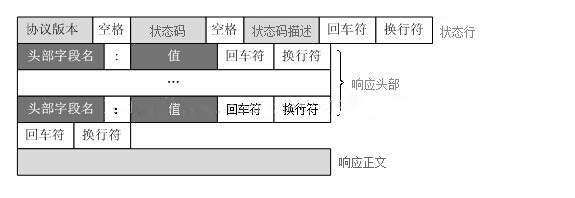

状态码

|      | 类别                           | 原因短语                   |
| ---- | ------------------------------ | -------------------------- |
| 1XX  | Informational(信息状态码)      | 接收的请求正在处理         |
| 2XX  | Success（成功状态码）          | 请求正常处理完毕           |
| 3XX  | Redirection(重定向状态码)      | 需要进行附加操作以完成请求 |
| 4XX  | Client Error(客户端错误状态码) | 服务器无法处理请求         |
| 5XX  | Server Error(服务端错误状态码) | 服务器处理请求出错         |

## HTTP请求格式(请求协议)


## HTTP响应格式（响应协议）




```java
 String[] headers = resString.trim().split("\r\n");
```

```java
 String mainInfo [] = firstline.split("\\s+");
```

首先要明白split方法的参数含义：
split
public String[] split(String regex)根据给定的正则表达式的匹配来拆分此字符串。

然后就要明确正则表达式的含义了：
\\s表示 空格,回车,换行等空白符,
+号表示一个或多个的意思,所以... 


```java
request.setUri(URLDecoder.decode(mainInfo[1], "UTF-8"));
```

[java.net.URLEncoder]:  https://blog.csdn.net/wangmx1993328/article/details/80873879

# 参考

[http协议详解]:  https://www.cnblogs.com/an-wen/p/11180076.html 	"好"

