# 基础概念

## 用户空间和内核空间

现在操作系统都是采用虚拟存储器，那么对32位操作系统而言，它的寻址空间（虚拟存储空间）为4G（2的32次方）。操作系统的核心是内核，独立于普通的应用程序，可以访问受保护的内存空间，也有访问底层硬件设备的所有权限。为了保证用户进程不能直接操作内核（kernel），保证内核的安全，操心系统将虚拟空间划分为两部分，一部分为内核空间，一部分为用户空间。针对linux操作系统而言，将最高的1G字节（从虚拟地址0xC0000000到0xFFFFFFFF），供内核使用，称为**内核空间**，而将较低的3G字节（从虚拟地址0x00000000到0xBFFFFFFF），供各个进程使用，称为**用户空间**。 

## 进程切换

为了控制进程的执行，内核必须有能力挂起正在CPU上运行的进程，并恢复以前挂起的某个进程的执行。这种行为被称为进程切换。因此可以说，任何进程都是在操作系统内核的支持下运行的，是与内核紧密相关的。 **进程切换很消耗资源**。

## 进程阻塞

正在执行的进程，由于期待的某些事件未发生，如请求系统资源失败、等待某种操作的完成、新数据尚未到达或无新工作做等，则由系统自动执行阻塞原语(Block)，使自己由运行状态变为阻塞状态。可见，进程的阻塞是进程自身的一种主动行为，也因此只有处于运行态的进程（获得CPU），才可能将其转为阻塞状态。**当进程进入阻塞状态，是不占用CPU资源的**。 

## 文件描述符

文件描述符（File descriptor）是计算机科学中的一个术语，**是一个用于表述指向文件的引用的抽象化概念**。有时也叫它**文件句柄**

文件描述符在形式上是一个非负整数。实际上，它是一个索引值，指向内核为每一个进程所维护的该进程打开文件的记录表。当程序打开一个现有文件或者创建一个新文件时，内核向进程返回一个文件描述符。在程序设计中，一些涉及底层的程序编写往往会围绕着文件描述符展开。但是文件描述符这一概念往往只适用于UNIX、Linux这样的操作系统。

## 缓存 I/O

缓存 I/O 又被称作标准 I/O，大多数文件系统的默认 I/O 操作都是缓存 I/O。在 Linux 的缓存 I/O  机制中，操作系统会将 I/O 的数据缓存在文件系统的页缓存（ page cache  ）中，也就是说，**数据会先被拷贝到操作系统内核的缓冲区中，然后才会从操作系统内核的缓冲区拷贝到应用程序的地址空间**。 

数据在传输过程中需要在应用程序地址空间和内核进行多次数据拷贝操作，这些数据拷贝操作所带来的 CPU 以及内存开销是非常大的。

# 同步异步、阻塞非阻塞


 在Linux中，对于一次I/O读取的操作，数据并不会直接拷贝到程序的程序缓冲区。**通常包括两个不同阶**段： 

1. 等待数据准备好，到达内核空间 (Waiting for the data to be ready) ；  
2. 从内核向进程复制数据 (Copying the data from the kernel to the process) 

对于一个套接字上的输入操作，第一步通常涉及等待数据从网络中到达。当所有等待分组到达时，它被复制到内核中的某个缓冲区。第二步就是把数据从内核缓冲区复制到应用程序缓冲区。 

在高性能的I/O设计中，有两个比较著名的模式Reactor 和 Proactor 模式，其中 Reactor模式用于同步 I/O ，而Proactor 运用于异步 I/O操作。  

同步和异步是针对应用程序和内核交互而言的，同步指用户进程触发IO操作并等待或者轮询的取查看IO操作是否就绪，二异步是指用户进程出复IO操作一行便开始做自己的事情，二当IO操作已完成的时候会得到IO完成的通知。

 阻塞和非阻塞是针对于进程在访问数据的时候，根据IO操作的就绪状态来采取的不同方式，说白了是一种读取或者写入操作函数的实现方式，阻塞方式下读取或者写入函数将一直等待，而非阻塞方式下，读取或者写入函数会立即同步阻塞IO: 在此种方式下，用户进程在发起一个IO操作以后，必须等待IO操作的完成，只有当真正完成了IO操作以后，用户进程才能运行.JAVA传统的IO模型属于此种方式！   

 **同步阻塞IO:** 在此种方式下，用户进程在发起一个IO操作以后，必须等待IO操作的完成，只有当真正完成了IO操作以后，用户进程才能运行.JAVA传统的IO模型属于此种方式！    

​    **同步非阻塞IO:**在此种方式下，用户进程发起一个IO操作以后 边可 返回做其它事情，但是用户进程需要时不时的询问IO操作是否就绪，这就要求用户进程不停的去询问，从而引入不必要的CPU资源浪费。其中目前JAVA的NIO 就属于同步非阻塞IO;

​    **异步阻塞IO**:此种方式下是指应用发起一个IO 操作以后，不等待内核 IO 操作的完成，等内核完成 IO操作以后会通知应用程序，这其实就是同步和异步最关键的区别，同步必须等待或者主动的去询问IO是否完成，那么为什么说是阻塞的呢？因为此时是通过select系统调用来完成的，而select函数本身的实现方式是阻塞的，而采用select函数有个好处就是它可以同时监听多个文件句柄，从而提高系统的并发性！   

​    **异步非阻塞IO**:在此种模式下，用户进程只需要发起一个 IO操作然后立即返回，等 IO操作真正的完成以后，应用程序会得到IO操作完成的通知，此时用户进程只需要对数据进行处理就好了，不需要进行实际的IO读写操作，因为真正的IO读取或者写入操作已经由内核完成了。目前Java中还没有支持此种IO模型。 返回一个状态值。  

## Reactor模式和Proactor模式

Reactor 模式应用于同步I/O 的场景。我们分别以读操作和写操作为例来看看Reactor中的具体步骤：   

​    读取操作: 

​    1、应用程序注册读就需事件和相关联的事件处理器 

​    2、事件分离器等待事件的发生 

​    3、 当发生读就需事件的时候，事件分离器调用第一步注册的事件处理器 

​    4、事件处理器首先执行实际的读取操作，然后根据读取到的内容进行进一步的处理 

   写入操作类似于读取操作，只不过第一步注册的是写就绪事件。 

   再来看看Proactor模式，此模式中读取操作和写入操作的过程：   

   读取操作： 

   1、应用程序初始化一个异步读取操作，然后注册相应的事件处理器，此时**事件处理器不关注读取就绪事件，而是关注读取完成事件**，这是区别于Reactor的关键。   

   2、事件分离器等待读取操作完成事件 

   3、 在事件分离器等待读取操作完成的时候，操作系统调用内核线程完成读取操作，并将读取的内容放入用户传递过来的缓存区中。这也是区别于Reactor的一点，Proactor中，应用程序需要传递缓存区。   

  4、事件分离器捕获到读取完成事件后，激活应用程序注册的事件处理器，事件处理器直接从缓存区读取数据，而不需要进行实际的读取操作。Proactor中写入操作和读取操作，只不过感兴趣的事件是写入完成事件。 

   从上面可以看出，Reactor和Proactor 模式的主要区别就是真正的读取和写入操作是有谁来完成的，Reactor 中需要应用程序自己读取或者写入数据，而Proactor模式中，应用程序不需要进行实际的读写过程，它只需要从缓存区读取或者写入即可，操作系统会读取缓存区或者写入缓存区到真正的IO设备   .    

  综上所述，**同步和异步是相对于应用和内核的交互方式而言的**，同步 需要主动去询问，而异步的时候内核在IO事件发生的时候通知应用程序，而**阻塞和非阻塞仅仅是系统在调用系统调用的时候函数的实现方式而已**。

# unix IO模型

服务器端编程经常需要构造高性能的IO模型，常见的IO模型有四种：

（1）同步阻塞IO（Blocking IO）：即传统的IO模型。

（2）同步非阻塞IO（Non-blocking IO）：默认创建的socket都是阻塞的，非阻塞IO要求socket被设置为NONBLOCK。注意这里所说的NIO并非Java的NIO（New IO）库。

（3）IO多路复用（IO Multiplexing）：即经典的Reactor设计模式，有时也称为异步阻塞IO，Java中的Selector和Linux中的epoll都是这种模型。

（4）异步IO（Asynchronous IO）：即经典的Proactor设计模式，也称为异步非阻塞IO。

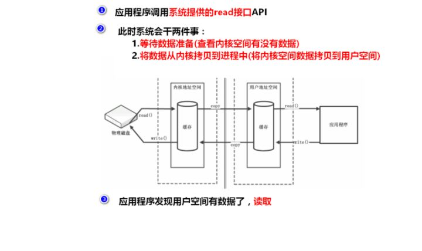

​	对于一个network IO (这里我们以read举例)，它会涉及到两个系统对象，一个是调用这个IO的process (or thread)，另一个就是系统内核(kernel)。当一个read操作发生时，该操作会经历两个阶段：

```
#1）等待数据准备 (Waiting for the data to be ready)
#2）将数据从内核拷贝到进程中(Copying the data from the kernel to the process)
```

　　记住这两点很重要，因为这些IO模型的区别就是在两个阶段上各有不同的情况。

## 同步阻塞IO

 **blocking IO的特点就是在IO执行的两个阶段（等待数据和拷贝数据两个阶段）都被block了。** 

 网络编程都是从listen()、send()、recv() 等接口开始的，使用这些接口可以很方便的构建服务器/客户机的模型。然而大部分的socket接口都是阻塞型的。 

 在进程(用户)空间中调用`recvfrom`，其系统调用直到数据包到达且**被复制到应用进程的缓冲区中或者发生错误时才返回**，在此期间**一直等待**。 

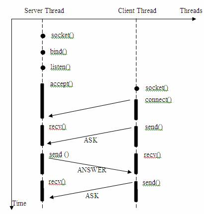

解决方案：

使用多线程，线程池

 **对应上例中的所面临的可能同时出现的上千甚至上万次的客户端请求，“线程池”或“连接池”或许可以缓解部分压力，但是不能解决所有问题。总之，多线程模型可以方便高效的解决小规模的服务请求，但面对大规模的服务请求，多线程模型也会遇到瓶颈，可以用非阻塞接口来尝试解决这个问题。** 

## 非阻塞IO

 非阻塞的recvform系统调用调用之后，进程并没有被阻塞，内核马上返回给进程，如果数据还没准备好，此时会返回一个error。进程在返回之后，可以干点别的事情，然后再发起recvform系统调用。重复上面的过程，循环往复的进行recvform系统调用。这个过程通常被称之为轮询。轮询检查内核数据，直到数据准备好，再拷贝数据到进程，进行数据处理。需要注意，拷贝数据整个过程，进程仍然是属于阻塞的状态。 

  **所以，在非阻塞式IO中，用户进程其实是需要不断的主动询问kernel数据准备好了没有。**  但**非阻塞IO模型绝不被推荐** 

 **优点：**能够在等待任务完成的时间里干其他活了（包括提交其他任务，也就是 “后台” 可以有多个任务在“”同时“”执行） 

缺点：

```
#1. 循环调用recv()将大幅度推高CPU占用率；这也是我们在代码中留一句time.sleep(2)的原因,否则在低配主机下极容易出现卡机情况
#2. 任务完成的响应延迟增大了，因为每过一段时间才去轮询一次read操作，而任务可能在两次轮询之间的任意时间完成。这会导致整体数据吞吐量的降低。
```

## 多路复用IO

 在Linux下对文件的操作是**利用文件描述符(file descriptor)来实现的**。

在Linux下它是这样子实现I/O复用模型的：

- 调用`select/poll/epoll/pselect`其中一个函数，**传入多个文件描述符**，如果有一个文件描述符**就绪，则返回**，否则阻塞直到超时。

（1）当用户进程调用了select，那么整个进程会被block；

（2）而同时，kernel会“监视”所有select负责的socket；

（3）当任何一个socket中的数据准备好了，select就会返回；

（4）这个时候用户进程再调用read操作，将数据从kernel拷贝到用户进程(空间)。

所以，I/O 多路复用的特点是**通过一种机制一个进程能同时等待多个文件描述符**，而这些文件描述符**其中的任意一个进入读就绪状态**，select()函数**就可以返回**。

强调：**

  **1. 如果处理的连接数不是很高的话，使用select/epoll的web server不一定比使用multi-threading + blocking IO的web server性能更好，可能延迟还更大。select/epoll的优势并不是对于单个连接能处理得更快，而是在于能处理更多的连接。**

  **2. 在多路复用模型中，对于每一个socket，一般都设置成为non-blocking，但是，如上图所示，整个用户的process其实是一直被block的。只不过process是被select这个函数block，而不是被socket IO给block。**

  **结论: select的优势在于可以处理多个连接，不适用于单个连接** 

**优点：**

```
#相比其他模型，使用select() 的事件驱动模型只用单线程（进程）执行，占用资源少，不消耗太多 CPU，同时能够为多客户端提供服务。如果试图建立一个简单的事件驱动的服务器程序，这个模型有一定的参考价值。
```

## 异步IO

 用户进程发起read操作之后，立刻就可以开始去做其它的事。而另一方面，从kernel的角度，当它受到一个asynchronous read之后，首先它会立刻返回，所以不会对用户进程产生任何block。然后，kernel会等待数据准备完成，然后将数据拷贝到用户内存，当这一切都完成之后，kernel会给用户进程发送一个signal，告诉它read操作完成了。 

# AIO NIO BIO概念

BIO:同步并阻塞（传统阻塞型），同步器实现模式为一个连接一个线程，即客户端有链接请求时服务段就需要启动一个线程进行处理，如果这个连接不做任何事情就会造成不必要的线程开销。

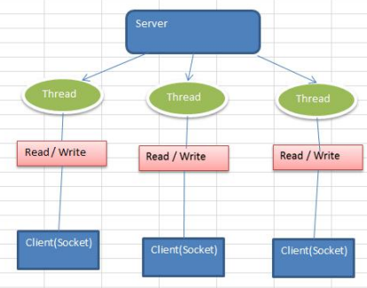

NIO:同步非阻塞，服务器实现模式为一个线程处理多个请求，即客户端发送的连接请求都会注册到多路复用器上，多路复用器轮询到连接有IO请求就进行处理。

 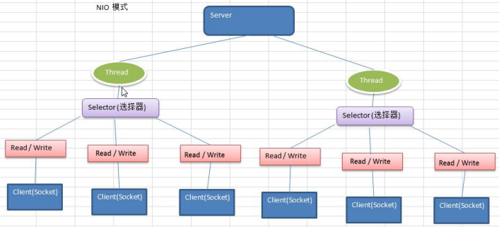

AIO：异步非阻塞。引用通道的概念，采用Proactor模式，简化了程序编写，有效的请求才启动线程，它的特点是**先有操作系统完成后才通知服务端程序取处理**，一般适用于**连接数较多且连接时间较长的应用**。

二、应用场景

1.BIO方式适用于**连接数目比较小且固定的架构**，这种方式对服务器资源要求比较高，并发局限于应用中，JDK1.4以前的唯一选择，但程序简单易理解。

2.NIO方式适用于**连接数目多且连接比较短（轻操作）**的架构，比如聊天服务器，弹幕系统，服务器间通讯等。编程比较复杂，JDK1.4开始支持。
3.AIO方式使用于**连接数目多且连接比较长（重操作）**的架构，比如相册服务器，充分调用OS参与并发操作，编程比较复杂，JDK7开始支持。

# BIO

举例

普通

多线程

线程池


# NIO

 io主要存在于两个场景

- 文件IO
- 网络IO

NIO的**魅力：在网络中使用IO就可以体现出来了**！

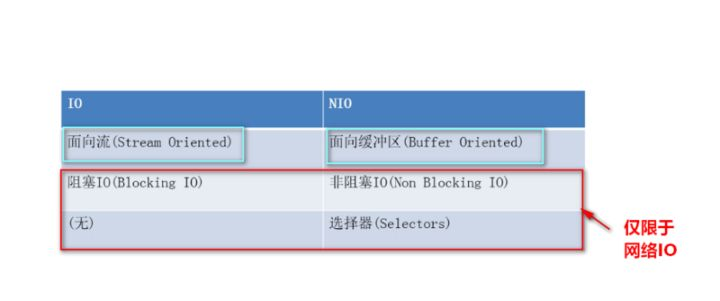

- 面向流的I/O 系统**一次一个字节地处理数据**。
- 一个面向块(缓冲区)的I/O系统**以块的形式处理数据**。

NIO主要有**三个核心部分组成**：

- **buffer缓冲区**
- **Channel管道**
- **Selector选择器**

**NIO将数据缓存流(buffer)与传输控制(channel)相剥离**

* 每个channel都对应一个Buffer

* Selector对应一个线程，一个线程对应多个channel连接

* 切换到哪个channel是由事件决定的

* buffer是一个内存块，底层是数组
* buffer与channel都是双向的

**为什么java nio是同步非阻塞的？**

​      我们知道java nio是基于io多路复用模型，也就是我们经常提到的select，poll，epoll。io 多路复用本质是同步io，其需要调用方在读写事件就绪时主动去进行读写。在java nio中，通过selector来获取就绪的事件，当selector上监听的channel中没有就绪的读写时间时，其可以直接返回，或者设置一段超时后返回。可以看出java nio可以实现非则塞，而不像传统io里必须则塞当前线程直到可读或可写。所以，java nio可以实现非阻塞。

## Buffer

 buffer缓冲区和Channel管道**配合使用**来处理数据。 

Buffer是抽象类，**实现类有**

 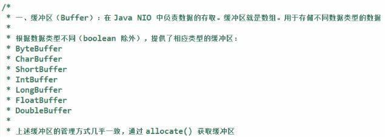

**核心方法**及**核心参数：**

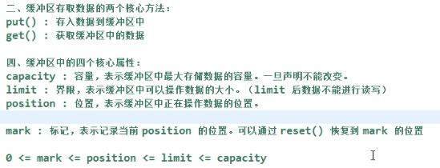

**演示：**

最常用的byteBuffer

```java
  public static void main(String[] args) throws InterruptedException {

// 创建一个缓冲区
        ByteBuffer byteBuffer = ByteBuffer.allocate(1024);

        // 看一下初始时4个核心变量的值
        System.out.println("初始时-->limit--->"+byteBuffer.limit());
        System.out.println("初始时-->position--->"+byteBuffer.position());
        System.out.println("初始时-->capacity--->"+byteBuffer.capacity());
        System.out.println("初始时-->mark--->" + byteBuffer.mark());

        System.out.println("--------------------------------------");

        // 添加一些数据到缓冲区中
        String s = "Java3y";
        byteBuffer.put(s.getBytes());

        // 看一下初始时4个核心变量的值
        System.out.println("put完之后-->limit--->"+byteBuffer.limit());
        System.out.println("put完之后-->position--->"+byteBuffer.position());
        System.out.println("put完之后-->capacity--->"+byteBuffer.capacity());
        System.out.println("put完之后-->mark--->" + byteBuffer.mark());
    }
```

```
初始时-->limit--->1024
初始时-->position--->0
初始时-->capacity--->1024
初始时-->mark--->java.nio.HeapByteBuffer[pos=0 lim=1024 cap=1024]
--------------------------------------
put完之后-->limit--->1024
put完之后-->position--->6
put完之后-->capacity--->1024
put完之后-->mark--->java.nio.HeapByteBuffer[pos=6 lim=1024 cap=1024]
```

读取数据，调用flip()方法，使得 **limit变成了position的位置了** ， **而position变成了0** 。

```
flip之后-->limit--->6
flip之后-->position--->0
flip之后-->capacity--->1024
flip之后-->mark--->java.nio.HeapByteBuffer[pos=0 lim=6 cap=1024]
```

 当调用完`filp()`时：  **limit是限制读到哪里，而position是从哪里读** 

 一般我们称`filp()`为**“切换成读模式”** ，每当要从缓存区的时候读取数据时，就调用`filp()`**“切换成读模式”**。

```java
  byte[] bytes = new byte[byteBuffer.limit()];
        // 将读取的数据装进我们的字节数组中
        byteBuffer.get(bytes);
        // 输出数据
        System.out.println(new String(bytes, 0, bytes.length));
```

```
 Java3y
读取完完之后-->limit--->6
读取完之后-->position--->6
读取完之后-->capacity--->1024
读取完之后-->mark--->java.nio.HeapByteBuffer[pos=6 lim=6 cap=1024]
```

 **读完我们还想写数据到缓冲区**，那就使用`clear()`函数，这个函数会“清空”缓冲区： 

### 内存分配

 https://blog.csdn.net/qq_21955179/article/details/101022437 

Java NIO引入了用于通道的缓冲区的ByteBuffer。 ByteBuffer有三个主要的实现：

HeapByteBuffer
在调用ByteBuffer.allocate（）时使用。 它被称为堆，因为它保存在JVM的堆空间中，因此你可以获得所有优势，如GC支持和缓存优化。 但是，它不是页面对齐的，这意味着如果你需要通过JNI与本地代码交谈，JVM将不得不复制到对齐的缓冲区空间。

DirectByteBuffer
在调用ByteBuffer.allocateDirect（）时使用。 JVM将使用malloc（）在堆空间之外分配内存空间。 因为它不是由JVM管理的，所以你的内存空间是页面对齐的，不受GC影响，这使得它成为处理本地代码的完美选择。 然而，你要C程序员一样，自己管理这个内存，必须自己分配和释放内存来防止内存泄漏。

MappedByteBuffer
在调用FileChannel.map（）时使用。 与DirectByteBuffer类似，这也是JVM堆外部的情况。 它基本上作为OS mmap（）系统调用的包装函数，以便代码直接操作映射的物理内存数据。


## Channel

这些是Java NIO中最重要的通道的实现：

- FileChannel  从文件中读写数据
- DatagramChannel  能通过UDP读写网络中的数据。
- SocketChannel SocketChannel 能通过TCP读写网络中的数据。
- ServerSocketChannel   可以监听新进来的TCP连接，像Web服务器那样。对每一个新进来的连接都会创建一个SocketChannel。

 通道不能单独存在，它**永远需要绑定一个缓存区**，所有的数据只会存在于缓存区中，无论你是写或是读，必然是缓存区**通过通道**到达磁盘文件，或是磁盘文件**通过通道**到达缓存区。 

通道与流的区别：

* 通过可以同时进行读写，而流只能读或者写
* 通道可以实现异步读写数据
* 通道可以从缓冲读数据，也可以写数据到缓冲

### 获取通道的方法

1）Java针对支持通道的类提供了getChannel()方法

本地IO：

|--FileInputStream/FileOutputStream

|--RandomAccessFile

网络IO：

|--Socket

|--ServerSocket

|--DatagramSocket

|--Pip.***

2）在JDK1.7中的NIO.2针对各个通过提供了静态方法open()

3）在JDK1.7中的NIO.2的Files工具类的newByteChannel()

4）Channles工具类中提供了静态方法newChannel()。

```
RandomAccessFile aFile = new RandomAccessFile("data/nio-data.txt", "rw");
FileChannel inChannel = aFile.getChannel();

ByteBuffer buf = ByteBuffer.allocate(48);

int bytesRead = inChannel.read(buf);
while (bytesRead != -1) {

System.out.println("Read " + bytesRead);
buf.flip();

while(buf.hasRemaining()){
System.out.print((char) buf.get());
}

buf.clear();
bytesRead = inChannel.read(buf);
}
aFile.close();
```

 注意 buf.flip() 的调用，首先读取数据到Buffer，然后反转Buffer,接着再从Buffer中读取数据。 


缓冲区方法：


### scatter和gather、字符集


- 分散读取(scatter)：将一个通道中的数据分散读取到多个缓冲区中
- 聚集写入(gather)：将多个缓冲区中的数据集中写入到一个通道中

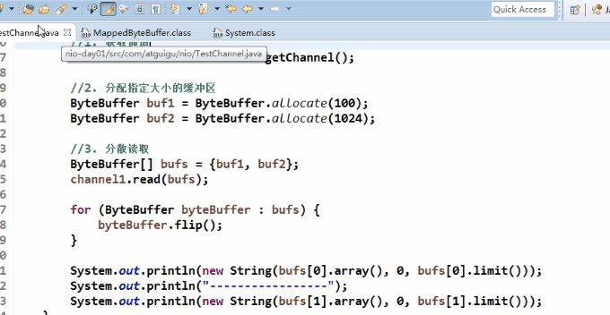

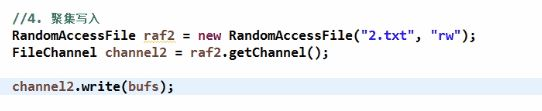

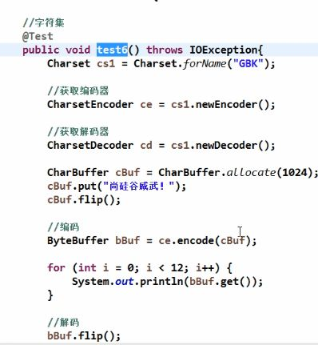

### 零拷贝

零拷贝从操作系统角度时没有cpu拷贝，即内核缓冲区之间没有数据是重复的，零拷贝能带来更少的上下文切换，更少的CPU伪共享以及无CPU校验和计算。

传统IO

**DMA:**direct memory access 直接内存拷贝不使用CPU

**传统拷贝**

 在Java中，我们可以通过InputStream从源数据中读取数据流到一个缓冲区里，然后再将它们输入到OutputStream里。我们知道，这种IO方式传输效率是比较低的。那么，当使用上面的代码时操作系统会发生什么情况： 

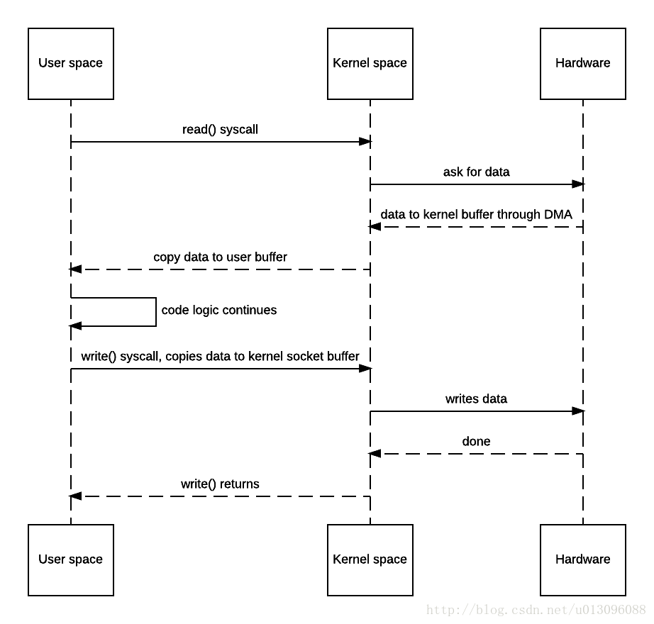

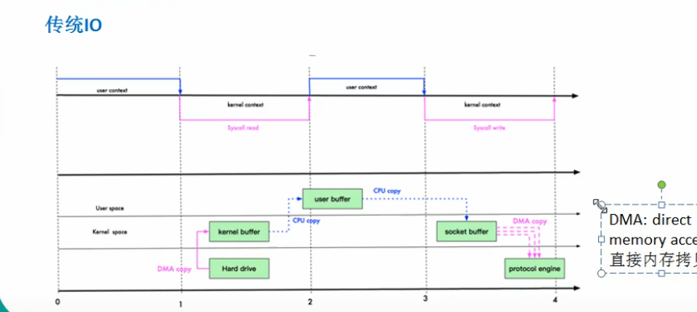

**MMap优化**：通过内存映射，将文件映射到内核缓冲区，同时，用户空间可以共享内核空间的数据，这样在进行网络传输时，就可以减少内核空间到用户空间的拷贝次数。**拷贝次数减少，状态切换次数不变。*

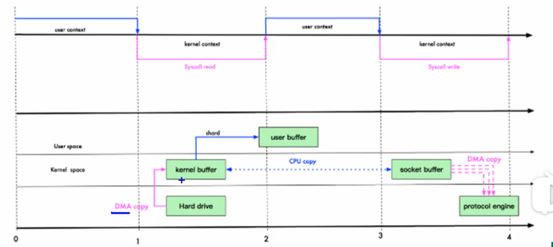

**sendfile优化：**linux2.1版本提供了sendfile函数，其基本原理如下：数据不用经过用户态，直接从内核缓冲区进入到SocketBuffer同时，由于和用户态完全无关，就减少了一次上下文切换

2.4时做了一些修改，避免了从内核缓冲区拷贝到socketbuffer (少量信息拷贝到socketbuffer中，消耗低可以忽略)

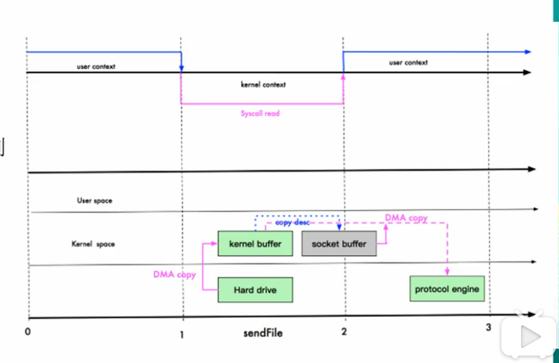

**NIO的零拷贝由transferTo()方法实现。**transferTo()方法将数据从FileChannel对象传送到可写的字节通道（如Socket Channel等）。在内部实现中，由native方法transferTo0()来实现，它依赖底层操作系统的支持。在UNIX和Linux系统中，**调用这个方法将会引起sendfile()系统调用。**

使用场景一般是：

* 文件较大，读写较慢，追求速度
* JVM内存不足，不能加载太大数据
* 内存带宽不够，即存在其他程序或线程存在大量的IO操作，导致带宽本来就小

 	以上都建立在不需要进行数据文件操作的情况下，如果既需要这样的速度，也需要进行数据操作怎么办？那么使用NIO的直接内存！

**NIO的直接内存**
首先，它的作用位置处于传统IO（BIO）与零拷贝之间，为何这么说？

传统IO，可以把磁盘的文件经过内核空间，读到JVM空间，然后进行各种操作，最后再写到磁盘或是发送到网络，效率较慢但支持数据文件操作。
零拷贝则是直接在内核空间完成文件读取并转到磁盘（或发送到网络）。由于它没有读取文件数据到JVM这一环，因此程序无法操作该文件数据，尽管效率很高！
而直接内存则介于两者之间，效率一般且可操作文件数据。直接内存（mmap技术）将文件直接映射到内核空间的内存，返回一个操作地址（address），它解决了文件数据需要拷贝到JVM才能进行操作的窘境。而是直接在内核空间直接进行操作，省去了内核空间拷贝到用户空间这一步操作。

NIO的直接内存是由MappedByteBuffer实现的。核心即是map()方法，该方法把文件映射到内存中，获得内存地址addr，然后通过这个addr构造MappedByteBuffer类，以暴露各种文件操作API。

由于MappedByteBuffer申请的是堆外内存，因此不受Minor GC控制，只能在发生Full GC时才能被回收。而DirectByteBuffer改善了这一情况，它是MappedByteBuffer类的子类，同时它实现了DirectBuffer接口，维护一个Cleaner对象来完成内存回收。因此它既可以通过Full GC来回收内存，也可以调用clean()方法来进行回收。

另外，直接内存的大小可通过jvm参数来设置：-XX:MaxDirectMemorySize。

NIO的MappedByteBuffer还有一个兄弟叫做HeapByteBuffer。顾名思义，它用来在堆中申请内存，本质是一个数组。由于它位于堆


### Channel to Channel（零拷贝）

在Java NIO中如果一个channel是FileChannel类型的，那么他可以直接把数据传输到另一个channel。逐个特性得益于FileChannel包含的transferTo和transferFrom两个方法。

**transferFrom()**

FileChannel.transferFrom方法把数据从通道源传输到FileChannel：

```
RandomAccessFile fromFile = new RandomAccessFile("fromFile.txt", "rw");
FileChannel      fromChannel = fromFile.getChannel();

RandomAccessFile toFile = new RandomAccessFile("toFile.txt", "rw");
FileChannel      toChannel = toFile.getChannel();

long position = 0;
long count    = fromChannel.size();

toChannel.transferFrom(fromChannel, position, count);
```

transferFrom的参数position和count表示目标文件的写入位置和最多写入的数据量。如果通道源的数据小于count那么就传实际有的数据量。 另外，有些SocketChannel的实现在传输时只会传输哪些处于就绪状态的数据，即使SocketChannel后续会有更多可用数据。因此，这个传输过程可能不会传输整个的数据。

**transferTo()**

transferTo方法把FileChannel数据传输到另一个channel,下面是案例：

```
RandomAccessFile fromFile = new RandomAccessFile("fromFile.txt", "rw");
FileChannel      fromChannel = fromFile.getChannel();

RandomAccessFile toFile = new RandomAccessFile("toFile.txt", "rw");
FileChannel      toChannel = toFile.getChannel();

long position = 0;
long count    = fromChannel.size();

fromChannel.transferTo(position, count, toChannel);
```

这段代码和之前介绍transfer时的代码非常相似，区别只在于调用方法的是哪个FileChannel.

SocketChannel的问题也存在与transferTo.SocketChannel的实现可能只在发送的buffer填充满后才发送，并结束。

### FileChannel文件通道

​	Java NIO中的FileChannel是用于连接文件的通道。通过文件通道可以读、写文件的数据。Java NIO的FileChannel是相对标准Java IO API的可选接口。

FileChannel不可以设置为非阻塞模式，他只能在阻塞模式下运行。


## selector

 Selector是Java NIO中的一个组件，用于检查一个或多个NIO Channel的状态是否处于可读、可写。如此可以实现单线程管理多个channels,也就是可以管理多个网络链接。 

 Channel必须是非阻塞的。所以FileChannel不适用Selector，因为FileChannel不能切换为非阻塞模式。Socket channel可以正常使用。 

 简而言之，通过Selector我们可以实现单线程操作多个channel。

  传统的Io方式是阻塞的，我们拿网络io来举例，传统的io模型如下： 

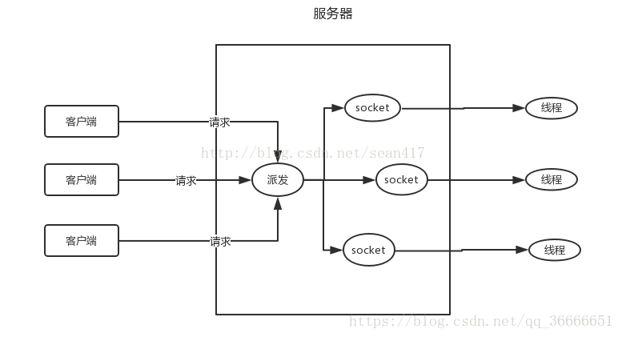

服务端主线程负责不断地server.accept()，如果没有客户端请求主线程就会阻塞，当客户端请求时，主线程会通过线程池创建一个新的线程执行。简单解释就是**一个线程负责一个客户端的socket**，当客户端因网络等原因传递速度慢的时候，服务端对应的客户端的线程就会等待，很浪费资源。同时线程过少的话会影响服务的吞吐量，而线程过多的话由于上下文切换等原因会导致效率十分低下，传统的io方式并不适合如今的网络流量。
    
Nio的模型如下：

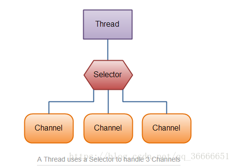

nio相比传统的io模型，最大的特点是优化了线程的使用。nio通过selector可以使用一个线程去管理多个socket句柄，说是管理也不太合适，nio是采用的**事件驱动模型**，selector负责的是**监控各个连接句柄的状态**，不是去轮询每个句柄，而是在数据就绪后，将消息通知给selector，而具体的socket句柄管理则是**采用多路复用**的模型，交由操作系统来完成。selector充当的是一个消息的监听者，负责监听channel在其注册的事件，这样就可以通过一个线程完成了大量连接的管理，当注册的事件发生后，再调用相应线程进行处理。这样就不需要为每个连接都使用一个线程去维持长连接，减少了长连接的开销，同时减少了上下文的切换提高了系统的吞吐量。


### selector 创建与注册

```java
//创建一个Selector可以通过Selector.open()方法：
Selector selector = Selector.open();
//为了同Selector挂了Channel，我们必须先把Channel注册到Selector上，这个操作使用SelectableChannel。register()：
channel.configureBlocking(false);
SelectionKey key = channel.register(selector, SelectionKey.OP_READ);
```

注意register的第二个参数，这个参数是一个“关注集合”，代表我们关注的channel状态，有四种基础类型可供监听：

```
SelectionKey.OP_CONNECT
SelectionKey.OP_ACCEPT
SelectionKey.OP_READ
SelectionKey.OP_WRITE
```

如果对多个事件感兴趣可利用位的或运算结合多个常量，比如：

```
int interestSet = SelectionKey.OP_READ | SelectionKey.OP_WRITE;  
```

### SelectionKey

利用register方法把Channel注册到了Selectors上，这个方法的返回值是SelectionKeys，这个返回的对象包含了一些比较有价值的属性：

- The interest set
- The ready set
- The Channel
- The Selector
- An attached object (optional)

注意： channel于selectionkey一一对应，selector通过selectionkey管理channel，一个Channel只能被注册到Selector上一次，如果将Channel注册多次到Selector上，其实相当于是在更新 

**Interest Set**

这个“关注集合”实际上就是我们希望处理的事件的集合，它的值就是注册时传入的参数，我们可以用按为与运算把每个事件取出来：

```
int interestSet = selectionKey.interestOps();

boolean isInterestedInAccept  = interestSet & SelectionKey.OP_ACCEPT;
boolean isInterestedInConnect = interestSet & SelectionKey.OP_CONNECT;
boolean isInterestedInRead    = interestSet & SelectionKey.OP_READ;
boolean isInterestedInWrite   = interestSet & SelectionKey.OP_WRITE; 
```

**Ready Set**

"就绪集合"中的值是当前channel处于就绪的值，一般来说在调用了select方法后都会需要用到就绪状态，select的介绍在胡须文章中继续展开。

```
int readySet = selectionKey.readyOps();
```

从“就绪集合”中取值的操作类似月“关注集合”的操作，当然还有更简单的方法，SelectionKey提供了一系列返回值为boolean的的方法：

```
selectionKey.isAcceptable();
selectionKey.isConnectable();
selectionKey.isReadable();
selectionKey.isWritable();
```

**Channel + Selector**

从SelectionKey操作Channel和Selector非常简单：

```
Channel  channel  = selectionKey.channel();
Selector selector = selectionKey.selector();    
```

**Attaching Objects**

我们可以给一个SelectionKey附加一个Object，这样做一方面可以方便我们识别某个特定的channel，同时也增加了channel相关的附加信息。例如，可以把用于channel的buffer附加到SelectionKey上：

```
selectionKey.attach(theObject);

Object attachedObj = selectionKey.attachment();
```

附加对象的操作也可以在register的时候就执行：

```
SelectionKey key = channel.register(selector, SelectionKey.OP_READ, theObject);
```


### 从Selector中选择channel

selector方法

- int select()
- int select(long timeout)
- int selectNow()

>  select()方法的返回值是一个int整形，**代表有多少channel处于就绪了**。也就是自上一次select后有多少channel进入就绪。举例来说，假设第一次调用select时正好有一个channel就绪，那么返回值是1，并且对这个channel做任何处理，接着再次调用select，此时恰好又有一个新的channel就绪，那么返回值还是1，现在我们一共有两个channel处于就绪，但是在每次调用select时只有一个channel是就绪的。  **通过Selector的select（）方法可以选择已经准备就绪的通道**  

* **selectedKeys()**

在调用select并返回了有channel就绪之后，可以通过选中的key集合来获取channel，这个操作通过调用selectedKeys()方法：

```
Set<SelectionKey> selectedKeys = selector.selectedKeys();  
```

selectedKeys是selectedKey的集合

 遍历这些SelectionKey可以通过如下方法： 

遍历这些SelectionKey可以通过如下方法：

```java
Set<SelectionKey> selectedKeys = selector.selectedKeys();

Iterator<SelectionKey> keyIterator = selectedKeys.iterator();

while(keyIterator.hasNext()) {

    SelectionKey key = keyIterator.next();

    if(key.isAcceptable()) {
        // a connection was accepted by a ServerSocketChannel.

    } else if (key.isConnectable()) {
        // a connection was established with a remote server.

    } else if (key.isReadable()) {
        // a channel is ready for reading

    } else if (key.isWritable()) {
        // a channel is ready for writing
    }

    keyIterator.remove();
}
```

* wakeUp()

>  	由于调用select而被阻塞的线程，可以通过调用Selector.wakeup()来唤醒即便此时已然没有channel处于就绪状态。具体操作是，在另外一个线程调用wakeup，被阻塞与select方法的线程就会立刻返回。

* close()

>  	当操作Selector完毕后，需要调用close方法。close的调用会关闭Selector并使相关的SelectionKey都无效。channel本身不管被关闭。

### 完整案例

```
Selector selector = Selector.open();

channel.configureBlocking(false);

SelectionKey key = channel.register(selector, SelectionKey.OP_READ);

while(true) {

  int readyChannels = selector.select();

  if(readyChannels == 0) continue;

  Set<SelectionKey> selectedKeys = selector.selectedKeys();

  Iterator<SelectionKey> keyIterator = selectedKeys.iterator();

  while(keyIterator.hasNext()) {

    SelectionKey key = keyIterator.next();

    if(key.isAcceptable()) {
        // a connection was accepted by a ServerSocketChannel.

    } else if (key.isConnectable()) {
        // a connection was established with a remote server.

    } else if (key.isReadable()) {
        // a channel is ready for reading

    } else if (key.isWritable()) {
        // a channel is ready for writing
    }

    keyIterator.remove();
  }
}
```


服务端与客户端简单交互

```java
public class WebServer {
    public static void main(String[] args) {
        try {
            ServerSocketChannel ssc = ServerSocketChannel.open();
            ssc.socket().bind(new InetSocketAddress("127.0.0.1", 8000));
            ssc.configureBlocking(false);

            Selector selector = Selector.open();
            // 注册 channel，并且指定感兴趣的事件是 Accept
            ssc.register(selector, SelectionKey.OP_ACCEPT);

            ByteBuffer readBuff = ByteBuffer.allocate(1024);
            ByteBuffer writeBuff = ByteBuffer.allocate(128);
            writeBuff.put("received".getBytes());
            writeBuff.flip();

            while (true) {
                int nReady = selector.select();
                Set<SelectionKey> keys = selector.selectedKeys();
                Iterator<SelectionKey> it = keys.iterator();

                while (it.hasNext()) {
                    SelectionKey key = it.next();
                    it.remove();

                    if (key.isAcceptable()) {
                        // 创建新的连接，并且把连接注册到selector上，而且，
                        // 声明这个channel只对读操作感兴趣。
                        SocketChannel socketChannel = ssc.accept();
                        socketChannel.configureBlocking(false);
                        socketChannel.register(selector, SelectionKey.OP_READ);
                    }
                    else if (key.isReadable()) {
                        SocketChannel socketChannel = (SocketChannel) key.channel();
                        readBuff.clear();
                        socketChannel.read(readBuff);

                        readBuff.flip();
                        System.out.println("received : " + new String(readBuff.array()));
                        key.interestOps(SelectionKey.OP_WRITE);
                    }
                    else if (key.isWritable()) {
                        writeBuff.rewind();
                        SocketChannel socketChannel = (SocketChannel) key.channel();
                        socketChannel.write(writeBuff);
                        key.interestOps(SelectionKey.OP_READ);
                    }
                }
            }
        } catch (IOException e) {
            e.printStackTrace();
        }
    }
}
```

**客户端：**

```java
package selector;

import java.io.IOException;
import java.net.InetSocketAddress;
import java.nio.ByteBuffer;
import java.nio.channels.SocketChannel;

public class WebClient {
    public static void main(String[] args) throws IOException {
        try {
            SocketChannel socketChannel = SocketChannel.open();
            socketChannel.connect(new InetSocketAddress("127.0.0.1", 8000));

            ByteBuffer writeBuffer = ByteBuffer.allocate(32);
            ByteBuffer readBuffer = ByteBuffer.allocate(32);

            writeBuffer.put("hello".getBytes());
            writeBuffer.flip();

            while (true) {
                writeBuffer.rewind();
                socketChannel.write(writeBuffer);
                readBuffer.clear();
                socketChannel.read(readBuffer);
            }
        } catch (IOException e) {
        }
    }
}
```


 **运行结果**

 先运行服务端，再运行客户端，服务端会不断收到客户端发送过来的消息。

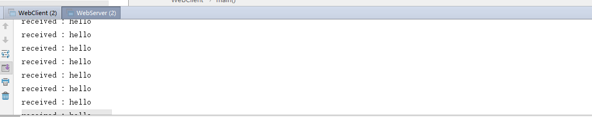

### 三种实现select、poll、epoll

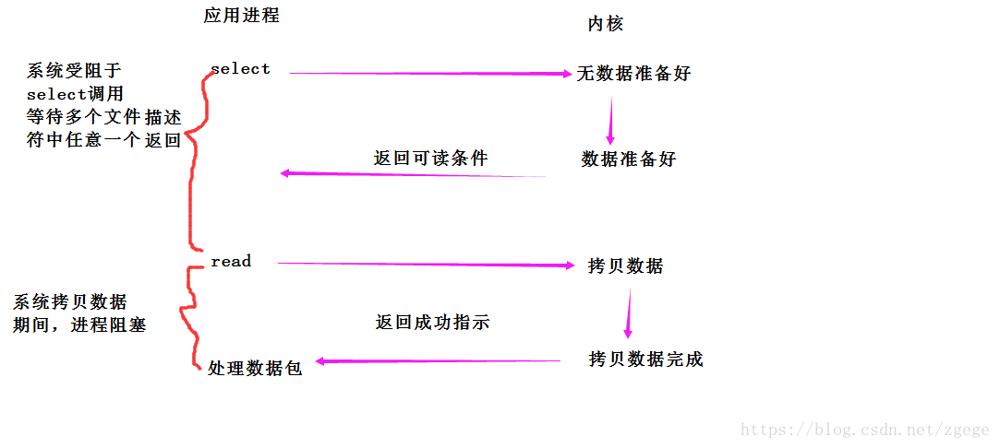

##### select运行机制

select()的机制中提供一种`fd_set`的数据结构，实际上是一个long类型的数组，每一个数组元素都能与一打开的文件句柄（不管是Socket句柄,还是其他文件或命名管道或设备句柄）建立联系，建立联系的工作由程序员完成，当调用select()时，由内核根据IO状态修改fd_set的内容，由此来通知执行了select()的进程哪一Socket或文件可读。

##### select机制的问题

1. 每次调用select，都需要把`fd_set`集合从用户态拷贝到内核态，如果`fd_set`集合很大时，那这个开销也很大
2. 同时每次调用select都需要在内核遍历传递进来的所有`fd_set`，如果`fd_set`集合很大时，那这个开销也很大
3. 为了减少数据拷贝带来的性能损坏，内核对被监控的`fd_set`集合大小做了限制，并且这个是通过宏控制的，大小不可改变(限制为1024)

**Poll**

poll的机制与select类似，与select在本质上没有多大差别，管理多个描述符也是进行轮询，根据描述符的状态进行处理，但是poll没有最大文件描述符数量的限制。也就是说，poll只解决了上面的问题3，并没有解决问题1，2的性能开销问题。

**epoll**

epoll在Linux2.6内核正式提出，是基于事件驱动的I/O方式，相对于select来说，epoll没有描述符个数限制，使用一个文件描述符管理多个描述符，将用户关心的文件描述符的事件存放到内核的一个事件表中，这样在用户空间和内核空间的copy只需一次。

epoll是Linux内核为处理大批量文件描述符而作了改进的poll，是Linux下多路复用IO接口select/poll的增强版本，它能显著提高程序在大量并发连接中只有少量活跃的情况下的系统CPU利用率。原因就是获取事件的时候，它无须遍历整个被侦听的描述符集，只要遍历那些被内核IO事件异步唤醒而加入Ready队列的描述符集合就行了

而epoll通过在linux申请一个建议的文件系统，把select调用分为了三部分。

1）调用epoll_create建立一个epoll对象，这个对象包含了一个红黑树和一个双向链表。并与底层建立回调机制。
2）调用epoll_ctl向epoll对象中添加这100万个连接的套接字
3）调用epoll_wait收集发生事件的连接。


[IO多路复用三种机制]:  https://www.jianshu.com/p/397449cadc9a


# 参考

[从linux内核理解并发]: https://www.cnblogs.com/cainingning/p/9556642.html
[java io/nio相关问题]: 	"https://blog.csdn.net/feather_wch/article/details/82665902"

[谷歌搜索排名第一的nio教程]: http://tutorials.jenkov.com/java-nio/channels.html
[java博客]: https://www.cnblogs.com/snailclimb/p/9086334.html	"有时间可以看看"
[NIO优势？堆内存？直接内存？映射文件？]: https://www.jianshu.com/p/c81f8a93d42f

[高性能io模型分析]: https://www.zhihu.com/people/li-peng-fei-49-75/posts