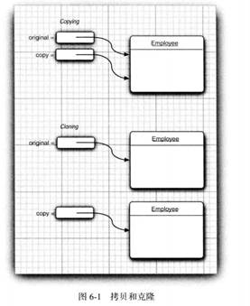

#### 数据类型：

  * 整形（int short long byte），长整形后缀l或者L，16进制前缀（0x,0X）,
    8进制前缀（0）,二进制前缀（0b）
  * 浮点类型（float,double）,默认为double，float后缀（f,F）
  * char类型，单个字符，使用'',值可以表示为十六进制值，转义字符，强烈不建议在程序中使用char类型
  * 常量，关键字final表示常量
  * 位运算符（&、|、^、~），<<,>>.移位运算符的右操作数要完成模32 的运算（除非左操作数是long 类型， 在这种情况下需要对右操作數模64
  * 枚举类型

 ```
 enum Size { SMALL, MEDIUM, LARGE, EXTR.A LARCE };
 Size s = Size.MEDIUM;
 ```

#### 3.6 字符串

* 常用操作：提取字串  字符串.substring(起始,长度)，拼接“+”；如果需要把多个字符串放在一起， 用一个定界符分隔，可以使用静态join 方法

 ```java
 String all = String.join(" / ", "S", "M", "L", "XL");
// all is the string "S / H / L / XL"
 ```

**String类对象为不可变字符串，可以修改字符串变量，让他引用另一个字符串，如果复制一个字符串变量，原始字符串与复制的字符串共享相同的字符**

* 构建字符串，每次连接字符串都会构建新的String对象，耗时耗空间，可以使用StringBuilder类(与StringBuffer相比，前者是单线程，后者运行多线程，效率稍低，API相同)

```java
StringBuilder builder=new StringBuilder();
builder.append(ch);
String completedString=builder.toString();
```

#### 输入输出

```java
Scanner in=new Scanner(System.in);
String name=in.nextLine();//读一行
String firstname=in.next();//读一个单词
int age=in.nextInt();//读一个整数


System.out.printf("%tc",new Date())//格式化输出

```

#### 3.8 控制流程

* 在循环中，检测两个浮点数是否相等需要格外小心，由于舍入的误差，最终可能得不到精确值
* switch case,case标签可以是char、byte、short、int的常量表达式，枚举常量，字符串常量
* Java 提供带标签的break语句，用于跳出多重嵌套的循环语句。

#### 3.10 数组

* 数组拷贝

```java
int[] copy=Arrays.copyOf(目标数组，长度)
```

* 打印一维数组Array.toString(a)
* 打印二维数组Array.deepToString(a)
* Java可以创建不规则数组 new int[Max][];

### 对象与类

####4.2对象与对象变量

* 在对象与对象变量之间存在一个重要的区别，一个对象变量并没有实际包含一个对象，而仅仅引用了一个对象，所有Java对象都存储在堆中。


* 两个日期类Date和LocalDate

####4.3 多个源文件使用

* javac Employee*.java通配符编译
* javac EmployeeTest.java会对其中使用的类进行自动搜索编译

# 4.3.9

* 可以将实例域定义为final,构建对象时必须初始化这样的域，并且不能再对它进行修改

#### 4.5方法参数

* Java程序设计语言对象引用是按值传递的，即参数将拷贝对象的引用，方法结束后不再使用
  一个方法不能修改一个基本数据类型的参数
  一个方法可以改变一个对象参数的状态
  一个方法不能让对象参数引用一个新的对象

```
Employee a = new Employee("Alice", . . .);
Employee b = new Employee("Bob", . . .);
swap(a, b);
// does a now refer to Bob, b to Alice? No
// x refers to Alice, y to Bob
Employee temp = x;
x = y;
y = temp;
// now x refers to Bob, y to Alice
```

4.7.2
静态导入

# 5.1 

一个对象变量可以指示多种实际类型的现象被称为多态，在运行时能够自动选择调用哪个方法的现象称为动态绑定
private static final方法或者构造器，编译器通过静态绑定调用方法
虚拟机通过为每个类创建方法表调用方法
覆盖方法时，子类方法不能低于超类方法的可见性
不允许扩展的类用final修饰
如果一个方法没有被覆盖并且很短，编译器就能够对它进行优化，这个过程称为内联

将超类转换成子类之前，应该使用instanceof进行检查
``
if (staff[1] instanceof Manager){
boss=(Manager) staff[1];
}

```
* 抽象类变量指向具体子类对象

*仅对本类可见--private
* 对所有类可见--public
* 对本包和所有子类可见--protected
*　对本包可见－－默认，不需要

＃５.２　在子类中定义ｅｑｕａｌｓ方法时，首先调用超类的ｅｑｕａｌｓ，如果检测失败则不可能相等，超类中域相等，则比较子类中的实例域


#### 4.4
* 不能对已存在的对象调用构造器
* 不要编写返回引用可变对象的访问器方法
```

....
private Date hireDay;
public Date getHireDay()

.....
Employee harry=...
Date d=harry.getHireDay()
d.setTime(...)

```
引用同一个对象，破坏了原有对象的封装性


* 与反射相关的类 Class、field、method、construtor
* 带有Declared修饰的方法可以反射到私有的方法/域，没有Declared修饰的只能用来反射公有的方法/域
* 一个类在 JVM 中只会有一个 Class 实例
* 反射访问控制，setAccessible方法```f.setAccessible(true)```
* 泛型toString方法，使用ObjectAnalyzer对象
​```java
ArrayList<Integer> squares = new Ar「ayList<>() ;
for (int i = 1; i <= 5; i++) squares.add(i * i);
System.out .println(new ObjectAnal yzer() _toString(squares)) ;

uti1.ArrayList[elementData=class java.1ang.Object[] {java.1ang.Integer[val ue=l] [] [],
java.1ang.Integer[value=4]U[],java.1ang.Integer [value=9] [] [],java.1ang.Integer[value=16] [] [],
java.1ang.Integer[value=25] [] [] .null .null,null,null.null},size=5] [modCount=5] [] []

```

```java
还可以使用通用的toString 方法实现ft 己类中的toString 方法， 如下所示：
public String toStringO
{
return new ObjectAnalyzer().toString(this);
}
这是一种公认的提供toString 方法的手段， 在编写程序时会发现， 它是非常有用的。

```

* 泛型数组

```java
public static Object goodCopyOf(Object a, int newLength)
{
Class cl = a.getClassO；
if (Icl .isArrayO) return null ;
Class componentType = cl .getComponentType0；
int length = Array.getLength(a) ;
Object newArray = Array.newlnstance(componentType, newLength) :
System.arraycopy(a, 0, newArray, 0, Math.min(length, newLength)) ;
return new Array;

```

*method方法调用 m1.invoke(参数)，第一个参数为隐式参数，其余为显式，若为静态方法第一个参数可省略

* 反射调用比直接调用效率低


## 接口

接口中不能包含实例域或静态方法，但可以包含常量

l 接口中的域将被自动设为public static final 

l 用default实现接口默认方法

l 有相同参数类默认方法，优先级超类》接口

### 6.2.3对象克隆

#clone只能对对象进行浅拷贝，即如果对象包含子对象的引用，拷贝域就会得到相同子对象的另一个引用，



 子类只能调用父类受保护的clone方法克隆它自己的对象，必须重新定义clone为public才能允许所有方法克隆对象

建立深拷贝需要手动克隆对象的可变实例域

## lambda增强java函数式编程

 Lambda表达式就是一个代码块，以及必须传入代码的变量规范（如果可以推导出参数类型则可省略），如果方法只有一个参数且参数类型可以推导出来，则可以省略小括号

```
(Srtring a,String b)->{代码}


```

无需指定lambda表达式的返回类型。Lambda表达式的返回类型会由上下文推导得出

### 6.3.3函数式接口

 lambda 表达式可以转换为接口， 这一点让 lambda 表达式很有吸引力。具体的语法很简 短。下面再来看一个例子：

```java
 Timer t = new Timer(1000, event -> { 
     System.out.println("At the tone, the time is " + new DateO);                                	
     Toolkit.getDefaultToolkit().beep();
                                    })； 

```

### 6.3.4方法引用

当有现成的方法可以完成想要传递到其他代码的某个动作，可以使用方法引用

 从这些例子可以看出， 要用：: 操作符分隔方法名与对象或类名。主要有 3 种情况： 

•object::instanceMethod 

•Class::staticMethod 

•Class.instanceMethod 

在前 2 种情况中，方法引用等价于提供方法参数的 lambda 表达式。前面已经提到， System.out::println 等价于 x -> System.out.println(x) 

类似地，Math::pow 等价于（x，y) -> Math.pow(x, y。) 

对于第 3 种情况， 第 1 个参数会成为方法的目标。例如，String::compareToIgnoreCase 等 同于 (x, y) -> x.compareToIgnoreCase(y)。

**lambda返回的可以看作是一个函数**

* lambda表达式可以捕获外围作用域中变量的值，但只能引用值不会改变变量。

```java
 public static void countDown(int start, int delay) {
 ActionListener listener = event -> 
 { start--; // Error: Can't mutate captured variable 
System.out.println(start); 
}； 
new Timer(delay, listener).start(); }  

```

而且lambda表达式中捕获的变量必须式最终变量

```java
 public static void repeat(String text, int count) {
 for (int i = 1; i <= count; i++) {
 ActionListener listener = event -> {
 System.out.pn' nt1n(i + ": " + text); // Error: Cannot refer to changing i }；
 new Timer(1000, listener).start(); }
 } 

```

* 在一个 lambda 表达式中使用 this 关键字时， 是指创建这个 lambda 表达式的方法的 this 参数。 

```java
 public static void repeat(int n, Runnable action) { 
 for (int i = 0; i < n; i++) action.run();
 } 
 public static void repeat(int n, Runnable action) { 
 for (int i = 0; i < n; i++) 
 action.run();
 } 

```

## 6.4内部类

内部类不能有构造器，只有内部类可以声明为static,在静态方法中的内部类必须为静态内部类

代理

 https://www.cnblogs.com/gonjan-blog/p/6685611.html 

### 7.2.5

带资源的try语句

```java
 try (Scanner in = new Scanne(new FileInputStream('7usr/share/dict/words"). "UTF-8"):；

PrintWriter out = new Pri ntWriter("out.txt"))

 { while (in.hasNextO)

 out.pri ntl n(i n.next().toUpperCaseO); 

}  

```

 执行 finally 语句块，并调用 dose 方法。而 close 方法本身也 有可能抛出 IOException 异常。当出现这种情况时， 原始的异常将会丢失，转而抛出 close 方 法的异常 

 带资源的 try 语句可以很好地处理这种情况。原来的异常会重新抛出，而 close 方法抛出的异常会“ 被抑制％ 这些异常将自动捕获，并由 addSuppressed 方法增加到原来的 异常。 

只要需要关闭资源， 就要尽可能使用带资源的 try 语句。  

#### 7.2.6 分析堆栈轨迹元素

####  8.5.3 翻译泛型方法

 住有关 Java 泛型转换的事实：

 •虚拟机中没有泛型，只有普通的类和方法。 

•所有的类型参数都用它们的限定类型替换。

 •桥方法被合成来保持多态。 

•为保持类型安全性，必要时插人强制类型转换 

**泛型【T】与限制通配符【?】的区别**

泛型和通配符最根本的区别就是Java编译器会把泛型【T】推断成具体类型，而把通配符【?】推断成未知类型。Java编辑器只能操作具体类型，不能操作未知类型，如果有对参数做修改的操作就必须要使用泛型，如果仅仅是查看就可以使用通配符。

这样，我们可以利用通配符特性设计出安全的接口。比如在一个接口的方法中定义了通配符参数，则继承该接口的所有方法都不能修改该方法传递过来的参数。

 List<T>是泛型方法，List<?>是限制通配符 

 List<T>一般有两种用途：
1、定义一个通用的泛型方法。 

 2、限制方法的参数之间或参数和返回结果之间的关系。 

 List<?>一般就是在泛型起一个限制作用。 

 https://www.zhihu.com/question/31429113 

-------------------------------------------

 Java中无论是汉字还是英文字母都是用Unicode编码来表示的，一个Unicode码是16位，每字节是8位，所以一个Unicode码占两字节。但是英文字母比较特殊，源自于8位（1字节）的[ASCII](https://www.baidu.com/s?wd=ASCII&tn=SE_PcZhidaonwhc_ngpagmjz&rsv_dl=gh_pc_zhidao)吗，于是在Unicode码仅使用了低8位（1字节）就可以表示，高8位的话不使用也无所谓。所以

char c='a';
System.out.println(c.getBytes().lenth()),得到的是1（字节）

但汉字就完整地使用了16位（2字节）的Unicode，所以
char c='中';
System.out.println(c.getBytes().lenth()),得到的是2（字节）

综上，c='a'在内存中确实只占1字节，但这不意味着String s="abc"在内存中只占3字节。应该这么说，String s="abc"至少在内存中占3字节。这是因为char是基本数据类型，而String确是对象类型。对象是一种很复杂的数据类型，你要看一个对象具体占多少字节，可以把这个对象序列化后存入一个文本文件来看它具体占用了多少字节，当然这也不是精确的，因为序列化需要写入少量系统信息，但大致是对的。 


接口的属性必须是public static final Type

接口的方法必须是public abstract Type

不管你是全写，或只写部分，系统都会自动按上面的要求不全

也就是说 **接口中 所有的属性 都是 只能是 静态的常量**

​       **接口中 所有的方法都是 只能是 抽象方法**