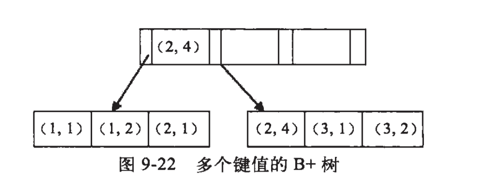

# DML和DDL

 可以把 SQL 分为两个部分：数据操作语言 (DML) 和 数据定义语言 (DDL)。 

查询和更新指令构成了 SQL 的 DML 部分：

- *SELECT* - 从数据库表中获取数据
- *UPDATE* - 更新数据库表中的数据
- *DELETE* - 从数据库表中删除数据
- *INSERT INTO* - 向数据库表中插入数据

SQL 的数据定义语言 (DDL) 部分使我们有能力创建或删除表格。我们也可以定义索引（键），规定表之间的链接，以及施加表间的约束。

SQL 中最重要的 DDL 语句:

- *CREATE DATABASE* - 创建新数据库
- *ALTER DATABASE* - 修改数据库
- *CREATE TABLE* - 创建新表
- *ALTER TABLE* - 变更（改变）数据库表
- *DROP TABLE* - 删除表
- *CREATE INDEX* - 创建索引（搜索键）
- *DROP INDEX* - 删除索引

# 常用语法：

## 1.DML

### 1.1查询

```
SELECT DISTINCT 列名称 FROM 表名称
```

* 查询去除重复值

```
SELECT Company, OrderNumber FROM Orders ORDER BY Company DESC
```

* 查询以逆字母顺序显示公司名称： 

```
SELECT *
FROM Persons
LIMIT 5
```

* 查询前5

```
SELECT * FROM Persons
WHERE City LIKE 'N%'
```

* 查询使用通配符


* IN 操作符允许我们在 WHERE 子句中规定多个值。

```
SELECT column_name(s)
FROM table_name
WHERE column_name IN (value1,value2,...)
```

* between

```
SELECT * FROM Persons
WHERE LastName
BETWEEN 'Adams' AND 'Carter'
```

不使用缓存

```
select sql_no_cache count(*) from usr;
```

### 1.2更新

```
UPDATE Person SET Address = 'Zhongshan 23', City = 'Nanjing'
WHERE LastName = 'Wilson'
```

更新

### 1.3插入

```
INSERT INTO Persons (LastName, Address) VALUES ('Wilson', 'Champs-Elysees')

```

### 1.4删除

```
DELETE FROM Person WHERE LastName = 'Wilson' 

```


## 2.Join

- JOIN: 如果表中有至少一个匹配，则返回行

- LEFT JOIN: 即使右表中没有匹配，也从左表返回所有的行

- RIGHT JOIN: 即使左表中没有匹配，也从右表返回所有的行

- FULL JOIN: 只要其中一个表中存在匹配，就返回行

  **INNER JOIN（内连接）** 

```
SELECT Persons.LastName, Persons.FirstName, Orders.OrderNo
FROM Persons, Orders
WHERE Persons.Id_P = Orders.Id_P 

```

```
SELECT Persons.LastName, Persons.FirstName, Orders.OrderNo
FROM Persons
INNER JOIN Orders
ON Persons.Id_P = Orders.Id_P
ORDER BY Persons.LastName

```

两者结果等同

**左连接（LEFT JOIN）实例**

 LEFT JOIN 关键字会从左表 (Persons) 那里返回所有的行，即使在右表 (Orders) 中没有匹配的行。 

```
SELECT Persons.LastName, Persons.FirstName, Orders.OrderNo
FROM Persons
LEFT JOIN Orders
ON Persons.Id_P=Orders.Id_P
ORDER BY Persons.LastName

```

**右连接和左连接相反**

**全连接（FULL JOIN）**

 FULL JOIN 关键字会从左表 (Persons) 和右表 (Orders) 那里返回所有的行。如果 "Persons" 中的行在表 "Orders" 中没有匹配，或者如果 "Orders" 中的行在表 "Persons" 中没有匹配，这些行同样会列出。 

## 3.union

 UNION 操作符用于合并两个或多个 SELECT 语句的结果集 

```
SELECT column_name(s) FROM table_name1
UNION ALL
SELECT column_name(s) FROM table_name2

```

 **注释：**默认地，UNION 操作符选取不同的值。如果允许重复的值，请使用 UNION ALL。 

 另外，UNION 结果集中的列名总是等于 UNION 中第一个 SELECT 语句中的列名。 

## 4. SELECT INTO

SELECT INTO 语句从一个表中选取数据，然后把数据插入另一个表中。

SELECT INTO 语句常用于创建表的备份复件或者用于对记录进行存档。

下面的例子会制作 "Persons" 表的备份复件：

```
SELECT *
INTO Persons_backup
FROM Persons

```

IN 子句可用于向另一个数据库中拷贝表：

```
SELECT *
INTO Persons IN 'Backup.mdb'
FROM Persons

```

## 5.约束：

- NOT NULL
- UNIQUE
- PRIMARY KEY
- FOREIGN KEY
- CHECK
- DEFAULT

### 外键约束

```
CREATE TABLE Orders
(
Id_O int NOT NULL PRIMARY KEY,
OrderNo int NOT NULL,
Id_P int FOREIGN KEY REFERENCES Persons(Id_P)
)

```

添加命名

```
CREATE TABLE Orders
(
Id_O int NOT NULL,
OrderNo int NOT NULL,
Id_P int,
PRIMARY KEY (Id_O),
CONSTRAINT fk_PerOrders FOREIGN KEY (Id_P)
REFERENCES Persons(Id_P)
)

```

```
ALTER TABLE Orders
ADD FOREIGN KEY (Id_P)
REFERENCES Persons(Id_P)

```

```
ALTER TABLE Orders
DROP FOREIGN KEY fk_PerOrders

```

### check约束

```
CREATE TABLE Persons
(
Id_P int NOT NULL,
LastName varchar(255) NOT NULL,
FirstName varchar(255),
Address varchar(255),
City varchar(255),
CHECK (Id_P>0)
)

```


```
CREATE TABLE Persons
(
Id_P int NOT NULL,
LastName varchar(255) NOT NULL,
FirstName varchar(255),
Address varchar(255),
City varchar(255) DEFAULT 'Sandnes'
)

```

### 索引

在表上创建一个简单的索引。允许使用重复的值：

```
CREATE INDEX index_name
ON table_name (column_name)

```

### 创建表的时候直接指定

```
CREATE TABLE mytable(  
 
ID INT NOT NULL,   
 
username VARCHAR(16) NOT NULL,  
 
INDEX [indexName] (username(length))  
 );

```

1.添加PRIMARY KEY（主键索引）

```
ALTER TABLE `table_name` ADD PRIMARY KEY ( `column` ) 

```

2.添加UNIQUE(唯一索引)

```
ALTER TABLE `table_name` ADD UNIQUE ( `column` ) 

```

3.添加INDEX(普通索引)

```
ALTER TABLE `table_name` ADD INDEX index_name ( `column` )

```

4.添加FULLTEXT(全文索引)

```
ALTER TABLE `table_name` ADD FULLTEXT ( `column`) 

```

5.添加多列索引

```
ALTER TABLE `table_name` ADD INDEX index_name ( `column1`, `

```

## 6.视图

视图的定义
视图是从一个或者几个基本表（或视图）导出的表。它与基本表不同，是一个虚表。
数据库中只存放视图的定义，而不存放视图对应的数据，这些数据仍存放在原来的基本表中。所以一旦基本表中发生数据变化，从视图中查询出的数据也就随之改变了。从这个意义上讲，视图就是一个窗口，通过视图可以看到数据库中自己想了解的数据变化。

**创建视图语法：**

```sql
create view 视图名 as 查询语句;

```

 **视图使用案例** 

```sql
//查询姓张的学生名和专业名
select stuname,mojarname from stuinfo s inner join major m on s.majorid=m.id where s.stuname like '张%';

//创建视图
 create view v1 as select stuname,mojarname from stuinfo s inner join major m on s.majorid=m.id ;
 
//利用视图()
select * from v1 where stuname like='张%';


```

当你多个地方用到同样的查询语句，而这个查询语法很复杂不如使用视图可以更加优雅的写出。

当你多个地方用到同样的查询语句，而这个查询语法很复杂不如使用视图可以更加优雅的写出。

## 7相关查询和非相关查询

 假设Books表如下：
类编号 图书名 出版社 价格
2 c#高级应用 圣通出版 23.00
2 Jsp开发应用 机械出版社 45.00
3 高等数学 济南出版社 25.00
3 疯狂英语 清华大学出版社 32.00 

**非相关子查询**

 执行不依赖与外部的查询。
执行过程：
（1）执行子查询，其结果不被显示，而是传递给外部查询，作为外部查询的条件使用。
（2）执行外部查询，并显示整个结果。　　 

```sql
SElECT 图书名，作者，出版社，价格
  FROM Books
  WHERE 价格 >
  (
    SELECT AVG(价格)
    FROM Books
  )

```

```sql
SElECT *
  FROM Readers
  WHERE 读者编号 IN
  (
    SELECT 读者编号
    FROM [Borrow History]
  )

```

 **相关子查询**

执行依赖于外部查询。多数情况下是子查询的WHERE子句中引用了外部查询的表。
执行过程：
（1）从外层查询中取出一个元组，将元组相关列的值传给内层查询。
（2）执行内层查询，得到子查询操作的值。
（3）外查询根据子查询返回的结果或结果集得到满足条件的行。
（4）然后外层查询取出下一个元组重复做步骤1-3，直到外层的元组全部处理完毕。 　

```sql
SELECT FROM Books As a
  WHERE 价格 >
  (
    SELECT AVG(价格)
    FROM Books AS b
    WHERE a.类编号=b.类编号
  )

```

 先将Books表中的第一条记录的“类编号”的值“2”代入子查询中，子查询变为：
　　　　　　SELECT AVG(价格)
　　 　　　　FROM Books AS b
　　　　 WHERE b.类编号=2
　　子查询的结果为该类图书的平均价格，所以外部查询变为：
　　　　　　SElECT 图书名,出版社,类编号,价格
　　　　　　 FROM Books As a
　　　　　WHERE 价格 > 34
如果WHERE条件为True，则第一条结果包括在结果集中，则否不包括。对Books表中的所有行运行相同的过程，最后形成的结果集及最后返回结果。 

**非相关子查询是独立于外部查询的子查询，子查询总共执行一次，执行完毕后将值传递给外部查询。**
**相关子查询的执行依赖于外部查询的数据，外部查询执行一行，子查询就执行一次。**
故非相关子查询比相关子查询效率高。


## 8触发器

**创建触发器**
触发器大概的语法如下所示：

```
CREATE TRIGGER 自定义名称
触发时机  触发事件 ON 触发事件所在的表名
FOR EACH ROW
触发需要执行的逻辑;

```


那么在理解语法之前，先举个例子，假如有这样一个场景，我有table1和table2两张表，需要每当table2中插入一条数据之后，修改table1中的count字段，在原来count的基础上加1，那么这个触发器就应该是这样：

```
CREATE TRIGGER trigger_t1
AFTER INSERT ON table2
FOR EACH ROW
UPDATE table1 SET table1.count=table1.count+1;

```


上边示例中每一行的解释是：
创建一个触发器，自定义名称是trigger_t1;
触发器生效的场景是，向table2表insert数据之后触发；
触发器对每一行生效，这一行基本是固定写法；
触发器触发后做的事，是修改table1的count字段，使其在原有的基础上加一。


# 引擎

# 索引

  

**索引的两大类型hash与btree**

> \#我们可以在创建上述索引的时候，为其指定索引类型，分两类
> hash类型的索引：查询单条快，范围查询慢
> btree类型的索引：b+树，层数越多，数据量指数级增长（我们就用它，因为innodb默认支持它）
>
> \#不同的存储引擎支持的索引类型也不一样
> InnoDB 支持事务，支持行级别锁定，支持 B-tree、Full-text 等索引，不支持 Hash 索引；
> MyISAM 不支持事务，支持表级别锁定，支持 B-tree、Full-text 等索引，不支持 Hash 索引；
> Memory 不支持事务，支持表级别锁定，支持 B-tree、Hash 等索引，不支持 Full-text 索引；
> NDB 支持事务，支持行级别锁定，支持 Hash 索引，不支持 B-tree、Full-text 等索引；
> Archive 不支持事务，支持表级别锁定，不支持 B-tree、Hash、Full-text 等索引；


### b树和b+树

### 索引数据结构

MySQL的基本存储结构是页(记录都存在页里边)：

[](https://camo.githubusercontent.com/57a746bf254e100c3fd0d2691d172df5c29592eb/687474703a2f2f6d792d626c6f672d746f2d7573652e6f73732d636e2d6265696a696e672e616c6979756e63732e636f6d2f31382d31302d322f32383535393432312e6a7067)

[](https://camo.githubusercontent.com/a0e0c5b1377f6ab52365479c52313f4238550d31/687474703a2f2f6d792d626c6f672d746f2d7573652e6f73732d636e2d6265696a696e672e616c6979756e63732e636f6d2f31382d31302d322f38323035333133342e6a7067)

- **各个数据页可以组成一个双向链表**
- 每个数据页中的记录又可以组成一个单向链表
  - 每个数据页都会为存储在它里边儿的记录生成一个页目录，在通过主键查找某条记录的时候可以在页目录中使用二分法快速定位到对应的槽，然后再遍历该槽对应分组中的记录即可快速找到指定的记录
  - 以其他列(非主键)作为搜索条件：只能从最小记录开始依次遍历单链表中的每条记录。

所以说，如果我们写select * from user where indexname = 'xxx'这样没有进行任何优化的sql语句，默认会这样做：

1. **定位到记录所在的页：需要遍历双向链表，找到所在的页**
2. **从所在的页内中查找相应的记录：由于不是根据主键查询，只能遍历所在页的单链表了**

很明显，在数据量很大的情况下这样查找会很慢！这样的时间复杂度为O（n）。

**使用索引之后**

索引做了些什么可以让我们查询加快速度呢？其实就是将无序的数据变成有序(相对)：

[](https://camo.githubusercontent.com/83e4b2a638e8352a21feafeafe97cbad0fc2a335/687474703a2f2f6d792d626c6f672d746f2d7573652e6f73732d636e2d6265696a696e672e616c6979756e63732e636f6d2f31382d31302d322f353337333038322e6a7067)

要找到id为8的记录简要步骤：

[](https://camo.githubusercontent.com/c63688b141c3562bbf4fb4b719ab027c6dea91e9/687474703a2f2f6d792d626c6f672d746f2d7573652e6f73732d636e2d6265696a696e672e616c6979756e63732e636f6d2f31382d31302d322f38393333383034372e6a7067)

很明显的是：没有用索引我们是需要遍历双向链表来定位对应的页，现在通过 **“目录”** 就可以很快地定位到对应的页上了！（二分查找，时间复杂度近似为O(logn)）

其实底层结构就是B+树，B+树作为树的一种实现，能够让我们很快地查找出对应的记录。

###  **聚集索引与辅助索引** 

聚集索引与辅助索引相同的是：不管是聚集索引还是辅助索引，其内部都是B+树的形式，即高度是平衡的，叶子结点存放着所有的数据。

聚集索引与辅助索引不同的是：叶子结点存放的是否是一整行的信息

**1、聚集索引**

> \#InnoDB存储引擎表示索引组织表，即表中数据按照主键顺序存放。而聚集索引（clustered index）就是按照每张表的主键构造一棵B+树，同时叶子结点存放的即为整张表的行记录数据，也将聚集索引的叶子结点称为数据页。聚集索引的这个特性决定了索引组织表中数据也是索引的一部分。
>
> 同B+树数据结构一样，每个数据页都通过一个双向链表来进行链接。 #如果未定义主键，MySQL取第一个唯一索引（unique）而且只含非空列（NOT NULL）作为主键，InnoDB使用它作为聚簇索引。 #如果没有这样的列，InnoDB就自己产生一个这样的ID值，它有六个字节，而且是隐藏的，使其作为聚簇索引。#由于实际的数据页只能按照一棵B+树进行排序，因此每张表只能拥有一个聚集索引。在多少情况下，查询优化器倾向于采用聚集索引。
>
> 因为聚集索引能够在B+树索引的叶子节点上直接找到数据。此外由于定义了数据的逻辑顺序，聚集索引能够特别快地访问针对范围值得查询。

聚集索引的好处之一：它对主键的排序查找和范围查找速度非常快，叶子节点的数据就是用户所要查询的数据。如用户需要查找一张表，查询最后的10位用户信息，由于B+树索引是双向链表，所以用户可以快速找到最后一个数据页，并取出10条记录

聚集索引的好处之二：范围查询（range query），即如果要查找主键某一范围内的数据，通过叶子节点的上层中间节点就可以得到页的范围，之后直接读取数据页即可


表中除了聚集索引外其他索引都是辅助索引（Secondary Index，也称为非聚集索引），**与聚集索引的区别是：辅助索引的叶子节点不包含行记录的全部数据。**

叶子节点除了包含键值以外，每个叶子节点中的索引行中还包含一个书签（bookmark）。该书签用来告诉InnoDB存储引擎去哪里可以找到与索引相对应的行数据。

由于InnoDB存储引擎是索引组织表，因此InnoDB存储引擎的辅助索引的书签就是相应行数据的聚集索引键。


辅助索引的存在并不影响数据在聚集索引中的组织，**因此每张表上可以有多个辅助索引，但只能有一个聚集索引。当通过辅助索引来寻找数据时，InnoDB存储引擎会遍历辅助索引并通过叶子级别的指针获得只想主键索引的主键，然后再通过主键索引来找到一个完整的行记录。**

举例来说，如果在一棵高度为3的辅助索引树种查找数据，那需要对这个辅助索引树遍历3次找到指定主键，如果聚集索引树的高度同样为3，那么还需要对聚集索引树进行3次查找，最终找到一个完整的行数据所在的页，因此一共需要6次逻辑IO访问才能得到最终的一个数据页。

### **最左匹配原则**

 最左优先，以最左边的为起点任何连续的索引都能匹配上。同时遇到范围查询(>、<、between、like)就会停止匹配。
例如：b = 2 如果建立(a,b)顺序的索引，是匹配不到(a,b)索引的；但是如果查询条件是a = 1 and b = 2或者a=1(又或者是b = 2 and b = 1)就可以，因为优化器会自动调整a,b的顺序。再比如a = 1 and b = 2 and c > 3 and d = 4 如果建立(a,b,c,d)顺序的索引，d是用不到索引的，因为c字段是一个范围查询，它之后的字段会停止匹配。 

最左匹配原则都是针对联合索引来说的，所以我们有必要了解一下联合索引的原理。了解了联合索引，那么为什么会有最左匹配原则这种说法也就理解了。

我们都知道索引的底层是一颗B+树，那么联合索引当然还是一颗B+树，只不过联合索引的健值数量不是一个，而是多个。构建一颗B+树只能根据一个值来构建，因此数据库依据联合索引最左的字段来构建B+树。
例子：假如创建一个（a,b)的联合索引，那么它的索引树是这样的


可以看到a的值是有顺序的，1，1，2，2，3，3，而b的值是没有顺序的1，2，1，4，1，2。所以b = 2这种查询条件没有办法利用索引，因为联合索引首先是按a排序的，b是无序的。

**同时我们还可以发现在a值相等的情况下，b值又是按顺序排列的，但是这种顺序是相对的。所以最左匹配原则遇上范围查询就会停止，剩下的字段都无法使用索引。**例如a = 1 and b = 2 a,b字段都可以使用索引，因为在a值确定的情况下b是相对有序的，而a>1and b=2，a字段可以匹配上索引，但b值不可以，因为a的值是一个范围，在这个范围中b是无序的。

### 其他使用索引注意

#### 前缀索引

 https://blog.csdn.net/u013295276/article/details/79105163 

### 覆盖索引

*  聚集索引（主键索引） 聚集索引就是按照每张表的主键构造一颗B+树，同时叶子节点中存放的即为整张表的记录数据。 聚集索引的叶子节点称为数据页，聚集索引的这个特性决定了索引组织表中的数据也是索引的一部分。

*  辅助索引（二级索引）非主键索引，叶子节点=键值+书签。Innodb存储引擎的书签就是相应行数据的主键索引值。
*  联合索引是非聚簇索引（辅助索引、二级索引），非聚簇索引包含索引列+主键。
*  覆盖索引：如果一个非聚簇索引覆盖所有需要查询的字段的值，并不需要根据主键回查聚簇索引表，就称为覆盖索引。（此时联合索引的最左前缀匹配原则不成立）

当一条查询语句符合覆盖索引条件时，sql只需要通过索引就可以返回查询所需要的数据，这样避免了查到索引后再返回表操作，减少I/O提高效率。
 使用覆盖索引Innodb比MyISAM效果更好----InnoDB使用聚集索引组织数据，如果二级索引中包含查询所需的数据，就不再需要在聚集索引中查找了

注：遇到以下情况，执行计划不会选择覆盖查询
 1.select选择的字段中含有不在索引中的字段 ，即索引没有覆盖全部的列。
 2.where条件中不能含有对索引进行like的操作。

### 联合索引


### **总结**

> \#1. 一定是为搜索条件的字段创建索引，比如select * from s1 where id = 333;就需要为id加上索引
>
> \#2. 在表中已经有大量数据的情况下，建索引会很慢，且占用硬盘空间，建完后查询速度加快
> 比如create index idx on s1(id);会扫描表中所有的数据，然后以id为数据项，创建索引结构，存放于硬盘的表中。
> 建完以后，再查询就会很快了。
>
> \#3. 需要注意的是：innodb表的索引会存放于s1.ibd文件中，而myisam表的索引则会有单独的索引文件table1.MYI
>
> MySAM索引文件和数据文件是分离的，索引文件仅保存数据记录的地址。
> 而在innodb中，表数据文件本身就是按照B+Tree（BTree即Balance True）组织的一个索引结构，这棵树的叶节点data域保存了完整的数据记录。
> 这个索引的key是数据表的主键，因此innodb表数据文件本身就是主索引。
> 因为inndob的数据文件要按照主键聚集，所以innodb要求表必须要有主键（Myisam可以没有），
> 如果没有显式定义，则mysql系统会自动选择一个可以唯一标识数据记录的列作为主键，
> 如果不存在这种列，则mysql会自动为innodb表生成一个隐含字段作为主键，这字段的长度为6个字节，类型为长整型.

慢查询优化的基本步骤

> 0.先运行看看是否真的很慢，注意设置SQL_NO_CACHE
> 1.where条件单表查，锁定最小返回记录表。这句话的意思是把查询语句的where都应用到表中返回的记录数最小的表开始查起，单表每个字段分别查询，看哪个字段的区分度最高
> 2.explain查看执行计划，是否与1预期一致（从锁定记录较少的表开始查询）
> 3.order by limit 形式的sql语句让排序的表优先查
> 4.了解业务方使用场景
> 5.加索引时参照建索引的几大原则
> 6.观察结果，不符合预期继续从0分析


### **InnoDB索引**和**MyISAM索引**的区别

**1 存储结构（主索引／辅助索引）**

InnoDB的数据文件本身就是主索引文件。而MyISAM的主索引和数据是分开的。

InnoDB的辅助索引data域存储相应记录主键的值而不是地址。而MyISAM的辅助索引和主索引没有多大区别。

innoDB是聚簇索引，数据挂在逐渐索引之下。

2 **锁**

MyISAM使用的是表锁

InnoDB使用行锁

**3 事务**

MyISAM没有事务支持和MVCC

InnoDB支持事务和MVCC

**4 全文索引**

MyISAM支持FULLTEXT类型的全文索引

InnoDB不支持FULLTEXT类型的全文索引，但是InnoDB可以使用sphinx插件支持全文索引，并且效果更好

**5 主键**

MyISAM允许没有任何索引和主键的表存在，索引都是保存行的地址

InnoDB如果没有设定主键或非空唯一索引，就会自动生成一个6字节的主键，数据是主索引的一部分，附加索引保存的是主索引的值

**6 外键**

 MyISAM不支持

InnoDB支持


**索引分析**

 https://www.zhihu.com/question/36996520 

**为了测试sql语句的效率，有时候要不用缓存来查询。**

使用

SELECT SQL_NO_CACHE ...

语法即可

# 事务

### 四大特性(ACID)

1. **原子性（Atomicity）：** 事务是最小的执行单位，不允许分割。事务的原子性确保动作要么全部完成，要么完全不起作用；
2. **一致性（Consistency）：** 执行事务前后，数据保持一致，多个事务对同一个数据读取的结果是相同的；
3. **隔离性（Isolation）：** 并发访问数据库时，一个用户的事务不被其他事务所干扰，各并发事务之间数据库是独立的；
4. **持久性（Durability）：** 一个事务被提交之后。它对数据库中数据的改变是持久的，即使数据库发生故障也不应该对其有任何影响。

### 并发事务带来哪些问题

* **脏读（Dirty read）:** 

* **丢失修改（Lost to modify）** 

* **不可重复读（Unrepeatableread）** 

* **幻读（Phantom read）:**  

### 事务隔离级别

**SQL 标准定义了四个隔离级别：**

- **READ-UNCOMMITTED(读取未提交)：** 最低的隔离级别，允许读取尚未提交的数据变更，**可能会导致脏读、幻读或不可重复读**。
- **READ-COMMITTED(读取已提交)：** 允许读取并发事务已经提交的数据，**可以阻止脏读，但是幻读或不可重复读仍有可能发生**。
- **REPEATABLE-READ(可重复读)：** 对同一字段的多次读取结果都是一致的，除非数据是被本身事务自己所修改，**可以阻止脏读和不可重复读，但幻读仍有可能发生**。
- **SERIALIZABLE(可串行化)：** 最高的隔离级别，完全服从ACID的隔离级别。所有的事务依次逐个执行，这样事务之间就完全不可能产生干扰，也就是说，**该级别可以防止脏读、不可重复读以及幻读**。

------

| 隔离级别         | 脏读 | 不可重复读 | 幻影读 |
| ---------------- | ---- | ---------- | ------ |
| READ-UNCOMMITTED | √    | √          | √      |
| READ-COMMITTED   | ×    | √          | √      |
| REPEATABLE-READ  | ×    | ×          | √      |
| SERIALIZABLE     | ×    | ×          | ×      |

这里需要注意的是：与 SQL 标准不同的地方在于 InnoDB 存储引擎在 **REPEATABLE-READ（可重读）** 事务隔离级别下使用的是Next-Key Lock 锁算法，因此可以避免幻读的产生，这与其他数据库系统(如 SQL Server) 是不同的。所以说InnoDB 存储引擎的默认支持的隔离级别是 **REPEATABLE-READ（可重读）** 已经可以完全保证事务的隔离性要求，即达到了 SQL标准的 **SERIALIZABLE(可串行化)** 隔离级别。因为隔离级别越低，事务请求的锁越少，所以大部分数据库系统的隔离级别都是 **READ-COMMITTED(读取提交内容)** ，但是你要知道的是InnoDB 存储引擎默认使用 **REPEAaTABLE-READ（可重读）** 并不会有任何性能损失。

InnoDB 存储引擎在 **分布式事务** 的情况下一般会用到 **SERIALIZABLE(可串行化)** 隔离级别。


### MVCC总结

 数据库默认隔离级别：**RR（Repeatable Read，可重复读），MVCC主要适用于Mysql的RC,RR隔离级别** 

**特点**

1.MVCC其实广泛应用于数据库技术，像Oracle,PostgreSQL等也引入了该技术，即适用范围广

2.MVCC并没有简单的使用数据库的行锁，而是使用了行级锁，row_level_lock,而非InnoDB中的innodb_row_lock.

**基本原理**

MVCC的实现，通过保存数据在某个时间点的快照来实现的。这意味着一个事务无论运行多长时间，在同一个事务里能够看到数据一致的视图。根据事务开始的时间不同，同时也意味着在同一个时刻不同事务看到的相同表里的数据可能是不同的。

**基本特征**

- 每行数据都存在一个版本，每次数据更新时都更新该版本。
- 修改时Copy出当前版本随意修改，各个事务之间无干扰。
- 保存时比较版本号，如果成功（commit），则覆盖原记录；失败则放弃copy（rollback）

**InnoDB存储引擎MVCC的实现策略**

在每一行数据中额外保存两个隐藏的列：当前行创建时的版本号和删除时的版本号（可能为空，其实还有一列称为回滚指针，用于事务回滚，不在本文范畴）。这里的版本号并不是实际的时间值，而是系统版本号。每开始新的事务，系统版本号都会自动递增。事务开始时刻的系统版本号会作为事务的版本号，用来和查询每行记录的版本号进行比较。

每个事务又有自己的版本号，这样事务内执行CRUD操作时，就通过版本号的比较来达到数据版本控制的目的。


**具体操作看参考**

# 锁（重写）


  

MyISAM和InnoDB存储引擎使用的锁：**

- MyISAM采用表级锁(table-level locking)。
- InnoDB支持行级锁(row-level locking)和表级锁,默认为行级锁

**表级锁和行级锁对比：**

- **表级锁：** MySQL中锁定 **粒度最大** 的一种锁，对当前操作的整张表加锁，实现简单，资源消耗也比较少，加锁快，不会出现死锁。其锁定粒度最大，触发锁冲突的概率最高，并发度最低，MyISAM和 InnoDB引擎都支持表级锁。
- **行级锁：** MySQL中锁定 **粒度最小** 的一种锁，只针对当前操作的行进行加锁。 行级锁能大大减少数据库操作的冲突。其加锁粒度最小，并发度高，但加锁的开销也最大，加锁慢，会出现死锁。

详细内容可以参考： MySQL锁机制简单了解一下：https://blog.csdn.net/qq_34337272/article/details/80611486

**InnoDB存储引擎的锁的算法有三种：**

- Record lock：单个行记录上的锁
- Gap lock：间隙锁，锁定一个范围，不包括记录本身(使用范围条件查询时用到)
- Next-key lock：record+gap 锁定一个范围，包含记录本身

**相关知识点：**

1. innodb对于行的查询使用next-key lock
2. Next-locking keying为了解决Phantom Problem幻读问题
3. 当查询的索引含有唯一属性时，将next-key lock降级为record key
4. Gap锁设计的目的是为了阻止多个事务将记录插入到同一范围内，而这会导致幻读问题的产生
5. 有两种方式显式关闭gap锁：（除了外键约束和唯一性检查外，其余情况仅使用record lock） A. 将事务隔离级别设置为RC B. 将参数innodb_locks_unsafe_for_binlog设置为1


**总结**

表锁其实我们程序员是很少关心它的：

- 在MyISAM存储引擎中，当执行SQL语句的时候是自动加的。
- 在InnoDB存储引擎中，如果没有使用索引，表锁也是自动加的。

现在我们大多数使用MySQL都是使用InnoDB，InnoDB支持行锁：

- 共享锁--读锁--S锁
- 排它锁--写锁--X锁

在默认的情况下，`select`是不加任何行锁的~事务可以通过以下语句显示给记录集加共享锁或排他锁。

- 共享锁（S）：`SELECT * FROM table_name WHERE ... LOCK IN SHARE MODE`。
- 排他锁（X)：`SELECT * FROM table_name WHERE ... FOR UPDATE`。

InnoDB**基于行锁**还实现了MVCC多版本并发控制，MVCC在隔离级别下的`Read committed`和`Repeatable read`下工作。MVCC能够实现**读写不阻塞**！

InnoDB实现的`Repeatable read`隔离级别配合GAP间隙锁已经避免了幻读！

- 乐观锁其实是一种思想，正如其名：认为不会锁定的情况下去更新数据，如果发现不对劲，才不更新(回滚)。在数据库中往往添加一个version字段来实现。
- 悲观锁用的就是数据库的行锁，认为数据库会发生并发冲突，直接上来就把数据锁住，其他事务不能修改，直至提交了当前事务

 https://blog.csdn.net/xifeijian/article/details/20313977 

# 大表优化

 当MySQL单表记录数过大时，数据库的CRUD性能会明显下降，一些常见的优化措施如下： 

#### . 限定数据的范围

务必禁止不带任何限制数据范围条件的查询语句。比如：我们当用户在查询订单历史的时候，我们可以控制在一个月的范围内；

#### 2. 读/写分离

经典的数据库拆分方案，主库负责写，从库负责读；

#### 3. 垂直分区

**根据数据库里面数据表的相关性进行拆分。** 例如，用户表中既有用户的登录信息又有用户的基本信息，可以将用户表拆分成两个单独的表，甚至放到单独的库做分库。

**简单来说垂直拆分是指数据表列的拆分，把一张列比较多的表拆分为多张表。** 如下图所示，这样来说大家应该就更容易理解了。 [](https://camo.githubusercontent.com/3045b900b49be903108147297e99499ee4168b94/68747470733a2f2f6d792d626c6f672d746f2d7573652e6f73732d636e2d6265696a696e672e616c6979756e63732e636f6d2f323031392d362f2545362539352542302545362538442541452545352542412539332545352539452538322545372539422542342545352538382538362545352538432542412e706e67)

- **垂直拆分的优点：** 可以使得列数据变小，在查询时减少读取的Block数，减少I/O次数。此外，垂直分区可以简化表的结构，易于维护。
- **垂直拆分的缺点：** 主键会出现冗余，需要管理冗余列，并会引起Join操作，可以通过在应用层进行Join来解决。此外，垂直分区会让事务变得更加复杂；

#### 4. 水平分区

**保持数据表结构不变，通过某种策略存储数据分片。这样每一片数据分散到不同的表或者库中，达到了分布式的目的。 水平拆分可以支撑非常大的数据量。**

水平拆分是指数据表行的拆分，表的行数超过200万行时，就会变慢，这时可以把一张的表的数据拆成多张表来存放。举个例子：我们可以将用户信息表拆分成多个用户信息表，这样就可以避免单一表数据量过大对性能造成影响。

[](https://camo.githubusercontent.com/3e93efc1212224996fe7d54a89a4894ab99c853c/68747470733a2f2f6d792d626c6f672d746f2d7573652e6f73732d636e2d6265696a696e672e616c6979756e63732e636f6d2f323031392d362f2545362539352542302545362538442541452545352542412539332545362542302542342545352542392542332545362538422538362545352538382538362e706e67)

水平拆分可以支持非常大的数据量。需要注意的一点是：分表仅仅是解决了单一表数据过大的问题，但由于表的数据还是在同一台机器上，其实对于提升MySQL并发能力没有什么意义，所以 **水平拆分最好分库** 。

水平拆分能够 **支持非常大的数据量存储，应用端改造也少**，但 **分片事务难以解决** ，跨节点Join性能较差，逻辑复杂。《Java工程师修炼之道》的作者推荐 **尽量不要对数据进行分片，因为拆分会带来逻辑、部署、运维的各种复杂度** ，一般的数据表在优化得当的情况下支撑千万以下的数据量是没有太大问题的。如果实在要分片，尽量选择客户端分片架构，这样可以减少一次和中间件的网络I/O。

**下面补充一下数据库分片的两种常见方案：**

- **客户端代理：** **分片逻辑在应用端，封装在jar包中，通过修改或者封装JDBC层来实现。** 当当网的 **Sharding-JDBC** 、阿里的TDDL是两种比较常用的实现。
- **中间件代理：** **在应用和数据中间加了一个代理层。分片逻辑统一维护在中间件服务中。** 我们现在谈的 **Mycat** 、360的Atlas、网易的DDB等等都是这种架构的实现。

详细内容可以参考： MySQL大表优化方案: https://segmentfault.com/a/1190000006158186

# 数据库连接池

 这种设计会初始预设资源，解决的问题就是抵消每次获取资源的消耗，如创建线程的开销，获取远程连接的开销等。就好比你去食堂打饭，打饭的大妈会先把饭盛好几份放那里，你来了就直接拿着饭盒加菜即可，不用再临时又盛饭又打菜，效率就高了。除了初始化资源，池化设计还包括如下这些特征：池子的初始值、池子的活跃值、池子的最大值等，这些特征可以直接映射到java线程池和数据库连接池的成员属性中。 

  

  

JDBC步骤

加载驱动程序：

```
Class.forName(driverClass)
//加载MySql驱动
Class.forName("com.mysql.jdbc.Driver")
//加载Oracle驱动
Class.forName("oracle.jdbc.driver.OracleDriver")

```

获得数据库连接：

```
DriverManager.getConnection("jdbc:mysql://127.0.0.1:3306/imooc", "root", "root");

```

创建Statement\PreparedStatement对象：

```
conn.createStatement();  
conn.prepareStatement(sql);

```

连接池实战

```java
package com.jnshu.datasource;

import java.sql.Connection;
import java.sql.DriverManager;
import java.sql.SQLException;
import java.util.LinkedList;

public class MyDataSource {
    //LinkedList集合，存储连接的容器---连接池
    private LinkedList<Connection> dataSources = new LinkedList();
    //初始化连接数量
    public MyDataSource() {
        //一次性创建10个连接
        for(int i = 0; i < 10; i++) {
            try {
                //1、装载驱动对象
                Class.forName("com.mysql.jdbc.Driver");
                //2、通过JDBC建立数据库连接
                Connection con =DriverManager.getConnection(
                        "jdbc:mysql://localhost:3306/practice", "root", "123456");
                //3、将连接加入连接池中
                dataSources.add(con);
            } catch (Exception e) {
                e.printStackTrace();
            }
        }
    }

    public Connection getConnection() throws SQLException {
        //取出连接池中一个连接
        final Connection conn = dataSources.removeFirst(); // 获取第一个连接给Connection，把剩下的连接返回给LinkedList集合
        System.out.println("执行数据库的操作时，连接池内剩余连接个数： "+dataSources.size());//输出集合里面剩下的连接的个数
        return conn;
    }

    public void releaseConnection(Connection conn) {
        //把连接返还给连接池
        dataSources.add(conn);
        System.out.println("数据库操作完成时，连接池剩余连接个数："+dataSources.size());//输出集合里面剩下的连接的个数
    }
}


```

```java
package com.jnshu.datasource;

import java.sql.Connection;
import java.sql.ResultSet;
import java.sql.Statement;

public class DataSourceDemo {
        public static void main(String[] args) throws Exception{
            //1、使用连接池建立数据库连接
            MyDataSource myDataSource = new MyDataSource();
            Connection conn =myDataSource.getConnection();
            //2、创建状态
            Statement state =conn.createStatement();
            //3、查询数据库并返回结果
            ResultSet result =state.executeQuery("select * from user where id=5");
            //4、输出查询结果
            while(result.next()){
                System.out.println(result.getString("name"));
            }
            //5、断开数据库连接
            result.close();
            state.close();
//        Connection connection=myDataSource.getConnection();
            //6、归还数据库连接给连接池
            myDataSource.releaseConnection(conn);
        }
    }


```

mysql语句执行	


# 日志

错误日志**：记录出错信息，也记录一些警告信息或者正确的信息。

**查询日志**：记录所有对数据库请求的信息，不论这些请求是否得到了正确的执行。

**慢查询日志**：设置一个阈值，将运行时间超过该值的所有SQL语句都记录到慢查询的日志文件中。

**二进制日志**：记录对数据库执行更改的所有操作。

**中继日志**：中继日志也是二进制日志，用来给slave 库恢复

**事务日志**：重做日志redo和回滚日志undo


## 查看mysql查询日志

### MySQL的日志操作：

1. **确认是否启用日志**

   登陆mysql后，执行sql语句：`show variables like 'log_bin';`

   ```
   mysql> show variables like 'log_bin';
   +---------------+-------+
   | Variable_name | Value |
   +---------------+-------+
   | log_bin       | OFF   |
   +---------------+-------+
   1 row in set (0.00 sec)            
   
   ```

   当前未启用日志。如果Value值为ON，则已启用日志。日志文件在mysql的安装目录的data目录下。
   查看当前日志：`mysql> show master status;`

2. **查询日志：log**

   开启方式：在my.ini的[mysqld]选项下，添加代码：
   `log=C:/backend/MySQL/MySQL Server 5.5/log.txt`

3. **错误日志：log-error**

   开启方式：在my.ini的[mysqld]选项下，添加代码：
   `log-error=C:/backend/MySQL/MySQL Server 5.5/log-error.txt`

4. **二进制日志：log-bin**

   开启方式：在my.ini的[mysqld]选项下，添加代码：
   `log-bin=C:/backend/MySQL/MySQL Server 5.5/log-bin`

5. **重启mysql服务**

   以管理员身份运行**cmd**,输入：

   ```
   C:\Windows\system32>net stop mysql
   The MySQL service is stopping.
   The MySQL service was stopped successfully.
   
   C:\Windows\system32>net start mysql
   The MySQL service is starting.
   The MySQL service was started successfully.
   
   ```


# sql优化相关命令

##### (1)、explain出来的各种item的意义；

```sql
EXPLAIN SELECT * FROM student where name='小红'

```


* select_type表示查询中每个select子句的类型
* type表示MySQL在表中找到所需行的方式，又称“访问类型”
* possible_keys指出MySQL能使用哪个索引在表中找到行，查询涉及到的字段上若存在索引，则该索引将被列出，但不一定被查询使用
* key显示MySQL在查询中实际使用的索引，若没有使用索引，显示为NULL
* key_len表示索引中使用的字节数，可通过该列计算查询中使用的索引的长度
* ref表示上述表的连接匹配条件，即哪些列或常量被用于查找索引列上的值
* Extra包含不适合在其他列中显示但十分重要的额外信息

[[MySQL高级\](一)]: https://blog.csdn.net/why15732625998/article/details/80388236


##### (2)、profile的意义以及使用场景；

查询到 SQL 会执行多少时间, 并看出 CPU/Memory 使用量, 执行过程中 Systemlock, Table lock 花多少时间等等

profile默认关闭，生产环境中也建议关闭。

查看当前环境的profile设置

```ruby
mysql> show variables like '%profiling%';
+------------------------+-------+
| Variable_name          | Value |
+------------------------+-------+
| have_profiling         | YES   |
| profiling              | OFF   |
| profiling_history_size | 15    |
+------------------------+-------+

```

profiling off表示profile关闭，profiling_history_size 15表示保存最近15条SQL的资源消耗情况。

开启profile功能，可以使用命令

```csharp
set global profiling = 1;

```

```ruby
mysql> show profiles;
+----------+------------+----------------------------+
| Query_ID | Duration   | Query                      |
+----------+------------+----------------------------+
|        1 | 0.00060275 | select * from customers    |
|        2 | 0.00222450 | show tables                |
|        3 | 0.00567425 | select * from offices      |
|        4 | 0.00052050 | show tables                |
|        5 | 0.01123300 | select * from payments     |
|        6 | 0.00111675 | show tables                |
|        7 | 0.02049625 | select * from productlines |
+----------+------------+----------------------------+

```

在排查SQL执行情况，或者是哪条SQL执行非常慢，慢在哪里；profile都是非常的辅助工具。

显示一条SQL的具体花销在哪里

```ruby
mysql> show profile for query 7;
+----------------------+----------+
| Status               | Duration |
+----------------------+----------+
| starting             | 0.000043 |
| checking permissions | 0.000005 |
| Opening tables       | 0.014552 |
| init                 | 0.000025 |
| System lock          | 0.000009 |
| optimizing           | 0.000004 |
| statistics           | 0.000011 |
| preparing            | 0.000010 |
| executing            | 0.000003 |
| Sending data         | 0.005653 |
| end                  | 0.000010 |
| query end            | 0.000009 |
| closing tables       | 0.000020 |
| freeing items        | 0.000121 |
| cleaning up          | 0.000023 |
+----------------------+----------+

```

# 参考

[查看mysql日志]: https://www.cnblogs.com/xiaohaifengke/p/11043633.html
[mysql中profile的使用]: https://www.jianshu.com/p/8f12163337e8
[mysql索引]:  	"很详细"
[mysql中MVCC的使用及原理]: https://blog.csdn.net/w2064004678/article/details/83012387

[索引和锁]: https://juejin.im/post/5b55b842f265da0f9e589e79#heading-11

