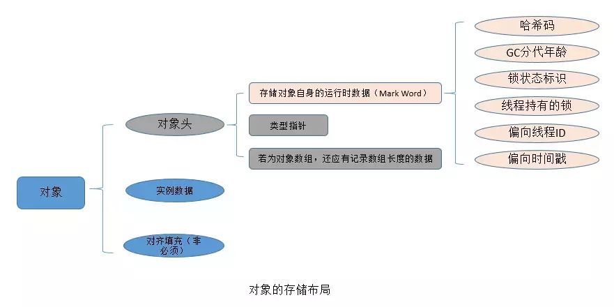

##  **进程与线程**

### 概念及意义

进程是操作系统进行资源分配的基本单位， 是系统运行程序的基本单位 ,而线程是操作系统进行调度的基本单位。 

多线程的性能一定就由于单线程呢？

　　不一定，要看具体的任务以及计算机的配置。比如说：

　　对于单核CPU，如果是CPU密集型任务，如解压文件，多线程的性能反而不如单线程性能，因为解压文件需要一直占用CPU资源，如果采用多线程，线程切换导致的开销反而会让性能下降。

　　但是对于比如交互类型的任务，肯定是需要使用多线程的、

　　而对于多核CPU，对于解压文件来说，多线程肯定优于单线程，因为多个线程能够更加充分利用每个核的资源。

### 内存分配

 同类的多个线程共享进程的**堆**和**方法区**资源，但每个线程有自己的**程序计数器**、**虚拟机栈**和**本地方法栈** 

 堆和方法区是所有线程共享的资源，其中堆是进程中最大的一块内存，主要用于存放新创建的对象 (所有对象都在这里分配内存)，方法区主要用于存放已被加载的类信息、常量、静态变量、即时编译器编译后的代码等数据。 


### 线程生命周期

 


### 上下文切换

 一般来说，线程上下文切换过程中会记录程序计数器、CPU寄存器状态等数据。 

 说简单点的：对于线程的上下文切换实际上就是 存储和恢复CPU状态的过程，它使得线程执行能够从中断点恢复执行 

###  **守护线程**


###  Thread类中常用的方法 

　1）start方法

　　start()用来启动一个线程，当调用start方法后，系统才会开启一个新的线程来执行用户定义的子任务，在这个过程中，会为相应的线程分配需要的资源。

　　2）run方法

　　run()方法是不需要用户来调用的，当通过start方法启动一个线程之后，当线程获得了CPU执行时间，便进入run方法体去执行具体的任务。注意，继承Thread类必须重写run方法，在run方法中定义具体要执行的任务。

3）sleep方法

　　sleep方法有两个重载版本：

```
`sleep(``long` `millis)   ``//参数为毫秒` `sleep(``long` `millis,``int` `nanoseconds)  ``//第一参数为毫秒，第二个参数为纳秒`
```

　　sleep相当于让线程睡眠，交出CPU，让CPU去执行其他的任务。

　　但是有一点要非常注意，sleep方法不会释放锁，也就是说如果当前线程持有对某个对象的锁，则即使调用sleep方法，其他线程也无法访问这个对象。

 如果调用了sleep方法，必须捕获InterruptedException异常或者将该异常向上层抛出。当线程睡眠时间满后，不一定会立即得到执行，因为此时可能CPU正在执行其他的任务。所以说调用sleep方法相当于让线程进入**阻塞状态**。 

4）yield方法

　　调用yield方法会让当前线程 交出CPU权限，让CPU去执行其他的线程。它跟sleep方法类似，同样不会释放锁。但是yield不能控制具体的交出CPU的时间，另外，yield方法只能让拥有**相同优先级**的线程有获取CPU执行时间的机会。

　　注意，调用yield方法并不会让线程进入阻塞状态，而是让线程**重回就绪状态**，它只需要等待重新获取CPU执行时间，这一点是和sleep方法不一样的。

5）join方法

　　join方法有三个重载版本：

```
`join()``join(``long` `millis)   ``//参数为毫秒``join(``long` `millis,``int` `nanoseconds)  ``//第一参数为毫秒，第二个参数为纳秒`
```

 　假如在main线程中，调用thread.join方法，则main方法会等待thread线程执行完毕或者等待一定的时间。如果调用的是无参join方法，则等待thread执行完毕，如果调用的是指定了时间参数的join方法，则等待一定的事件。

　　6）interrupt方法

　　interrupt，顾名思义，即中断的意思。单独调用interrupt方法可以使得处于阻塞状态的线程抛出一个异常，也就说，它可以用来中断一个正处于阻塞状态的线程；另外，通过interrupt方法和isInterrupted()方法来停止正在运行的线程。


**说说 sleep() 方法和 wait() 方法区别和共同点?**
两者最主要的区别在于：sleep 方法没有释放锁，而 wait 方法释放了锁 。
两者都可以暂停线程的执行。
Wait 通常被用于线程间交互/通信，sleep 通常被用于暂停执行。
wait() 方法被调用后，线程不会自动苏醒，需要别的线程调用同一个对象上的 notify() 或者 notifyAll() 方法。sleep() 方法执行完成后，线程会自动苏醒。或者可以使用 wait(long timeout)超时后线程会自动苏醒。


### **线程安全**

当多个线程同时访问临界资源（一个对象，对象中的属性，一个文件，一个数据库等）时，就可能会产生线程安全问题。

　　不过，当多个线程执行一个方法，**方法内部的局部变量并不是临界资源**，因为方法是在栈上执行的，而Java栈是线程私有的，因此不会产生线程安全问题。

## 悲观锁与乐观锁

### 死锁必须具备以下四个条件：

1. 互斥条件：该资源任意一个时刻只由一个线程占用。
2. 请求与保持条件：一个进程因请求资源而阻塞时，对已获得的资源保持不放。
3. 不剥夺条件:线程已获得的资源在末使用完之前不能被其他线程强行剥夺，只有自己使用完毕后才释放资源。
4. 循环等待条件:若干进程之间形成一种头尾相接的循环等待资源关系。

**如何避免线程死锁?**

我们只要破坏产生死锁的四个条件中的其中一个就可以了。

**破坏互斥条件**

这个条件我们没有办法破坏，因为我们用锁本来就是想让他们互斥的（临界资源需要互斥访问）。

**破坏请求与保持条件**

一次性申请所有的资源。

**破坏不剥夺条件**

占用部分资源的线程进一步申请其他资源时，如果申请不到，可以主动释放它占有的资源。

**破坏循环等待条件**

靠按序申请资源来预防。按某一顺序申请资源，释放资源则反序释放。破坏循环等待条件。

### 悲观锁

  总是假设最坏的情况，每次去拿数据的时候都认为别人会修改，所以每次在拿数据的时候都会上锁，这样别人想拿这个数据就会阻塞直到它拿到锁（**共享资源每次只给一个线程使用，其它线程阻塞，用完后再把资源转让给其它线程**）。传统的关系型数据库里边就用到了很多这种锁机制，比如行锁，表锁等，读锁，写锁等，都是在做操作之前先上锁。Java中`synchronized`和`ReentrantLock`等独占锁就是悲观锁思想的实现。 

### 乐观锁

总是假设最好的情况，每次去拿数据的时候都认为别人不会修改，所以不会上锁，但是在更新的时候会判断一下在此期间别人有没有去更新这个数据，可以使用版本号机制和CAS算法实现。**乐观锁适用于多读的应用类型，这样可以提高吞吐量**，像数据库提供的类似于**write_condition机制**，其实都是提供的乐观锁。在Java中`java.util.concurrent.atomic`包下面的原子变量类就是使用了乐观锁的一种实现方式**CAS**实现的。

#### 版本号

#### CAS

 当且仅当 V 的值等于 A时，CAS通过原子方式用新值B来更新V的值，否则不会执行任何操作（比较和替换是一个原子操作）。一般情况下是一个**自旋操作**，即**不断的重试**。 

> 从 实现原理上来讲，互斥锁属于sleep-waiting(睡眠等待)类型的锁。例如在一个双核的机器上有两个线程(线程A和线程B)，它们分别运行在Core0和 Core1上。假设线程A想要通过pthread_mutex_lock操作去得到一个临界区的锁，而此时这个锁正被线程B所持有，那么线程A就会被阻塞 (blocking)，Core0 会在此时进行上下文切换(Context Switch)将线程A置于等待队列中，此时Core0就可以运行其他的任务(例如另一个线程C)而不必进行忙等待。而自旋锁则不然，它属于busy-waiting(忙等待)类型的锁，如果线程A是使用pthread_spin_lock操作去请求锁，那么线程A就会一直在 Core0上进行忙等待并不停的进行锁请求，直到得到这个锁为止。

**自旋锁存在的问题**

1. 如果某个线程持有锁的时间过长，就会导致其它等待获取锁的线程进入循环等待，消耗CPU。使用不当会造成CPU使用率极高。
2. 上面Java实现的自旋锁不是公平的，即无法满足等待时间最长的线程优先获取锁。不公平的锁就会存在“线程饥饿”问题。

**自旋锁的优点**

1. 自旋锁不会使线程状态发生切换，一直处于用户态，即线程一直都是active的；不会使线程进入阻塞状态，减少了不必要的上下文切换，执行速度快
2. 非自旋锁在获取不到锁的时候会进入阻塞状态，从而进入内核态，当获取到锁的时候需要从内核态恢复，需要线程上下文切换。 （线程被阻塞后便进入内核（Linux）调度状态，这个会导致系统在用户态与内核态之间来回切换，严重影响锁的性能）

#### **为什么CAS减少上下文切换？**

 传统锁`sync` 或者`Lock`接口的`LockSupport.park()`这个底层基本上都是切换线程； 

 **不是说CAS没有线程上下文切换，只是减少了上下文切换**。在多线程竞争下，加锁、释放锁会导致比较多的上下文切换和调度延时，引起性能问题。而当多个线程尝试使用CAS同时更新同一个变量时，只有其中一个线程能更新变量的值，而其它线程都失败，失败的线程并不会被挂起，而是被告知这次竞争中失败，并可以再次尝试（只要cpu分配给线程的时间片没有过，就可以不断的重试，但**是时间片过后，如果还是没有成功，也会进行上下文切换，所以说只是减少了上下文切换**）。 

### 两种锁的使用场景

从上面对两种锁的介绍，我们知道两种锁各有优缺点，不可认为一种好于另一种，像**乐观锁适用于写比较少的情况下（多读场景）**，即冲突真的很少发生的时候，这样可以省去了锁的开销，加大了系统的整个吞吐量。但如果是多写的情况，一般会经常产生冲突，这就会导致上层应用会不断的进行retry，这样反倒是降低了性能，所以**一般多写的场景下用悲观锁就比较合适。


## JUC包


**tools:** 

* CountDownLatch
* CyclicBarrier
* Semaphore

 **executor** 

* ScheduledExecutorService 解决那些需要任务重复执行的问题

* ScheduledThreadPoolExecutor  周期性任务调度的类实现

 **atomic(原子性包)**：是JDK提供的一组原子操作类 

**locks（锁包）** :

* ReentrantLock  它是独占锁，是指只能被独自占领，即同一个时间点只能被一个线程锁获取到的锁。
* ReentrantReadWriteLock  它包括子类ReadLock和WriteLock。ReadLock是共享锁，而WriteLock是独占锁。

* LockSupport 它具备阻塞线程和解除阻塞线程的功能，并且不会引发死锁。

 **collections(集合类)：** 

*  CopyOnWriteArrayList 

*  CopyOnWriteArraySet 

*  ConcurrentHashMap 

##  synchronized 关键字

**synchronized关键字最主要的三种使用方式：**

- **修饰实例方法:** 作用于当前对象实例加锁，进入同步代码前要获得当前对象**实例的锁**
- **修饰静态方法:** 也就是给当前类加锁，会作用于类的所有对象实例，因为静态成员不属于任何一个实例对象，是类成员（ static 表明这是该类的一个静态资源，不管new了多少个对象，只有一份）。所以如果一个线程A调用一个实例对象的非静态 synchronized 方法，而线程B需要调用这个实例对象所属类的静态 synchronized 方法，是允许的，不会发生互斥现象，**因为访问静态 synchronized 方法占用的锁是当前类的锁，而访问非静态 synchronized 方法占用的锁是当前实例对象锁**。
- **修饰代码块:** 指定加锁对象，对给定对象加锁，进入同步代码库前要获得给定对象的锁。

###  底层原理

 **synchronized 同步语句块的实现使用的是 monitorenter 和 monitorexit 指令，其中 monitorenter 指令指向同步代码块的开始位置，monitorexit 指令则指明同步代码块的结束位置。** 当执行 monitorenter 指令时，线程试图获取锁也就是获取 monitor(monitor对象存在于每个Java对象的对象头中，synchronized 锁便是通过这种方式获取锁的，也是为什么Java中任意对象可以作为锁的原因) 的持有权。当计数器为0则可以成功获取，获取后将锁计数器设为1也就是加1。相应的在执行 monitorexit 指令后，将锁计数器设为0，表明锁被释放。如果获取对象锁失败，那当前线程就要阻塞等待，直到锁被另外一个线程释放为止。 

 synchronized 修饰的方法并没有 monitorenter 指令和 monitorexit 指令，取得代之的确实是 ACC_SYNCHRONIZED 标识，当方法调用时，**调用指令将会检查方法的 ACC_SYNCHRONIZED 访问标志是否被设置**，如果设置了，**执行线程将先获取monitor**，获取成功之后才能执行方法体，**方法执行完后再释放monitor**。在方法执行期间，其他任何线程都无法再获得同一个monitor对象。



Hotspot虚拟机的对象头主要包括两部分数据：**Mark Word（标记字段）、Class Pointer（类型指针）**。其中 **Class Pointer是对象指向它的类元数据的指针**，虚拟机通过这个指针来确定这个对象是哪个类的实例，**Mark Word用于存储对象自身的运行时数据，它是实现轻量级锁和偏向锁的关键**

获取锁流程

> 首先会进入 _EntryList 集合，**当线程获取到对象的monitor后，进入 _Owner区域并把monitor中的owner变量设置为当前线程，同时monitor中的计数器count加1**；
>
> 若线程调用 wait() 方法，**将释放当前持有的monitor，owner变量恢复为null，count自减1，同时该线程进入 WaitSet集合中等待被唤醒**；
>
> 若当前线程执行完毕，**也将释放monitor（锁）并复位count的值，以便其他线程进入获取monitor(锁)**；


### 锁的升级

#### **偏向锁**

 **轻量级锁是为了在线程交替执行同步块时提高性能，而偏向锁则是在只有一个线程执行同步块时进一步提高性能** 

 偏向锁的释放采用了 **一种只有竞争才会释放锁的机制，线程是不会主动去释放偏向锁，需要等待其他线程来竞争** 

> **1. 检测Mark Word是否为可偏向状态**，即是否为偏向锁1，锁标识位为01；
>
> 2. **若为可偏向状态，则测试线程ID是否为当前线程ID**，如果是，则执行步骤（5），否则执行步骤（3）；
>
> 3. **如果测试线程ID不为当前线程ID**，则通过CAS操作竞争锁，竞争成功，则将Mark Word的线程ID替换为当前线程ID，否则执行线程（4）；
>
> 4. **通过CAS竞争锁失败，证明当前存在多线程竞争情况，当到达全局安全点，获得偏向锁的线程被挂起，偏向锁升级为轻量级锁**，然后被阻塞在安全点的线程继续往下执行同步代码块；
>
> 执行同步代码块；


####  轻量级锁

引入轻量级锁的主要目的是 **在没有多线程竞争的前提下，减少传统的重量级锁使用操作系统互斥量产生的性能消耗**。 


> 1. 在线程进入同步块时，**如果同步对象锁状态为无锁状态（锁标志位为“01”状态，是否为偏向锁为“0”），虚拟机首先将在当前线程的栈帧中建立一个名为锁记录（Lock Record）的空间，用于存储锁对象目前的Mark Word的拷贝**，官方称之为 Displaced Mark Word。此时线程堆栈与对象头的状态如下图所示：
>
> 2. 拷贝对象头中的Mark Word复制到锁记录（Lock Record）中；
>
> 3. 拷贝成功后，**虚拟机将使用CAS操作尝试将对象Mark Word中的Lock Word更新为指向当前线程Lock Record的指针，并将Lock record里的owner指针指向object mark word**。如果更新成功，则执行步骤（4），否则执行步骤（5）；
>
> **4. 如果这个更新动作成功了，那么当前线程就拥有了该对象的锁，并且对象Mark Word的锁标志位设置为“00”，即表示此对象处于轻量级锁定状态**，此时线程堆栈与对象头的状态如下图所示：
>
> **5. 如果这个更新操作失败了，虚拟机首先会检查对象Mark Word中的Lock Word是否指向当前线程的栈帧**，如果是，就说明当前线程已经拥有了这个对象的锁，那就可以直接进入同步块继续执行。**否则说明多个线程竞争锁，进入自旋执行（3），若自旋结束时仍未获得锁，轻量级锁就要膨胀为重量级锁，锁标志的状态值变为“10”，Mark Word中存储的就是指向重量级锁（互斥量）的指针，当前线程以及后面等待锁的线程也要进入阻塞状态**。


**如果是单线程使用，那偏向锁毫无疑问代价最小**，并且它就能解决问题，连CAS都不用做，仅仅在内存中比较下对象头就可以了；

 **如果出现了其他线程竞争**，则偏向锁就会升级为轻量级锁；

 **如果其他线程通过一定次数的CAS尝试没有成功**，则进入重量级锁；

#### 重量级锁

Synchronized是通过对象内部的一个叫做 **监视器锁（Monitor）来实现的**。**但是监视器锁本质又是依赖于底层的操作系统的Mutex Lock来实现的。而操作系统实现线程之间的切换这就需要从用户态转换到核心态，这个成本非常高，状态之间的转换需要相对比较长的时间**，这就是为什么Synchronized效率低的原因。因此，这种依赖于操作系统Mutex Lock所实现的锁我们称之为 **“重量级锁”**。


###  synchronized和ReentrantLock 的区别

 **① 两者都是可重入锁** 

 **② synchronized 依赖于 JVM 而 ReentrantLock 依赖于 API** 

**③ ReentrantLock 比 synchronized 增加了一些高级功能**

相比synchronized，ReentrantLock增加了一些高级功能。主要来说主要有三点：**①等待可中断；②可实现公平锁；③可实现选择性通知（锁可以绑定多个条件）**

## Locks

(1)lock

 lock()方法是平常使用得最多的一个方法，就是用来获取锁。如果锁已被其他线程获取，则进行等待。 

 如果采用Lock，必须主动去释放锁，并且在发生异常时，不会自动释放锁。因此一般来说，使用Lock必须在try{}catch{}块中进行，并且将释放锁的操作放在finally块中进行，以保证锁一定被被释放，防止死锁的发生。 

(2)trylock

 tryLock()方法是有返回值的，它表示用来尝试获取锁，如果获取成功，则返回true，如果获取失败（即锁已被其他线程获取），则返回false，也就说这个方法无论如何都会立即返回。在拿不到锁时不会一直在那等待。 

(3) tryLock(long time, TimeUnit unit) 

 　tryLock(long time, TimeUnit unit)方法和tryLock()方法是类似的，只不过区别在于这个方法在拿不到锁时会等待一定的时间，在时间期限之内如果还拿不到锁，就返回false。如果如果一开始拿到锁或者在等待期间内拿到了锁，则返回true。 


 https://www.cnblogs.com/dolphin0520/p/3923737.html 

 (4)lockInterruptibly() 

lockInterruptibly()方法比较特殊，当通过这个方法去获取锁时，如果线程正在等待获取锁，则这个线程能够响应中断，即中断线程的等待状态。也就使说，当两个线程同时通过lock.lockInterruptibly()想获取某个锁时，假若此时线程A获取到了锁，而线程B只有在等待，那么对线程B调用threadB.interrupt()方法能够中断线程B的等待过程。

　　由于lockInterruptibly()的声明中抛出了异常，所以lock.lockInterruptibly()必须放在try块中或者在调用lockInterruptibly()的方法外声明抛出InterruptedException。

 而用synchronized修饰的话，当一个线程处于等待某个锁的状态，是无法被中断的，只有一直等待下去。 


 lockInterruptibly()允许在等待时由其他线程的Thread.interrupt()方法来中断等待线程而直接返回，这时是不用获取锁的，而会抛出一个InterruptException。而ReentrantLock.lock()方法则不允许Thread.interrupt()中断，即使检测到了Thread.interruptted一样会继续尝试获取锁，失败则继续休眠。只是在最后获取锁成功之后在把当前线程置为interrupted状态。 


###  ReentrantLock 

 　ReentrantLock，意思是“可重入锁”，关于可重入锁的概念在下一节讲述。ReentrantLock是唯一实现了Lock接口的类 

 lockInterruptibly()响应中断的使用方法 

```java
import java.util.*;
import java.util.concurrent.locks.Lock;
import java.util.concurrent.locks.ReentrantLock;

public class Main {
    public static Lock lock = new ReentrantLock(); //公用一个锁
    public static void main(String[] args) {
        Main m = new Main();
        MyTread myTread1 = new MyTread(m);
        MyTread myTread2 = new MyTread(m);
        myTread1.start();
        myTread2.start();

        try {
            Thread.sleep(2000);
        } catch (InterruptedException e) {
            e.printStackTrace();
        }
        
        myTread2.interrupt();
    }
    
    public static void insert(Thread thread) throws InterruptedException {
        lock.lockInterruptibly();
        try{
            System.out.println(Thread.currentThread()+"得到了锁");
            long starttime = System.currentTimeMillis();
            for (; ; ) {
                if (System.currentTimeMillis() - starttime > 10) {
                    break;
                }
    
            }
        }finally {
            System.out.println(Thread.currentThread().getName()+"执行final");
            lock.unlock();
            System.out.println(Thread.currentThread().getName()+"释放了锁");
        }
    }
}

class MyTread extends Thread{
    Main m = null;
    public MyTread(Main m) {
        this.m=m;
    }
    
    @Override
    public void run() {
        try {
            m.insert(Thread.currentThread());
        } catch (InterruptedException e) {
            System.out.println("被中断");
        }
    }
}
```

```
Thread[Thread-0,5,main]得到了锁
被中断
Thread-0执行final
Thread-0释放了锁
```

 **ReadWriteLock** 

 定义两个锁，一个用来获取读锁(Lock readLock())，一个用来获取写锁(Lock writeLock())。也就是说将文件的读写操作分开，分成2个锁来分配给线程，从而使得多个线程可以同时进行读操作。下面的ReentrantReadWriteLock实现了ReadWriteLock接口。 

**Lock和synchronized的选择**

　　总结来说，Lock和synchronized有以下几点不同：

　　1）Lock是一个接口，而synchronized是Java中的关键字，synchronized是内置的语言实现；

　　2）synchronized在发生异常时，会自动释放线程占有的锁，因此不会导致死锁现象发生；而Lock在发生异常时，如果没有主动通过unLock()去释放锁，则很可能造成死锁现象，因此使用Lock时需要在finally块中释放锁；

　　3）Lock可以让等待锁的线程响应中断，而synchronized却不行，使用synchronized时，等待的线程会一直等待下去，不能够响应中断；

　　4）通过Lock可以知道有没有成功获取锁，而synchronized却无法办到。

　　5）Lock可以提高多个线程进行读操作的效率。

　　在性能上来说，如果竞争资源不激烈，两者的性能是差不多的，而当竞争资源非常激烈时（即有大量线程同时竞争），此时Lock的性能要远远优于synchronized。所以说，在具体使用时要根据适当情况选择。

**锁相关概念**

可重入锁

 synchronized和ReentrantLoc 

可中断锁

 synchronized就不是可中断锁，而Lock是可中断锁 

公平锁

synchronized就是非公平锁，它无法保证等待的线程获取锁的顺序。

　　而对于ReentrantLock和ReentrantReadWriteLock，它默认情况下是非公平锁，但是可以设置为公平锁。

读写锁

读写锁将对一个资源（比如文件）的访问分成了2个锁，一个读锁和一个写锁。

　　正因为有了读写锁，才使得多个线程之间的读操作不会发生冲突。

　　ReadWriteLock就是读写锁，它是一个接口，ReentrantReadWriteLock实现了这个接口。


### 通信Condition

[wait、notify/notifyAll ](https://www.cnblogs.com/moongeek/p/7631447.html)

1、wait()、notify/notifyAll() 方法是Object的本地final方法，无法被重写。

2、wait()使当前线程阻塞，前提是 必须先获得锁，一般配合synchronized 关键字使用，即，一般在synchronized 同步代码块里使用 wait()、notify/notifyAll() 方法。

3、 由于 wait()、notify/notifyAll() 在synchronized 代码块执行，说明当前线程一定是获取了锁的。

当线程执行wait()方法时候，会释放当前的锁，然后让出CPU，进入等待状态。

只有当 notify/notifyAll() 被执行时候，才会唤醒一个或多个正处于等待状态的线程，然后继续往下执行，直到执行完synchronized 代码块的代码或是中途遇到wait() ，再次释放锁。

也就是说，notify/notifyAll() 的执行只是唤醒沉睡的线程，而不会立即释放锁，锁的释放要看代码块的具体执行情况。所以在编程中，尽量在使用了notify/notifyAll() 后立即退出临界区，以唤醒其他线程让其获得锁

4、wait() 需要被try catch包围，以便发生异常中断也可以使wait等待的线程唤醒。

5、notify 和wait 的顺序不能错，如果A线程先执行notify方法，B线程在执行wait方法，那么B线程是无法被唤醒的。

6、notify 和 notifyAll的区别

notify方法只唤醒一个等待（对象的）线程并使该线程开始执行。所以如果有多个线程等待一个对象，这个方法只会唤醒其中一个线程，选择哪个线程取决于操作系统对多线程管理的实现。notifyAll 会唤醒所有等待(对象的)线程，尽管哪一个线程将会第一个处理取决于操作系统的实现。如果当前情况下有多个线程需要被唤醒，推荐使用notifyAll 方法。比如在生产者-消费者里面的使用，每次都需要唤醒所有的消费者或是生产者，以判断程序是否可以继续往下执行。


 线程间协作的两种方式：wait、notify、notifyAll和Condition 

　调用某个对象的wait()方法，相当于让当前线程交出此对象的monitor，然后进入等待状态，等待后续再次获得此对象的锁（Thread类中的sleep方法使当前线程暂停执行一段时间，从而让其他线程有机会继续执行，但它并不释放对象锁）；

　　notify()方法能够唤醒一个正在等待该对象的monitor的线程，当有多个线程都在等待该对象的monitor的话，则只能唤醒其中一个线程，具体唤醒哪个线程则不得而知。

　　同样地，调用某个对象的notify()方法，当前线程也必须拥有这个对象的monitor，因此调用notify()方法必须在同步块或者同步方法中进行（synchronized块或者synchronized方法）。

　　nofityAll()方法能够唤醒所有正在等待该对象的monitor的线程，这一点与notify()方法是不同的。

　　这里要注意一点：notify()和notifyAll()方法只是唤醒等待该对象的monitor的线程，并不决定哪个线程能够获取到monitor。

 上面尤其要注意一点，一个线程被唤醒不代表立即获取了对象的monitor，只有等调用完notify()或者notifyAll()并退出synchronized块，释放对象锁后，其余线程才可获得锁执行。

**Condition**

Condition是在java 1.5中才出现的，它用来替代传统的Object的wait()、notify()实现线程间的协作，相比使用Object的wait()、notify()，使用Condition1的await()、signal()这种方式实现线程间协作更加安全和高效。因此通常来说比较推荐使用Condition，在阻塞队列那一篇博文中就讲述到了，阻塞队列实际上是使用了Condition来模拟线程间协作。

- Condition是个接口，基本的方法就是await()和signal()方法；
- Condition依赖于Lock接口，生成一个Condition的基本代码是lock.newCondition() 
- 调用Condition的await()和signal()方法，都必须在lock保护之内，就是说必须在lock.lock()和lock.unlock之间才可以使用

　　Conditon中的await()对应Object的wait()；

　　Condition中的signal()对应Object的notify()；

　　Condition中的signalAll()对应Object的notifyAll()。

java中Condition类的详细介绍（详解） https://blog.csdn.net/a1439775520/article/details/98471610 

### ReentrantReadWriteLock

Lock和ReadWriteLock是两大锁的根接口，Lock代表实现类是ReentrantLock（可重入锁），ReadWriteLock（读写锁）的代表实现类是ReentrantReadWriteLock。

　　　　Lock 接口支持那些语义不同（重入、公平等）的锁规则，可以在非阻塞式结构的上下文（包括 hand-over-hand 和锁重排算法）中使用这些规则。主要的实现是 ReentrantLock。
ReadWriteLock 接口以类似方式定义了一些读取者可以共享而写入者独占的锁。此包只提供了一个实现，即 ReentrantReadWriteLock，因为它适用于大部分的标准用法上下文。但程序员可以创建自己的、适用于非标准要求的实现。

### Lock实现原理


 锁的存储结构（AQS）主要涵盖**双向链表和int型状态值**

**非公平锁获取锁的流程**，CAS贯穿其中每一个环节

 


释放锁

 释放锁就是对AQS中的状态值State进行修改。同时更新下一个链表中的线程等待节点。 


## volatile关键字

cpu-高速缓存-内存

 在并发编程中，我们通常会遇到以下三个问题：原子性问题，可见性问题，有序性问题 

 **原子性：**即一个操作或者多个操作 要么全部执行并且执行的过程不会被任何因素打断，要么就都不执行。 

 Java内存模型只保证了基本读取和赋值是原子性操作，如果要实现更大范围操作的原子性，可以通过synchronized和Lock来实现 


 **可见性**是指当多个线程访问同一个变量时，一个线程修改了这个变量的值，其他线程能够立即看得到修改的值。 


对于可见性，Java提供了volatile关键字来保证可见性。

　　当一个共享变量被volatile修饰时，它会保证修改的值会立即被更新到主存，当有其他线程需要读取时，它会去内存中读取新值。

 另外，通过synchronized和Lock也能够保证可见性，synchronized和Lock能保证同一时刻只有一个线程获取锁然后执行同步代码，并且在释放锁之前会将对变量的修改刷新到主存当中。因此可以保证可见性。 

 **有序性：**即程序执行的顺序按照代码的先后顺序执行。 

 　Java内存模型规定所有的变量都是存在主存当中（类似于前面说的物理内存），每个线程都有自己的工作内存（类似于前面的高速缓存）。线程对变量的所有操作都必须在工作内存中进行，而不能直接对主存进行操作。并且每个线程不能访问其他线程的工作内存。 

 volatile到底如何保证可见性和禁止指令重排序的。 

　“观察加入volatile关键字和没有加入volatile关键字时所生成的汇编代码发现，加入volatile关键字时，会多出一个lock前缀指令”

　　lock前缀指令实际上相当于一个内存屏障（也成内存栅栏），内存屏障会提供3个功能：

　　1）它确保指令重排序时不会把其后面的指令排到内存屏障之前的位置，也不会把前面的指令排到内存屏障的后面；即在执行到内存屏障这句指令时，在它前面的操作已经全部完成；

　　2）它会强制将对缓存的修改操作立即写入主存；

　　3）如果是写操作，它会导致其他CPU中对应的缓存行无效

个人理解，确保变量赋值操作被立即写入内存，其他缓存无效

单例double check

```java
class Singleton{
    private volatile static Singleton instance = null;
     
    private Singleton() {
         
    }
     
    public static Singleton getInstance() {
        if(instance==null) {
            synchronized (Singleton.class) {
                if(instance==null)
                    instance = new Singleton();
            }
        }
        return instance;
    }
}
```

### synchronized关键字和volatile关键字比较

- **volatile关键字**是线程同步的**轻量级实现**，所以**volatile性能肯定比synchronized关键字要好**。但是**volatile关键字只能用于变量而synchronized关键字可以修饰方法以及代码块**。synchronized关键字在JavaSE1.6之后进行了主要包括为了减少获得锁和释放锁带来的性能消耗而引入的偏向锁和轻量级锁以及其它各种优化之后执行效率有了显著提升，**实际开发中使用 synchronized 关键字的场景还是更多一些**。
- **多线程访问volatile关键字不会发生阻塞，而synchronized关键字可能会发生阻塞**
- **volatile关键字能保证数据的可见性，但不能保证数据的原子性。synchronized关键字两者都能保证。**
- **volatile关键字主要用于解决变量在多个线程之间的可见性，而 synchronized关键字解决的是多个线程之间访问资源的同步性。**


## ThreadLocal

ThreadLocal提供了线程内存储变量的能力，这些变量不同之处在于每一个线程读取的变量是对应的互相独立的。通过get和set方法就可以得到当前线程对应的值 

```java
  public static void main(String[] args) {
        ThreadLocal<Integer> a=new ThreadLocal<>();
        a.set(8);
        System.out.println(a.get());
        new Thread(){
            public void run(){
                System.out.println(a.get());
                a.set(9);
            }
        }.start();
//        System.out.println(a.get());
    }
```

```java
8
null
```


### 原理

 ThreadLocal是JDK包提供的，它提供线程本地变量，如果创建一乐ThreadLocal变量，那么访问这个变量的每个线程都会有这个变量的一个副本，在实际多线程操作的时候，操作的是自己本地内存中的变量，从而规避了线程安全问题.

 Thread类中有两个变量threadLocals和inheritableThreadLocals，二者都是ThreadLocal内部类ThreadLocalMap类型的变量， 

 每个线程的本地变量**不是存放在ThreadLocal实例中**，而是放在调用线程的ThreadLocals变量里面（前面也说过，该变量是Thread类的变量）。也就是说，ThreadLocal类型的本地变量是存放在具体的线程空间上，其本身相当于一个装载本地变量的工具壳，**通过set方法将value添加到调用线程的threadLocals中，当调用线程调用get方法时候能够从它的threadLocals中取出变量**。 


**自己理解，ThreadLocal用于多个线程共享同一个变量，及自身不创建变量，而是保存共享变量的引用或独立的副本**


### 内存泄漏

 THreadLocalMap中的Entry的key使用的是ThreadLocal对象的弱引用，在没有其他地方对ThreadLoca依赖，ThreadLocalMap中的ThreadLocal对象就会被回收掉，但是对应的不会被回收，这个时候Map中就可能存在key为null但是value不为null的项，这需要实际的时候使用完毕及时调用remove方法避免内存泄漏。 


使用ThreadLocal时会发生内存泄漏的前提条件：

①ThreadLocal引用被设置为null，且后面没有set，get,remove操作。
②线程一直运行，不停止。（线程池）
③触发了垃圾回收。（Minor GC或Full GC）
    我们看到ThreadLocal出现内存泄漏条件还是很苛刻的，所以我们只要破坏其中一个条件就可以避免内存泄漏，单但为了更好的避免这种情况的发生我们使用ThreadLocal时遵守以下两个小原则:
    ①ThreadLocal申明为private static final。
         Private与final 尽可能不让他人修改变更引用，
         Static 表示为类属性，只有在程序结束才会被回收。
    ②ThreadLocal使用后务必调用remove方法。
        最简单有效的方法是使用后将其移除。
————————————————
：https://blog.csdn.net/zzg1229059735/java/article/details/82715741

下图虚线表示弱引用。ThreadLocal对象被GC回收了，那么key变成了null。Map又是通过key拿到的value的对象。所以，GC在回收了key所占内存后，没法访问到value的值，因为需要通过key才能访问到value对象。另外，如图所示的引用链：CurrentThread -- Map -- Entry -- value ，所以，在当前线程没有被回收的情况下，value所占内存也不 会被回收。所以可能会造成了内存溢出。


### 父子

同一个ThreadLocal变量在父线程中被设置值后，在子线程中是获取不到的。（threadLocals中为当前调用线程对应的本地变量，所以二者自然是不能共享的）

 而InheritableThreadLocal类则可以做到这个功能 
  https://www.cnblogs.com/fsmly/p/11020641.html 


在进行get之前，必须先set，否则会报空指针异常；如果想在get之前不需要调用set就能正常访问的话，必须重写initialValue()方法。 因为在上面的代码分析过程中，我们发现如果没有先set的话，即在map中查找不到对应的存储，则会通过调用setInitialValue方法返回i，而在setInitialValue方法中，有一个语句是T value = initialValue()， 而默认情况下，initialValue方法返回的是null。


## 同步容器

　在Java中，同步容器主要包括2类：

　　1）Vector、Stack、HashTable

　　2）Collections类中提供的静态工厂方法创建的类

　　Vector实现了List接口，Vector实际上就是一个数组，和ArrayList类似，但是Vector中的方法都是synchronized方法，即进行了同步措施。

　　Stack也是一个同步容器，它的方法也用synchronized进行了同步，它实际上是继承于Vector类。

　　HashTable实现了Map接口，它和HashMap很相似，但是HashTable进行了同步处理，而HashMap没有。

　　Collections类是一个工具提供类，注意，它和Collection不同，Collection是一个顶层的接口。在Collections类中提供了大量的方法，比如对集合或者容器进行排序、查找等操作。最重要的是，在它里面提供了几个静态工厂方法来创建同步容器类，如下图所示：

  

 同步容器存在性能问题，且不一定保证安全 Java ，可能出现ConcurrentModificationException 

**原因：**

 modCount不等于expectedModCount，则抛出ConcurrentModificationException异常。 

**单线程解决**

调用 Itr类的remove方法 ，删除元素实际上调用的就是list.remove()方法，但是它多了一个操作：

```
`expectedModCount = modCount;`
```

**多线程解决**

因此一般有2种解决办法：

　　1）在使用iterator迭代的时候使用synchronized或者Lock进行同步；

　　2）使用并发容器CopyOnWriteArrayList代替ArrayList和Vector。

 同步容器的实现原理其实很简单，就是对普通容器做了一层封装，并实现容器的每一个方法，在方法上实现同步。 

## 并发容器

同步容器类存在两个问题，一个问题就是上面提到的复合操作需要客户端加锁，以保证操作的正确性。另外一个就是同步容器将所有对容器状态的访问都串行化，以实现他们的线程安全性，但这种方法的代价是严重降低并发性，当多个线程竞争访问容器的锁时，吞吐量将严重降低。因此，通过并发容器代替同步容器，可以极大地提高伸缩性并降低风险。并发容器注重以下特性：

1. 根据具体场景进行设计，尽量避免使用锁，提高容器的并发访问性。
2. 并发容器定义了一些线程安全的复合操作。
3. 并发容器在迭代时，可以不封闭在synchronized中。但是未必每次看到的都是”最新的、当前的”数据。如果说将迭代操作包装在synchronized中，可以达到”串行”的并发安全性，那么并发容器的迭代达到了”脏读”。


### ConcurrentHashMap的内部结构

  

 Segment的数量永远是2的指数个，这样的好处是方便采用移位操作来进行hash，加快hash的过程 

remove操作

 首先remove操作也是确定需要删除的元素的位置，不过这里删除元素的方法不是简单地把待删除元素的前面的一个元素的next指向后面一个就完事了，我们之前已经说过HashEntry中的next是final的，一经赋值以后就不可修改，在定位到待删除元素的位置以后，程序就将待删除元素前面的那一些元素全部复制一遍，然后再一个一个重新接到链表上去 

 **在JDK1.7的时候，ConcurrentHashMap（分段锁）** 对整个桶数组进行了分割分段(Segment)，每一把锁只锁容器其中一部分数据，多线程访问容器里不同数据段的数据，就不会存在锁竞争，提高并发访问率。 **到了 JDK1.8 的时候已经摒弃了Segment的概念，而是直接用 Node 数组+链表+红黑树的数据结构来实现，并发控制使用 synchronized 和 CAS 来操作。（JDK1.6以后 对 synchronized锁做了很多优化）** 整个看起来就像是优化过且线程安全的 HashMap，虽然在JDK1.8中还能看到 Segment 的数据结构，但是已经简化了属性，只是为了兼容旧版本；② **Hashtable(同一把锁)** :使用 synchronized 来保证线程安全，效率非常低下。当一个线程访问同步方法时，其他线程也访问同步方法，可能会进入阻塞或轮询状态，如使用 put 添加元素，另一个线程不能使用 put 添加元素，也不能使用 get，竞争会越来越激烈效率越低。 


#### put方法

* 判断是否初始化

* * sizeCtl判断是否在进行初始化，若有进行yield,若无利用CAS获取进行初始化

* 通过hash计算，定位位置，如果位置上为null，表示可以直接放进去。 

* 如果对应位置的元素已经被标记为MOVED，即Node的hash为MOVED，那么表示当前table数组在进行扩容操作，此时，当前的线程会帮助扩容。 

* 如果通过hash计算之后的位置不为null，表示出现了哈希冲突，此时会锁住当前这个位置上的Node对象，然后将新添加的Node添加这个位置链表或者红黑树上 

#### 更新baseCount

 ddCount方法里面分为主要两个操作：1.更新baseCount；2.检测是否扩容。这里由于在讨论更新baseCount，所以不对扩容操作进行详细的解释，之后会做详细的解释。 

 更新baseCount的操作分成了两步：1.(cas)尝试更新baseCount变量；2.如果更新失败，或者counterCells为null会调用fullAddCount方法进行循环更新。 


先解释一下baseCount和counterCells含义。两个都是用记录元素个数，只是记录的时机不同的。当要更新元素个数时，优先更新baseCount，如果baseCount更新成功的话，表示更新元素个数的操作已经完成了；如果更新失败的话，此时会考虑更新counterCells数组中某一个（随机的）cell的value值。因此，**map的元素个数 = baseCount + 所有的cell的value值**。

###  CopyOnWriteArrayList 

  `CopyOnWriteArrayList` 类的所有可变操作（add，set 等等）都是通过创建底层数组的新副本来实现的。当 List 需要被修改的时候，我并不修改原有内容，而是对原有数据进行一次复制Arrays.copyOf，将修改的内容写入副本。写完之后，再将修改完的副本替换原来的数据，这样就可以保证写操作不会影响读操作了。 

CopyOnWrite容器即写时复制的容器。通俗的理解是当我们往一个容器添加元素的时候，不直接往当前容器添加，而是先将当前容器进行Copy，复制出一个新的容器，然后新的容器里添加元素，添加完元素之后，再将原容器的引用指向新的容器。这样做的好处是我们可以对CopyOnWrite容器进行并发的读，而不需要加锁，因为当前容器不会添加任何元素。所以CopyOnWrite容器也是一种读写分离的思想，读和写不同的容器。 

 CopyOnWrite并发容器用于读多写少的并发场景 

###  阻塞队列 

####  ArrayBlockingQueue

 ArrayBlockingQueue 一旦创建，容量不能改变。其并发控制采用可重入锁来控制，不管是插入操作还是读取操作，都需要获取到锁才能进行操作。当队列容量满时，尝试将元素放入队列将导致操作阻塞;尝试从一个空队列中取一个元素也会同样阻塞。 


#### LinkedBlockingQueue

**LinkedBlockingQueue** 底层基于**单向链表**实现的阻塞队列，可以当做无界队列也可以当做有界队列来使用，同样满足 FIFO 的特性，与 ArrayBlockingQueue 相比起来具有更高的吞吐量，为了防止 LinkedBlockingQueue 容量迅速增，损耗大量内存。通常在创建 LinkedBlockingQueue 对象时，会指定其大小，如果未指定，容量等于 Integer.MAX_VALUE。

#### PriorityBlockingQueue

**PriorityBlockingQueue** 是一个支持优先级的无界阻塞队列。默认情况下元素采用自然顺序进行排序，也可以通过自定义类实现 `compareTo()` 方法来指定元素排序规则，或者初始化时通过构造器参数 `Comparator` 来指定排序规则。


lock优先考虑获取锁，待获取锁成功后，才响应中断。这个方法不抛出中断异常。

lockInterruptibly 优先考虑响应中断，再去获取锁。这个方法会抛出中断异常。

所以我们返回来看： 

offer(e), 这个方法的实现用是调用lock, 实现的功能是入队之后，要么返回true，要么返回false，还有如果入队的元素是null，那么会抛空指针异常，但是这个方法不会抛出被中断的异常(InterruptedException)。

这个方法内部也设置了中断状态，但是不会抛出中断异常。非阻塞方法。入队不成功，就返回。

offer(e,timeout,unit) 这个方法调用lockInterruptibly, 实现的功能是在指定的时间内如果入队成功，则返回true，反之，返回false，如果在等待入队的过程中被其他线程打断，会抛出异常。 

这个方法会抛出中断异常。而且是阻塞方法。

 这个是经典的生产者-消费者模式，通过阻塞队列和Object.wait()和Object.notify()实现，wait()和notify()主要用来实现线程间通信。 

#### 生产者-消费者

```java
public class Test {
    private int queueSize = 10;
    private PriorityQueue<Integer> queue = new PriorityQueue<Integer>(queueSize);
     
    public static void main(String[] args)  {
        Test test = new Test();
        Producer producer = test.new Producer();
        Consumer consumer = test.new Consumer();
         
        producer.start();
        consumer.start();
    }
     
    class Consumer extends Thread{
         
        @Override
        public void run() {
            consume();
        }
         
        private void consume() {
            while(true){
                synchronized (queue) {
                    while(queue.size() == 0){
                        try {
                            System.out.println("队列空，等待数据");
                            queue.wait();
                        } catch (InterruptedException e) {
                            e.printStackTrace();
                            queue.notify();
                        }
                    }
                    queue.poll();          //每次移走队首元素
                    queue.notify();
                    System.out.println("从队列取走一个元素，队列剩余"+queue.size()+"个元素");
                }
            }
        }
    }
     
    class Producer extends Thread{
         
        @Override
        public void run() {
            produce();
        }
         
        private void produce() {
            while(true){
                synchronized (queue) {
                    while(queue.size() == queueSize){
                        try {
                            System.out.println("队列满，等待有空余空间");
                            queue.wait();
                        } catch (InterruptedException e) {
                            e.printStackTrace();
                            queue.notify();
                        }
                    }
                    queue.offer(1);        //每次插入一个元素
                    queue.notify();
                    System.out.println("向队列取中插入一个元素，队列剩余空间："+(queueSize-queue.size()));
                }
            }
        }
    }
}
```

 下面是使用阻塞队列实现的生产者-消费者模式： 

```java
public class Test {
    private int queueSize = 10;
    private ArrayBlockingQueue<Integer> queue = new ArrayBlockingQueue<Integer>(queueSize);
     
    public static void main(String[] args)  {
        Test test = new Test();
        Producer producer = test.new Producer();
        Consumer consumer = test.new Consumer();
         
        producer.start();
        consumer.start();
    }
     
    class Consumer extends Thread{
         
        @Override
        public void run() {
            consume();
        }
         
        private void consume() {
            while(true){
                try {
                    queue.take();
                    System.out.println("从队列取走一个元素，队列剩余"+queue.size()+"个元素");
                } catch (InterruptedException e) {
                    e.printStackTrace();
                }
            }
        }
    }
     
    class Producer extends Thread{
         
        @Override
        public void run() {
            produce();
        }
         
        private void produce() {
            while(true){
                try {
                    queue.put(1);
                    System.out.println("向队列取中插入一个元素，队列剩余空间："+(queueSize-queue.size()));
                } catch (InterruptedException e) {
                    e.printStackTrace();
                }
            }
        }
    }
}
```

###  ConcurrentSkipListMap

  

 在高并发的情况下，你会需要一个全局锁来保证整个平衡树的线程安全。而对于跳表，你只需要部分锁即可。这样，在高并发环境下，你就可以拥有更好的性能。而就查询的性能而言，跳表的时间复杂度也是 **O(logn)** 所以在并发数据结构中，JDK 使用跳表来实现一个 Map。 

从上面很容易看出，**跳表是一种利用空间换时间的算法。**

使用跳表实现 Map 和使用哈希算法实现 Map 的另外一个不同之处是：哈希并不会保存元素的顺序，而跳表内所有的元素都是排序的。因此在对跳表进行遍历时，你会得到一个有序的结果。所以，如果你的应用需要有序性，那么跳表就是你不二的选择。JDK 中实现这一数据结构的类是 ConcurrentSkipListMap。

##  线程池的使用 

**多任务任务线程分配**

核心线程递增--超出核心线程限制进入队列--队列满开启线程--线程总数超出最大线程拒绝任务

  

**使用线程池的好处**：

- **降低资源消耗**。通过重复利用已创建的线程降低线程创建和销毁造成的消耗。
- **提高响应速度**。当任务到达时，任务可以不需要的等到线程创建就能立即执行。
- **提高线程的可管理性**。线程是稀缺资源，如果无限制的创建，不仅会消耗系统资源，还会降低系统的稳定性，使用线程池可以进行统一的分配，调优和监控。


### Executor 框架结构

  


#### 1）任务(`Runnable` /`Callable`)

执行任务需要实现的 **`Runnable` 接口** 或 **`Callable`接口**。**`Runnable` 接口**或 **`Callable` 接口** 实现类都可以被 **`ThreadPoolExecutor`** 或 **`ScheduledThreadPoolExecutor`** 执行

 `Runnable`自Java 1.0以来一直存在，但`Callable`仅在Java 1.5中引入,目的就是为了来处理`Runnable`不支持的用例。**`Runnable` 接口**不会返回结果或抛出检查异常，但是**`Callable` 接口**可以。所以，如果任务不需要返回结果或抛出异常推荐使用 **`Runnable` 接口**，这样代码看起来会更加简洁。 

#### 2) 任务的执行(`Executor`)

如下图所示，包括任务执行机制的核心接口 **`Executor`** ，以及继承自 `Executor` 接口的 **`ExecutorService` 接口。`ThreadPoolExecutor`** 和 **`ScheduledThreadPoolExecutor`** 这两个关键类实现了 **ExecutorService 接口**。

  


 **`ThreadPoolExecutor`** 


Executor是一个顶层接口，在它里面只声明了一个方法execute(Runnable)，返回值为void，参数为Runnable类型，从字面意思可以理解，就是用来执行传进去的任务的；

　　然后ExecutorService接口继承了Executor接口，并声明了一些方法：submit、invokeAll、invokeAny以及shutDown等；

　　抽象类AbstractExecutorService实现了ExecutorService接口，基本实现了ExecutorService中声明的所有方法；

　　然后ThreadPoolExecutor继承了类AbstractExecutorService。

在ThreadPoolExecutor类中有几个非常重要的方法：

```
`execute()``submit()``shutdown()``shutdownNow()`
```

**`ThreadPoolExecutor` 3 个最重要的参数：**

- **`corePoolSize` :** 核心线程数线程数定义了最小可以同时运行的线程数量。
- **`maximumPoolSize` :** 当队列中存放的任务达到队列容量的时候，当前可以同时运行的线程数量变为最大线程数。
- **`workQueue`:** 当新任务来的时候会先判断当前运行的线程数量是否达到核心线程数，如果达到的话，信任就会被存放在队列中。

`ThreadPoolExecutor`其他常见参数:

1. **`keepAliveTime`**:当线程池中的线程数量大于 `corePoolSize` 的时候，如果这时没有新的任务提交，核心线程外的线程不会立即销毁，而是会等待，直到等待的时间超过了 `keepAliveTime`才会被回收销毁；
2. **`unit`** : `keepAliveTime` 参数的时间单位。
3. **`threadFactory`** :executor 创建新线程的时候会用到。
4. **`handler`** :饱和策略。关于饱和策略下面单独介绍一下

  

如果当前同时运行的线程数量达到最大线程数量并且队列也已经被放满了任时，`ThreadPoolTaskExecutor` 定义一些策略:

- **`ThreadPoolExecutor.AbortPolicy`**：抛出 `RejectedExecutionException`来拒绝新任务的处理。
- **`ThreadPoolExecutor.CallerRunsPolicy`**：调用执行自己的线程运行任务，也就是直接在调用`execute`方法的线程中运行(`run`)被拒绝的任务，如果执行程序已关闭，则会丢弃该任务。因此这种策略会降低对于新任务提交速度，影响程序的整体性能。另外，这个策略喜欢增加队列容量。如果您的应用程序可以承受此延迟并且你不能任务丢弃任何一个任务请求的话，你可以选择这个策略。
- **`ThreadPoolExecutor.DiscardPolicy`：** 不处理新任务，直接丢弃掉。
- **`ThreadPoolExecutor.DiscardOldestPolicy`：** 此策略将丢弃最早的未处理的任务请求。

```java
import java.util.concurrent.ArrayBlockingQueue;
import java.util.concurrent.ThreadPoolExecutor;
import java.util.concurrent.TimeUnit;

public class ThreadPoolExecutorDemo {

    private static final int CORE_POOL_SIZE = 5;
    private static final int MAX_POOL_SIZE = 10;
    private static final int QUEUE_CAPACITY = 100;
    private static final Long KEEP_ALIVE_TIME = 1L;
    public static void main(String[] args) {

        //使用阿里巴巴推荐的创建线程池的方式
        //通过ThreadPoolExecutor构造函数自定义参数创建
        ThreadPoolExecutor executor = new ThreadPoolExecutor(
                CORE_POOL_SIZE,
                MAX_POOL_SIZE,
                KEEP_ALIVE_TIME,
                TimeUnit.SECONDS,
                new ArrayBlockingQueue<>(QUEUE_CAPACITY),
                new ThreadPoolExecutor.CallerRunsPolicy());

        for (int i = 0; i < 10; i++) {
            //创建WorkerThread对象（WorkerThread类实现了Runnable 接口）
            Runnable worker = new MyRunnable("" + i);
            //执行Runnable
            executor.execute(worker);
        }
        //终止线程池
        executor.shutdown();
        while (!executor.isTerminated()) {
        }
        System.out.println("Finished all threads");
    }
}
```

在java doc中，并不提倡我们直接使用ThreadPoolExecutor，而是使用Executors类中提供的几个静态方法来创建线程池：

```
Executors.newCachedThreadPool();    //创建一个缓冲池，缓冲池容量大小为Integer.MAX_VALUE
Executors.newSingleThreadExecutor();  //创建容量为1的缓冲池
Executors.newFixedThreadPool(``int``);  //创建固定容量大小的缓冲池
```

#### 3）计算结果Future

**`Future`** 接口以及 `Future` 接口的实现类 **`FutureTask`** 类都可以代表异步计算的结果。

当我们把 **`Runnable`接口** 或 **`Callable` 接口** 的实现类提交给 **`ThreadPoolExecutor`** 或 **`ScheduledThreadPoolExecutor`** 执行。（调用 `submit()` 方法时会返回一个 **`FutureTask`** 对象）

 **主线程可以执行 `FutureTask.get()`方法来等待任务执行完成。主线程也可以执行 `FutureTask.cancel（boolean mayInterruptIfRunning）`来取消此任务的执行。** 

## Tools组件

 **AQS  (AbstractQueuedSynchronizer) 核心思想是，如果被请求的共享资源空闲，则将当前请求资源的线程设置为有效的工作线程，并且将共享资源设置为锁定状态。如果被请求的共享资源被占用，那么就需要一套线程阻塞等待以及被唤醒时锁分配的机制，这个机制 AQS 是用 CLH 队列锁实现的，即将暂时获取不到锁的线程加入到队列中。** 

**AQS 定义两种资源共享方式**

**1)Exclusive**（独占）

公平锁和非公平锁只有两处不同：

1. 非公平锁在调用 lock 后，首先就会调用 CAS 进行一次抢锁，如果这个时候恰巧锁没有被占用，那么直接就获取到锁返回了。
2. 非公平锁在 CAS 失败后，和公平锁一样都会进入到 tryAcquire 方法，在 tryAcquire 方法中，如果发现锁这个时候被释放了（state == 0），非公平锁会直接 CAS 抢锁，但是公平锁会判断等待队列是否有线程处于等待状态，如果有则不去抢锁，乖乖排到后面。


**2)Share**（共享）

多个线程可同时执行，如 Semaphore/CountDownLatch。Semaphore、CountDownLatCh、 CyclicBarrier、ReadWriteLock

 **AQS底层使用了模板方法模式**

### CountDownLatch类 倒计时器

位于java.util.concurrent包下，利用它可以实现类似计数器的功能。比如有一个任务A，它要等待其他4个任务执行完毕之后才能执行，此时就可以利用CountDownLatch来实现这种功能了。 

三种用法

① 某一线程在开始运行前等待 n 个线程执行完毕。 

 ② 实现多个线程开始执行任务的最大并行性。注意是并行性，不是并发，强调的是多个线程在某一时刻同时开始执行。类似于赛跑，将多个线程放到起点，等待发令枪响，然后同时开跑。 

 ③ 死锁检测：一个非常方便的使用场景是，你可以使用 n 个线程访问共享资源，在每次测试阶段的线程数目是不同的，并尝试产生死锁。 

**CountDownLatch 的不足**

CountDownLatch 是一次性的，计数器的值只能在构造方法中初始化一次，之后没有任何机制再次对其设置值，当 CountDownLatch 使用完毕后，它不能再次被使用。

```java
public class Test {
     public static void main(String[] args) {   
         final CountDownLatch latch = new CountDownLatch(2);
          
         new Thread(){
             public void run() {
                 try {
                     System.out.println("子线程"+Thread.currentThread().getName()+"正在执行");
                    Thread.sleep(3000);
                    System.out.println("子线程"+Thread.currentThread().getName()+"执行完毕");
                    latch.countDown();
                } catch (InterruptedException e) {
                    e.printStackTrace();
                }
             };
         }.start();
          
         new Thread(){
             public void run() {
                 try {
                     System.out.println("子线程"+Thread.currentThread().getName()+"正在执行");
                     Thread.sleep(3000);
                     System.out.println("子线程"+Thread.currentThread().getName()+"执行完毕");
                     latch.countDown();
                } catch (InterruptedException e) {
                    e.printStackTrace();
                }
             };
         }.start();
          
         try {
             System.out.println("等待2个子线程执行完毕...");
            latch.await();
            System.out.println("2个子线程已经执行完毕");
            System.out.println("继续执行主线程");
        } catch (InterruptedException e) {
            e.printStackTrace();
        }
     }
}
```

```
线程Thread-0正在执行
线程Thread-1正在执行
等待2个子线程执行完毕...
线程Thread-0执行完毕
线程Thread-1执行完毕
2个子线程已经执行完毕
继续执行主线程
```

### CyclicBarrier 循环栅栏

字面意思回环栅栏，通过它可以实现让一组线程等待至某个状态之后再全部同时执行。叫做回环是因为当所有等待线程都被释放以后，CyclicBarrier可以被重用。我们暂且把这个状态就叫做barrier，当调用await()方法之后，线程就处于barrier了。

 CyclicBarrier 默认的构造方法是 `CyclicBarrier(int parties)`，其参数表示屏障拦截的线程数量，每个线程调用`await`方法告诉 CyclicBarrier 我已经到达了屏障，然后当前线程被阻塞。 

　　CyclicBarrier类位于java.util.concurrent包下，CyclicBarrier提供2个构造器：

```java
public CyclicBarrier(int parties, Runnable barrierAction) {}
public CyclicBarrier(int parties) {  }
```

**CyclicBarrier 和 CountDownLatch 的区别**

*  对于 CountDownLatch 来说，重点是“一个线程（多个线程）等待”，而其他的 N 个线程在完成“某件事情”之后，可以终止，也可以等待。而对于 CyclicBarrier，重点是多个线程，在任意一个线程没有完成，所有的线程都必须等待。 

*  CountDownLatch 是计数器，只能使用一次，而 CyclicBarrier 的计数器提供 reset 功能，可以多次使用。 

```java
public class Test {
    public static void main(String[] args) {
        int N = 4;
        CyclicBarrier barrier  = new CyclicBarrier(N);
         
        for(int i=0;i<N;i++) {
            new Writer(barrier).start();
        }
         
        try {
            Thread.sleep(25000);
        } catch (InterruptedException e) {
            e.printStackTrace();
        }
         
        System.out.println("CyclicBarrier重用");
         
        for(int i=0;i<N;i++) {
            new Writer(barrier).start();
        }
    }
    static class Writer extends Thread{
        private CyclicBarrier cyclicBarrier;
        public Writer(CyclicBarrier cyclicBarrier) {
            this.cyclicBarrier = cyclicBarrier;
        }
 
        @Override
        public void run() {
            System.out.println("线程"+Thread.currentThread().getName()+"正在写入数据...");
            try {
                Thread.sleep(5000);      //以睡眠来模拟写入数据操作
                System.out.println("线程"+Thread.currentThread().getName()+"写入数据完毕，等待其他线程写入完毕");
             
                cyclicBarrier.await();
            } catch (InterruptedException e) {
                e.printStackTrace();
            }catch(BrokenBarrierException e){
                e.printStackTrace();
            }
            System.out.println(Thread.currentThread().getName()+"所有线程写入完毕，继续处理其他任务...");
        }
    }
}
```

```
线程Thread-0正在写入数据...
线程Thread-1正在写入数据...
线程Thread-3正在写入数据...
线程Thread-2正在写入数据...
线程Thread-1写入数据完毕，等待其他线程写入完毕
线程Thread-3写入数据完毕，等待其他线程写入完毕
线程Thread-2写入数据完毕，等待其他线程写入完毕
线程Thread-0写入数据完毕，等待其他线程写入完毕
Thread-0所有线程写入完毕，继续处理其他任务...
Thread-3所有线程写入完毕，继续处理其他任务...
Thread-1所有线程写入完毕，继续处理其他任务...
Thread-2所有线程写入完毕，继续处理其他任务...
CyclicBarrier重用
线程Thread-4正在写入数据...
线程Thread-5正在写入数据...
线程Thread-6正在写入数据...
线程Thread-7正在写入数据...
线程Thread-7写入数据完毕，等待其他线程写入完毕
线程Thread-5写入数据完毕，等待其他线程写入完毕
线程Thread-6写入数据完毕，等待其他线程写入完毕
线程Thread-4写入数据完毕，等待其他线程写入完毕
Thread-4所有线程写入完毕，继续处理其他任务...
Thread-5所有线程写入完毕，继续处理其他任务...
Thread-6所有线程写入完毕，继续处理其他任务...
Thread-7所有线程写入完毕，继续处理其他任务...
```


### Semaphore 信号量 

翻译成字面意思为 信号量，Semaphore可以控同时访问的线程个数，通过 acquire() 获取一个许可，如果没有就等待，而 release() 释放一个许可。 

 **synchronized 和 ReentrantLock 都是一次只允许一个线程访问某个资源，Semaphore(信号量)可以指定多个线程同时访问某个资源。** 限制线程访问数量

### 总结

* CountDownLatch和CyclicBarrier都能够实现线程之间的等待，只不过它们侧重点不同：CountDownLatch一般用于**某个线程A等待若干个其他线程**执行完任务之后，它才执行；而CyclicBarrier一般用于**一组线程互相等待至某个状态**，然后这一组线程再同时执行；另外，CountDownLatch是不能够重用的，而CyclicBarrier是**可以重用**的。

* Semaphore其实和锁有点类似，它一般用于控制对某组资源的访问权限。


## JUC 包中的原子类

**基本类型**

使用原子的方式更新基本类型

- AtomicInteger：整形原子类
- AtomicLong：长整型原子类
- AtomicBoolean：布尔型原子类

**数组类型**

使用原子的方式更新数组里的某个元素

- AtomicIntegerArray：整形数组原子类
- AtomicLongArray：长整形数组原子类
- AtomicReferenceArray：引用类型数组原子类

**引用类型**

- AtomicReference：引用类型原子类
- AtomicStampedReference：原子更新引用类型里的字段原子类
- AtomicMarkableReference ：原子更新带有标记位的引用类型

**对象的属性修改类型**

- AtomicIntegerFieldUpdater：原子更新整形字段的更新器
- AtomicLongFieldUpdater：原子更新长整形字段的更新器
- AtomicStampedReference：原子更新带有版本号的引用类型。该类将整数值与引用关联起来，可用于解决原子的更新数据和数据的版本号，可以解决使用 CAS 进行原子更新时可能出现的 ABA 问题。

##  当我要进行多线程时，如何确定多线程数量 

 1.确定最佳线程数量
首先确定应用是CPU密集型 （例如分词，加密等），还是耗时io（ 网络，文件操作等）
CPU密集型：： 最佳线程数等于cpu核心数或稍微小于cpu核心数。。。具体数值要以jvm图形线程监控显示繁忙情况为依据。。

耗时io型：： 最佳线程数一般会大于cpu核心数很多倍。。一般是io设备延时除以cpu处理延时，得到一个倍数，我的经验数值是20--50倍*cpu核心数，，具体数值也是要以jvm图形线程监控显示繁忙情况为依据。。保证线程空闲可以衔接上。。。


最佳线程数量也与机器配置（内存，磁盘速度）有关，如果cpu，内存，磁盘任何一个达到顶点，就需要适当减少线程数。。


2./////使用多线程的原因

1.防止界面卡死.
提高用户的用户体验
对单核CPU，对客户端软件，采用多线程，主要是 创建多线程将一些计算放在后台执行，而不影响用户交互操作。（用户界面 & 其他计算 并行进行）提高用户的操作性能！

2.耗时的操作(io,网络io等)使用线程，提高cpu使用率..
I/O操作不仅包括了直接的文件、网络的读写，还包括数据库操作、Web Service、HttpRequest以及.net Remoting等跨进程的调用。
要是不使用多线程,你回发现cpu使用率很空闲..

3．多CPU(核心)中，使用线程提高CPU利用率
 使多CPU系统更加有效
操作系统会保证当线程数不大于CPU数目时，不同的线程运行于不同的CPU上。
要是不使用多线程,你回发现仅仅一个cpu很忙碌的,其他cpu使用率很空闲..


3.////////////不适用多线程的情况,

1.你的代码是cpu密集型,在单核cpu上..
2.单核cpu上,线程的使用（滥用）会给系统带来上下文切换的额外负担。并且线程间的共享变量可能造成死锁的出现。
3.当需要执行I/O操作时，使用异步操作常常比使用线程+同步I/O操作更合适。 

## 参考资料

Java多线程学习https://www.cnblogs.com/dolphin0520/p/3920385.html（）

[concurrentHashMap源码分]: https://www.jianshu.com/p/c7f85caa0b3f

[Lock锁底层原理]: https://blog.csdn.net/qq_29373285/article/details/85964460

[深入分析Synchronized原理]: https://www.jianshu.com/p/e62fa839aa41

