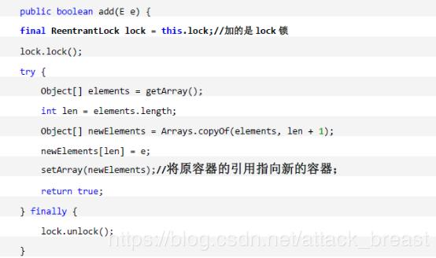

## 1. 什么是线程？线程生命周期？

 	 　线程是操作系统能够进行运算调度的最小单位，它被包含在进程之中，是进程中的实际运作单位。 

当我们在Java程序中新建一个线程时，它的状态是*New。*当我们调用线程的start()方法时，状态被改变为*Runnable*。线程调度器会为*Runnable*线程池中的线程分配CPU时间并且讲它们的状态改变为*Running。*其他的线程状态还有*Waiting，Blocked* 和*Dead*。 

**用Runnable还是Thread？**

 Java不支持类的多重继承，但允许你调用多个接口。所以如果你要继承其他类，当然是调用Runnable接口好了 

## 2. Runnable和Callable有什么不同？

　　Runnable和Callable都代表那些要在不同的线程中执行的任务。Runnable从JDK1.0开始就有了，Callable是在JDK1.5增加的。它们的主要区别是Callable的 call() 方法可以返回值和抛出异常，而Runnable的run()方法没有这些功能。Callable可以返回装载有计算结果的Future对象

## 3. 如何确保main()方法所在的线程是Java程序最后结束的线程？

我们可以使用Thread类的joint()方法来确保所有程序创建的线程在main()方法退出前结束。这里有一篇文章关于[Thread类的joint()方法](http://www.journaldev.com/1024/java-thread-join-example-with-explanation)。

## 4. 为什么线程通信的方法wait(), notify()和notifyAll()被定义在Object类里？

 一个很明显的原因是JAVA提供的锁是对象级的而不是线程级的，每个对象都有锁，通过线程获得。如果线程需要等待某些锁那么调用对象中的wait()方法就有意义了。如果wait()方法定义在Thread类中，线程正在等待的是哪个锁就不明显了。简单的说，由于wait，notify和notifyAll都是锁级别的操作，所以把他们定义在Object类中因为锁属于对象。 

**为什么wait(), notify()和notifyAll()必须在同步方法或者同步块中被调用**

 当一个线程需要调用对象的wait()方法的时候，这个线程必须拥有该对象的锁，接着它就会释放这个对象锁并进入等待状态直到其他线程调用这个对象上的notify()方法。同样的，当一个线程需要调用对象的notify()方法时，它会释放这个对象的锁，以便其他在等待的线程就可以得到这个对象锁。由于所有的这些方法都需要线程持有对象的锁，这样就只能通过同步来实现，所以他们只能在同步方法或者同步块中被调用。 

##  5. 为什么Thread类的sleep()和yield()方法是静态的？

Thread类的sleep()和yield()方法将在当前正在执行的线程上运行。所以在其他处于等待状态的线程上调用这些方法是没有意义的。这就是为什么这些方法是静态的。它们可以在当前正在执行的线程中工作，并避免程序员错误的认为可以在其他非运行线程调用这些方法。

## 6. 什么是Java线程转储(Thread Dump)，如何得到它？

线程转储是一个JVM活动线程的列表，它对于分析系统瓶颈和死锁非常有用。有很多方法可以获取线程转储——使用Profiler，Kill -3命令，jstack工具等等。我更喜欢jstack工具，因为它容易使用并且是JDK自带的。由于它是一个基于终端的工具，所以我们可以编写一些脚本去定时的产生线程转储以待分析。读这篇文档可以了解更多关于[产生线程转储](http://www.journaldev.com/1053/how-to-generate-thread-dump-in-java)的知识。

##  7. 什么是Java Timer类？如何创建一个有特定时间间隔的任务？

java.util.Timer是一个工具类，可以用于安排一个线程在未来的某个特定时间执行。Timer类可以用安排一次性任务或者周期任务。

java.util.TimerTask是一个实现了Runnable接口的抽象类，我们需要去继承这个类来创建我们自己的定时任务并使用Timer去安排它的执行。

## 8. 什么是阻塞队列？如何使用阻塞队列来实现生产者-消费者模型？

java.util.concurrent.BlockingQueue的特性是：当队列是空的时，从队列中获取或删除元素的操作将会被阻塞，或者当队列是满时，往队列里添加元素的操作会被阻塞。

阻塞队列不接受空值，当你尝试向队列中添加空值的时候，它会抛出NullPointerException。

阻塞队列的实现都是线程安全的，所有的查询方法都是原子的并且使用了内部锁或者其他形式的并发控制。

BlockingQueue 接口是java collections框架的一部分，它主要用于实现生产者-消费者问题。

#### Java中什么是竞态条件？ 举个例子说明。

　　竞态条件会导致程序在并发情况下出现一些bugs。多线程对一些资源的竞争的时候就会产生竞态条件，如果首先要执行的程序竞争失败排到后面执行了，那么整个程序就会出现一些不确定的bugs。这种bugs很难发现而且会重复出现，因为线程间的随机竞争。一个例子就是无序处理，

## 9. 为什么说ConcurrentHashMap是弱一致性的？以及为何多个线程并发修改ConcurrentHashMap时不会报ConcurrentModificationException？

①get方法：正是因为get 操作几乎所有时候都是一个无锁操作（get 中有一个readValueUnderLock 调用，不过这句执行到的几率极小），使得同一个Segment 实例上的put 和get 可以同时进行，这就是get 操作是弱一致的根本原因。（说白了就是虽然有readValueUnderLock调用，但执行到的几率极小，也就是一个无锁操作）

②clear方法：因为没有全局的锁，在清除完一个segment 之后，正在清理下一个segment 的时候，已经清理的***\*segment\**** 可能又被加入了数据，因此***\*clear\****返回的时候，***\*ConcurrentHashMap\**** 中是可能存在数据的。因此，***\*clear\**** 方法是弱一致的。

③迭代器：在遍历过程中，如果已经遍历的数组上的内容变化了，迭代器不会抛出ConcurrentModificationException 异常。如果未遍历的数组上的内容发生了变化，则有可能反映到迭代过程中。这就是ConcurrentHashMap 迭代器弱一致的表现。在这种迭代方式中，当iterator 被创建后，集合再发生改变就不再是抛出ConcurrentModificationException，取而代之的是在改变时new 新的数据从而不影响原有的数据，iterator 完成后再将头指针替换为新的数据，这样iterator 线程可以使用原来老的数据，而写线程也可以并发的完成改变，更重要的，这保证了多个线程并发执行的连续性和扩展性，是性能提升的关键。

总结：ConcurrentHashMap 的弱一致性主要是为了提升效率，是一致性与效率之间的一种权衡。要成为强一致性，就得到处使用锁，甚至是全局锁，这就与Hashtable 和同步的HashMap 一样了

## 10. Java中什么是竞态条件？ 举个例子说明。

　　竞态条件会导致程序在并发情况下出现一些bugs。多线程对一些资源的竞争的时候就会产生竞态条件，如果首先要执行的程序竞争失败排到后面执行了，那么整个程序就会出现一些不确定的bugs。这种bugs很难发现而且会重复出现，因为线程间的随机竞争。一个例子就是无序处理，

## 11. Java中如何停止一个线程

* 使用退出标志，使线程正常退出，也就是当 run() 方法完成后线程中止。
* 使用 stop() 方法强行终止线程，但是不推荐使用这个方法，该方法已被弃用。
* 使用 interrupt 方法中断线程。

## 12. 一个线程运行时发生异常会怎样？

Java中Throwable分为Exception和Error： 

* 出现Error的情况下，程序会停止运行。 
  Exception分为RuntimeException和非运行时异常。 
* 非运行时异常必须处理，比如thread中sleep()时，必须处理InterruptedException异常，才能通过编译。 
* 而RuntimeException可以处理也可以不处理，因为编译并不能检测该类异常，比如NullPointerException、ArithmeticException）和 ArrayIndexOutOfBoundException等。（运行时异常在编译阶段是无法检测出来的，非运行时异常在编译阶段是可以检测出来的，比如你使用了一个sleep()函数，会强制要求你throws，并且try catch）

由此题目所诉情形下发生的应该是RuntimeException，属于未检测异常，编译器不会检查该异常，可以处理，也可不处理。 
所以这里存在两种情形： 

① 如果该异常被捕获或抛出，则程序继续运行。 
② 如果异常没有被捕获该线程将会停止执行。 

Thread.UncaughtExceptionHandler是用于处理未捕获异常造成线程突然中断情况的一个内嵌接口。当一个未捕获异常将造成线程中断的时候JVM会使用Thread.getUncaughtExceptionHandler()来查询线程的UncaughtExceptionHandler，并将线程和异常作为参数传递给handler的uncaughtException()方法进行处理

## 13. 如何在两个线程间共享数据？

 你可以通过共享对象来实现这个目的，或者是使用像阻塞队列这样并发的数据结构。 

## 14. Java中interrupted 和 isInterruptedd方法的区别？

 　　*interrupted()* 和 *isInterrupted()*的主要区别是前者会将中断状态清除而后者不会。Java多线程的中断机制是用内部标识来实现的，调用*Thread.interrupt()*来中断一个线程就会设置中断标识为true。当中断线程调用[静态方法](http://java67.blogspot.com/2012/11/what-is-static-class-variable-method.html)*Thread.interrupted()*来检查中断状态时，中断状态会被清零。而非静态方法isInterrupted()用来查询其它线程的中断状态且不会改变中断状态标识。简单的说就是任何抛出InterruptedException异常的方法都会将中断状态清零。无论如何，一个线程的中断状态有有可能被其它线程调用中断来改变。 

## 15.如何写代码来解决生产者消费者问题？

 　在现实中你解决的许多线程问题都属于生产者消费者模型，就是一个线程生产任务供其它线程进行消费，你必须知道怎么进行线程间通信来解决这个问题。比较低级的办法是用wait和notify来解决这个问题，比较赞的办法是用Semaphore 或者 BlockingQueue来实现生产者消费者模型，[这篇教程](http://javarevisited.blogspot.sg/2012/02/producer-consumer-design-pattern-with.html)有实现它。 

## 16.怎么检测一个线程是否拥有锁？

 在java.lang.Thread中有一个方法叫holdsLock()，它返回true如果当且仅当当前线程拥有某个具体对象的锁。 

 **你如何在Java中获取线程堆栈？**

 当你获取线程堆栈时，JVM会把所有线程的状态存到日志文件或者输出到控制台。在Windows你可以使用Ctrl + Break组合键来获取线程堆栈，Linux下用kill -3命令 

**JVM中哪个参数是用来控制线程的栈堆栈小的**

　　这个问题很简单， -Xss参数用来控制线程的堆栈大小

## 17.有三个线程T1，T2，T3，怎么确保它们按顺序执行？

　　在多线程中有多种方法让线程按特定顺序执行，你可以用线程类的join()方法在一个线程中启动另一个线程，另外一个线程完成该线程继续执行。为了确保三个线程的顺序你应该先启动最后一个(T3调用T2，T2调用T1)，这样T1就会先完成而T3最后完成

##  18.Thread类中的yield方法有什么作用？

　　Yield方法可以暂停当前正在执行的线程对象，让其它有相同优先级的线程执行

## 19.如果你提交任务时，线程池队列已满。会时发会生什么？

　　这个问题问得很狡猾，许多程序员会认为该任务会阻塞直到线程池队列有空位。事实上如果一个任务不能被调度执行那么ThreadPoolExecutor’s submit()方法将会抛出一个RejectedExecutionException异常。

## 20.Java线程池中submit() 和 execute()方法有什么区别？

　　两个方法都可以向线程池提交任务，execute()方法的返回类型是void，它定义在Executor接口中, 而submit()方法可以返回持有计算结果的Future对象，它定义在ExecutorService接口中，它扩展了Executor接口，其它线程池类像ThreadPoolExecutor和ScheduledThreadPoolExecutor都有这些方法。

## 21.什么是阻塞式方法？

　　阻塞式方法是指程序会一直等待该方法完成期间不做其他事情，ServerSocket的accept()方法就是一直等待客户端连接。这里的阻塞是指调用结果返回之前，当前线程会被挂起，直到得到结果之后才会返回。此外，还有异步和非阻塞式方法在任务完成前就返回。

## 22.如果同步块内的线程抛出异常会发生什么？

 无论你的同步块是正常还是异常退出的，里面的线程都会释放锁，所以对比锁接口我更喜欢同步块，因为它不用我花费精力去释放锁，该功能可以在[finally block](http://javarevisited.blogspot.com/2012/11/difference-between-final-finally-and-finalize-java.html)里释放锁实现。 

## 23.如何在Java中创建线程安全的Singleton？单例模式的双检锁是什么？

## 24.写出3条你遵循的多线程最佳实践

- 给你的线程起个有意义的名字。 这样可以方便找bug或追踪。OrderProcessor, QuoteProcessor or TradeProcessor 这种名字比 Thread-1. Thread-2 and Thread-3 好多了，给线程起一个和它要完成的任务相关的名字，所有的主要框架甚至JDK都遵循这个最佳实践。
- 避免锁定和缩小同步的范围 锁花费的代价高昂且上下文切换更耗费时间空间，试试最低限度的使用同步和锁，缩小临界区。因此相对于同步方法我更喜欢同步块，它给我拥有对锁的绝对控制权。
- 多用同步类少用wait 和 notify 首先，CountDownLatch, Semaphore, CyclicBarrier 和 Exchanger 这些同步类简化了编码操作，而用wait和notify很难实现对复杂控制流的控制。其次，这些类是由最好的企业编写和维护在后续的JDK中它们还会不断优化和完善，使用这些更高等级的同步工具你的程序可以不费吹灰之力获得优化。
- 多用并发集合少用同步集合 这是另外一个容易遵循且受益巨大的最佳实践，并发集合比同步集合的可扩展性更好，所以在并发编程时使用并发集合效果更好。如果下一次你需要用到map，你应该首先想到用ConcurrentHashMap。我的文章[Java并发集合](http://javarevisited.blogspot.com/2013/02/concurrent-collections-from-jdk-56-java-example-tutorial.html)有更详细的说明。

## 25.内存屏障

 内存屏障有2 个作用：①先于这个内存屏障的指令必须先执行，后于这个内存屏障的指令必须后执行。②使得内存可见性。 

## 26. JAVA自带同步容器类以及它们的缺陷

在Java 中，同步容器主要包括2 类：

①Vector、HashTable。

②Collections 类中提供的静态工厂方法创建的类：Collections.synchronizedXXX()。

***\**\*缺陷\*\**\***

②性能问题：在有多个线程进行访问时，如果多个线程都只是进行读取操作，那么每个时刻就只能有一个线程进行读取，其他线程便只能等待，这些线程必须竞争同一把锁。

②ConcurrentModificationException 异常：在对Vector 等容器进行迭代修改时，会报ConcurrentModificationException 异常。但是在并发容器中（如ConcurrentHashMap，CopyOnWriteArrayList 等）不会出现这个问题。

## 27. CopyOnWriteArrayList的实现原理

 CopyOnWrite 容器即写时复制的容器，也就是当我们往一个容器添加元素的时候，不直接往当前容器添加而是先将当前容器进行Copy，复制出一个新的容器，然后新的容器里添加元素，添加完元素之后，再将原容器的引用指向新的容器（改变引用的指向）。这样做的好处是我们可以对CopyOnWrite容器进行并发的读而不需要加锁，因为当前容器不会添加任何元素。所以CopyOnWrite 容器也是一种读写分离的思想，读和写在不同的容器上进行，注意，写的时候需要加锁。 

***\**\*add方法\*\**\***

以下代码是向CopyOnWriteArrayList 中add 方法的实现，可以发现在添加的时候是需要加锁的，否则多线程写的时候会Copy 出N 个副本出来。

在CopyOnWriteArrayList 里处理写操作（包括add、remove、set 等）是先将原始的数据通过Arrays.copyof()来生成一份新的数组，然后在新的数据对象上进行写，写完后再将原来的引用指向到当前这个数据对象，这样保证了每次写都是在新的对象上。然后读的时候就是在引用的当前对象上进行读（包括get，iterator 等），不存在加锁和阻塞。CopyOnWriteArrayList 中写操作需要大面积复制数组，所以性能肯定很差，但是读操作因为操作的对象和写操作不是同一个对象，读之间也不需要加锁，读和写之间的同步处理只是在写完后通过一个简单的“=”将引用指向新的数组对象上来，这个几乎不需要时间，这样读操作就很快很安全，适合在多线程里使用。

（说白了就是同时进行read和write的时候，两者互不干扰，只是最后通过“=”来更改下指向即可）

***\**\*read方法\*\**\***

读的时候不需要加锁， 如果读的时候有线程正在向CopyOnWriteArrayList 添加数据，读还是会读到旧的数据（在原容器中进行读）。

***\**\*缺点\*\**\***

内存占用问题和数据一致性问题。

①内存占用问题：因为CopyOnWrite 的写时复制机制，所以在进行写操作的时候，内存里会同时驻扎两个对象的内存，旧的对象和新写入的对象。针对内存占用问题，可以

A通过压缩容器中的元素的方法来减少大对象的内存消耗，比如，如果元素全是10 进制的数字，可以考虑把它压缩成36 进制或64 进制。

B不使用CopyOnWrite 容器而使用其他的并发容器， 如ConcurrentHashMap。

②数据一致性问题：CopyOnWrite 容器只能保证数据的最终一致性，不能保证数据的实时一致性。所以如果你希望写入的数据，马上能读到，请不要使用CopyOnWrite 容器！！

# 28. Java 中堆和栈有什么不同

栈是一块和线程紧密相关的内存区域。每个线程都有自己的栈内存，用于存储本地变量，方法参数和栈调用，一个线程中存储的变量对其它线程是不可见的。而堆是所有线程共享的一片公用内存区域。对象都在堆里创建，为了提升效率线程会从堆中弄一个缓存到自己的栈（这里指的是主存与CPU高速缓存），如果多个线程使用该变量就可能引发问题，这时volatile 变量就可以发挥作用了，它要求线程从主存中读取变量的值。

## 29.如果不用锁机制如何实现共享数据访问。

无锁化编程的常用方法：硬件CPU 同步原语CAS（Compare a

nd Swap），如无锁栈，无锁队列（ConcurrentLinkedQueue）等等。现在几乎所有的CPU 指令都支持CAS 的原子操作，X86 下对应的是CMPXCHG 汇编指令，处理器执行CMPXCHG 指令是一个原子性操作。有了这个原子操作，我们就可以用其来实现各种无锁（lock free）的数据结构。

CAS 实现了区别于sychronized 同步锁的一种乐观锁，当多个线程尝试使用CAS 同时更新同一个变量时，只有其中一个线程能更新变量的值，而其它线程都失败，失败的线程并不会被挂起，而是被告知这次竞争中失败，并可以再次尝试。CAS 有3 个操作数，内存值V，旧的预期值A，要修改后的新值B。当且仅当预期值A 和内存值V 相同时，将内存值V 修改为B，否则什么都不做。其实CAS 也算是有锁操作，只不过是由CPU 来触发，比synchronized 性能好的多。CAS 的关键点在于，系统在硬件层面保证了比较并交换操作的原子性，处理器使用基于对缓存加锁或总线加锁的方式来实现多处理器之间的原子操作。CAS 是非阻塞算法的一种常见实现。

Atomic 包提供了一系列原子类。这些类可以保证多线程环境下，当某个线程在执行atomic 的方法时，不会被其他线程打断，而别的线程就像自旋锁一样，一直等到该方法执行完成，才由JVM 从等待队列中选择一个线程执行。Atomic 类在软件层面上是非阻塞的，它的原子性其实是在硬件层面上借助相关的指令来保证的。

## synchronized 修饰静态方法和修饰实例方法有什么不同

访问静态 synchronized 方法占用的锁是当前类的锁，而访问非静态 synchronized 方法占用的锁是当前实例对象锁

多线程问题 http://www.pianshen.com/article/883180751/ 