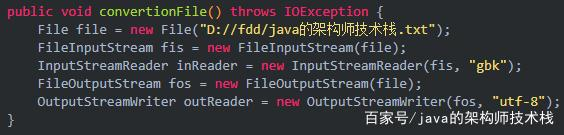
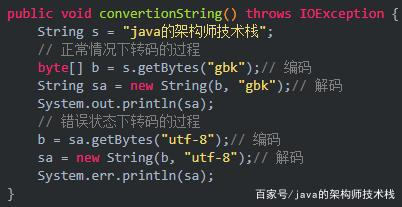
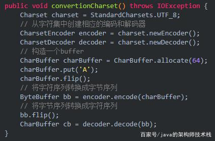

# java应用cpu使用率过高问题排查

1、先通过top命令找到消耗cpu很高的进程id假设是123

2、执行top -p 123单独监控该进程

3、在第2步的监控界面输入H，获取当前进程下的所有线程信息

4、找到消耗cpu特别高的线程编号，假设是123

5、执行jstack 123456对当前的进程做dump，输出所有的线程信息

6 将第4步得到的线程编号11354转成16进制是0x7b

7 根据第6步得到的0x7b在第5步的线程信息里面去找对应线程内容

8 解读线程信息，定位具体代码位置
————————————————
版权声明：本文为CSDN博主「小轱辘.」的原创文章，遵循 CC 4.0 BY-SA 版权协议，转载请附上原文出处链接及本声明。
原文链接：https://blog.csdn.net/qq_34944965/article/details/81107419

# Java编译运行过程

 编辑器（JDK）将你的java源代码编译成为java bytecode（就是*.class文件中的代码），也即java虚拟机的机器语言；
而java虚拟机则是java bytecode的执行平台 

- 有JVM就可以解释执行字节码文件(.class).
- JVM解释执行这些字节码文件的时候需要调用类库，如果没有这些类库JVM就不能正确的执行字节码文件，**JVM+类库=JRE,**
- 有了JRE就可以正确的执行java程序了，但是光有JRE不能开放Java程序，所以JRE+开发工具=JDK,有了JDK,就可同时开发，执行JRE.

# Java编码

使用Unicode编码模式，具体包括UTF-8,UTF-16

 UTF-8 是目前互联网上使用最广泛的一种 Unicode 编码方式，**它的最大特点就是可变长**。它可以使用 1-4 个字节表示一个字符，根据字符的不同变换长度。编码规则如下： 

1）对于单字节的符号，字节的第一位设为`0`，后面7位为这个符号的 Unicode 码。因此对于英语字母，UTF-8 编码和 ASCII 码是相同的。

2）对于`n`字节的符号（`n > 1`），第一个字节的前`n`位都设为`1`，第`n + 1`位设为`0`，后面字节的前两位一律设为`10`。剩下的没有提及的二进制位，全部为这个符号的 Unicode 码。

 http://www.ruanyifeng.com/blog/2007/10/ascii_unicode_and_utf-8.html 

转换编码方式：

* IO流

  

* String

   

* CharSet

  

# 字符串

import java.util.*;
import java.io.*;
public class Test{
 public static void main(String args[]){
  String s1=new String("abc");
  String ss1="abc";
  String s2=new String("abc");
  String ss2="abc";

  System.out.println(s1==s2);
  System.out.println(ss1==ss2);

 System.out.println("s1==ss1="+s1==ss1);

 }
}
这个程序会依次输出False和true和false；对于s1，对其定义时pool中没有"abc"，String s1=new String("abc")会先后在pool中和heap中定义"abc"，所以它创建了两个对象；而对于s2，它只在heap中定义了一个"abc"，所以它创建了一个对象；而对于ss1和ss2，他们定义的时候pool中已经有了"abc"，所以定义了0个对象。