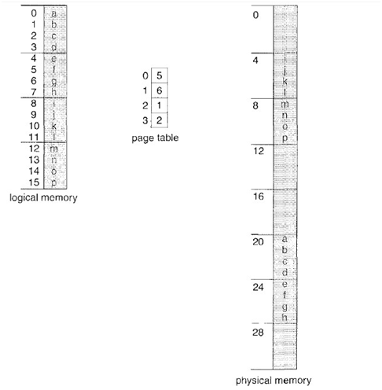
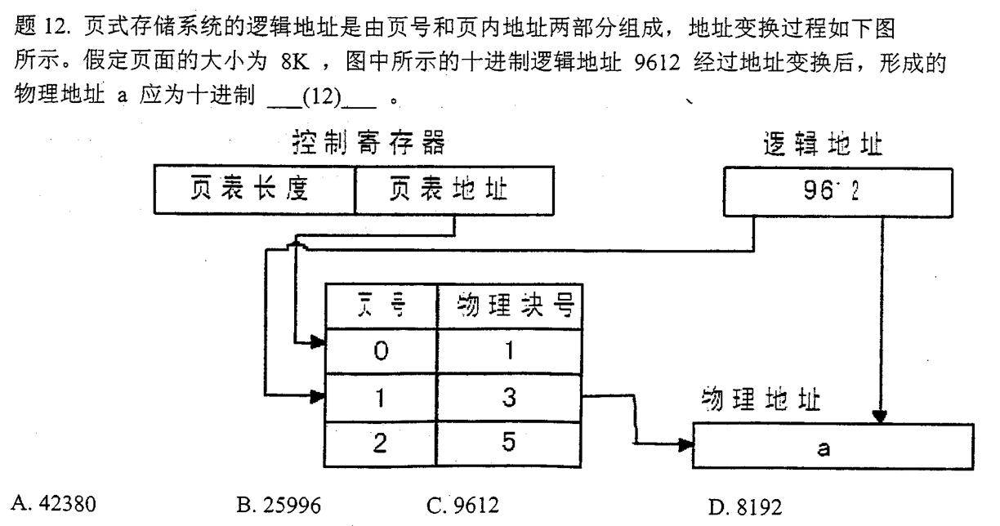

# 线程与线程的关系以及区别

1) 简而言之,一个程序至少有一个进程,一个进程至少有一个线程.

2) 线程的划分尺度小于进程，使得多线程程序的并发性高。

3) 另外，进程在执行过程中拥有独立的内存单元，而多个线程共享内存，从而极大地提高了程序的运行效率。

4) 线程在执行过程中与进程还是有区别的。每个独立的线程有一个程序运行的入口、顺序执行序列和程序的出口。但是线程不能够独立执行，必须依存在应用程序中，由应用程序提供多个线程执行控制。
5) 从逻辑角度来看，多线程的意义在于一个应用程序中，有多个执行部分可以同时执行。但操作系统并没有将多个线程看做多个独立的应用，来实现进程的调度和管理以及资源分配。这就是进程和线程的重要区别。**进程和线程的关系**

- 一个线程只能属于一个进程，而一个进程可以有多个线程，但至少有一个线程。**线程是操作系统可识别的最小执行和调度单位**
- **资源分配给进程，同一进程的所有线程共享该进程的所有资源**。 **同一进程中的多个线程共享代码段(代码和常量)，数据段(全局变量和静态变量)，扩展段(堆存储)**。但是每个线程拥有自己的栈段，栈段又叫运行时段，用来存放所有局部变量和临时变量
- **处理机分给线程，即真正在处理机上运行的是线程**
- 线程在执行过程中，需要协作同步。**不同进程的线程间要利用消息通信的办法实现同步**

# Windows下的内存是如何管理的

 **1.虚拟内存：**
最适合用来管理大型对象或者结构数组
**2.内存映射文件：**
最适合用来管理大型数据流（通常来自文件）以及在单个计算机上运行多个进程之间共享数据
**3.内存堆栈：**
最适合用来管理大量的小对象 

# 什么是临界区、如何解决冲突？

　　**每个进程中访问临界资源（变量、数组、缓冲区）的那段程序称为临界区**，每次只准许一个进程进入临界区，进入后不允许其他进程进入。如果有若干个进程要求进入空闲的临界区，一次仅允许一个进程进入。任何时候，处于临界区的进程不可多于一个。如已有进程进入自己的临界区，则其他试图进入临界区的进程必须等待。进入临界区的进程要在有限时间内退出，以便其他进程能及时进入自己的临界区。如果不能进入自己的临界区，就应该让出CPU，避免进程出现忙等等现象。

# 虚拟内存

 虚拟内存是计算机系统内存管理的一种技术。它使得应用程序认为它拥有连续可用的内存（一个连续完整的地址空间），而实际上，它通常是被分隔成多个物理内存碎片，还有部分暂时存储在外部磁盘存储器上，在需要时进行数据交换。 

# 分段和分页的区别？

* 地址不确定（分段解决）
* 空间不隔离(分段解决)
* 内存利用效率低（分页解决）

目的： 将系统内有限的物理内存如何及时有效的分配给多个程序了 

 内存管理无非就是想办法解决上面三个问题，如何使进程的地址空间隔离，如何提高内存的使用效率，如何解决程序运行时的重定位问题？ 

　　**页是信息的物理单位**，分页是为了实现离散分配方式，以减少内存的外零头，提高内存的利用率。分页仅仅是由于系统管理的需要，而不是用户的需要。
　　**段是信息的逻辑单位**，它含有一组其意义相对完整的信息。分段的目的是为了能更好的满足用户的需要。
　　页的大小固定且由系统确定，把**逻辑地址分为页号和页内地址**两部分，由机器硬件实现的。因此一个系统只能有一种大小的页面。段的长度却不固定，决定于用户所编写的程序，通常由编写程序在对源代码进行编辑时，根据信息的性质来划分。
　　分页的作业地址空间是一维的，即单一的线性空间。
　　分段的作业地址空间是二维的，程序员在标识一个地址时，既需要给出段名，又需要给出段内地址。

 举个例子， 页大小为4B，而逻辑内存为32B（8页），逻辑地址0的页号为0，页号0对应帧5，因此逻辑地址映射为物理地址5*4+0=20。逻辑地址3映射物理地址5*4+3=23。逻辑地址13(4*3+1，页号为3，偏移为1，因此帧号为2（通过查找映射表）)，映射到物理地址9。 

  

  

 根据上面的三个步骤可以很容易得到结果：物理地址 = 3 * 8 * 1024 + 9612 % 8192 = 25996 

# 进程间通信有哪些方式？它们的区别？

**1.管道（pipe）**：管道是一种半双工的通信方式，数据只能单向流动，而且只能在有血缘关系的进程间使用，进程的血缘关系通常是指父子进程关系。
**2.命名管道**（named pipe）：也是半双工的通信方式，但是它允许无亲缘关系关系进程间通信。

**3.信号**（signal）：是一种比较复杂的通信方式，用于通知接收进程某一事件已经发生。
**4.信号量**（semophere）：信号量是一个计数器，可用来控制多个进程对共享资源的访问。它通常作为一种锁机制，防止某进程正在访问共享资源时，其他进程也访问该资源。因此，主要作为进程间以及同一进程内不同线程之间的同步手段。

**5.消息队列**（message queue）:消息队列是由消息组成的链表，存放在内核中，并由消息队列标识符标识。消息队列克服了信号传递消息少，管道只能承载无格式字节流以及缓冲区大小受限等缺点。

**6.共享内存（**shared memory）:就是映射一段能被其他进程所访问的内存，这段共享内存由一个进程创建，但多个进程都可以访问，共享内存是最快的IPC方式，它是针对其他进程间的通信方式运行效率低而专门设计的。它往往与其他通信机制，如信号量等配合使用，来实现进程间的同步和通信。
**7.套接字**（socket）：套接口也是进程间的通信机制，与其他通信机制不同的是它可用于不同及其间的进程通信。

**几种方式的比较**：
管道：速度慢、容量有限
消息队列：容量收到系统限制，且要注意第一次读的时候，要考虑上一次没有读完数据的问题。
信号量：不能传递复杂信息，只能用来同步。
共享内存：能够很容易控制容量，速度快，但要保持同步，比如一个进程在写的时候，另一个进程要注意读写的问题，相当于线程中的线程安全。

# 线程间的通信机制

参考：https://blog.csdn.net/alexlee1986/article/details/21227417
1.锁机制：互斥锁、条件变量、读写锁
　互斥锁提供了以排他方式防止数据结构被并发修改的方法。
　读写锁允许多个线程同时读共享数据，而对写操作是互斥的。
　条件变量可以以原子的方式进行阻塞进程，直到某个特定条件为真为止。对条件的测试是在互斥锁的保护下进行的。条件变量始终与互斥锁一起使用。
２.信号量机制：包括无名信号量和命名线程信号量
３.信号机制：类似进程间的信号处理

# 进程间同步与互斥的区别，线程同步的方式？

互斥：指某一个资源同时只允许一个访问者对其进行访问，具有唯一性和排它性。但互斥无法限制访问者对资源的访问顺序，即访问是无序的
同步：是指在互斥的基础上（大多数情况下），通过其它机制实现访问者对资源的有序访问。大多数情况下，同步已经实现了互斥，特别是所有写入资源的情况必定是互斥的。少数情况是指可以允许多个访问者同时访问资源。
同步：体现的是一种协作性。互斥：体现的是排它性。
进程同步的主要任务：是对多个相关进程在执行次序上进行协调，以使并发执行的诸进程之间能有效地共享资源和相互合作。从而使程序的执行具有可再现性。
**同步机制遵循的原则：**
　1.空闲让进；
　2.忙则等待；
　3.有限等待；
　4.让权等待；
　　线程同步是指多个线程同时访问某资源时，采用一系列的机制以保证最多只能一个线程访问该资源。线程同步是多线程中必须考虑和解决的问题，以为很有可能发生多个线程同时访问（主要是写操作）同一资源，如果不进行线程同步，很可能会引起数据混乱，造成线程死锁等问题。
线程同步的方式：
　　临界区、互斥量、信号量、事件

# 进程的调度算法有哪些？

　1.先来先服务（FCFS）:此算法的原则是按照作业到达后备作业队列（或进程进入就绪队列）的先后次序选择作业（或进程）
　　2.短作业优先（SJF:Shortest Process First）：这种算法主要用于作业调度，它从作业后备序列中挑选所需运行时间最短的作业进入主存运行。
　　3.时间片轮转调度算法：当某个进程执行的时间片用完时，调度程序便终止该进程的执行，并将它送到就绪队列的末尾，等待分配下一时间片再执行。然后把处理机分配给就绪队列中新的队首进程，同时也让它执行一个时间片。这样就可以保证队列中的所有进程，在已给定的时间内，均能获得一时间片处理机执行时间。
　　4.高响应比优先：按照高响应比（已等待时间+要求运行时间）/要求运行时间 优先的原则，在每次选择作业投入运行时，先计算此时后备作业队列中每个作业的响应比RP。选择最大的作业投入运行。
　　5.优先权调度算法：按照进程的优先权大小来调度。使高优先权进程得到优先处理的调度策略称为优先权调度算法。注意：优先数越多，优先权越小。
　　6.多级队列调度算法：多队列调度是根据作业的性质和类型的不同，将就绪队列再分为若干个队列，所有的作业（进程）按其性质排入相应的队列中，而不同的就绪队列采用不同的调度算法。

# **为什么进程上下文切换比线程上下文切换代价高？**

 对于单核单线程CPU而言，在某一时刻只能执行一条CPU指令。上下文切换(Context Switch)是一种**将CPU资源从一个进程分配给另一个进程的机制**。从用户角度看，计算机能够并行运行多个进程，这恰恰是操作系统通过快速上下文切换造成的结果。**在切换的过程中，操作系统需要先存储当前进程的状态(包括内存空间的指针，当前执行完的指令等等)，再读入下一个进程的状态，然后执行此进程。** 

进程切换分两步：

- 切换页目录以使用新的地址空间
- 切换内核栈和硬件上下文