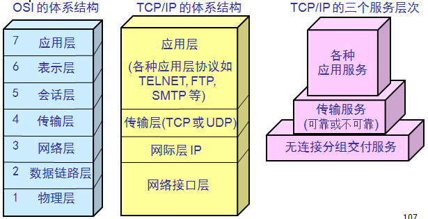
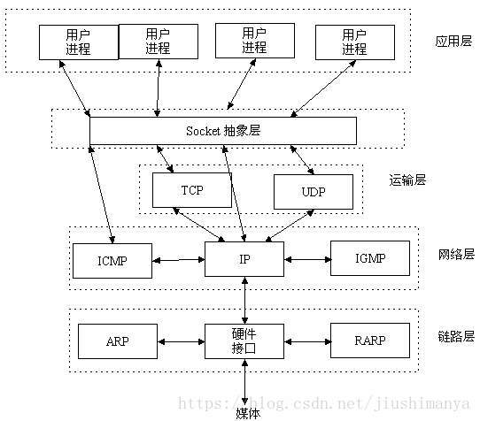
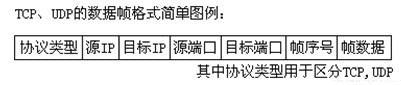
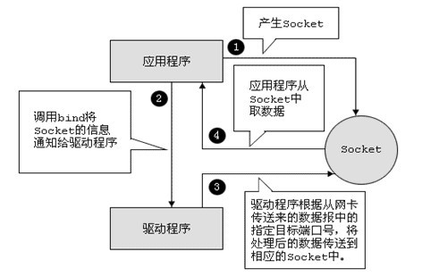
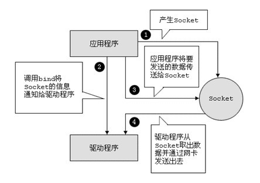
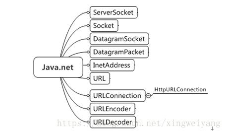
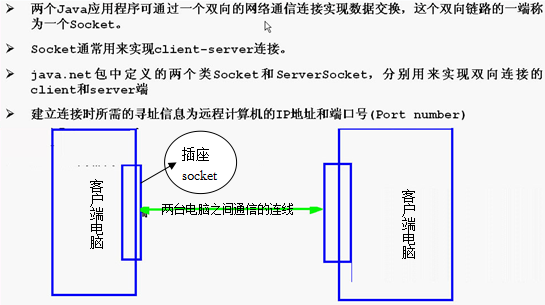
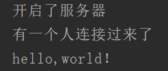

  

## 基本概念

### 1.OSI与TCP/IP体系模型



  

### 2.IP和端口

解决了文章最开始提到的定位的问题。

IP在互联网中能唯一标识一台计算机，是每一台计算机的唯一标识（身份证）；网络编程是和远程计算机的通信，所以必须先能定位到远程计算机；IP帮助解决此问题；一台计算机中可能有很多进程，具体和哪一个进程进行通信，这就得靠端口来识别；

**IP和端口能唯一定位到需要通信的进程。这里的IP表示地址，区别于IP协议。在OSI体系还是TCP/IP体系中，IP协议位于网际层，来封装IP地址到报文中。** 

###  

### 3.TCP和UDP协议

**TCP**是**Tranfer Control Protocol**的简称，是一种面向连接的保证可靠传输的协议。通过TCP协议传输，得到的是一个顺序的无差错的数据流。发送方和接收方的成对的两个socket之间必须建立连接，以便在TCP协议的基础上进行通信，当一个socket（通常都是server socket）等待建立连接时，另一个socket可以要求进行连接，一旦这两个socket连接起来，它们就可以进行双向数据传输，双方都可以进行发送或接收操作。

**UDP**是**User Datagram Protocol**的简称，是一种无连接的协议，每个数据报都是一个独立的信息，包括完整的源地址或目的地址，它在网络上以任何可能的路径传往目的地，因此能否到达目的地，到达目的地的时间以及内容的正确性都是不能被保证的。

**比较：**

UDP：

1. 每个数据报中都给出了完整的地址信息，因此无需要建立发送方和接收方的连接。
2. UDP传输数据时是有大小限制的，每个被传输的数据报必须限定在64KB之内。
3. UDP是一个不可靠的协议，发送方所发送的数据报并不一定以相同的次序到达接收方

TCP：

1. 面向连接的协议，在socket之间进行数据传输之前必然要建立连接，所以在TCP中需要连接时间。
2. TCP传输数据大小限制，一旦连接建立起来，双方的socket就可以按统一的格式传输大的数据。
3. TCP是一个可靠的协议，它确保接收方完全正确地获取发送方所发送的全部数据。

**数据桢：**



**
**

**应用：**

- **TCP**在网络通信上有极强的生命力，例如远程连接（Telnet）和文件传输（FTP）都需要不定长度的数据被可靠地传输。但是可靠的传输是要付出代价的，对数据内容正确性的检验必然占用计算机的处理时间和网络的带宽，因此TCP传输的效率不如UDP高。
- **UDP**操作简单，而且仅需要较少的监护，因此通常用于局域网高可靠性的分散系统中client/server应用程序。例如视频会议系统，并不要求音频视频数据绝对的正确，只要保证连贯性就可以了，这种情况下显然使用UDP会更合理一些。

 

### 4.Socket

Socket是语言无关标准，任何可以实现网络编程的编程语言都有socket.

Socket 是在应用程序中创建的，它是通过一种绑定机制与驱动程序建立关系，告诉自己所对应的 IP 和 Port。在网络上传输的每一个数据帧，必须包含发送者的 IP 地址和端口号。创建完 Socket 以后，应用程序写入到 Socket 的数据，由 Socket 交给驱动程序向网络上发送数据，计算机从网络上收到与某个 Socket 绑定的 IP 和 Port 相关的数据后，由驱动程序再交给 Socket ，应用程序就可以从这个 Socket 中读取接收到的数据。网络应用程序就是这样通过 Socket 发送和接收的。

**Socket数据发送过程：**



**
**

**Socket数据接收过程：**

 



### 5.常用应用层协议

应用层协议是为了解决某一类应用问题，而问题的解决又往往是通过位于不同主机中的多个应用进程之间的通信和协同工作来完成的。应用层的具体内容就是规定应用进程在通信时所遵循的协议。

## 常用类



### 1.InteAddress类

Java中的InetAddress是一个代表IP地址的封装。IP地址可以由字节数组和字符串来分别表示，InetAddress将IP地址以对象的形式进行封装，可以更方便的操作和获取其属性。InetAddress没有构造方法，可以通过两个静态方法获得它的对象。

[](javascript:void(0);)

```java
//根据主机名来获取对应的InetAddress实例
     InetAddress ip = InetAddress.getByName("www.baidu.com");
    //判断是否可达
    System.out.println("baidu是否可达：" + ip.isReachable(2000));
    //获取该InetAddress实例的IP字符串
    System.out.println(ip.getHostAddress());
    //根据原始IP地址(字节数组形式)来获取对应的InetAddress实例
        InetAddress local = InetAddress.getByAddress(new byte[]{127,0,0,1});
    System.out.println("本机是否可达：" + local.isReachable(5000));
    //获取该InetAddress实例对应的全限定域名
    System.out.println(local.getCanonicalHostName());
```

### 2.URE相关类

#### 1)URL和URLConnection类

网络中的URL（Uniform Resource Locator）是统一资源定位符的简称。它表示Internet上某一资源的地址。通过URL我们可以访问Internet上的各种网络资源，比如最常见的WWW，FTP站点。 URL可以被认为是指向互联网资源的“指针”，通过URL可以获得互联网资源相关信息，包括获得URL的InputStream对象获取资源的信息，以及一个到URL所引用远程对象的连接URLConnection。 URLConnection对象可以向所代表的URL发送请求和读取URL的资源。通常，创建一个和URL的连接，需要如下几个步骤：

1. 创建URL对象，并通过调用openConnection方法获得URLConnection对象；
2. 设置URLConnection参数和普通请求属性；
3. 向远程资源发送请求；
4. 远程资源变为可用，程序可以访问远程资源的头字段和通过输入流来读取远程资源返回的信息。

这里需要重点讨论一下第三步：如果只是发送GET方式请求，使用connect方法建立和远程资源的连接即可；如果是需要发送POST方式的请求，则需要获取URLConnection对象所对应的输出流来发送请求。这里需要注意的是，由于GET方法的参数传递方式是将参数显式追加在地址后面，那么在构造URL对象时的参数就应当是包含了参数的完整URL地址，而在获得了URLConnection对象之后，就直接调用connect方法即可发送请求。而POST方法传递参数时仅仅需要页面URL，而参数通过需要通过输出流来传递。另外还需要设置头字段。以下是两种方式的代码：

```java
//1. 向指定URL发送GET方法的请求
 String urlName = url + "?" + param;
 URL realUrl = new URL(urlName);
 //打开和URL之间的连接
 URLConnection conn = realUrl.openConnection();
 //设置通用的请求属性
 conn.setRequestProperty("accept", "*/*");
 conn.setRequestProperty("connection", "Keep-Alive");
 conn.setRequestProperty("user-agent","Mozilla/4.0 (compatible; MSIE 6.0; Windows NT 5.1; SV1)");
 //建立实际的连接
 conn.connect();    
 //2. 向指定URL发送POST方法的请求
 URL realUrl = new URL(url);
 //打开和URL之间的连接
 URLConnection conn = realUrl.openConnection(); 
 //设置通用的请求属性
 conn.setRequestProperty("accept", "*/*");
 conn.setRequestProperty("connection", "Keep-Alive");
 conn.setRequestProperty("user-agent", "Mozilla/4.0 (compatible; MSIE 6.0; Windows NT 5.1; SV1)"); 
 //发送POST请求必须设置如下两行
 conn.setDoOutput(true);
 conn.setDoInput(true);
 //获取URLConnection对象对应的输出流
 out = new PrintWriter(conn.getOutputStream());
 //发送请求参数
 out.print(param);
```

#### 2)URLDecoder和URLEncoder

 这两个类可以别用于将application/x-www-form-urlencoded MIME类型的字符串转换为普通字符串，将普通字符串转换为这类特殊型的字符串。使用URLDecoder类的静态方法decode()用于解码，URLEncoder类的静态方法encode()用于编码。具体使用方法如下： 

```java
//将application/x-www-form-urlencoded字符串转换成普通字符串  
String keyWord = URLDecoder.decode("%E6%9D%8E%E5%88%9A+j2ee", "UTF-8");  
System.out.println(keyWord);  
//将普通字符串转换成  application/x-www-form-urlencoded字符串  
String urlStr = URLEncoder.encode( "ROR敏捷开发最佳指南" , "GBK");  
System.out.println(urlStr);
```


## 3.Socket相关类

一般的网络编程都称为Socket编程，Socket的英文意思是“插座”。

  

两台电脑都安装上一个插座，然后使用一根线的两端插到两台电脑的插座上，这样两台电脑就建立好了连接。这个插座就是Socket。

因为互相之间都能互相通信，我说你是我的Server只是从逻辑意义上来讲，我应该把东西先发到你那里去，然后由你来处理，转发。所以你叫Server。但从技术意义上来讲，只有TCP才会分Server和Client。对于UDP来说，从严格意义上来讲，并没有所谓的Server和Client。TCP的Server的插座就叫ServerSocket，Client的插座就叫Socket。

两台计算机互相连接，那么首先必须得知道它们的IP地址，但是只提供IP地址是不够的，还必须要有连接的端口号，也就是要连接到哪个应用程序上。

端口号是用来区分一台机器上不同的应用程序的。端口号在计算机内部是占2个字节。一台机器上最多有65536个端口号。一个应用程序可以占用多个端口号。端口号如果被一个应用程序占用了，那么其他的应用程序就无法再使用这个端口号了。记住一点，我们编写的程序要占用端口号的话占用1024以上的端口号，1024以下的端口号不要去占用，因为系统有可能会随时征用。端口号本身又分为TCP端口和UDP端口，TCP的8888端口和UDP的8888端口是完全不同的两个端口。TCP端口和UDP端口都有65536个。


### 1）TCP编程-- serverSocket 

**TCP编程：**
**需求：**完成网络登录功能

用户输入用户名密码，服务器给出登录成功或失败的提示
**分析：**

使用基于TCP协议的Socket网络编程实现
TCP协议基于请求响应模式
在网络通讯中，第一次主动发起通讯的程序被作为客户端程序
第一次通讯中等待连接的程序被称作服务器程序
利用IO流实现数据的传输
**实现**

服务器

```java
import java.io.DataInputStream;
import java.io.IOException;
import java.io.InputStream;
import java.net.ServerSocket;
import java.net.Socket;

public class TestServer {

    public static void main(String[] args) throws IOException {
        //服务器开启了一个监听端口
        ServerSocket serverSocket = new ServerSocket(6666);
        System.out.println("开启了服务器");
        while (true){
            //等待客户端连接
            Socket accept = serverSocket.accept();
            System.out.println("有一个人连接过来了");
            //获得客户端输入的东西
            InputStream inputStream = accept.getInputStream();
            //包装成DataInputStream流
            DataInputStream dataInputStream = new DataInputStream(inputStream);
            //通过流流读取消息
            String s = dataInputStream.readUTF();
            System.out.println(s);
        }
    }
}

```

**客户端**

```java
import java.io.DataOutputStream;
import java.io.IOException;
import java.net.Socket;

public class TestClient {
    public static void main(String[] args) throws IOException {
        //创建同一连接
        Socket s = new Socket("127.0.0.1",6666);
        DataOutputStream dos = new DataOutputStream(s.getOutputStream());
        dos.writeUTF("hello,world！");
    }
}

```

**运行**

  

### 2）UDP编程--DatagramSocket、DatagramPacket

**UDP编程：**
**需求**：完成在线咨询功能，学生和老师在线一对一交流
**分析：**

使用基于UDP协议的Socket网络编程实现
不需要利用IO流实现数据的传输
每个数据发送单元被统一封装成数据包的方式，发送方将数据包发送到网络中，数据包在网络中去寻找他的目的地，一切以包为中心。
UDP基本概念：

DatagramSocket：用于发送或接收数据包的套接字
DatagramPacket：数据包
实现

**接收方**

```java
import java.io.IOException;
import java.net.DatagramPacket;
import java.net.DatagramSocket;

public class PeopleOne {
    public static void main(String[] args) throws IOException {
        //1.开放一个端口
        DatagramSocket socket = new DatagramSocket(5051);
        //2.准备容器接收
        byte[] receiveBuf = new byte[100];
        //3.等待包裹容器封包
        DatagramPacket packet = new DatagramPacket(receiveBuf,receiveBuf.length);
        System.out.println("等你包裹来。。。。");
        while (true){
            //4.接收包裹
            socket.receive(packet);
            //5.解析包裹
            String receStr = new String(packet.getData(),0,packet.getLength());
            System.out.println("我收到了："+receStr);
            if (receStr.equals("exit")){
                break;
            }
        }
        //6.释放资源
        socket.close();
    }
}

```

**发送方**

```java
import java.io.IOException;
import java.net.*;
import java.util.Scanner;

public class PeopleTwo {
    public static void main(String[] args) throws IOException {
        //1.指定一个端口进行发送
        DatagramSocket socket = new DatagramSocket();
        //2.指定一个IP
        InetAddress addr = InetAddress.getByName("127.0.0.1");
        int port = 5051;
        //3.准备一个小容器
        byte[] sendBuf;
        while (true){
            Scanner scanner = new Scanner(System.in);
            System.out.println("你要发什么东西：");
            String s = scanner.nextLine();
            //4.加入要放的数据
            sendBuf = s.getBytes();
            //5.数据打包
            DatagramPacket packet = new DatagramPacket(sendBuf,sendBuf.length,addr,port);
            //6.发送包
            socket.send(packet);
            if (s.equals("exit")){
                break;
            }
        }
        //7.释放资源
        socket.close();
    }
}

```

## 4.url、httpclient、socket区别

### **UrlConnection连接和Socket连接** 

 套接字（socket）是通信的基石，是支持TCP/IP协议的网络通信的基本操作单元。它是网络通信过程中端点的抽象表示，包含进行网络通信必须的五种信息：连接使用的协议，本地主机的IP地址，本地进程的协议端口，远地主机的IP地址，远地进程的协议端口。 


使用UrlConnection比直接使用Socket要简单的多，不用关心状态和线程治理。 **UrlConnection基于Http协议**，只是进行了封装，添加了一些额外规则（如头信息），**本质上也是建立TCP连接，利用Socket实现连接和传输数据**的

UrlConnection在应用层，socket在传输层上


### **httpclient和urlConnection连接区别**

在一般情况下，如果只是需要向Web站点的某个简单页面提交请求并获取服务器响应，HttpURLConnection完全可以胜任。但在绝大部分情况下，Web站点的网页可能没这么简单，这些页面并不是通过一个简单的URL就可访问的，可能需要用户登录而且具有相应的权限才可访问该页面。在这种情况下，就需要涉及Session、Cookie的处理了，如果打算使用HttpURLConnection来处理这些细节，当然也是可能实现的，只是处理起来难度就大了。

为了更好地处理向Web站点请求，包括处理Session、Cookie等细节问题，Apache开源组织提供了一个HttpClient项目，看它的名称就知道，它是一个简单的HTTP客户端（并不是浏览器），可以用于发送HTTP请求，接收HTTP响应。但不会缓存服务器的响应，不能执行HTML页面中嵌入的Javascript代码；也不会对页面内容进行任何解析、处理。

简单来说，HttpClient就是一个增强版的HttpURLConnection，HttpURLConnection可以做的事情HttpClient全部可以做；HttpURLConnection没有提供的有些功能，HttpClient也提供了，但它只是关注于如何发送请求、接收响应，以及管理HTTP连接。

 HttpClient相比传统JDK自带的URLConnection，增加了易用性和灵活性，它不仅使客户端发送HTTP请求变得容易，而且也方便了开发人员测试接口（基于Http协议的） 

# servlet和socket区别

## 什么是servlet

维基百科上说：

> `Servlet`（Server Applet），全称`Java Servlet`，未有中文译文。是用Java编写的服务器端程序。其主要功能在于`交互式`地浏览和修改数据，生成动态Web内容。狭义的Servlet是指Java语言实现的一个`接口`，广义的Servlet是指任何`实现了这个Servlet接口的类`，一般情况下，人们将Servlet理解为后者。

简单来说，`Servlet`就是个接口，一段程序。

通过上面的介绍，可以看到，中间提到`交互式地浏览和修改数据`，这突然让我想到了前一段时间学的`socket`，通过`socket`，我们也会实现客户端和服务器的交互效果。

### 使用协议

`socket`：使用`TCP/IP`协议或`UDP`协议，前者居多。
`servlet`：从维基百科中可以看到，一般使用的是`HTTP`协议。

### 工作模式

`socket`：由于是使用的`TCP`协议，所以首先必须要做到的就是建立两端的连接，建立一条持续连接的通道。
这需要服务器端先建立起一个服务，然后由客户端去连接服务器端，这样，就建立好了一条连接，然后就可以进行随意的通信了，服务器可以发送消息给客户端，同样的客户端也可以发送消息给服务端。

整理一下:

> 1)服务器端建立服务
> 2)客户端连接服务器端
> 3)相互发送数据

然后我们在看一下`servlet`的工作模式：

由于`servlet`大多数是工作在基于http的web服务器下，所以它的模式想必大家也很熟悉了：

> 1) 客户端发送请求至服务器端；
> 2) 服务器将请求信息发送至 Servlet；
> 3) Servlet 生成响应内容并将其传给服务器。响应内容动态生成，通常取决于客户端的请求；
> 4) 服务器将响应返回给客户端。

看到这里，更加觉得两者太像了。没错的，由于两个服务协议的关系，`http`本来就是对`TCP`协议的一个封装和完善，所以其底层的数据传输还是使用`TCP`的那套东西。

对熟悉网络的朋友来说，两者只是工作层面不同的两个相互协作的过程而已。

## 参考

[Java网络编程]: https://blog.csdn.net/allenfoxxxxx/article/details/90707505
[什么是URL？及URL类和URLConn]:  http://c.biancheng.net/view/1205.html

[socket通讯原理及例程（一看就懂）]: https://blog.csdn.net/jiushimanya/article/details/82684525

[Socket和Http之间的区别和概述]: https://blog.csdn.net/weixin_41648325/article/details/79412158

[HttpURLConnection与HttpClient]: https://www.cnblogs.com/sharpest/p/7831350.html
[HttpClient介绍和简单使用流程]: https://www.cnblogs.com/kitor/p/11235762.html

[servlet和socket区别]: https://segmentfault.com/a/1190000017218231

