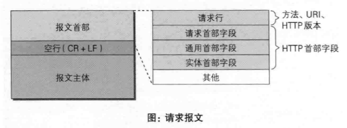
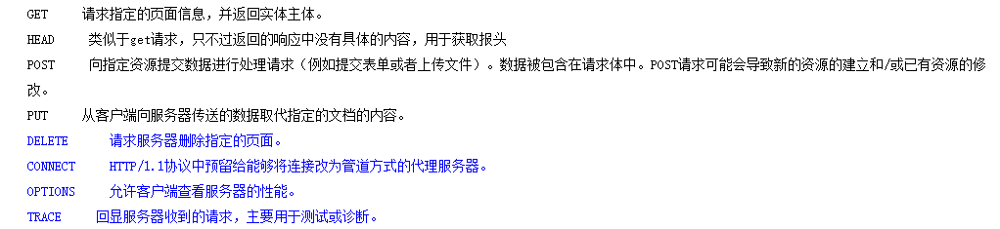
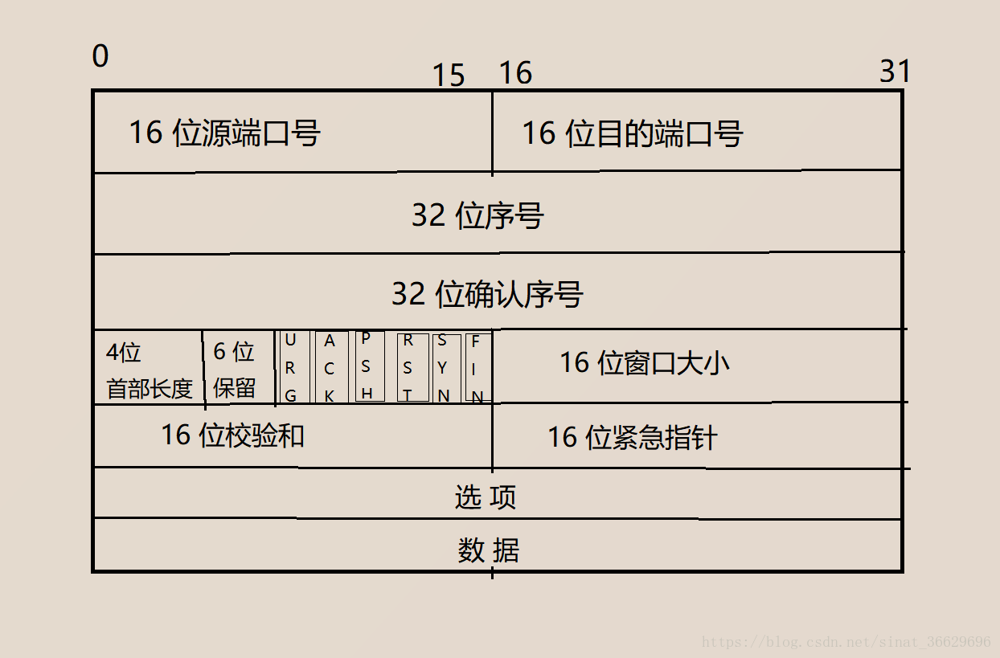
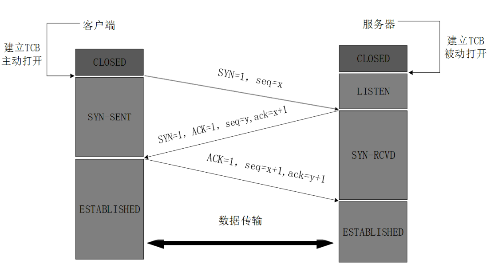
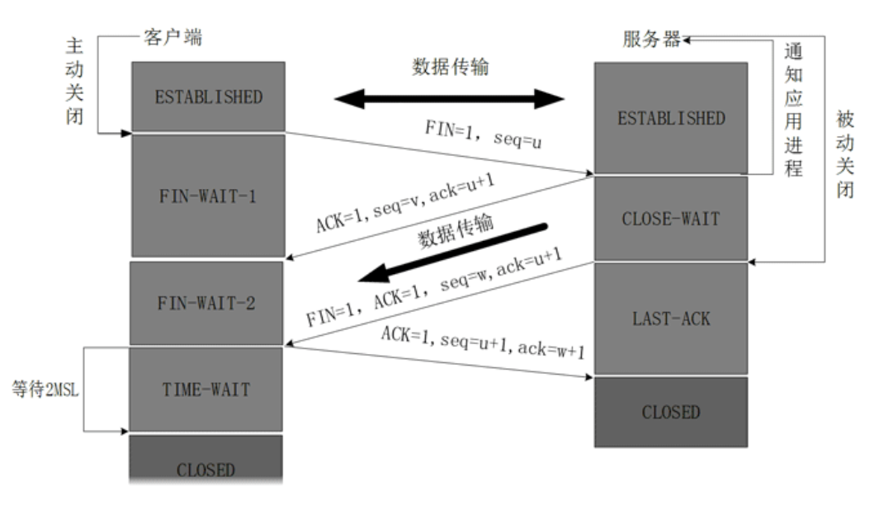

# 七层结构


# HTTP

 	HTTP是一个**应用层协议**，由请求和响应构成，是一个标准的客户端服务器模型。HTTP是一个**无状态**的协议。

 	HTTP默认的端口号为**80**，HTTPS的端口号为**443**。

 **无状态**：HTTP协议是**无状态协议**。**无状态是指协议对于事务处理没有记忆能力** 

## 请求Request



 **请求行**、**请求头部**、**空行**和**请求数据**四个部分组成 

### 请求行

请求行，用来说明请求类型,要访问的资源以及所使用的HTTP版本

>  根据HTTP标准，HTTP请求可以使用多种请求方法。
>  **HTTP1.0**定义了三种请求方法： **GET, POST** 和 **HEAD**方法。
>  **HTTP1.1**新增了五种请求方法：**OPTIONS, PUT, DELETE, TRACE 和 CONNECT** 方法。 

  


### 请求头部

 从第二行起为请求头部，HOST将指出请求的目的地.User-Agent,服务器端和客户端脚本都能访问它,它是浏览器类型检测逻辑的重要基础.该信息由你的浏览器来定义,并且在每个请求中自动发送等等 

### 空行

**请求头部后面的空行是必须的**,即使第四部分的请求数据为空，也必须有空行。

### 请求体

可添加其他请求数据

```http
GET / HTTP/1.1
Host:hackr.jp
User-Agent:Mozilla/5.0 (Windows NU 6.1;WOW64;rv:13.0) Gecko/201000 Firefor/13.0
Accept: text/html,application/xhtml+xml,application/xml;q=0.9,*/*;q=0.8
Accept-Language:ja,en-us;q=0.7,en;q=0.3
Accept-Encodeing:gzip,deflate
DNT:1
Connection:keep_alive
If-Modified-Since:Fri,31 Aug 2007 02:02:20 GMT
IF-None-Match:"45bae1-16a-46d776ac"
Cache-Control:max-age=0;
```

## 响应Response

状态行，消息报头，空行，响应正文

### 状态行

 	状态行，由HTTP**协议版本号， 状态码， 状态消息** 三部分组成。

 	第一行为状态行，（HTTP/1.1）表明HTTP版本为1.1版本，状态码为200，状态消息为（ok）

状态代码有**三位数字**组成，第一个数字定义了响应的类别，共分五种类别:

1xx：**指示信息--表示请求已接收，继续处理**

2xx：**成功--表示请求已被成功接收、理解、接受**

3xx：**重定向--要完成请求必须进行更进一步的操作**

4xx：**客户端错误--请求有语法错误或请求无法实现**

5xx：**服务器端错误--服务器未能实现合法的请求**


### 消息报头

用来说明客户端要使用的一些附加信息，第二行和第三行和第四行为消息报头，
Date:生成响应的日期和时间；Content-Type:指定了MIME类型的HTML(text/html),编码类型是ISO-8859-1 

### 空行

### 响应正文

服务器返回给客户端的文本信息。空行后面的html部分为响应正文。

# TCP

  






 https://blog.csdn.net/sinat_36629696/article/details/80740678 

