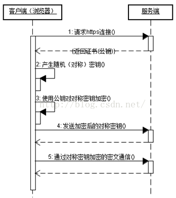
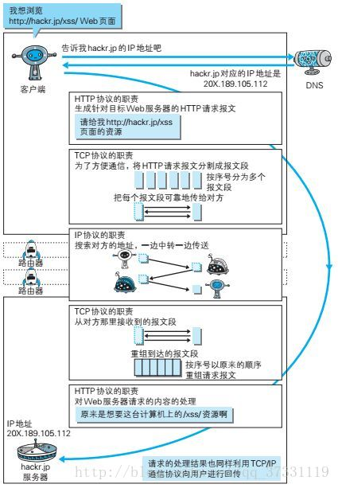
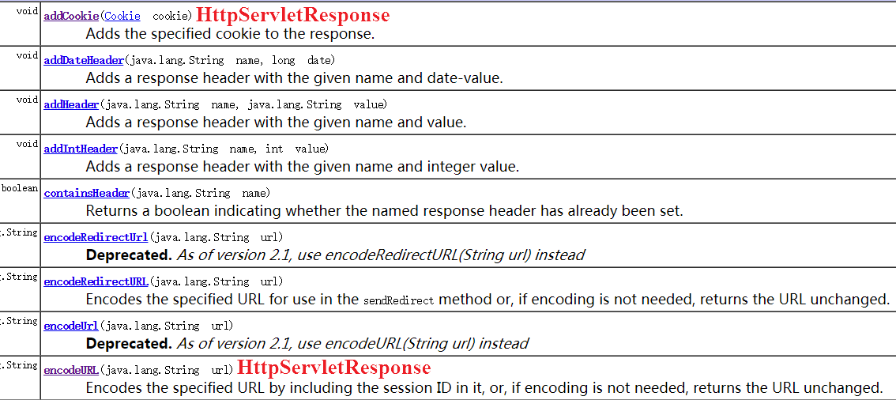
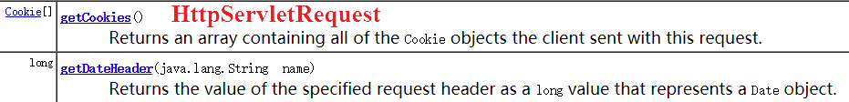
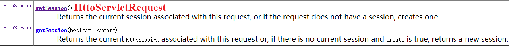
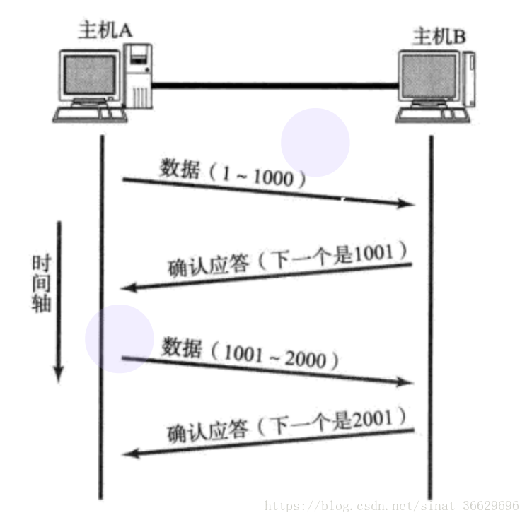
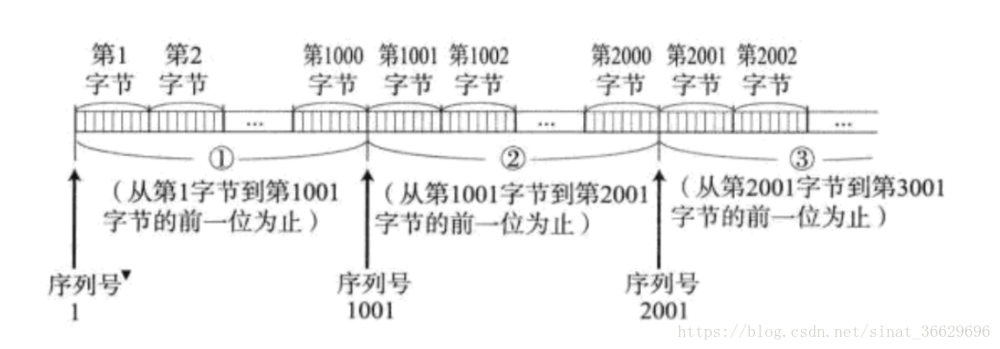
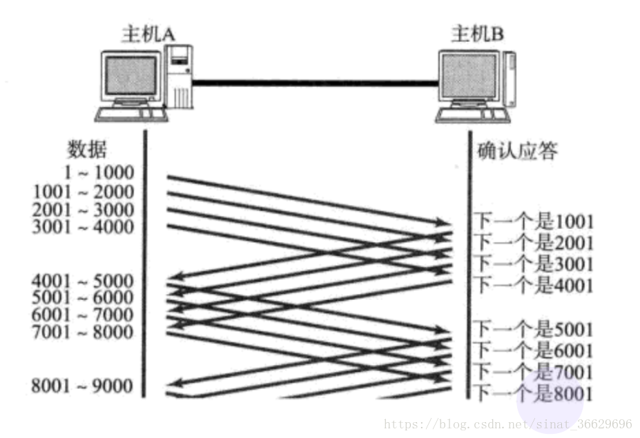
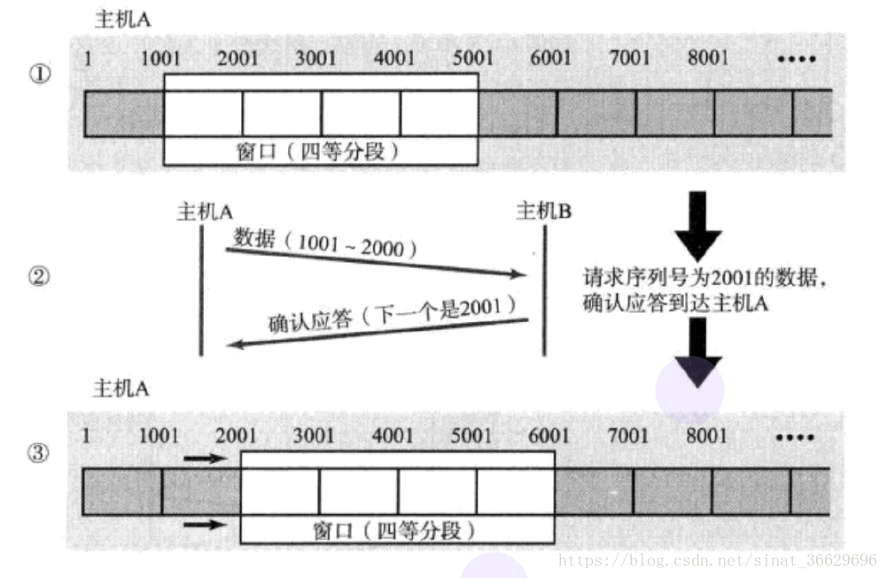

计算机网络面试 [https://github.com/Snailclimb/JavaGuide/blob/master/docs/network/%E8%AE%A1%E7%AE%97%E6%9C%BA%E7%BD%91%E7%BB%9C.md](https://github.com/Snailclimb/JavaGuide/blob/master/docs/network/计算机网络.md) 

  

### **1、Http和Https的区别**

　　Http协议运行在TCP之上，明文传输，客户端与服务器端都无法验证对方的身份；Https是身披S	SL(Secure Socket Layer)外壳的Http，运行于SSL上，SSL运行于TCP之上，是添加了加密和认证机制的HTTP。二者之间存在如下不同：

- 端口不同：Http与Http使用不同的连接方式，用的端口也不一样，前者是80，后者是443；
- 资源消耗：和HTTP通信相比，Https通信会由于加减密处理消耗更多的CPU和内存资源；
- 开销：Https通信需要证书，而证书一般需要向认证机构购买； 
  　 
  Https的加密机制是一种共享密钥加密和公开密钥加密并用的混合加密机制。

 HTTP：HyperText Transfer Protocol 超文本传输协议
HTTPS：Hypertext Transfer Protocol Secure 超文本传输安全协议
TLS：位于 HTTP 和 TCP 之间的协议，其内部有 TLS握手协议、TLS记录协议
HTTPS 经由 HTTP 进行通信，但利用 TLS 来保证安全，即 HTTPS = HTTP + TLS 

### HTTPS流程

  

 https://www.cnblogs.com/anyehome/p/8858456.html 

HTTPS协议其实就是HTTP over TSL，
基础的HTTP通信是明文的，有三大风险：信息被窃听，信息被篡改，身份的冒充。
TSL协议就是为防范这些风险存在的。TSL使用非对称加密保护下的对称加密在保证了通信效率的同时防止窃听，使用证书体系防止信息篡改和身份冒认。

注意：TSL协议握手阶段的通信是明文进行的
1.浏览器发送ClientHello
其中包含了浏览器支持的TSL协议的版本，支持的加密算法，压缩算法等。同时浏览器端生成一个随机数，一起发送给服务器。

2.服务器返回ServerHello
(1)确认TSL协议版本，确定一个双方都支持的加密算法
(2)发送服务器的证书，发送一个服务器端生成的随机数。（如果访问的网站出于安全性的考虑，要求访问者也提供证书的话会在这一步发出请求。）

3.浏览器拿到证书后验证该证书是否是可信任的，如果证书可信任，那么其中的公钥也是可信的。
(1)浏览器生成**第三个随机数 pre key，将pre key使用服务器的公钥加密**，发送回服务器
(2)编码改变通知，告知服务器接下来将使用选择的加密算法进行加密通信
(3)将此前发送过的所有信息的摘要加密后发送给服务器，供服务器进行加密通道验证。最后发出客户端握手阶段结束信号。

4.服务器接收到对方发来的pre key后，此时通信双方都拥有了三个随机数（前两个是明文发送的，第三个pre key 是非对称加密发送的），由这三个随机数双方可以计算得到两个相同的对称密钥，服务器使用这一密钥验证加密通道后，向客户端发送服务器发出：
(1)编码改变通知：告知接下来的通信将使用加密通信
(2)服务器握手阶段结束信号。

至此握手阶段结束，**双方接下来使用普通的http协议**进行通信，由**三个随机数生成的对称密钥加密**内容。
————————————————

原文链接：https://blog.csdn.net/swordman_g/article/details/90523864

### HTTP状态码

  


### **2、对称加密与非对称加密**

　　对称密钥加密是指加密和解密使用同一个密钥的方式，这种方式存在的最大问题就是密钥发送问题，即如何安全地将密钥发给对方；而非对称加密是指使用一对非对称密钥，即公钥和私钥，公钥可以随意发布，但私钥只有自己知道。发送密文的一方使用对方的公钥进行加密处理，对方接收到加密信息后，使用自己的私钥进行解密。

　　由于非对称加密的方式不需要发送用来解密的私钥，所以可以保证安全性；但是和对称加密比起来，它非常的慢，所以我们还是要用对称加密来传送消息，但对称加密所使用的密钥我们可以通过非对称加密的方式发送出去。

### **3、三次握手与四次挥手**

　(1). 三次握手(我要和你建立链接，你真的要和我建立链接么，我真的要和你建立链接，成功)：

- 第一次握手：Client将标志位SYN置为1，随机产生一个值seq=J，并将该数据包发送给Server，Client进入SYN_SENT状态，等待Server确认。

- 第二次握手：Server收到数据包后由标志位SYN=1知道Client请求建立连接，Server将标志位SYN和ACK都置为1，ack=J+1，随机产生一个值seq=K，并将该数据包发送给Client以确认连接请求，Server进入SYN_RCVD状态。

- 第三次握手：Client收到确认后，检查ack是否为J+1，ACK是否为1，如果正确则将标志位ACK置为1，ack=K+1，并将该数据包发送给Server，Server检查ack是否为K+1，ACK是否为1，如果正确则连接建立成功，Client和Server进入ESTABLISHED状态，完成三次握手，随后Client与Server之间可以开始传输数据了。

  　　　　

------

　(2). 四次挥手(我要和你断开链接；好的，断吧。我也要和你断开链接；好的，断吧)：

- 第一次挥手：Client发送一个FIN，**用来关闭Client到Server的数据传送**，Client进入FIN_WAIT_1状态。

- 第二次挥手：Server收到FIN后，发送一个ACK给Client，确认序号为收到序号+1（与SYN相同，一个FIN占用一个序号），Server进入CLOSE_WAIT状态。此时TCP链接处于半关闭状态，即客户端已经没有要发送的数据了，但服务端若发送数据，则客户端仍要接收。

- 第三次挥手：Server发送一个FIN，**用来关闭Server到Client的数据传送**，Server进入LAST_ACK状态。

- 第四次挥手：Client收到FIN后，Client进入TIME_WAIT状态，接着发送一个ACK给Server，确认序号为收到序号+1，Server进入CLOSED状态，完成四次挥手。

  　　　　

### time_wait

***1.time_wait状态是什么\***

> 简单来说：time_wait状态是四次挥手中server向client发送FIN终止连接后进入的状态。


***2.为什么会有time_wait状态\***

> time_wait存在的原因有两点
> 1.可靠的终止TCP连接。
> 2.保证让迟来的TCP报文段有足够的时间被识别并丢弃。
>
> 
>
> 1.可靠的终止TCP连接，**若处于time_wait的client发送给server确认报文段丢失的话，server将在此又一次发送FIN报文段**，那么client必须处于一个可接收的状态就是time_wait而不是close状态。
> 2.保证迟来的TCP报文段有足够的时间被识别并丢弃，linux 中一个TCPport不能打开两次或两次以上。当client处于time_wait状态时我们将无法使用此port建立新连接，假设不存在time_wait状态，新连接可能会收到旧连接的数据。
>
> time_wait持续的时间是2MSL，保证旧的数据能够丢弃。由于网络中的数据最大存在MSL(maxinum segment lifetime)

------

***3.哪一方会有time_wait状态\***

> time_wait状态是一般有client的状态。
>
> 并且会占用port
> 有时产生在server端，由于server主动断开连接或者发生异常


 https://www.cnblogs.com/mfmdaoyou/p/6715422.html 


### 4、为什么TCP链接需要三次握手，两次不可以么，为什么？**

　　为了防止 **已失效的链接请求报文突然又传送到了服务端**，因而产生错误。

　　客户端发出的连接请求报文并未丢失，而是在某个网络节点长时间滞留了，以致延误到链接释放以后的某个时间才到达Server。这是，Server误以为这是Client发出的一个新的链接请求，于是就向客户端发送确认数据包，同意建立链接。若不采用“三次握手”，那么只要Server发出确认数据包，新的链接就建立了。由于client此时并未发出建立链接的请求，所以其不会理睬Server的确认，也不与Server通信；而这时Server一直在等待Client的请求，这样Server就白白浪费了一定的资源。若采用“三次握手”，在这种情况下，由于Server端没有收到来自客户端的确认，则就会知道Client并没有要求建立请求，就不会建立链接。


### 为什么连接的时候是三次握手，关闭的时候却是四次握手？

答：因为当Server端收到Client端的SYN连接请求报文后，可以直接发送SYN+ACK报文。其中ACK报文是用来应答的，SYN报文是用来同步的。但是关闭连接时，当Server端收到FIN报文时，很可能并不会立即关闭SOCKET，所以只能先回复一个ACK报文，告诉Client端，"你发的FIN报文我收到了"。只有等到我Server端所有的报文都发送完了，我才能发送FIN报文，因此不能一起发送。故需要四步握手。 

### **5、TCP协议如何来保证传输的可靠性**

　　TCP提供一种面向连接的、可靠的字节流服务。其中，面向连接意味着两个使用TCP的应用（通常是一个客户和一个服务器）在彼此交换数据之前必须先建立一个TCP连接。在一个TCP连接中，仅有两方进行彼此通信；而字节流服务意味着两个应用程序通过TCP链接交换8bit字节构成的字节流，TCP不在字节流中插入记录标识符。

　　**对于可靠性，TCP通过以下方式进行保证：**

- 数据包校验：目的是检测数据在传输过程中的任何变化，若校验出包有错，则丢弃报文段并且不给出响应，这时TCP发送数据端超时后会重发数据；
- 对失序数据包重排序：既然TCP报文段作为IP数据报来传输，而IP数据报的到达可能会失序，因此TCP报文段的到达也可能会失序。TCP将对失序数据进行重新排序，然后才交给应用层；
- 丢弃重复数据：对于重复数据，能够丢弃重复数据；
- 应答机制：当TCP收到发自TCP连接另一端的数据，它将发送一个确认。这个确认不是立即发送，通常将推迟几分之一秒；
- 超时重发：当TCP发出一个段后，它启动一个定时器，等待目的端确认收到这个报文段。如果不能及时收到一个确认，将重发这个报文段；
- 流量控制：TCP连接的每一方都有固定大小的缓冲空间。TCP的接收端只允许另一端发送接收端缓冲区所能接纳的数据，这可以防止较快主机致使较慢主机的缓冲区溢出，这就是流量控制。TCP使用的流量控制协议是可变大小的滑动窗口协议。

### **6、客户端不断进行请求链接会怎样？DDos(Distributed Denial of Service)攻击？**

　　服务器端会为每个请求创建一个链接，并向其发送确认报文，然后等待客户端进行确认

1)、DDos 攻击

- 客户端向服务端发送请求链接数据包
- 服务端向客户端发送确认数据包
- 客户端不向服务端发送确认数据包，服务器一直等待来自客户端的确认

------

2)、DDos 预防 **( 没有彻底根治的办法，除非不使用TCP )**

- 限制同时打开SYN半链接的数目
- 缩短SYN半链接的Time out 时间
- 关闭不必要的服务

### **7、Get与POST的区别**

　　GET与POST是我们常用的两种HTTP Method，二者之间的区别主要包括如下五个方面：

(1). 从功能上讲，GET一般用来从服务器上获取资源，POST一般用来更新服务器上的资源；

(2). 从REST服务角度上说，GET是幂等的，即读取同一个资源，总是得到相同的数据，而POST不是幂等的，因为每次请求对资源的改变并不是相同的；进一步地，GET不会改变服务器上的资源，而POST会对服务器资源进行改变；

(3). 从请求参数形式上看，GET请求的数据会附在URL之后，即将请求数据放置在HTTP报文的 请求头 中，以?分割URL和传输数据，参数之间以&相连。特别地，如果数据是英文字母/数字，原样发送；否则，会将其编码为 application/x-www-form-urlencoded MIME 字符串(如果是空格，转换为+，如果是中文/其他字符，则直接把字符串用BASE64加密，得出如：%E4%BD%A0%E5%A5%BD，其中％XX中的XX为该符号以16进制表示的ASCII)；而POST请求会把提交的数据则放置在是HTTP请求报文的 请求体 中。

(4). 就安全性而言，POST的安全性要比GET的安全性高，因为GET请求提交的数据将明文出现在URL上，而且POST请求参数则被包装到请求体中，相对更安全。

(5). 从请求的大小看，GET请求的长度受限于浏览器或服务器对URL长度的限制，允许发送的数据量比较小，而POST请求则是没有大小限制的。

------

1). GET请求中URL编码的意义

　　我们知道，在GET请求中会对URL中非西文字符进行编码，这样做的目的就是为了 **避免歧义**。看下面的例子，

　　针对“name1=value1&name2=value2”的例子，我们来谈一下数据从客户端到服务端的解析过程。首先，上述字符串在计算机中用ASCII吗表示为：

```text
   6E616D6531 3D 76616C756531 26 6E616D6532 3D 76616C756532   6E616D6531：name1    3D：=    76616C756531：value1    26：&   6E616D6532：name2    3D：=    76616C756532：value2 12345678
```

- 1
- 2
- 3
- 4
- 5
- 6
- 7
- 8

　　服务端在接收到该数据后就可以遍历该字节流，一个字节一个字节的吃，当吃到3D这字节后，服务端就知道前面吃得字节表示一个key，再往后吃，如果遇到26，说明从刚才吃的3D到26子节之间的是上一个key的value，以此类推就可以解析出客户端传过来的参数。

　　现在考虑这样一个问题，如果我们的参数值中就包含=或&这种特殊字符的时候该怎么办？比如，“name1=value1”，其中value1的值是“va&lu=e1”字符串，那么实际在传输过程中就会变成这样“name1=va&lu=e1”。这样，我们的本意是只有一个键值对，但是服务端却会解析成两个键值对，这样就产生了歧义。

　　那么，如何解决上述问题带来的歧义呢？解决的办法就是对参数进行URL编码：例如，我们对上述会产生歧义的字符进行URL编码后结果：“name1=va%26lu%3D”，这样服务端会把紧跟在“%”后的字节当成普通的字节，就是不会把它当成各个参数或键值对的分隔符。更多关于 **URL编码** 的内容，请参考我的博文[《使用 URLDecoder 和 URLEncoder 对中文字符进行编码和解码》](http://blog.csdn.net/justloveyou_/article/details/57156039)，此不赘述。

### **8、TCP与UDP的区别**

　　TCP (Transmission Control Protocol)和UDP(User Datagram Protocol)协议属于传输层协议，它们之间的区别包括：

- TCP是面向连接的，UDP是无连接的；
- TCP是可靠的，UDP是不可靠的；
- TCP只支持点对点通信，UDP支持一对一、一对多、多对一、多对多的通信模式；
- TCP是面向字节流的，UDP是面向报文的；
- TCP有拥塞控制机制;UDP没有拥塞控制，适合媒体通信；
- TCP首部开销(20个字节)比UDP的首部开销(8个字节)要大；

### **9、TCP的拥塞处理**

　　计算机网络中的带宽、交换结点中的缓存及处理机等都是网络的资源。在某段时间，若对网络中某一资源的需求超过了该资源所能提供的可用部分，网络的性能就会变坏，这种情况就叫做拥塞。拥塞控制就是 防止过多的数据注入网络中，这样可以使网络中的路由器或链路不致过载。注意，**拥塞控制和流量控制不同，前者是一个全局性的过程，而后者指点对点通信量的控制。**拥塞控制的方法主要有以下四种：

------

1). **慢启动：**不要一开始就发送大量的数据，先探测一下网络的拥塞程度，也就是说由小到大逐渐增加拥塞窗口的大小;

------

2). **拥塞避免：**拥塞避免算法让拥塞窗口缓慢增长，即每经过一个往返时间RTT就把发送方的拥塞窗口cwnd加1，而不是加倍，这样拥塞窗口按线性规律缓慢增长。

　　　　　　　　　　

------

3). **快重传：**快重传要求接收方在收到一个 **失序的报文段** 后就立即发出 **重复确认**（为的是使发送方及早知道有报文段没有到达对方）而不要等到自己发送数据时捎带确认。快重传算法规定，发送方只要一连收到三个重复确认就应当立即重传对方尚未收到的报文段，而不必继续等待设置的重传计时器时间到期。

　　　　　　　　　　

------

4). **快恢复：**快重传配合使用的还有快恢复算法，当发送方连续收到三个重复确认时，就执行“乘法减小”算法，把ssthresh门限减半，但是接下去并不执行慢开始算法：因为如果网络出现拥塞的话就不会收到好几个重复的确认，所以发送方现在认为网络可能没有出现拥塞。所以此时不执行慢开始算法，而是将cwnd设置为ssthresh的大小，然后执行拥塞避免算法。

　　　　　　　　　　

 https://blog.csdn.net/qq_41431406/article/details/97926927 

### **10、从输入网址到获得页面的过程**

　　(1). 浏览器查询 DNS，获取域名对应的IP地址:具体过程包括浏览器搜索自身的DNS缓存、搜索操作系统的DNS缓存、读取本地的Host文件和向本地DNS服务器进行查询等。对于向本地DNS服务器进行查询，如果要查询的域名包含在本地配置区域资源中，则返回解析结果给客户机，完成域名解析(此解析具有权威性)；如果要查询的域名不由本地DNS服务器区域解析，但该服务器已缓存了此网址映射关系，则调用这个IP地址映射，完成域名解析（此解析不具有权威性）。如果本地域名服务器并未缓存该网址映射关系，那么将根据其设置发起递归查询或者迭代查询；

　　(2). 浏览器获得域名对应的IP地址以后，浏览器向服务器请求建立链接，发起三次握手；

　　(3). TCP/IP链接建立起来后，浏览器向服务器发送HTTP请求；

　　(4). 服务器接收到这个请求，并根据路径参数映射到特定的请求处理器进行处理，并将处理结果及相应的视图返回给浏览器；

　　(5). 浏览器解析并渲染视图，若遇到对js文件、css文件及图片等静态资源的引用，则重复上述步骤并向服务器请求这些资源；

　　(6). 浏览器根据其请求到的资源、数据渲染页面，最终向用户呈现一个完整的页面。



  

### **11、Session、Cookie 与 Application**

　　Cookie和Session都是客户端与服务器之间保持状态的解决方案，具体来说，cookie机制采用的是在客户端保持状态的方案，而session机制采用的是在服务器端保持状态的方案。

------

(1). Cookie及其相关API

　　Cookie实际上是一小段的文本信息。客户端请求服务器，如果服务器需要记录该用户状态，就使用response向客户端浏览器颁发一个Cookie，而客户端浏览器会把Cookie保存起来。当浏览器再请求该网站时，浏览器把请求的网址连同该Cookie一同提交给服务器，服务器检查该Cookie，以此来辨认用户状态。服务器还可以根据需要修改Cookie的内容。

　　　　　　　　　　　

　　　　　　　　　　　

------

(2). Session及其相关API

　　同样地，会话状态也可以保存在服务器端。客户端请求服务器，如果服务器记录该用户状态，就获取Session来保存状态，这时，如果服务器已经为此客户端创建过session，服务器就按照sessionid把这个session检索出来使用；如果客户端请求不包含sessionid，则为此客户端创建一个session并且生成一个与此session相关联的sessionid，并将这个sessionid在本次响应中返回给客户端保存。保存这个sessionid的方式可以采用 cookie机制 ，这样在交互过程中浏览器可以自动的按照规则把这个标识发挥给服务器；若浏览器禁用Cookie的话，可以通过 URL重写机制 将sessionid传回服务器。

　　　　　　　　　　　

------

(3). Session 与 Cookie 的对比

- 实现机制：Session的实现常常依赖于Cookie机制，通过Cookie机制回传SessionID；

- 大小限制：Cookie有大小限制并且浏览器对每个站点也有cookie的个数限制，Session没有大小限制，理论上只与服务器的内存大小有关；

- 安全性：Cookie存在安全隐患，通过拦截或本地文件找得到cookie后可以进行攻击，而Session由于保存在服务器端，相对更加安全；

- 服务器资源消耗：Session是保存在服务器端上会存在一段时间才会消失，如果session过多会增加服务器的压力。

  Application（ServletContext）：与一个Web应用程序相对应，为应用程序提供了一个全局的状态，所有客户都可以使用该状态。

------

(4). Application

　　Application（Java Web中的ServletContext）：与一个Web应用程序相对应，为应用程序提供了一个全局的状态，所有客户都可以使用该状态。

### **12、SQL 注入**

　　SQL注入就是通过把SQL命令插入到Web表单提交或输入域名或页面请求的查询字符串，最终达到欺骗服务器执行恶意的SQL命令。

1). SQL注入攻击的总体思路

　　(1). 寻找到SQL注入的位置 
　　(2). 判断服务器类型和后台数据库类型 
　　(3). 针对不通的服务器和数据库特点进行SQL注入攻击

------

2). SQL注入攻击实例

　　比如，在一个登录界面，要求输入用户名和密码，可以这样输入实现免帐号登录：

```text
用户名： ‘or 1 = 1 --密 码：12
```

- 1
- 2

　　用户一旦点击登录，如若没有做特殊处理，那么这个非法用户就很得意的登陆进去了。这是为什么呢?下面我们分析一下：从理论上说，后台认证程序中会有如下的SQL语句：String sql = “select * from user_table where username=’ “+userName+” ’ and password=’ “+password+” ‘”; 因此，当输入了上面的用户名和密码，上面的SQL语句变成：SELECT * FROM user_table WHERE username=’’or 1 = 1 – and password=’’。分析上述SQL语句我们知道， 
username=‘ or 1=1 这个语句一定会成功；然后后面加两个-，这意味着注释，它将后面的语句注释，让他们不起作用。这样，上述语句永远都能正确执行，用户轻易骗过系统，获取合法身份。

------

3). 应对方法

(1). 参数绑定

　　使用预编译手段，绑定参数是最好的防SQL注入的方法。目前许多的ORM框架及JDBC等都实现了SQL预编译和参数绑定功能，攻击者的恶意SQL会被当做SQL的参数而不是SQL命令被执行。在mybatis的mapper文件中，对于传递的参数我们一般是使用#和$来获取参数值。当使用#时，变量是占位符，就是一般我们使用javajdbc的PrepareStatement时的占位符，所有可以防止sql注入；当使用$时，变量就是直接追加在sql中，一般会有sql注入问题。

(2). 使用正则表达式过滤传入的参数

### **13、 XSS 攻击**

　　XSS是一种经常出现在web应用中的计算机安全漏洞，与SQL注入一起成为web中最主流的攻击方式。XSS是指恶意攻击者利用网站没有对用户提交数据进行转义处理或者过滤不足的缺点，进而添加一些脚本代码嵌入到web页面中去，使别的用户访问都会执行相应的嵌入代码，从而盗取用户资料、利用用户身份进行某种动作或者对访问者进行病毒侵害的一种攻击方式。

------

1). XSS攻击的危害

- 盗取各类用户帐号，如机器登录帐号、用户网银帐号、各类管理员帐号
- 控制企业数据，包括读取、篡改、添加、删除企业敏感数据的能力
- 盗窃企业重要的具有商业价值的资料
- 非法转账
- 强制发送电子邮件
- 网站挂马
- 控制受害者机器向其它网站发起攻击

------

2). 原因解析

　　主要原因：过于信任客户端提交的数据！

　　解决办法：不信任任何客户端提交的数据，只要是客户端提交的数据就应该先进行相应的过滤处理然后方可进行下一步的操作。

　　进一步分析细节：客户端提交的数据本来就是应用所需要的，但是恶意攻击者利用网站对客户端提交数据的信任，在数据中插入一些符号以及javascript代码，那么这些数据将会成为应用代码中的一部分了，那么攻击者就可以肆无忌惮地展开攻击啦，因此我们绝不可以信任任何客户端提交的数据！！！

------

3). XSS 攻击分类

(1). 反射性XSS攻击 (非持久性XSS攻击)

　　漏洞产生的原因是攻击者注入的数据反映在响应中。一个典型的非持久性XSS攻击包含一个带XSS攻击向量的链接(即每次攻击需要用户的点击)，例如，正常发送消息：

```text
http://www.test.com/message.php?send=Hello,World！1
```

- 1

接收者将会接收信息并显示Hello,World；但是，非正常发送消息：

```text
http://www.test.com/message.php?send=<script>alert(‘foolish!’)</script>！1
```

- 1

接收者接收消息显示的时候将会弹出警告窗口！

------

(2). 持久性XSS攻击 (留言板场景)

　　XSS攻击向量(一般指XSS攻击代码)存储在网站数据库，当一个页面被用户打开的时候执行。也就是说，每当用户使用浏览器打开指定页面时，脚本便执行。与非持久性XSS攻击相比，持久性XSS攻击危害性更大。从名字就可以了解到，持久性XSS攻击就是将攻击代码存入数据库中，然后客户端打开时就执行这些攻击代码。

```
例如，留言板表单中的表单域：
<input type=“text” name=“content” value=“这里是用户填写的数据”>1
```

- 1

正常操作流程是：用户是提交相应留言信息 —— 将数据存储到数据库 —— 其他用户访问留言板，应用去数据并显示；而非正常操作流程是攻击者在value填写:

```javascript
<script>alert(‘foolish!’)；</script> <!--或者html其他标签（破坏样式。。。）、一段攻击型代码-->1
```

- 1

并将数据提交、存储到数据库中；当其他用户取出数据显示的时候，将会执行这些攻击性代码。

------

4). 修复漏洞方针

　　漏洞产生的根本原因是 太相信用户提交的数据，对用户所提交的数据过滤不足所导致的，因此解决方案也应该从这个方面入手，具体方案包括：

- 将重要的cookie标记为http only, 这样的话Javascript 中的document.cookie语句就不能 
  获取到cookie了（如果在cookie中设置了HttpOnly属性，那么通过js脚本将无法读取到cookie信息，这样能有效的防止XSS攻击）；

- 表单数据规定值的类型，例如：年龄应为只能为int、name只能为字母数字组合。。。。

- 对数据进行Html Encode 处理

- 过滤或移除特殊的Html标签，例如: <script>, <iframe> , < for <, > for>, &quot for

- 过滤JavaScript 事件的标签，例如 “οnclick=”, “onfocus” 等等。

  需要注意的是，在有些应用中是允许html标签出现的，甚至是javascript代码出现。因此，我们在过滤数据的时候需要仔细分析哪些数据是有特殊要求（例如输出需要html代码、javascript代码拼接、或者此表单直接允许使用等等），然后区别处理！

  

### **14、网络层的ARP协议工作原理**

　　**网络层的ARP协议完成了IP地址与物理地址的映射。**首先，每台主机都会在自己的ARP缓冲区中建立一个ARP列表，以表示IP地址和MAC地址的对应关系。当源主机需要将一个数据包要发送到目的主机时，会首先检查自己ARP列表中是否存在该IP地址对应的MAC地址：如果有，就直接将数据包发送到这个MAC地址；如果没有，就向本地网段发起一个ARP请求的广播包，查询此目的主机对应的MAC地址。此ARP请求数据包里包括源主机的IP地址、硬件地址、以及目的主机的IP地址。网络中所有的主机收到这个ARP请求后，会检查数据包中的目的IP是否和自己的IP地址一致。如果不相同就忽略此数据包；如果相同，该主机首先将发送端的MAC地址和IP地址添加到自己的ARP列表中，如果ARP表中已经存在该IP的信息，则将其覆盖，然后给源主机发送一个ARP响应数据包，告诉对方自己是它需要查找的MAC地址；源主机收到这个ARP响应数据包后，将得到的目的主机的IP地址和MAC地址添加到自己的ARP列表中，并利用此信息开始数据	的传输。如果源主机一直没有收到ARP响应数据包，表示ARP查询失败。

**17、IP地址的分类**

　　IP地址是指互联网协议地址，是IP协议提供的一种统一的地址格式，它为互联网上的每一个网络和每一台主机分配一个逻辑地址，以此来屏蔽物理地址的差异。IP地址编址方案将IP地址空间划分为A、B、C、D、E五类，其中A、B、C是基本类，D、E类作为多播和保留使用，为特殊地址。

　　每个IP地址包括两个标识码（ID），即网络ID和主机ID。同一个物理网络上的所有主机都使用同一个网络ID，网络上的一个主机（包括网络上工作站，服务器和路由器等）有一个主机ID与其对应。A~E类地址的特点如下：

- A类地址：以0开头，第一个字节范围：0~127；
- B类地址：以10开头，第一个字节范围：128~191；
- C类地址：以110开头，第一个字节范围：192~223；
- D类地址：以1110开头，第一个字节范围为224~239；
- E类地址：以1111开头，保留地址

------

1). A类地址：1字节的网络地址 + 3字节主机地址，网络地址的最高位必须是“0”

　　一个A类IP地址是指， 在IP地址的四段号码中，第一段号码为网络号码，剩下的三段号码为本地计算机的号码。如果用二进制表示IP地址的话，A类IP地址就由1字节的网络地址和3字节主机地址组成，网络地址的最高位必须是“0”。A类IP地址中网络的标识长度为8位，主机标识的长度为24位，A类网络地址数量较少，有126个网络，每个网络可以容纳主机数达1600多万台。

　　A类IP地址的地址范围1.0.0.0到127.255.255.255（二进制表示为：00000001 00000000 00000000 00000000 - 01111110 11111111 11111111 11111111），最后一个是广播地址。A类IP地址的子网掩码为255.0.0.0，每个网络支持的最大主机数为256的3次方-2=16777214台。

------

2). B类地址: 2字节的网络地址 + 2字节主机地址，网络地址的最高位必须是“10”

　　一个B类IP地址是指，在IP地址的四段号码中，前两段号码为网络号码。如果用二进制表示IP地址的话，B类IP地址就由2字节的网络地址和2字节主机地址组成，网络地址的最高位必须是“10”。B类IP地址中网络的标识长度为16位，主机标识的长度为16位，B类网络地址适用于中等规模的网络，有16384个网络，每个网络所能容纳的计算机数为6万多台。

　　B类IP地址地址范围128.0.0.0-191.255.255.255（二进制表示为：10000000 00000000 00000000 00000000—-10111111 11111111 11111111 11111111），最后一个是广播地址。B类IP地址的子网掩码为255.255.0.0，每个网络支持的最大主机数为256的2次方-2=65534台。

------

3). C类地址: 3字节的网络地址 + 1字节主机地址，网络地址的最高位必须是“110”

　　一个C类IP地址是指，在IP地址的四段号码中，前三段号码为网络号码，剩下的一段号码为本地计算机的号码。如果用二进制表示IP地址的话，C类IP地址就由3字节的网络地址和1字节主机地址组成，网络地址的最高位必须是“110”。C类IP地址中网络的标识长度为24位，主机标识的长度为8位，C类网络地址数量较多，有209万余个网络。适用于小规模的局域网络，每个网络最多只能包含254台计算机。

　　C类IP地址范围192.0.0.0-223.255.255.255（二进制表示为: 11000000 00000000 00000000 00000000 - 11011111 11111111 11111111 11111111）。C类IP地址的子网掩码为255.255.255.0，每个网络支持的最大主机数为256-2=254台。

------

4). D类地址:多播地址，用于1对多通信，最高位必须是“1110”

　　D类IP地址在历史上被叫做多播地址(multicast address)，即组播地址。在以太网中，多播地址命名了一组应该在这个网络中应用接收到一个分组的站点。多播地址的最高位必须是“1110”，范围从224.0.0.0到239.255.255.255。

------

5). E类地址:为保留地址，最高位必须是“1111”

**18、IP地址与物理地址**

　　物理地址是数据链路层和物理层使用的地址，IP地址是网络层和以上各层使用的地址，是一种逻辑地址，其中ARP协议用于IP地址与物理地址的对应。

------

**21、 常见状态码及原因短语**

　　HTTP请求结构： 请求方式 + 请求URI + 协议及其版本 
　　HTTP响应结构： 状态码 + 原因短语 + 协议及其版本

------

- 1×× : 请求处理中，请求已被接受，正在处理

------

- 2×× : 请求成功，请求被成功处理 
  200 OK

------

- 3×× : 重定向，要完成请求必须进行进一步处理 
  301 : 永久性转移 
  302 ：暂时性转移 
  304 ： 已缓存

------

- 4×× : 客户端错误，请求不合法 
  400：Bad Request,请求有语法问题 
  403：拒绝请求 
  404：客户端所访问的页面不存在

------

- 5×× : 服务器端错误，服务器不能处理合法请求 
  500 ：服务器内部错误 
  503 ： 服务不可用，稍等 


### 长连接与短连接

在HTTP/1.0中默认使用短连接。也就是说，客户端和服务器每进行一次HTTP操作，就建立一次连接，任务结束就中断连接。当客户端浏览器访问的某个HTML或其他类型的Web页中包含有其他的Web资源（如JavaScript文件、图像文件、CSS文件等），每遇到这样一个Web资源，浏览器就会重新建立一个HTTP会话。

而从HTTP/1.1起，默认使用长连接，用以保持连接特性。

它的优势是在多次通信中可以省去连接建立和关闭连接的开销，并且从总体上来看，进行多次数据传输的总耗时更少。缺点是需要花费额外的精力来保持这个连接一直是可用的，因为网络抖动、服务器故障等都会导致这个连接不可用，甚至是由于防火墙的原因。所以，一般我们会通过下面这几种方式来做“保活”工作，确保连接在被使用的时候是可用状态：

1. 利用 TCP 自身的保活（Keepalive）机制来实现，保活机制会定时发送探测报文来识别对方是否可达。一般的默认定时间隔是 2 小时，你可以根据自己的需要在操作系统层面去调整这个间隔，不管是 linux 还是 windows 系统。
2. 上层应用主动的定时发送一个小数据包作为“心跳”，探测是否能成功送达到另外一端。 保活功能大多数情况下用于服务端探测客户端的场景，一旦识别客户端不可达，则断开连接，缓解服务端压力。

-------------------------------------------------------


### TCP可靠性控制

**确认应答机制(ACK机制)**



TCP将每个字节的数据都进行了编号, 即为序列号.


每一个ACK都带有对应的确认序列号, 意思是告诉发送者, 我已经收到了哪些数据; 下一次你要从哪里开始发.
比如, 客户端向服务器发送了1005字节的数据, 服务器返回给客户端的确认序号是1003, 那么说明服务器只收到了1-1002的数据.
1003, 1004, 1005都没收到.
此时客户端就会从1003开始重发.

**超时重传机制**

 主机A发送数据给B之后, 可能因为网络拥堵等原因, 数据无法到达主机B
如果主机A在一个特定时间间隔内没有收到B发来的确认应答, 就会进行重发
但是主机A没收到确认应答也可能是ACK丢失了. 

**超时时间如何确定?**
最理想的情况下, 找到一个最小的时间, 保证 “确认应答一定能在这个时间内返回”.
但是这个时间的长短, 随着网络环境的不同, 是有差异的.
如果超时时间设的太长, 会影响整体的重传效率; 如果超时时间设的太短, 有可能会频繁发送重复的包.

TCP为了保证任何环境下都能保持较高性能的通信, 因此会**动态计算**这个最大超时时间.

- Linux中(BSD Unix和Windows也是如此), 超时以`500ms`为一个单位进行控制, 每次判定超时重发的超时时间都是`500ms`的整数倍.
  如果重发一次之后, 仍然得不到应答, 等待 `2*500ms` 后再进行重传. 如果仍然得不到应答, 等待 `4*500ms` 进行重传.
  依次类推, 以指数形式递增. 累计到一定的重传次数, TCP认为网络异常或者对端主机出现异常, 强制关闭连接.

### 滑动窗口

刚才我们讨论了确认应答机制, 对每一个发送的数据段, 都要给一个ACK确认应答. 收到ACK后再发送下一个数据段.
这样做有一个比较大的缺点, 就是性能较差. 尤其是数据往返时间较长的时候.
那么我们可不可以一次发送多个数据段呢?
例如这样:

  

一个概念: **窗口**
窗口大小指的是无需等待确认应答就可以继续发送数据的最大值.
上图的窗口大小就是4000个字节 (四个段).

发送前四个段的时候, 不需要等待任何ACK, 直接发送
收到第一个ACK确认应答后, 窗口向后移动, 继续发送第五六七八段的数据…

因为这个窗口不断向后滑动, 所以叫做**滑动窗口.**
操作系统内核为了维护这个滑动窗口, 需要开辟发送缓冲区来记录当前还有哪些数据没有应答
只有ACK确认应答过的数据, 才能从缓冲区删掉.


如果出现了丢包, 那么该如何进行重传呢?

此时分两种情况讨论:

1, 数据包已经收到, 但确认应答ACK丢了.这种情况下, 部分ACK丢失并无大碍, 因为还可以通过后续的ACK来确认对方已经收到了哪些数据包.

2, 数据包丢失

当某一段报文丢失之后, 发送端会一直收到 1001 这样的ACK, 就像是在提醒发送端 “我想要的是 1001”
如果发送端主机连续三次收到了同样一个 “1001” 这样的应答, 就会将对应的数据 1001 - 2000 重新发送
这个时候接收端收到了 1001 之后, 再次返回的ACK就是7001了
因为2001 - 7000接收端其实之前就已经收到了, 被放到了接收端操作系统内核的接收缓冲区中.

**这种机制被称为 “高速重发控制” ( 也叫 “快重传” )**

接收端处理数据的速度是有限的. 如果发送端发的太快, 导致接收端的缓冲区被填满, 这个时候如果发送端继续发送, 就会造成丢包, 进而引起丢包重传等一系列连锁反应.
因此TCP支持根据接收端的处理能力, 来决定发送端的发送速度.
这个机制就叫做 **流量控制(Flow Control)**

接收端将自己可以接收的缓冲区大小放入 TCP 首部中的 “窗口大小” 字段,
通过ACK通知发送端;
窗口大小越大, 说明网络的吞吐量越高;
接收端一旦发现自己的缓冲区快满了, 就会将窗口大小设置成一个更小的值通知给发送端;
发送端接受到这个窗口大小的通知之后, 就会减慢自己的发送速度;
如果接收端缓冲区满了, 就会将窗口置为0;
这时发送方不再发送数据, 但是需要定期发送一个窗口探测数据段, 让接收端把窗口大小再告诉发送端.

TCP详解 https://blog.csdn.net/sinat_36629696/article/details/80740678 

# 引用


> 引用
>
> [浅谈HTTP中Get与Post的区别](http://www.cnblogs.com/hyddd/archive/2009/03/31/1426026.html) 
> [TCP的拥塞控制](http://blog.csdn.net/sicofield/article/details/9708383) 
> [Session简介](http://www.cnblogs.com/xuxm2007/archive/2011/12/05/2276705.html/6557596.htmlB与拥塞避免.jpg) 
> [javaweb学习总结(十一)——使用Cookie进行会话管理](http://www.cnblogs.com/xdp-gacl/p/3803033.html.jpg) 
> [XSS跨站脚本攻击](http://www.cnblogs.com/phpstudy2015-6/p/6767032.html#_label1)
>
> [计算机网络面试问题集锦](https://blog.csdn.net/qq_39322743/article/details/79700863 )

