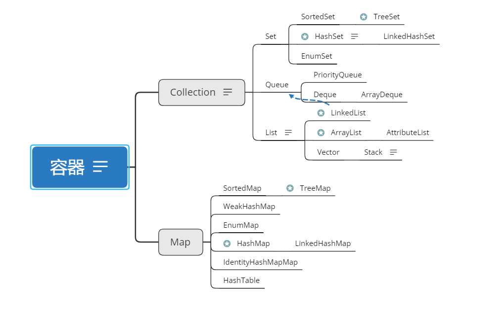

## **Connection接口:**

### 1.优缺点

#### — List 有序,可重复

* ArrayList
  **优点**: 底层数据结构是数组，查询快，增删慢。
  **缺点**: 线程不安全，效率高

* Vector
  **优点**: 底层数据结构是数组，查询快，增删慢。
  **缺点**: 线程安全，效率低

* LinkedList
  **优点**: 底层数据结构是链表，查询慢，增删快。
  **缺点**: 线程不安全，效率高

#### —Set 无序,唯一

* HashSet
  底层数据结构是哈希表。(无序,唯一)
  如何来保证元素唯一性?
  1.依赖两个方法：hashCode()和equals()

* LinkedHashSet
  底层数据结构是链表和哈希表。(FIFO插入有序,唯一)
  1.由链表保证元素有序
  2.由哈希表保证元素唯一

* TreeSet
  底层数据结构是红黑树。(唯一，有序且按规则排序)
  1. 如何保证元素排序的呢?
     自然排序
     比较器排序
     2.如何保证元素唯一性的呢?
     根据比较的返回值是否是0来决定

### **2.选择Collection**

> * 是否唯一
>
> * * 是
>   * * 排序吗
>     * * 是：TreeSet,LinkedHashSet
>       * 否：HashSet
>       * 无条件优先使用HashSet
>
>   * 否
>
>   * * 安全吗
>
>     * * 是：Vector
>
>       * 否：ArrayList,LinkedList
>
>       * * 查询多：ArrayList
>         * 增删多：LinkedList
>         * 无条件时优先用ArrayList

## Set

### 1.TreeSet, LinkedHashSet and HashSet 的区别

> - TreeSet的主要功能用于排序
> - LinkedHashSet的主要功能用于保证FIFO即有序的集合(先进先出)
> - HashSet只是通用的存储数据的集合

相同点：

- Duplicates elements: 因为三者都实现Set interface，所以三者都不包含duplicate elements
- Thread safety: 三者都不是线程安全的，如果要使用线程安全可以Collections.synchronizedSet()

不同点：

* Performance and Speed: HashSet插入数据最快，其次LinkHashSet，最慢的是TreeSet因为内部实现排序 
* Ordering: HashSet不保证有序，LinkHashSet保证FIFO即按插入顺序排序，TreeSet安装内部实现排序，也可以自定义排序规则
* null:HashSet和LinkHashSet允许存在null数据，但是TreeSet中插入null数据时会报NullPointerException

 PRESENT 

## 源码学习

### ArrayList核心源码

 https://github.com/Snailclimb/JavaGuide/blob/master/docs/java/collection/ArrayList.md  

总结问题：

**1.EMPTY_ELEMENTDATA 和 # DEFAULTCAPACITY_EMPTY_ELEMENTDATA**

 https://blog.csdn.net/m0_37927649/article/details/100775027 

以上可以看出完全就是 DEFAULTCAPACITY_EMPTY_ELEMENTDATA 代替了 EMPTY_ELEMENTDATA。那 EMPTY_ELEMENTDATA 干什么去了，看一下构造函数中 EMPTY_ELEMENTDATA 安排在哪里了？都是在判断容量为空的情况下，赋值给 elementData。Java7中如果容量是0的话，会创建一个空数组，赋值给elementData:this.elementData = new Object[initialCapacity];、elementData = Arrays.copyOf(elementData, size, Object[].class);。如果一个应用中有很多这样ArrayList空实例的话，就会有很多的空数组，无疑 EMPTY_ELEMENTDATA 是为了优化性能，所有ArrayList空实例都指向同一个空数组。

2. **mcount** 

 在一个迭代器初始的时候会赋予它调用这个迭代器的对象的mCount，如何在迭代器遍历的过程中，一旦发现这个对象的mcount和迭代器中存储的mcount不一样那就抛异常 

 https://blog.csdn.net/u012926924/article/details/50452411 

**3.数组拷贝**

**4.arraycopy()方法、clone() 方法、copyOf()和copyOfRan**

 http://c.biancheng.net/view/924.html 

 以上几种方法都是浅拷贝（浅复制）。浅拷贝只是复制了对象的引用地址，两个对象指向同一个内存地址，所以修改其中任意的值，另一个值都会随之变化。深拷贝是将对象及值复制过来，两个对象修改其中任意的值另一个值不会改变。 

**5.ArrayList中elementData为什么被transient修饰**

 原因在于elementData是一个缓存数组，它通常会预留一些容量，等容量不足时再扩充容量，那么有些空间可能就没有实际存储元素，采用上诉的方式来实现序列化时，就可以保证只序列化实际存储的那些元素，而不是整个数组，从而节省空间和时间。 

 https://blog.csdn.net/u011733020/article/details/98878453 

**6.System.arraycopy 本地方法 源代码分析**

**7.ensureCapacity和ensureCapacityInternal**

 我们可以肯定capacity一定是大于或等于ArrayList的size，那么当size不断增加到了要超过capacity的时候，ArrayList就不得不重新创建新的capacity来容纳更多的元素，这时需要首先建立一个更长的数组，将原来的数组中的元素复制到新数组中，再删除原来的数组。可见当ArrayList越来越大时，这种操作的消耗也是越来越大的。

为了减少这种不必要的重建capacity的操作，当我们能肯定ArrayList大致有多大（或者至少会有多大）时，我们可以先让ArrayList把capacity设为我们期望的大小，以避免多余的数组重建。

 https://blog.csdn.net/qq_36359679/article/details/72779549 

**8.transient反序列化**

**9.foreach、for、iterator**
for 、foreach 、iterator 三种遍历方式的比较https://www.cnblogs.com/cxuanBlog/p/10927538.html 
Java基础8：Iterator和foreach循环
https://blog.csdn.net/CSDN2497242041/article/details/77902500

https://www.cnblogs.com/xrq730/p/5005347.html 

**10.如何理解 Java 中的 <T extends Comparable<? super T>>
https://www.cnblogs.com/zhaoyibing/p/9051428.html
int compare(Object o1, Object o2) 返回一个基本类型的整型
如果要按照升序排序,则o1 小于o2，返回-1（负数），相等返回0，01大于02返回1（正数）
如果要按照降序排序,则o1 小于o2，返回1（正数），相等返回0，01大于02返回-1（负数）
理解return a-b
即返回1调整，否则不调整https://blog.csdn.net/weimob258616/article/details/89737057

### ListedList源码学习

### HashMap源码学习

 JDK1.8 之前 HashMap 由 数组+链表 组成的，数组是 HashMap 的主体，链表则是主要为了解决哈希冲突而存在的（“拉链法”解决冲突）.JDK1.8 以后在解决哈希冲突时有了较大的变化，当链表长度大于阈值（默认为 8）时，将链表转化为红黑树（将链表转换成红黑树前会判断，如果当前数组的长度小于 64，那么会选择先进行数组扩容，而不是转换为红黑树），以减少搜索时间，具体可以参考 `treeifyBin`方法。 

初始容量控制

[Java8 HashMap之tableSizeFor](https://www.cnblogs.com/loading4/p/6239441.html)

javaHashMap的hash算法扰动函数 https://blog.csdn.net/qq_28523617/article/details/77533097 

### HashSet源码学习

 https://blog.csdn.net/m0_37884977/article/details/80562727 

## Map

Map接口有三个比较重要的实现类，分别是HashMap、TreeMap和HashTable。

* TreeMap是有序的，HashMap和HashTable是无序的。
* Hashtable的方法是同步的，HashMap的方法不是同步的。这是两者最主要的区别。

这就意味着:

* Hashtable是线程安全的，HashMap不是线程安全的。
* HashMap效率较高，Hashtable效率较低。
  如果对同步性或与遗留代码的兼容性没有任何要求，建议使用HashMap。 查看Hashtable的源代码就可以发现，除构造函数外，Hashtable的所有 public 方法声明中都有 synchronized关键字，而HashMap的源码中则没有。
* Hashtable不允许null值，HashMap允许null值（key和value都允许）
* 父类不同：Hashtable的父类是Dictionary，HashMap的父类是AbstractMap

### 红黑树

 https://www.cnblogs.com/skywang12345/p/3245399.html 

## 参考

Java集合中List,Set以及Map等集合体系详解(史上最全) https://blog.csdn.net/zhangqunshuai/article/details/80660974 