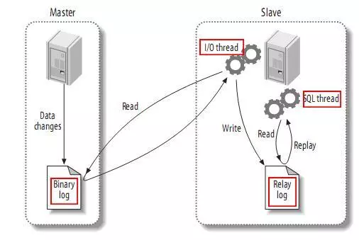
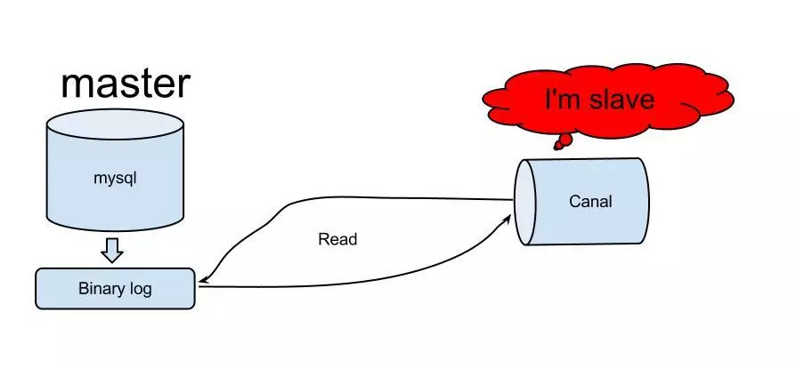
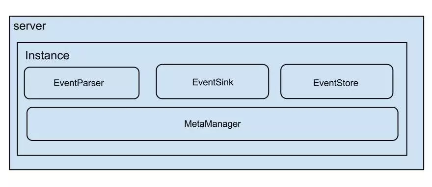
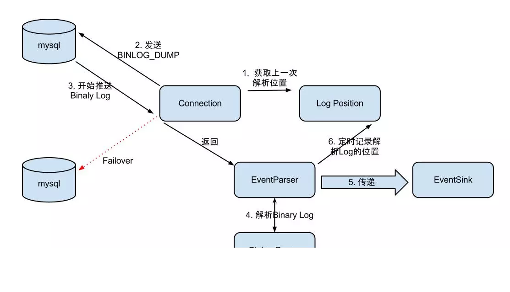
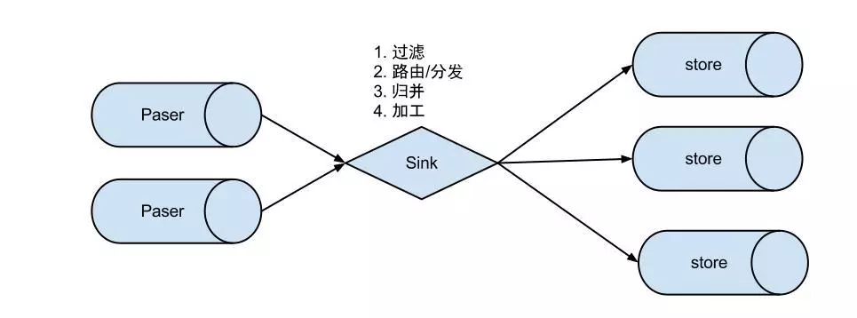
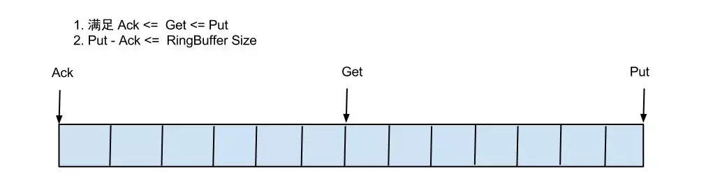

# binlog

* mysql的binlog是多文件存储，定位一个LogEvent需要通过binlog filename + binlog position，进行定位

* mysql的binlog数据格式，按照生成的方式，主要分为：statement-based、row-based、mixed。

> **binlog是记录所有数据库表结构变更（例如CREATE、ALTER TABLE…）以及表数据修改（INSERT、UPDATE、DELETE…）的二进制日志。
> binlog不会记录SELECT和SHOW这类操作，因为这类操作对数据本身并没有修改，但你可以通过查询通用日志来查看MySQL执行过的所有语句。**

多说一句，如果`update`操作没有造成数据变化，也是会记入`binlog`。

这个二进制日志包括两类文件：

- 索引文件（文件名后缀为.index）用于记录哪些日志文件正在被使用
- 日志文件（文件名后缀为.00000*）记录数据库所有的DDL和DML(除了数据查询语句)语句事件。

## binlog于 redolog区别

* 层次不同。redo/undo log是innodb层维护的，而binlog是mysql server层维护的，跟采用何种引擎没有关系，记录的是所有引擎的更新操作的日志记录。 

* 记录内容不同。redo/undo日志记录的是每个页的修改情况，属于物理日志+逻辑日志结合的方式（redo log物理到页，页内采用逻辑日志，undo log采用的是逻辑日志），目的是保证数据的一致性。binlog记录的都是事务操作内容，比如一条语句`DELETE FROM TABLE WHERE i > 1`之类的，不管采用的是什么引擎，当然格式是二进制的，

* 记录时机不同。redo/undo日志在事务执行过程中会不断的写入，binlog是在事务最终commit前写入的 ， binlog什么时候刷新到磁盘跟参数`sync_binlog`相关 

## binlog有三种格式，各有优缺点：

| format    | 定义                       | 优点                           | 缺点                                                         |
| --------- | -------------------------- | ------------------------------ | ------------------------------------------------------------ |
| statement | 记录的是修改SQL语句        | 日志文件小，节约IO，提高性能   | 准确性差，对一些系统函数不能准确复制或不能复制，如now()、uuid()等 |
| row       | 记录的是每行实际数据的变更 | 准确性强，能准确复制数据的变更 | 日志文件大，较大的网络IO和磁盘IO                             |
| mixed     | statement和row模式的混合   | 准确性强，文件大小适中         | 有可能发生主从不一致问题                                     |

## Mysql主从备份原理

  

1. master将改变记录到二进制日志(binary log)中（这些记录叫做二进制日志事件，binary log events，可以通过show binlog events进行查看）；

2. slave将master的binary log events拷贝到它的中继日志(relay log)；

3. slave重做中继日志中的事件，将改变反映它自己的数据。

# Canal

 基于数据库增量日志解析，提供增量数据订阅&消费，目前主要支持了MySQL 

## 工作原理

  

1. canal模拟mysql slave的交互协议，伪装自己为mysql slave，向mysql master发送dump协议

2. mysql master收到dump请求，开始推送binary log给slave(也就是canal)

3. canal解析binary log对象(原始为byte流)

## 架构

  

说明：

- server代表一个canal运行实例，对应于一个jvm
- instance对应于一个数据队列 （1个server对应1..n个instance)

instance模块：

- eventParser (数据源接入，模拟slave协议和master进行交互，协议解析)
- eventSink (Parser和Store链接器，进行数据过滤，加工，分发的工作)
- eventStore (数据存储)
- metaManager (增量订阅&消费信息管理器)

### eventParser

  

Connection获取上一次解析成功的位置 (如果第一次启动，则获取初始指定的位置或者是当前数据库的binlog位点)

Connection建立链接，发送BINLOG_DUMP指令
 // 0. write command number
 // 1. write 4 bytes bin-log position to start at
 // 2. write 2 bytes bin-log flags
 // 3. write 4 bytes server id of the slave
 // 4. write bin-log file name

Mysql开始推送Binaly Log

接收到的Binaly Log的通过Binlog parser进行协议解析，补充一些特定信息
 // 补充字段名字，字段类型，主键信息，unsigned类型处理

传递给EventSink模块进行数据存储，是一个阻塞操作，直到存储成功

存储成功后，定时记录Binaly Log位置

### EventSink设计

  

说明：

- 数据过滤：支持通配符的过滤模式，表名，字段内容等
- 数据路由/分发：解决1:n (1个parser对应多个store的模式)
- 数据归并：解决n:1 (多个parser对应1个store)
- 数据加工：在进入store之前进行额外的处理，比如join

### EventStore设计

- \1. 目前仅实现了Memory内存模式，后续计划增加本地file存储，mixed混合模式
- \2. 借鉴了Disruptor的RingBuffer的实现思路

  

实现说明：

- Put/Get/Ack cursor用于递增，采用long型存储
- buffer的get操作，通过取余或者与操作。(与操作： cusor & (size - 1) , size需要为2的指数，效率比较高)

## 增量订阅/消费设计

### get/ack/rollback协议介绍：

- Message getWithoutAck(int batchSize)，允许指定batchSize，一次可以获取多条，每次返回的对象为Message，包含的内容为：
  a. batch id 唯一标识
  b. entries 具体的数据对象，对应的数据对象格式：[EntryProtocol.proto](https://github.com/alibaba/canal/blob/master/protocol/src/main/java/com/alibaba/otter/canal/protocol/EntryProtocol.proto) 
- void rollback(long batchId)，顾命思议，回滚上次的get请求，重新获取数据。基于get获取的batchId进行提交，避免误操作
- void ack(long batchId)，顾命思议，确认已经消费成功，通知server删除数据。基于get获取的batchId进行提交，避免误操作

canal的get/ack/rollback协议和常规的jms协议有所不同，允许get/ack异步处理，比如可以连续调用get多次，后续异步按顺序提交ack/rollback，项目中称之为流式api.

### **流式api设计的好处：**

- get/ack异步化，减少因ack带来的网络延迟和操作成本 (99%的状态都是处于正常状态，异常的rollback属于个别情况，没必要为个别的case牺牲整个性能)
- get获取数据后，业务消费存在瓶颈或者需要多进程/多线程消费时，可以不停的轮询get数据，不停的往后发送任务，提高并行化. (作者在实际业务中的一个case：业务数据消费需要跨中美网络，所以一次操作基本在200ms以上，为了减少延迟，所以需要实施并行化)

### 数据对象格式：[EntryProtocol.proto](https://github.com/alibaba/canal/blob/master/protocol/src/main/java/com/alibaba/otter/canal/protocol/EntryProtocol.proto) 


```css
Entry
    Header
        logfileName [binlog文件名]
        logfileOffset [binlog position]
        executeTime [binlog里记录变更发生的时间戳]
        schemaName [数据库实例]
        tableName [表名]
        eventType [insert/update/delete类型]
    entryType   [事务头BEGIN/事务尾END/数据ROWDATA]
    storeValue  [byte数据,可展开，对应的类型为RowChange]

RowChange
isDdl       [是否是ddl变更操作，比如create table/drop table]
sql     [具体的ddl sql]
rowDatas    [具体insert/update/delete的变更数据，可为多条，1个binlog event事件可对应多条变更，比如批处理]
beforeColumns [Column类型的数组]
afterColumns [Column类型的数组]

Column
index       [column序号]
sqlType     [jdbc type]
name        [column name]
isKey       [是否为主键]
updated     [是否发生过变更]
isNull      [值是否为null]
value       [具体的内容，注意为文本]
```

说明：

- 可以提供数据库变更前和变更后的字段内容，针对binlog中没有的name,isKey等信息进行补全
- 可以提供ddl的变更语句

# 参考：

[阿里开源canal--简介]: https://www.jianshu.com/p/87944efe1005

[研发应该懂的binlog知识(上]: 

