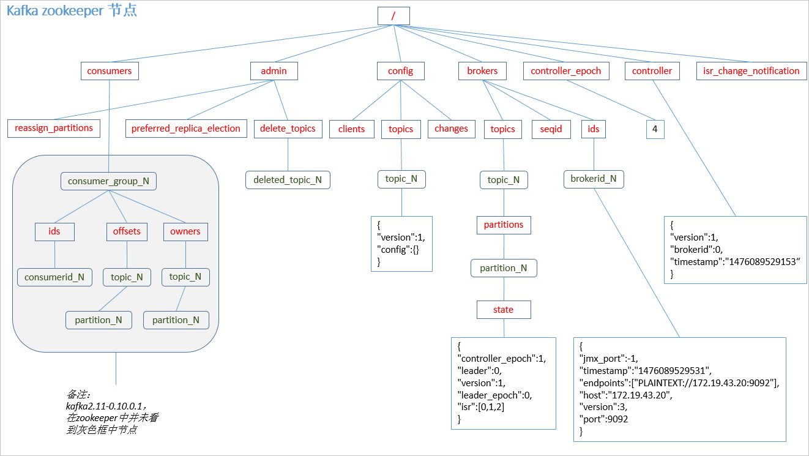

# 消息队列

消息队列是分布式系统中重要的组件，使用消息队列主要是为了通过异步处理提高系统性能和削峰、降低系统耦合性。目前使用较多的消息队列有ActiveMQ，RabbitMQ，Kafka，RocketMQ

### JMS与AMQP

**1JMS**

 	JMS（JAVA Message Service,java消息服务）是java的消息服务，JMS的客户端之间可以通过JMS服务进行异步的消息传输。JMS（JAVA Message Service,Java消息服务）API是一个消息服务的标准或者说是规范，允许应用程序组件基于JavaEE平台创建、发送、接收和读取消息。它使分布式通信耦合度更低，消息服务更加可靠以及异步性。

 	**JMS两种消费模型 **

  * 点到点（P2P）模型


  * 发布/订阅（Pub/Sub）模型


**JMS 五种不同的消息正文格式
 	JMS定义了五种不同的消息正文格式，以及调用的消息类型，允许你发送并接收以一些不同形式的数据，提供现有消息格式的一些级别的兼容性。

* StreamMessage -- Java原始值的数据流
* MapMessage--一套名称-值对
* TextMessage--一个字符串对象
* ObjectMessage--一个序列化的 Java对象
* BytesMessage--一个字节的数据流

**2AMQP**

 AMQP，即Advanced Message Queuing Protocol,一个提供统一消息服务的应用层标准 高级消息队列协议（二进制应用层协议），是应用层协议的一个开放标准,为面向消息的中间件设计，兼容 JMS。基于此协议的客户端与消息中间件可传递消息，并不受客户端/中间件同产品，不同的开发语言等条件的限制。

对比方向	JMS	AMQP
定义	Java API	协议
跨语言	否	是
跨平台	否	是
支持消息类型	提供两种消息模型：①Peer-2-Peer;②Pub/sub	提供了五种消息模型：①direct exchange；②fanout exchange；③topic change；④headers exchange；⑤system exchange。本质来讲，后四种和JMS的pub/sub模型没有太大差别，仅是在路由机制上做了更详细的划分；
支持消息类型	支持多种消息类型 ，我们在上面提到过	byte[]（二进制）

### 消息传递模式

**点对点**

 在点对点消息系统中，消息持久化到一个队列中。此时，将有一个或多个消费者消费队列中的数据。但是**一条消息只能被消费一次**。当一个消费者消费了队列中的某条数据之后，该条数据则从消息队列中删除。该模式即使有多个消费者同时消费数据，也**能保证数据处理的顺序**。 

  

**发布-订阅消息传递模式**

 发布-订阅消息系统中，消息被持久化到一个topic中。与点对点消息系统不同的是，**消费者可以订阅一个或多个topic**，消费者可以消费该topic中所有的数据，**同一条数据可以被多个消费者消费**，数据被消费后不会立马删除。在发布-订阅消息系统中，消息的生产者称为发布者，消费者称为订阅者。 

# kafka架构

  

* **Topic**,消息类别，类似于数据库中的表，由至少一个Partition组成
* **partition**中的数据使用多个segment文件存储。partition中的数据是有序的，不同partition间的数据丢失了数据的顺序。  **在需要严格保证消息的消费顺序的场景下，需要将partition数目设为1**。 

* **Producer**,生产者，即数据发布者， broker将消息**追加**到当前用于追加数据的segment文件中 ，可指定partition.
* **Consumer Group**, 每个Consumer属于一个特定的Consumer Group（可为每个Consumer指定group name，若不指定group name则属于默认的group）。 
* **Leader**. 每个partition有多个副本，其中有且仅有一个作为Leader，Leader是当前负责数据的读写的partition。 
* **Follower**，Partiton从节点，跟随Leader.

  

 Kafka通过Zookeeper管理集群配置，选举leader，以及在Consumer Group发生变化时进行rebalance。Producer使用**push模式**将消息发布到broker，Consumer使用**pull模式**从broker订阅并消费消息。 

## Topic和Partition

 为了**使得Kafka的吞吐率可以线性提高，物理上把Topic分成一个或多个Partition**，每个Partition在物理上对应一个文件夹，该文件夹下存储这个Partition的所有消息和索引文件。创建一个topic时，同时可以指定分区数目，分区数越多，其吞吐量也越大，但是需要的资源也越多，同时也会导致更高的不可用性，kafka在接收到生产者发送的消息之后，**会根据均衡策略将消息存储到不同的分区中**。因为每条消息都被append到该Partition中，**属于顺序写磁盘，因此效率非常高**（经验证，顺序写磁盘效率比随机写内存还要高，这是Kafka高吞吐率的一个很重要的保证）。 

  

 对于传统的message queue而言，一般会删除已经被消费的消息，而Kafka集群会保留所有的消息，无论其被消费与否。当然，因为磁盘限制，不可能永久保留所有数据（实际上也没必要），因此**Kafka提供两种策略删除旧数据。一是基于时间，二是基于Partition文件大小**。例如可以通过配置$KAFKA_HOME/config/server.properties，让Kafka删除一周前的数据，也可在Partition文件超过1GB时删除旧数据，配置如下所示： 

 Kafka会为每一个Consumer Group保留一些metadata信息——当前消费的消息的position，也即offset。这个offset由Consumer控制。正常情况下Consumer会在消费完一条消息后递增该offset。当然，Consumer也可将offset设成一个较小的值，重新消费一些消息 。**offset由消费者控制因此也就不需要锁机制，这也为Kafka的高吞吐率提供了有力保障。**

## Producer消息路由

如果一个Topic对应一个文件，那这个文件所在的机器I/O将会成为这个Topic的性能瓶颈，而有了Partition后，**不同的消息可以并行写入不同broker的不同Partition里，极大的提高了吞吐率**。可以在$KAFKA_HOME/config/server.properties中通过配置项num.partitions来指定新建Topic的默认Partition数量，也可在创建Topic时通过参数指定，同时也可以在Topic创建之后通过Kafka提供的工具修改。

在发送一条消息时，可以指定这条消息的key，Producer根据这个key和Partition机制来判断应该将这条消息发送到哪个Parition。Paritition机制可以通过指定Producer的paritition. class这一参数来指定，该class必须实现kafka.producer.Partitioner接口。

## Consumer Group

 使用Consumer high level API时，同一Topic的一条消息只能被同一个Consumer Group内的一个Consumer消费，但多个Consumer Group可同时消费这一消息。 

  

 这是Kafka用来实现一个Topic消息的广播（发给所有的Consumer）和单播（发给某一个Consumer）的手段。 

## Kafka delivery guarantee

> At most once 　　消息可能会丢，但绝不会重复传输  ack=0
>
> At least one 　　 消息绝不会丢，但可能会重复传输  ack=-1
>
> Exactly once 　　 每条消息肯定会被传输一次且仅传输一次，很多时候这是用户所想要的。

 **Kafka默认保证At least once**，并且允许通过设置Producer异步提交来实现At most once。而Exactly once要求与外部存储系统协作，幸运的是Kafka提供的offset可以非常直接非常容易得使用这种方式。 

 0.11 版本的 Kafka，引入了一项重大特性：幂等性。所谓的幂等性就是指 Producer 不论 向 Server 发送多少次重复数据，Server 端都只会持久化一条。幂等性结合 At Least Once 语 义，就构成了 Kafka 的 Exactly Once 语义。

即： At Least Once + 幂等性 = Exactly Once  


# Kafka HA设计解析

### 3.1　如何将所有Replica均匀分布到整个集群

Kafka分配Replica的算法如下：

1.将所有Broker（假设共n个Broker）和待分配的Partition排序

2.将第i个Partition分配到第（i mod n）个Broker上

3.将第i个Partition的第j个Replica分配到第（(i + j) mode n）个Broker上

### 3.2　Data Replication（副本策略）

#### 3.2.1　消息传递同步策略

*  Producer只将该消息发送到该Partition的Leader 
*  Leader会将该消息写入其本地Log 
*  每个Follower都从Leader pull数据 ， Follower在收到该消息并写入其Log后，向Leader发送ACK 
*  Leader收到了ISR中的所有Replica的ACK，该消息就被认为已经commit了，Leader将增加HW并且向Producer发送ACK。 

**每个Follower在接收到数据后就立马向Leader发送ACK，而非等到数据写入Log中。**因此，对于已经commit的消息，Kafka只能保证它被存于多个Replica的内存中，而不能保证它们被持久化到磁盘中，也就**不能完全保证异常发生后该条消息一定能被Consumer消费。**

**Consumer读消息也是从Leader读取，只有被commit过的消息才会暴露给Consumer。**

#### 3.2.2　ACK前需要保证有多少个备份

对于Kafka而言，定义一个Broker是否“活着”包含两个条件：

- 一是它必须维护与ZooKeeper的session（这个通过ZooKeeper的Heartbeat机制来实现）。
- 二是Follower必须能够及时将Leader的消息复制过来，不能“落后太多”

 **Leader会跟踪与其保持同步的Replica列表，该列表称为ISR（即in-sync Replica）**。如果一个Follower宕机，或者落后太多，Leader将把它从ISR中移除。这里所描述的“落后太多”指Follower复制的消息落后于Leader后的条数超过预定值（该值可在$KAFKA_HOME/config/server.properties中通过replica.lag.max.messages配置，其默认值是4000）或者Follower超过一定时间（该值可在$KAFKA_HOME/config/server.properties中通过replica.lag.time.max.ms来配置，其默认值是10000）未向Leader发送fetch请求。 

 Kafka的这种使用ISR的方式则很好的均衡了确保数据不丢失以及吞吐率。Follower可以批量的从Leader复制数据，这样极大的提高复制性能（批量写磁盘），极大减少了Follower与Leader的差距。 

 **对于Producer而言，它可以选择是否等待消息commit，这可以通过request.required.acks来设置。**这种机制确保了只要ISR有一个或以上的Follower，一条被commit的消息就不会丢失。 

#### 3.2.3　Leader Election算法

Leader选举本质上是一个分布式锁，有两种方式实现基于ZooKeeper的分布式锁：

- 节点名称唯一性：多个客户端创建一个节点，只有成功创建节点的客户端才能获得锁
- 临时顺序节点：所有客户端在某个目录下创建自己的临时顺序节点，只有序号最小的才获得锁

 **Majority Vote** 

优点：

* 系统的latency只取决于最快的几个Broker，而非最慢那个 

缺点：

* 所能容忍的fail的follower个数比较少。如果要容忍n个follower挂掉  必须要有2n+1个以上的Replica .

 而大量的Replica又会在大数据量下导致性能的急剧下降 

 **Kafka在ZooKeeper中动态维护了一个ISR（in-sync replicas）**，这个ISR里的所有Replica都跟上了leader，只有ISR里的成员才有被选为Leader的可能。 

优点：

*  对于f+1个Replica，一个Partition能在保证不丢失已经commit的消息的前提下容忍f个Replica的失败。 

缺点：

* 需等待最慢的Broker这一优势 

 Kafka作者认为Kafka可以通过Producer选择是否被commit阻塞来改善这一问题，并且节省下来的Replica和磁盘使得ISR模式仍然值得。 

#### 2.2.4　选举Leader

 **方案：**所有Follower都在ZooKeeper上设置一个Watch，一旦Leader宕机，其对应的ephemeral znode会自动删除，此时所有Follower都尝试创建该节点，而创建成功者（ZooKeeper保证只有一个能创建成功）即是新的Leader，其它Replica即为Follower。 

**问题**

*  不能保证同一时刻所有Replica“看”到的状态是一样的，这就可能造成不同Replica的响应不一致 
*  如果宕机的那个Broker上的Partition比较多，会造成多个Watch被触发，造成集群内大量的调整 
*  ZooKeeper负载过重 每个Replica都要为此在ZooKeeper上注册一个Watch，当集群规模增加到几千个Partition时ZooKeeper负载会过重。 

 Kafka 0.8.*的Leader Election方案解决了上述问题，它在所有broker中选出一个controller，所有Partition的Leader选举都由controller决定。controller会将Leader的改变直接通过RPC的方式（比ZooKeeper Queue的方式更高效）通知需为为此作为响应的Broker。同时controller也负责增删Topic以及Replica的重新分配。 

#### 2.2.5　如何处理所有Replica都不工作

这种情况下有两种可配置的方案：

1.等待ISR中的任一个Replica“活”过来，并且选它作为Leader（强一致性）

2.选择第一个“活”过来的Replica（不一定是ISR中的）作为Leader（高可用性）


# zookeeper kafka

  

## **消息写入**

producer 发送消息到 broker 时，会根据分区算法选择将其存储到哪一个 partition。其路由机制为：

```
1、 指定了 patition，则直接使用；
2、 未指定 patition 但指定 key，通过对 key 的 value 进行hash 选出一个 patition
3、 patition 和 key 都未指定，使用轮询选出一个 patition。
```

流程说明：

> ```
> 1、 producer 先从 zookeeper 的 "/brokers/.../state" 节点找到该 partition 的 leader 
> 2、 producer 将消息发送给该 leader 
> 3、 leader 将消息写入本地 log 
> 4、 followers 从 leader pull 消息，写入本地 log 后 leader 发送 ACK 
> 5、 leader 收到所有 ISR 中的 replica 的 ACK 后，增加 HW（high watermark，最后 commit 的 offset） 并向 producer 发送 ACK
> ```

## 创建topic

```
1、 controller 在 ZooKeeper 的 /brokers/topics 节点上注册 watcher，当 topic 被创建，则 controller 会通过 watch 得到该 topic 的 partition/replica 分配。
2、 controller从 /brokers/ids 读取当前所有可用的 broker 列表，对于 set_p 中的每一个 partition：
     2.1、 从分配给该 partition 的所有 replica（称为AR）中任选一个可用的 broker 作为新的 leader，并将AR设置为新的 ISR 
     2.2、 将新的 leader 和 ISR 写入 /brokers/topics/[topic]/partitions/[partition]/state 
3、 controller 通过 RPC 向相关的 broker 发送 LeaderAndISRRequest。
```

## **broker failover**

```
1、 controller 在 zookeeper 的 /brokers/ids/[brokerId] 节点注册 Watcher，当 broker 宕机时 zookeeper 会 fire watch
2、 controller 从 /brokers/ids 节点读取可用broker 
3、 controller决定set_p，该集合包含宕机 broker 上的所有 partition 
4、 对 set_p 中的每一个 partition 
    4.1、 从/brokers/topics/[topic]/partitions/[partition]/state 节点读取 ISR 
    4.2、 决定新 leader 
    4.3、 将新 leader、ISR、controller_epoch 和 leader_epoch 等信息写入 state 节点
5、 通过 RPC 向相关 broker 发送 leaderAndISRRequest 命令
```

## **controller failover**

 当 controller 宕机时会触发 controller failover。每个 broker 都会在 zookeeper 的 "/controller" 节点注册 watcher，当 controller 宕机时 zookeeper 中的临时节点消失，所有存活的 broker 收到 fire 的通知，每个 broker 都尝试创建新的 controller path，只有一个竞选成功并当选为 controller。 