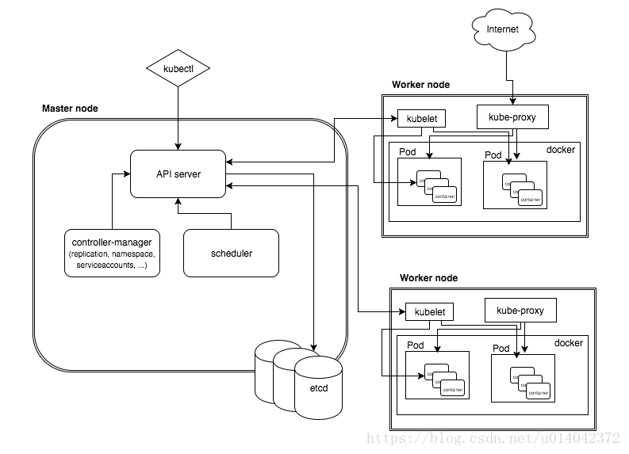

 Kubernetes是一个可以移植、可扩展的开源平台，使用 [声明式的配置](https://kuboard.cn/learning/k8s-intermediate/workload/wl-deployment/#deployment-概述) 并依据配置信息自动地执行容器化应用程序的管理。 

## **容器部署优势：**

- **敏捷地创建和部署应用程序**：相较于创建虚拟机镜像，创建容器镜像更加容易和快速
- 持续构建集成：可以更快更频繁地构建容器镜像、部署容器化的应用程序、并且轻松地回滚应用程序
- **分离开发和运维的关注点**：在开发构建阶段就完成容器镜像的构建，构建好的镜像可以部署到多种基础设施上。这种做法将开发阶段需要关注的内容包含在如何构建容器镜像的过程中，将部署阶段需要关注的内容聚焦在如何提供基础设施以及如何使用容器镜像的过程中。降低了开发和运维的耦合度
- **可监控性**：不仅可以查看操作系统级别的资源监控信息，还可以查看应用程序健康状态以及其他信号的监控信息
- **开发、测试、生产不同阶段的环境一致性**：开发阶段在笔记本上运行的容器与测试、生产环境中运行的容器一致
- **跨云服务商、跨操作系统发行版的可移植性**：容器可运行在 Ubuntu、RHEL、CoreOS、CentOS等不同的操作系统发行版上，可以运行在私有化部署、Google Kubernetes Engine、AWS、阿里云等不同的云供应商的环境中
- **以应用程序为中心的管理**：虚拟机时代的考虑的问题是在虚拟硬件上运行一个操作系统，而容器化时代，问题的焦点则是在操作系统的逻辑资源上运行一个应用程序
- **松耦合、分布式、弹性、无约束的微服务**：应用程序被切分成更小的、独立的微服务，并可以动态部署和管理，而不是一个部署在专属机器上的庞大的单片应用程序
- **资源隔离**：确保应用程序性能不受干扰
- **资源利用**：资源高效、高密度利用

## Kubernetes的功能

 **服务发现和负载均衡** 

 **存储编排** 

 **自动发布和回滚** 

 **自愈** 

## 组件

  

### Mater组件：负责控制和调度

* **kube-apiserver**

此 master 组件提供 Kubernetes API

* **etcd**

支持一致性和高可用的名值对存储组件，Kubernetes集群的所有配置信息都存储在 etcd 中

* **kube-scheduler**

此 master 组件监控所有新创建尚未分配到节点上的 Pod，并且自动选择为 Pod 选择一个合适的节点去运行

* **kube-controller-manager**

此 master 组件运行了所有的控制器

逻辑上来说，每一个控制器是一个独立的进程，但是为了降低复杂度，这些控制器都被合并运行在一个进程里。

### Node 组件

*** kubelet**

 此组件是运行在每一个集群节点上的代理程序。它确保 Pod 中的容器处于运行状态。 

*** kube-proxy**

[kube-proxy](https://kuboard.cn/learning/k8s-intermediate/service/service-details.html#虚拟-ip-和服务代理) 是一个网络代理程序，运行在集群中的每一个节点上，是实现 Kubernetes Service 概念的重要部分。

*** 容器引擎**

容器引擎负责运行容器。

  

 Deployment 处于 master 节点上，通过发布 Deployment，master 节点会选择合适的 worker 节点创建 Container（即图中的正方体），Container 会被包含在 Pod （即蓝色圆圈）里 

需要为前端系统屏蔽后端系统的 Pod（容器组）在销毁、创建过程中所带来的 IP 地址的变化。

Kubernetes 中的 **Service（服务）** 提供了这样的一个抽象层，它选择具备某些特征的 Pod（容器组）并为它们定义一个访问方式。

kubevirt和virtlet

 [KubeVirt](https://github.com/kubevirt/kubevirt) is a virtual machine management add-on for Kubernetes providing control of VMs as [Kubernetes Custom Resources](https://kubernetes.io/docs/concepts/extend-kubernetes/api-extension/custom-resources/). [Virtlet](https://github.com/Mirantis/virtlet), on the other hand is a [CRI (Container Runtime Interface)](https://kubernetes.io/blog/2016/12/container-runtime-interface-cri-in-kubernetes/) implementation, 

## 什么是Custom resources

Resource是Kubernetes API中的一个endpoint，用于存储某种类型的API对象的集合。例如，内置的Pod 资源包含了Pod对象的集合。Custom Resource是Kubernetes API的扩展，不一定要用在在每个Kubernetes集群上。换句话说，它表示特定Kubernetes安装的定制。

Custom Resource可以通过动态注册在正在运行的集群中出现和消失，集群管理员可以独立于集群本身更新自定义资源。一旦安装了自定义资源，用户就可以使用kubectl来创建和访问其对象，就像它们为内置资源（如pod）一样。

 [Kubernetes](https://www.kubernetes.org.cn/)节点的底层由一个叫做“容器运行时”的软件进行支撑，它负责比如启停容器这样的事情。最广为人知的容器运行时当属Docker，但它不是唯一的。事实上，容器运行时这个领域发展迅速。为了使Kubernetes的扩展变得更容易，我们一直在打磨支持容器运行时的K8s插件API：容器运行时接口(Container Runtime Interface, CRI)。 

 KubeVirt将虚拟机定义为Kubernetes自定义资源，其优点是安装非常简单，可以作为任何Kubernetes集群的附件使用，但是其缺点是其VM必须与kubelet分开管理，需要使用新命令kubectl，也是一个新的控制器。尽管这样做的好处是KubeVirt开发人员可以自由地实现所有必需的功能，并且不受Pod定义的限制，但它也确实存在很多缺点。 

您只能使用Pods随附的功能。例如，实时迁移，设备热插拔或VM扩展（例如添加CPU或RAM）将需要分别实现。实现这些功能是可能的，但并不理想。

与[KubeVirt存储](http://kubevirt.io/user-guide/#/workloads/virtual-machines/disks-and-volumes)相比，[Virtlet的](http://kubevirt.io/user-guide/#/workloads/virtual-machines/disks-and-volumes)存储选项也有限，