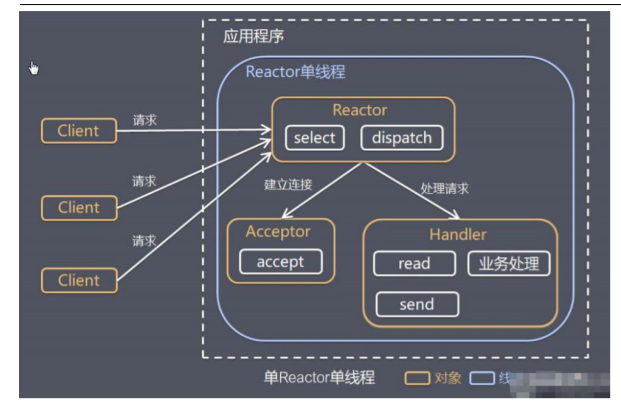
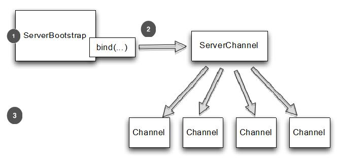
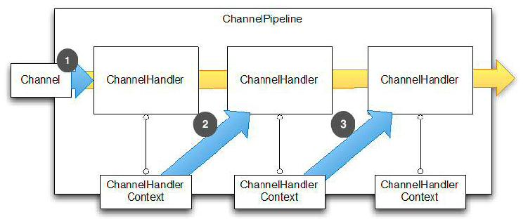

# 背景

## NIO问题

JDK 原生也有一套网络应用程序 API，但是存在一系列问题，主要如下：

- NIO 的类库和 API 繁杂，使用麻烦。你需要熟练掌握 Selector、ServerSocketChannel、SocketChannel、ByteBuffer 等。
- 需要具备其他的额外技能做铺垫。例如熟悉 Java 多线程编程，因为 NIO 编程涉及到 Reactor 模式，你必须对多线程和网路编程非常熟悉，才能编写出高质量的 NIO 程序。
- 可靠性能力补齐，开发工作量和难度都非常大。例如客户端面临断连重连、网络闪断、半包读写、失败缓存、网络拥塞和异常码流的处理等等。 NIO 编程的特点是功能开发相对容易，但是可靠性能力补齐工作量和难度都非常大。
- JDK NIO 的 Bug。例如臭名昭著的 Epoll Bug，它会导致 Selector 空轮询，最终导致 CPU 100%。 官方声称在 JDK 1.6 版本的 update 18 修复了该问题，但是直到 JDK 1.7 版本该问题仍旧存在，只不过该 Bug 发生概率降低了一些而已，它并没有被根本解决。


Netty 的特点

Netty 对 JDK 自带的 NIO 的 API 进行封装，解决上述问题，主要特点有：

- 设计优雅，适用于各种传输类型的统一 API 阻塞和非阻塞 Socket；基于灵活且可扩展的事件模型，可以清晰地分离关注点；高度可定制的线程模型 - 单线程，一个或多个线程池；真正的无连接数据报套接字支持（自 3.1 起）。
- 使用方便，详细记录的 Javadoc，用户指南和示例；没有其他依赖项，JDK 5（Netty 3.x）或 6（Netty 4.x）就足够了。
- 高性能，吞吐量更高，延迟更低；减少资源消耗；最小化不必要的内存复制。
- 安全，完整的 SSL/TLS 和 StartTLS 支持。
- 社区活跃，不断更新，社区活跃，版本迭代周期短，发现的 Bug 可以被及时修复，同时，更多的新功能会被加入。

## Reactor模式

传统模型，当并发数很大，就会创建大量线程，占用大量资源

连接创建后，如果当前线程暂时没有数据可读，该线程会阻塞在read操作，造成资源的浪费 

IO复用结合线程池，就是Reactor模式基本设计思想


* 通过一个或多个输入同时传递给服务处理器的模式（基于事件驱动）
* 服务器端程序处理传入的多个请求，并将它们同步分派到相应的处理线程，因此Reactor模式也叫Dispatcher模式
* Reactor模式使用IO复用监听事件，收到事件后，分发给某个线程，这是网络服务器高并发处理关键

**核心组成：**

Reactor :Reactor 在一个单独线程中，负责监听和分发事件

Handlers:处理程序执行IO事件要完成的实际事件。

 可以这样理解，Reactor 就是一个执行 while (true) { selector.select(); …} 循环的线程，会源源不断的产生新的事件，称作反应堆很贴切。 

**三种模式**：

### **单Reactor单线程**




优点：模型简单，没有多线程、进程通信、竞争问题，全部都在一个线程中完成

缺点：只有一个线程，无法完全发挥多核cpu的性能，Handler在处理某个连接上的业务时，整个进程无法处理其他连接事件，很容易导致性能瓶颈

 	可靠性问题，线程意外终止，造成节点故障

### **单Reactor多线程**


1)Reactor 对象**通过select 监控客户端请求** 事件, 收到事件后，**通过dispatch进行分发**

2)如果建立连接请求, 则右Acceptor 通过 accept 处理连接请求, 然后创建一个Handler对象处理完成连接后的各种事件

3)如果不是连接请求，则由reactor分发调用连接对应的handler 来处理

4)**handler 只负责响应事件，不做具体的业务处理**, 通过read 读取数据后，会分发给后面的worker线程池的某个线程处理业务

5)worker 线程池会分配独立线程完成真正的业务，并将结果返回给handler

6)handler收到响应后，通过send 将结果返回给client


优点 可以充分利用多核cpu处理能力

缺点：多线程数据共享和访问比较复杂。reactor处理所有事件监听和响应，在单线程运行，在高并发场景下容易出现性能瓶颈


### **主从Reactor多线程**


1)Reactor主线程 MainReactor 对象**通过select 监听连接事件**, 收到事件后，**通过Acceptor 处理连接事件**

2)当 Acceptor 处理连接事件后，MainReactor 将连接分配给SubReactor 

3)subreactor 将连接加入到连接队列进行监听,并创建handler进行各种事件处理

4)当有新事件发生时， subreactor 就会调用对应的handler处理

5)handler 通过read 读取数据，分发给后面的worker 线程处理

6)worker 线程池分配独立的worker 线程进行业务处理，并返回结果

7)handler 收到响应的结果后，再通过send 将结果返回给client

8)Reactor 主线程可以对应多个Reactor 子线程, 即MainRecator 可以关联多个SubReactor

优点：

父线程与子线程数据交互简单，职责明确，父线程只需要接收新连接，子线程完成后续业务处理

缺点

编程复杂度高


### **Reactor** **模式具有如下的优点：**

1)响应快，不必为单个同步时间所阻塞，虽然 Reactor 本身依然是同步的

2)可以最大程度的避免复杂的多线程及同步问题，并且避免了多线程/进程的切换开销

3)扩展性好，可以方便的通过增加 Reactor 实例个数来充分利用 CPU 资源

4)复用性好，Reactor 模型本身与具体事件处理逻辑无关，具有很高的复用性

在Netty中,三种Reactor模式都是支持,但是除非选了一个垃圾的单核cpu的服务器,选主从模式就可以了,三种实现方式在下面:

```text
//Reactor 单线程模式
EventLoopGroup eventGroup = new NioEventLoopGroup(1);
ServerBootstrap serverBootstrap = new ServerBootstrap();
serverBootstrap.group(eventGroup);

//非主从 Reactor 多线程模式
EventLoopGroup eventGroup = new NioEventLoopGroup();
ServerBootstrap serverBootstrap = new ServerBootstrap();
serverBootstrap.group(eventGroup);

//主从 Reactor 多线程模式
EventLoopGroup bossGroup = new NioEventLoopGroup();
EventLoopGroup workerGroup = new NioEventLoopGroup();
ServerBootstrap serverBootstrap = new ServerBootstrap();
serverBootstrap.group(bossGroup, workerGroup);
```

 再补充一下,Netty的boosGroup大多时候并不能用到一个线程组,只会用到线程组中的一个,在Netty服务器启动的时候,会绑定地址和端口,一般来说我们服务器只会绑定一个地址和端口,所以实际上也只用到了bossGroup中的一个线程. 


## 事件驱动模型

通常，我们设计一个事件处理模型的程序有两种思路：

- 轮询方式，线程不断轮询访问相关事件发生源有没有发生事件，有发生事件就调用事件处理逻辑。
- 事件驱动方式，发生事件，主线程把事件放入事件队列，在另外线程不断循环消费事件列表中的事件，调用事件对应的处理逻辑处理事件。事件驱动方式也被称为消息通知方式，其实是设计模式中观察者模式的思路。

以 GUI 的逻辑处理为例，说明两种逻辑的不同：

- 轮询方式，线程不断轮询是否发生按钮点击事件，如果发生，调用处理逻辑。
- 事件驱动方式，发生点击事件把事件放入事件队列，在另外线程消费的事件列表中的事件，根据事件类型调用相关事件处理逻辑。

  

主要包括 4 个基本组件：

- 事件队列（event queue）：接收事件的入口，存储待处理事件。
- 分发器（event mediator）：将不同的事件分发到不同的业务逻辑单元。
- 事件通道（event channel）：分发器与处理器之间的联系渠道。
- 事件处理器（event processor）：实现业务逻辑，处理完成后会发出事件，触发下一步操作。

可以看出，相对传统轮询模式，事件驱动有如下优点：

- 可扩展性好，分布式的异步架构，事件处理器之间高度解耦，可以方便扩展事件处理逻辑。
- 高性能，基于队列暂存事件，能方便并行异步处理事件。

# netty

 	 Netty 是一个异步的、基于事件驱动的网络应用框架，它可以用来开发高性能服务端和客户端。 

 	`Netty`说自己是异步事件驱动的框架，并没有说网络模型用的是异步模型，异步事件驱动框架体现在所有的`I/O`操作是异步的，所有的`IO`调用会立即返回，并不保证调用成功与否，但是调用会返回`ChannelFuture`，`netty`会通过`ChannelFuture`通知你调用是成功了还是失败了亦或是取消了。 

## 架构

netty基于reactor 主从模式进行了一些改进


1)netty抽象出两组线程池 **BossGroup 专门负责接收客户端的连接**, **WorkerGroup 专门负责网络的读写**

2)BossGroup 和 WorkerGroup 类型都是 NioEventLoopGroup

3)NioEventLoopGroup 相当于一个事件循环组, 这个组中含有多个事件循环 ，每一个事件循环是 NioEventLoop

4)NioEventLoop 表示一个不断循环的执行处理任务的线程， **每个NioEventLoop 都有一个selector** , **用于监听绑定在其上的socket的网络通讯**

5)NioEventLoopGroup 可以有多个线程, 即可以含有多个NioEventLoop

6)每个Boss NioEventLoop 循环执行的步骤有3步

1.轮询accept 事件

2.处理accept 事件 , 与client建立连接 , 生成NioScocketChannel , 并将其注册到某个worker NIOEventLoop 上的 selector 

3.处理任务队列的任务 ， 即 runAllTasks

7) 每个 Worker NIOEventLoop 循环执行的步骤

1.轮询read, write 事件

2.处理i/o事件， 即read , write 事件，在对应NioScocketChannel 处理

3.处理任务队列的任务 ， 即 runAllTasks

8) 每个Worker NIOEventLoop  处理业务时，会使用pipeline(管道), pipeline 中包含了 channel , 即通过pipeline 可以获取到对应通道, 管道中维护了很多的 处理器

**注意**

1)netty抽象出两组**线程池**，BossGroup 专门负责接收客户端连接，WorkerGroup 专门负责网络读写操作。

2)NioEventLoop 表示一个不断循环执行处理任务的线程，每个 NioEventLoop 都有一个 selector，用于监听绑定在其上的 socket 网络通道。

3)NioEventLoop 内部采用串行化设计，从消息的读取->解码->处理->编码->发送，始终由 IO 线程 NioEventLoop 负责

* NioEventLoopGroup 下包含多个 NioEventLoop
* 每个 NioEventLoop 中包含有一个 Selector，一个 taskQueue
* 每个 NioEventLoop 的 Selector 上可以注册监听多个 NioChannel
* 每个 NioChannel 只会绑定在唯一的 NioEventLoop 上
* 每个 NioChannel 都绑定有一个自己的 ChannelPipeline

## 功能特性


  

Netty 功能特性如下：

- 传输服务，支持 BIO 和 NIO。
- 容器集成，支持 OSGI、JBossMC、Spring、Guice 容器。
- 协议支持，HTTP、Protobuf、二进制、文本、WebSocket 等一系列常见协议都支持。还支持通过实行编码解码逻辑来实现自定义协议。
- Core 核心，可扩展事件模型、通用通信 API、支持零拷贝的 ByteBuf 缓冲对象。

## 核心组件

###  EventLoopGroup

 Netty 的调度模块称为 EventLoopGroup，默认提供了 NioEventLoopGroup、OioEventLoopGroup 等多种实现。 

 

*【NioEventLoop】：*

NioEventLoop 中维护了一个线程和任务队列，支持异步提交执行任务，线程启动时会调用 NioEventLoop 的 run 方法，执行 I/O 任务和非 I/O 任务：

I/O 任务，即 selectionKey 中 ready 的事件，如 accept、connect、read、write 等，由 processSelectedKeys 方法触发。

非 IO 任务，添加到 taskQueue 中的任务，如 register0、bind0 等任务，由 runAllTasks 方法触发。

两种任务的执行时间比由变量 ioRatio 控制，默认为 50，则表示允许非 IO 任务执行的时间与 IO 任务的执行时间相等。

*【NioEventLoopGroup】：*

NioEventLoopGroup，主要管理 eventLoop 的生命周期，可以理解为一个线程池，内部维护了一组线程，每个线程(NioEventLoop)负责处理多个 Channel 上的事件，而一个 Channel 只对应于一个线程。

```java
//默认NioEventLoop数为cpu核心*2,可传入参数
NioEventLoopGroup boss = new NioEventLoopGroup();
NioEventLoopGroup worker = new NioEventLoopGroup();

```

### Bootstap、ServerBootstap

 Bootstrap 意思是引导，一个 Netty 应用通常由一个 Bootstrap 开始，主要作用是配置整个 Netty 程序，串联各个组件，Netty 中 Bootstrap 类是客户端程序的启动引导类，ServerBootstrap 是服务端启动引导类。 

####  Bootstrap 

 Bootstrap类可以用来引导客户端和一些无连接协议

**客户端引导方法**

下表是 Bootstrap 的常用方法，其中很多是继承自 AbstractBootstrap。

**Table 9.1 Bootstrap methods**

|          名称          |                             描述                             |
| :--------------------: | :----------------------------------------------------------: |
|         group          |      设置 EventLoopGroup 用于处理所有的 Channel 的事件       |
| channel channelFactory | channel() 指定 Channel 的实现类。如果类没有提供一个默认的构造函数,你可以调用 channelFactory() 来指定一个工厂类被 bind() 调用。 |
|      localAddress      | 指定应该绑定到本地地址 Channel。如果不提供,将由操作系统创建一个随机的。或者,您可以使用 bind() 或 connect()指定localAddress |
|         option         | 设置 ChannelOption 应用于 新创建 Channel 的 ChannelConfig。这些选项将被 bind 或 connect 设置在通道,这取决于哪个被首先调用。这个方法在创建管道后没有影响。所支持 ChannelOption 取决于使用的管道类型。请参考9.6节和 ChannelConfig 的 API 文档 的 Channel 类型使用。 |
|          attr          | 这些选项将被 bind 或 connect 设置在通道,这取决于哪个被首先调用。这个方法在创建管道后没有影响。请参考9.6节。 |
|        handler         | 设置添加到 ChannelPipeline 中的 ChannelHandler 接收事件通知。 |
|         clone          |       创建一个当前 Bootstrap的克隆拥有原来相同的设置。       |
|     remoteAddress      |         设置远程地址。此外,您可以通过 connect() 指定         |
|        connect         |   连接到远端，返回一个 ChannelFuture, 用于通知连接操作完成   |
|          bind          | 将通道绑定并返回一个 ChannelFuture,用于通知绑定操作完成后,必须调用 Channel.connect() 来建立连接。 |

  


1. 当 bind() 调用时，Bootstrap 将创建一个新的管道, 当 connect() 调用在 Channel 来建立连接
2. Bootstrap 将创建一个新的管道, 当 connect() 调用时
3. 新的 Channel

 **下面演示了引导客户端，使用的是 NIO TCP 传输** 

```java
EventLoopGroup group = new NioEventLoopGroup();
Bootstrap bootstrap = new Bootstrap(); //1
bootstrap.group(group) //2
    .channel(NioSocketChannel.class) //3
    .handler(new SimpleChannelInboundHandler<ByteBuf>() { //4
        @Override
        protected void channeRead0(
            ChannelHandlerContext channelHandlerContext,
            ByteBuf byteBuf) throws Exception {
                System.out.println("Received data");
                byteBuf.clear();
            }
        });
ChannelFuture future = bootstrap.connect(
    new InetSocketAddress("www.manning.com", 80)); //5
future.addListener(new ChannelFutureListener() {
    @Override
    public void operationComplete(ChannelFuture channelFuture)
        throws Exception {
            if (channelFuture.isSuccess()) {
                System.out.println("Connection established");
            } else {
                System.err.println("Connection attempt failed");
                channelFuture.cause().printStackTrace();
            }
        }
    });
```

**兼容性**

Channel 的实现和 EventLoop 的处理过程在 EventLoopGroup 中必须兼容，哪些 Channel 是和 EventLoopGroup 是兼容的可以查看 API 文档。经验显示，相兼容的实现一般在同一个包下面，例如使用NioEventLoop，NioEventLoopGroup 和 NioServerSocketChannel 在一起。请注意，这些都是前缀“Nio”，然后不会用这些代替另一个实现和另一个前缀，如“Oio”，也就是说 OioEventLoopGroup 和NioServerSocketChannel 是不相容的。


#### ServerBootstap

**引导服务器的方法**

下表显示了 ServerBootstrap 的方法

**Table 9.2 Methods of ServerBootstrap‘**

|          名称          |                             描述                             |
| :--------------------: | :----------------------------------------------------------: |
|         group          | 设置 EventLoopGroup 用于 ServerBootstrap。这个 EventLoopGroup 提供 ServerChannel 的 I/O 并且接收 Channel |
| channel channelFactory | channel() 指定 Channel 的实现类。如果管道没有提供一个默认的构造函数,你可以提供一个 ChannelFactory。 |
|      localAddress      | 指定 ServerChannel 实例化的类。如果不提供,将由操作系统创建一个随机的。或者,您可以使用 bind() 或 connect()指定localAddress |
|         option         | 指定一个 ChannelOption 来用于新创建的 ServerChannel 的 ChannelConfig 。这些选项将被设置在管道的 bind() 或 connect(),这取决于谁首先被调用。在此调用这些方法之后设置或更改 ChannelOption 是无效的。所支持 ChannelOption 取决于使用的管道类型。请参考9.6节和 ChannelConfig 的 API 文档 的 Channel 类型使用。 |
|      childOption       | 当管道已被接受，指定一个 ChannelOption 应用于 Channel 的 ChannelConfig。 |
|          attr          | 指定 ServerChannel 的属性。这些属性可以被 管道的 bind() 设置。当调用 bind() 之后，修改它们不会生效。 |
|       childAttr        |         应用属性到接收到的管道上。后续调用没有效果。         |
|        handler         | 设置添加到 ServerChannel 的 ChannelPipeline 中的 ChannelHandler。 具体详见 childHandler() 描述 |
|      childHandler      | 设置添加到接收到的 Channel 的 ChannelPipeline 中的 ChannelHandler。handler() 和 childHandler()之间的区别是前者是接收和处理ServerChannel，同时 childHandler() 添加处理器用于处理和接收 Channel。后者代表一个套接字绑定到一个远端。 |
|         clone          | 克隆 ServerBootstrap 用于连接到不同的远端，通过设置相同的原始 ServerBoostrap。 |
|          bind          | 绑定 ServerChannel 并且返回一个 ChannelFuture,用于 通知连接操作完成了（结果可以是成功或者失败） |

  


1. 当调用 bind() 后 ServerBootstrap 将创建一个新的管道，这个管道将会在绑定成功后接收子管道
2. 接收新连接给每个子管道
3. 接收连接的 Channel


```java
NioEventLoopGroup group = new NioEventLoopGroup();
ServerBootstrap bootstrap = new ServerBootstrap(); //1
bootstrap.group(group) //2
    .channel(NioServerSocketChannel.class) //3
    .childHandler(new SimpleChannelInboundHandler<ByteBuf>() { //4
        @Override
        protected void channelRead0(ChannelHandlerContext ctx,
            ByteBuf byteBuf) throws Exception {
                System.out.println("Reveived data");
                byteBuf.clear();
            }
        }
    );
ChannelFuture future = bootstrap.bind(new InetSocketAddress(8080)); //5
future.addListener(new ChannelFutureListener() {
    @Override
    public void operationComplete(ChannelFuture channelFuture)
        throws Exception {
            if (channelFuture.isSuccess()) {
                System.out.println("Server bound");
            } else {
                System.err.println("Bound attempt failed");
                channelFuture.cause().printStackTrace();
            }
        }
    }
);
```

**添加多个handler**

 `childHandler()`用于指定处理新连接数据的读写处理逻辑，`handler()`用于指定在服务端启动过程中的一些逻辑，通常情况下呢，我们用不着这个方法。 

 Netty 提供 ChannelInitializer 抽象类用来初始化 ChannelPipeline 中的 ChannelHandler。ChannelInitializer是一个特殊的 ChannelHandler，通道被注册到 EventLoop 后就会调用ChannelInitializer，并允许将 ChannelHandler 添加到CHannelPipeline；完成初始化通道后，这个特殊的 ChannelHandler 初始化器会从 ChannelPipeline 中自动删除。 

```java
ServerBootstrap bootstrap = new ServerBootstrap();//1
bootstrap.group(new NioEventLoopGroup(), new NioEventLoopGroup())  //2
    .channel(NioServerSocketChannel.class)  //3
    .childHandler(new ChannelInitializerImpl()); //4
ChannelFuture future = bootstrap.bind(new InetSocketAddress(8080));  //5
future.sync();


final class ChannelInitializerImpl extends ChannelInitializer<Channel> {  //6
    @Override
    protected void initChannel(Channel ch) throws Exception {
        ChannelPipeline pipeline = ch.pipeline(); //7
        pipeline.addLast(new HttpClientCodec());
        pipeline.addLast(new HttpObjectAggregator(Integer.MAX_VALUE));

    }
}
```

Netty 中ChannelOption和属性

> 1、ChannelOption.SO_BACKLOG（服务端常用）
> ChannelOption.SO_BACKLOG对应的是tcp/ip协议listen函数中的backlog参数，函数listen(int socketfd,int backlog)用来初始化服务端可连接队列，服务端处理客户端连接请求是顺序处理的，所以同一时间只能处理一个客户端连接，多个客户端来的时候，服务端将不能处理的客户端连接请求放在队列中等待处理，backlog参数指定了队列的大小
>
> 2、ChannelOption.SO_REUSEADDR
> ChanneOption.SO_REUSEADDR对应于套接字选项中的SO_REUSEADDR，这个参数表示允许重复使用本地地址和端口，比如，某个服务器进程占用了TCP的80端口进行监听，此时再次监听该端口就会返回错误，使用该参数就可以解决问题，该参数允许共用该端口，这个在服务器程序中比较常使用，比如某个进程非正常退出，该程序占用的端口可能要被占用一段时间才能允许其他进程使用，而且程序死掉以后，内核一需要一定的时间才能够释放此端口，不设置SO_REUSEADDR就无法正常使用该端口。
>
> 3、ChannelOption.SO_KEEPALIVE(childoption常用)
> Channeloption.SO_KEEPALIVE参数对应于套接字选项中的SO_KEEPALIVE，该参数用于设置TCP连接，当设置该选项以后，连接会测试链接的状态，这个选项用于可能长时间没有数据交流的连接。当设置该选项以后，如果在两小时内没有数据的通信时，TCP会自动发送一个活动探测数据报文。
>
> 4、ChannelOption.SO_SNDBUF和ChannelOption.SO_RCVBUF
> ChannelOption.SO_SNDBUF参数对应于套接字选项中的SO_SNDBUF，ChannelOption.SO_RCVBUF参数对应于套接字选项中的SO_RCVBUF这两个参数用于操作接收缓冲区和发送缓冲区的大小，接收缓冲区用于保存网络协议站内收到的数据，直到应用程序读取成功，发送缓冲区用于保存发送数据，直到发送成功。
>
> 5、ChannelOption.SO_LINGER
> ChannelOption.SO_LINGER参数对应于套接字选项中的SO_LINGER,Linux内核默认的处理方式是当用户调用close()方法的时候，函数返回，在可能的情况下，尽量发送数据，不一定保证会发生剩余的数据，造成了数据的不确定性，使用SO_LINGER可以阻塞close()的调用时间，直到数据完全发送
>
> 6、ChannelOption.TCP_NODELAY(childoption常用)
> ChannelOption.TCP_NODELAY参数对应于套接字选项中的TCP_NODELAY,该参数的使用与Nagle算法有关。Nagle算法是将小的数据包组装为更大的帧然后进行发送，而不是输入一次发送一次,因此在数据包不足的时候会等待其他数据的到了，组装成大的数据包进行发送，虽然该方式有效提高网络的有效负载，但是却造成了延时，而该参数的作用就是禁止使用Nagle算法，使用于小数据即时传输，于TCP_NODELAY相对应的是TCP_CORK，该选项是需要等到发送的数据量最大的时候，一次性发送数据，适用于文件传输。


**关闭Netty之前已经引导的客户端或服务器**

 主要是记住关闭 EventLoopGroup,将处理任何悬而未决的事件和任务并随后释放所有活动线程。这只是一种叫EventLoopGroup.shutdownGracefully()。这个调用将返回一个 Future 用来通知关闭完成。注意,shutdownGracefully()也是一个异步操作,所以你需要阻塞,直到它完成或注册一个侦听器直到返回的 Future 来通知完成。 

```java
EventLoopGroup group = new NioEventLoopGroup() //1
Bootstrap bootstrap = new Bootstrap(); //2
bootstrap.group(group)
    .channel(NioSocketChannel.class);
...
...
Future<?> future = group.shutdownGracefully(); //3
// block until the group has shutdown
future.sync();
```

很多程序后面有

```
            future.channel().closeFuture().sync();
```

 不是没执行，是主线程到这里就 wait 子线程退出了，子线程才是真正监听和接受请求的。 

### Channel

 Transport API 的核心是 Channel 接口，用于所有的出站操作，见下图 

  

如上图所示，每个 Channel 都会分配一个 ChannelPipeline 和ChannelConfig。ChannelConfig 负责设置并存储 Channel 的配置，并允许在运行期间更新它们。传输一般有特定的配置设置，可能实现了 ChannelConfig. 的子类型。

ChannelPipeline 容纳了使用的 ChannelHandler 实例，这些ChannelHandler 将处理通道传递的“入站”和“出站”数据以及事件。ChannelHandler 的实现允许你改变数据状态和传输数据。

**Channel 提供了很多方法，如下列表：**

Table 4.1 Channel main methods

|      方法名称      |                        描述                         |
| :----------------: | :-------------------------------------------------: |
|    eventLoop()     |            返回分配给Channel的EventLoop             |
|     pipeline()     |         返回分配给Channel的ChannelPipeline          |
|     isActive()     |    返回Channel是否激活，已激活说明与远程连接对等    |
|   localAddress()   |            返回已绑定的本地SocketAddress            |
|  remoteAddress()   |            返回已绑定的远程SocketAddress            |
|      write()       | 写数据到远程客户端，数据通过ChannelPipeline传输过去 |
|      flush()       |                   刷新先前的数据                    |
| writeAndFlush(...) |  一个方便的方法用户调用write(...)而后调用y flush()  |

 Channel 是线程安全(thread-safe)的，它可以被多个不同的线程安全的操作，在多线程环境下，所有的方法都是安全的。正因为 Channel 是安全的，我们存储对Channel的引用，并在学习的时候使用它写入数据到远程已连接的客户端，使用多线程也是如此。下面的代码是一个简单的多线程例子： 


```java
final Channel channel = ...; // 获取channel的引用
final ByteBuf buf = Unpooled.copiedBuffer("your data",
        CharsetUtil.UTF_8).retain();    //1
Runnable writer = new Runnable() {        //2
    @Override
    public void run() {
        channel.writeAndFlush(buf.duplicate());
    }
};
Executor executor = Executors.newCachedThreadPool();//3

//写进一个线程
executor.execute(writer);        //4

//写进另外一个线程
executor.execute(writer);        //5
```


7)不同协议、不同的阻塞类型的连接都有不同的 Channel 类型与之对应，常用的 Channel 类型:

> •NioSocketChannel异步的客户端 TCP Socket 连接。
>
> •NioServerSocketChannel，异步的服务器端 TCP Socket 连接。
>
> •NioDatagramChannel，异步的 UDP 连接。
>
> •NioSctpChannel，异步的客户端 Sctp 连接。
>
> •NioSctpServerChannel，异步的 Sctp 服务器端连接，这些通道涵盖了 UDP 和 TCP 网络 IO 以及文件 IO。

### 


**channel.attr()**

```java
 final AttributeKey<Integer> id = new AttributeKey<Integer>("ID");　//1 

 bootstrap.attr(id, 123456); //8 

   public void channelRegistered(ChannelHandlerContext ctx) throws Exception {               Integer idValue = ctx.channel().attr(id).get();  //6                // do something  with the idValue            } 

```

**server和client的AttributeKey不共享**

因为是两个独立的服务，处于两个独立的进程中，channel也是独立的


### ChannelHandler

**Channel 生命周期**

下面表格是 Channel 的四个状态

Table 6.1 Channel lifeycle states

|        状态         |                             描述                             |
| :-----------------: | :----------------------------------------------------------: |
| channelUnregistered |            channel已创建但未注册到一个 EventLoop.            |
|  channelRegistered  |                channel 注册到一个 EventLoop.                 |
|    channelActive    | channel 变为活跃状态(连接到了远程主机)，现在可以接收和发送数据了 |
|   channelInactive   |          channel 处于非活跃状态，没有连接到远程主机          |

Channel 的正常的生命周期如下图，当状态出现变化，就会触发对应的事件，这样就能与 ChannelPipeline 中的 ChannelHandler进行及时的交互。

**Figure 6.1 Channel State Model**


**ChannelHandler 生命周期**

  


1. `handlerAdded()` ：指的是当检测到新连接之后，调用 `ch.pipeline().addLast(new LifeCyCleTestHandler());` 之后的回调，表示在当前的 channel 中，已经成功添加了一个 handler 处理器。
2. `channelRegistered()`：这个回调方法，表示当前的 channel 的所有的逻辑处理已经和某个 NIO 线程建立了绑定关系，类似我们在[Netty 是什么？](https://juejin.im/book/5b4bc28bf265da0f60130116/section/5b4bc28b5188251b1f224ee5)这小节中 BIO 编程中，accept 到新的连接，然后创建一个线程来处理这条连接的读写，只不过 Netty 里面是使用了线程池的方式，只需要从线程池里面去抓一个线程绑定在这个 channel 上即可，这里的 NIO 线程通常指的是 `NioEventLoop`,不理解没关系，后面我们还会讲到。
3. `channelActive()`：当 channel 的所有的业务逻辑链准备完毕（也就是说 channel 的 pipeline 中已经添加完所有的 handler）以及绑定好一个 NIO 线程之后，这条连接算是真正激活了，接下来就会回调到此方法。
4. `channelRead()`：客户端向服务端发来数据，每次都会回调此方法，表示有数据可读。
5. `channelReadComplete()`：服务端每次读完一次完整的数据之后，回调该方法，表示数据读取完毕。


ChannelHandler 定义的生命周期操作如下表，当 ChannelHandler 添加到 ChannelPipeline，或者从 ChannelPipeline 移除后，对应的方法将会被调用。每个方法都传入了一个 ChannelHandlerContext 参数

**Table 6.2 ChannelHandler lifecycle methods**

|      类型       |                      描述                       |
| :-------------: | :---------------------------------------------: |
|  handlerAdded   |  当 ChannelHandler 添加到 ChannelPipeline 调用  |
| handlerRemoved  | 当 ChannelHandler 从 ChannelPipeline 移除时调用 |
| exceptionCaught |      当 ChannelPipeline 执行抛出异常时调用      |

**ChannelHandler 子接口**

   

Netty 提供2个重要的 ChannelHandler 子接口：

- ChannelInboundHandler - 处理进站数据和所有状态更改事件
- ChannelOutboundHandler - 处理出站数据，允许拦截各种操作

*ChannelHandler 适配器*

*Netty 提供了一个简单的 ChannelHandler 框架实现，给所有声明方法签名。这个类 ChannelHandlerAdapter 的方法,主要推送事件 到 pipeline 下个 ChannelHandler 直到 pipeline 的结束。这个类 也作为 ChannelInboundHandlerAdapter 和ChannelOutboundHandlerAdapter 的基础。所有三个适配器类的目的是作为自己的实现的起点;您可以扩展它们,覆盖你需要自定义的方法。*

**ChannelInboundHandler**

ChannelInboundHandler 的生命周期方法在下表中，当接收到数据或者与之关联的 Channel 状态改变时调用。之前已经注意到了，这些方法与 Channel 的生命周期接近

**Table 6.3 ChannelInboundHandler methods**

|           类型            |                             描述                             |
| :-----------------------: | :----------------------------------------------------------: |
|     channelRegistered     | Invoked when a Channel is registered to its EventLoop and is able to handle I/O. |
|    channelUnregistered    | Invoked when a Channel is deregistered from its EventLoop and cannot handle any I/O. |
|       channelActive       | Invoked when a Channel is active; the Channel is connected/bound and ready. |
|      channelInactive      | Invoked when a Channel leaves active state and is no longer connected to its remote peer. |
|    channelReadComplete    | Invoked when a read operation on the Channel has completed.  |
|        channelRead        |          Invoked if data are read from the Channel.          |
| channelWritabilityChanged | Invoked when the writability state of the Channel changes. The user can ensure writes are not done too fast (with risk of an OutOfMemoryError) or can resume writes when the Channel becomes writable again.Channel.isWritable() can be used to detect the actual writability of the channel. The threshold for writability can be set via Channel.config().setWriteHighWaterMark() and Channel.config().setWriteLowWaterMark(). |
|  userEventTriggered(...)  | Invoked when a user calls Channel.fireUserEventTriggered(...) to pass a pojo through the ChannelPipeline. This can be used to pass user specific events through the ChannelPipeline and so allow handling those events. |

注意，ChannelInboundHandler 实现覆盖了 channelRead() 方法处理进来的数据用来响应释放资源。**Netty 在 ByteBuf 上使用了资源池，所以当执行释放资源时可以减少内存的消耗。**

Listing 6.1 Handler to discard data

```
@ChannelHandler.Sharable
public class DiscardHandler extends ChannelInboundHandlerAdapter {        //1

    @Override
    public void channelRead(ChannelHandlerContext ctx,
                                     Object msg) {
        ReferenceCountUtil.release(msg); //2
    }

}

```

1.扩展 ChannelInboundHandlerAdapter

2.ReferenceCountUtil.release() 来丢弃收到的信息

Netty 用一个 WARN-level 日志条目记录未释放的资源,使其能相当简单地找到代码中的违规实例。然而,由于手工管理资源会很繁琐,您可以**通过使用 SimpleChannelInboundHandler 简化问题**。如下：

Listing 6.2 Handler to discard data

```
@ChannelHandler.Sharable
public class SimpleDiscardHandler extends SimpleChannelInboundHandler<Object> {  //1

    @Override
    public void channelRead0(ChannelHandlerContext ctx,
                                     Object msg) {
        // No need to do anything special //2
    }

}

```

1.扩展 SimpleChannelInboundHandler

2.不需做特别的释放资源的动作

注意 SimpleChannelInboundHandler 会自动释放资源，而无需存储任何信息的引用。

更多详见 “Error! Reference source not found..” 一节

**ChannelOutboundHandler**

ChannelOutboundHandler 提供了出站操作时调用的方法。这些方法会被 Channel, ChannelPipeline, 和 ChannelHandlerContext 调用。

ChannelOutboundHandler 另个一个强大的方面是它具有在请求时延迟操作或者事件的能力。比如，当你在写数据到 remote peer 的过程中被意外暂停，你可以延迟执行刷新操作，然后在迟些时候继续。

下面显示了 ChannelOutboundHandler 的方法（继承自 ChannelHandler 未列出来）

**Table 6.4 ChannelOutboundHandler methods**

|    类型    |                             描述                             |
| :--------: | :----------------------------------------------------------: |
|    bind    |  Invoked on request to bind the Channel to a local address   |
|  connect   | Invoked on request to connect the Channel to the remote peer |
| disconnect | Invoked on request to disconnect the Channel from the remote peer |
|   close    |           Invoked on request to close the Channel            |
| deregister | Invoked on request to deregister the Channel from its EventLoop |
|    read    |    Invoked on request to read more data from the Channel     |
|   flush    | Invoked on request to flush queued data to the remote peer through the Channel |
|   write    | Invoked on request to write data through the Channel to the remote peer |

几乎所有的方法都将 ChannelPromise 作为参数,一旦请求结束要通过 ChannelPipeline 转发的时候，必须通知此参数。

*ChannelPromise vs. ChannelFuture*

*ChannelPromise 是 特殊的 ChannelFuture，允许你的 ChannelPromise 及其 操作 成功或失败。所以任何时候调用例如 Channel.write(...) 一个新的 ChannelPromise将会创建并且通过 ChannelPipeline传递。这次写操作本身将会返回 ChannelFuture， 这样只允许你得到一次操作完成的通知。Netty 本身使用 ChannelPromise 作为返回的 ChannelFuture 的通知，事实上在大多数时候就是 ChannelPromise 自身（ChannelPromise 扩展了 ChannelFuture）*

如前所述,ChannelOutboundHandlerAdapter 提供了一个实现了 ChannelOutboundHandler 所有基本方法的实现的框架。 这些简单事件转发到下一个 ChannelOutboundHandler 管道通过调用 ChannelHandlerContext 相关的等效方法。你可以根据需要自己实现想要的方法。

**资源管理**

当你通过 ChannelInboundHandler.channelRead(...) 或者 ChannelOutboundHandler.write(...) 来处理数据，重要的是在处理资源时要确保资源不要泄漏。

Netty 使用引用计数器来处理池化的 ByteBuf。所以当 ByteBuf 完全处理后，要确保引用计数器被调整。

引用计数的权衡之一是用户时必须小心使用消息。当 JVM 仍在 GC(不知道有这样的消息引用计数)这个消息，以至于可能是之前获得的这个消息不会被放回池中。因此很可能,如果你不小心释放这些消息，很可能会耗尽资源。

为了让用户更加简单的找到遗漏的释放，Netty 包含了一个 ResourceLeakDetector ，将会从已分配的缓冲区 1% 作为样品来检查是否存在在应用程序泄漏。因为 1% 的抽样,开销很小。

对于检测泄漏,您将看到类似于下面的日志消息。

```
LEAK: ByteBuf.release() was not called before it’s garbage-collected. Enable advanced leak reporting to find out where the leak occurred. To enable advanced
leak reporting, specify the JVM option ’-Dio.netty.leakDetectionLevel=advanced’ or call ResourceLeakDetector.setLevel()

Relaunch your application with the JVM option mentioned above, then you’ll see the recent locations of your application where the leaked buffer was accessed. The following output shows a leak from our unit test (XmlFrameDecoderTest.testDecodeWithXml()):

Running io.netty.handler.codec.xml.XmlFrameDecoderTest

15:03:36.886 [main] ERROR io.netty.util.ResourceLeakDetector - LEAK:
ByteBuf.release() was not called before it’s garbage-collected.

Recent access records: 1

#1:

io.netty.buffer.AdvancedLeakAwareByteBuf.toString(AdvancedLeakAwareByteBuf.java:697)

io.netty.handler.codec.xml.XmlFrameDecoderTest.testDecodeWithXml(XmlFrameDecoderTest.java:157)
    io.netty.handler.codec.xml.XmlFrameDecoderTest.testDecodeWithTwoMessages(XmlFrameDecoderTest.java:133)

```

**泄漏检测等级**

Netty 现在定义了四种泄漏检测等级，可以按需开启，见下表

**Table 6.5 Leak detection levels**

| Level Description |                           DISABLED                           |
| :---------------: | :----------------------------------------------------------: |
|     Disables      | Leak detection completely. While this even eliminates the 1 % overhead you should only do this after extensive testing. |
|      SIMPLE       | Tells if a leak was found or not. Again uses the sampling rate of 1%, the default level and a good fit for most cases. |
|     ADVANCED      | Tells if a leak was found and where the message was accessed, using the sampling rate of 1%. |
|     PARANOID      | Same as level ADVANCED with the main difference that every access is sampled. This it has a massive impact on performance. Use this only in the debugging phase. |

修改检测等级，只需修改 io.netty.leakDetectionLevel 系统属性，举例

```
# java -Dio.netty.leakDetectionLevel=paranoid

```

这样，我们就能在 ChannelInboundHandler.channelRead(...) 和 ChannelOutboundHandler.write(...) 避免泄漏。

当你处理 channelRead(...) 操作，并在消费消息(不是通过 ChannelHandlerContext.fireChannelRead(...) 来传递它到下个 ChannelInboundHandler) 时，要释放它，如下：

Listing 6.3 Handler that consume inbound data

```
@ChannelHandler.Sharable
public class DiscardInboundHandler extends ChannelInboundHandlerAdapter {  //1

    @Override
    public void channelRead(ChannelHandlerContext ctx,
                                     Object msg) {
        ReferenceCountUtil.release(msg); //2
    }

}

```

1. 继承 ChannelInboundHandlerAdapter
2. 使用 ReferenceCountUtil.release(...) 来释放资源

所以记得，每次处理消息时，都要释放它。

***SimpleChannelInboundHandler -消费入站消息更容易***

*使用入站数据和释放它是一项常见的任务，Netty 为你提供了一个特殊的称为 SimpleChannelInboundHandler 的 ChannelInboundHandler 的实现。该实现将自动释放一个消息，一旦这个消息被用户通过channelRead0() 方法消费。*

当你在处理写操作，并丢弃消息时，你需要释放它。现在让我们看下实际是如何操作的。

Listing 6.4 Handler to discard outbound data

@ChannelHandler.Sharable public class DiscardOutboundHandler extends ChannelOutboundHandlerAdapter { //1

```
@Override
public void write(ChannelHandlerContext ctx,
                                 Object msg, ChannelPromise promise) {
    ReferenceCountUtil.release(msg);  //2
    promise.setSuccess();    //3

}

```

}

1. 继承 ChannelOutboundHandlerAdapter
2. 使用 ReferenceCountUtil.release(...) 来释放资源
3. 通知 ChannelPromise 数据已经被处理

重要的是，释放资源并通知 ChannelPromise。如果，ChannelPromise 没有被通知到，这可能会引发 ChannelFutureListener 不会被处理的消息通知的状况。

所以，总结下：如果消息是被 消耗/丢弃 并不会被传入下个 ChannelPipeline 的 ChannelOutboundHandler ，调用 ReferenceCountUtil.release(message) 。一旦消息经过实际的传输，在消息被写或者 Channel 关闭时，它将会自动释放。


<u>**Handler中应尽量处理非阻塞过程，阻塞则重开进程（进入任务队列）**</u>


### Pipeline

  

- **一个 ChannelPipeline 是用来保存关联到一个 Channel 的ChannelHandler**

> **ChannelPipeline** 是一系列的ChannelHandler 实例，流经一个 Channel 的入站和出站事件可以被ChannelPipeline 拦截，ChannelPipeline能够让用户自己对入站/出站事件的处理逻辑，以及pipeline里的各个Handler之间的交互进行定义。
>
> 每当一个新的Channel被创建了，都会建立一个新的 ChannelPipeline，并且这个新的 ChannelPipeline 还会绑定到Channel上。这个关联是永久性的；Channel 既不能附上另一个 ChannelPipeline 也不能分离当前这个。这些都由Netty负责完成,，而无需开发人员的特别处理。

- **可以修改 ChannelPipeline 通过动态添加和删除 ChannelHandler**

> **Table 6.6 ChannelHandler methods for modifying a ChannelPipeline**
>
> |                名称                 |                      描述                      |
> | :---------------------------------: | :--------------------------------------------: |
> | addFirst addBefore addAfter addLast |    添加 ChannelHandler 到 ChannelPipeline.     |
> |               Remove                |    从 ChannelPipeline 移除 ChannelHandler.     |
> |               Replace               | 在 ChannelPipeline 替换另外一个 ChannelHandler |
>
> ```java
> ChannelPipeline pipeline = null; // get reference to pipeline;
> FirstHandler firstHandler = new FirstHandler(); //1
> pipeline.addLast("handler1", firstHandler); //2
> pipeline.addFirst("handler2", new SecondHandler()); //3
> pipeline.addLast("handler3", new ThirdHandler()); //4
> 
> pipeline.remove("handler3"); //5
> pipeline.remove(firstHandler); //6 
> 
> pipeline.replace("handler2", "handler4", new ForthHandler()); //6
> 
> ```


- **ChannelPipeline 有着丰富的API调用动作来回应入站和出站事件**

> ChannelPipeline API 有额外调用入站和出站操作的方法。下表列出了入站操作,用于通知 ChannelPipeline 中 ChannelInboundHandlers 正在发生的事件
>
> **Table 6.8 Inbound operations on ChannelPipeline**
>
> |          名称           |                             描述                             |
> | :---------------------: | :----------------------------------------------------------: |
> |  fireChannelRegistered  | Calls channelRegistered(ChannelHandlerContext) on the next ChannelInboundHandler in the ChannelPipeline. |
> | fireChannelUnregistered | Calls channelUnregistered(ChannelHandlerContext) on the next ChannelInboundHandler in the ChannelPipeline. |
> |    fireChannelActive    | Calls channelActive(ChannelHandlerContext) on the next ChannelInboundHandler in the ChannelPipeline. |
> |   fireChannelInactive   | Calls channelInactive(ChannelHandlerContext)on the next ChannelInboundHandler in the ChannelPipeline. |
> |   fireExceptionCaught   | Calls exceptionCaught(ChannelHandlerContext, Throwable) on the next ChannelHandler in the ChannelPipeline. |
> | fireUserEventTriggered  | Calls userEventTriggered(ChannelHandlerContext, Object) on the next ChannelInboundHandler in the ChannelPipeline. |
> |     fireChannelRead     | Calls channelRead(ChannelHandlerContext, Object msg) on the next ChannelInboundHandler in the ChannelPipeline. |
> | fireChannelReadComplete | Calls channelReadComplete(ChannelHandlerContext) on the next ChannelStateHandler in the ChannelPipeline. |


### channelHandlerContext

在ChannelHandler 添加到 ChannelPipeline 时会创建一个实例，就是**接口 ChannelHandlerContext**，它代表了 ChannelHandler 和ChannelPipeline 之间的关联。接口ChannelHandlerContext 主要是对通过同一个 ChannelPipeline 关联的 ChannelHandler 之间的交互进行管理

ChannelHandlerContext 中包含了有许多方法，其中一些方法也出现在 Channel 和ChannelPipeline 本身。如果您通过Channel 或ChannelPipeline 的实例来调用这些方法，他们就会在整个 pipeline中传播 。相比之下，一样的方法在 ChannelHandlerContext 的实例上调用， 就只会从当前的 ChannelHandler 开始并传播到相关管道中的下一个有处理事件能力的 ChannelHandler 。

ChannelHandlerContext API 总结如下：

**Table 6.10 ChannelHandlerContext API**

|          名称           |                             描述                             |
| :---------------------: | :----------------------------------------------------------: |
|          bind           | Request to bind to the given SocketAddress and return a ChannelFuture. |
|         channel         |     Return the Channel which is bound to this instance.      |
|          close          |   Request to close the Channel and return a ChannelFuture.   |
|         connect         | Request to connect to the given SocketAddress and return a ChannelFuture. |
|       deregister        | Request to deregister from the previously assigned EventExecutor and return a ChannelFuture. |
|       disconnect        | Request to disconnect from the remote peer and return a ChannelFuture. |
|        executor         |       Return the EventExecutor that dispatches events.       |
|    fireChannelActive    |               A Channel is active (connected).               |
|   fireChannelInactive   |               A Channel is inactive (closed).                |
|     fireChannelRead     |                A Channel received a message.                 |
| fireChannelReadComplete |    Triggers a channelWritabilityChanged event to the next    |


  **ChannelHandlerContext的用法 ，以及ChannelHandlerContext, Channel 和 ChannelPipeline 这些类中方法的不同表现。** 


```java
ChannelHandlerContext ctx = context;
Channel channel = ctx.channel();  //1
channel.write(Unpooled.copiedBuffer("Netty in Action",
        CharsetUtil.UTF_8));  //2

```

```java
ChannelHandlerContext ctx = context;
ChannelPipeline pipeline = ctx.pipeline(); //1
pipeline.write(Unpooled.copiedBuffer("Netty in Action", CharsetUtil.UTF_8));  //2

```

 两者是一样的,如图6.4所示。重要的是要注意,虽然在 Channel 或者 ChannelPipeline 上调用write() 都会把事件在整个管道传播,但是在 ChannelHandler 级别上，从一个处理程序转到下一个却要通过在 ChannelHandlerContext 调用方法实现。 

  


 想要实现从一个特定的 ChannelHandler 开始处理，你必须引用与 此ChannelHandler的前一个ChannelHandler 关联的 ChannelHandlerContext 。这个ChannelHandlerContext 将会调用与自身关联的 ChannelHandler 的下一个ChannelHandler 。 

```java
ChannelHandlerContext ctx = context;
ctx.write(Unpooled.copiedBuffer("Netty in Action",              CharsetUtil.UTF_8));

```

  

### bytebuf

 通过之前的章节我们知道byte（字节）一直都是网络数据的基本单位。然而Java NIO提供的字节容器ByteBuffer的作用受到限制，也没有经过优化，所以使用ByteBuffer会让事情变得繁琐和复杂。 

 Netty 缓冲 API 提供了几个优势：

- 可以自定义缓冲类型
- 通过一个内置的复合缓冲类型实现零拷贝
- 扩展性好，比如 StringBuilder
- 不需要调用 flip() 来切换读/写模式
- 读取和写入索引分开
- 方法链
- 引用计数
- Pooling(池)


   


ByteBuf 提供两个指针变量支付读和写操作，读操作是使用 readerIndex()，写操作时使用 writerIndex()。这和JDK的ByteBuffer不同，ByteBuffer只有一个方法来设置索引，所以需要使用 flip() 方法来切换读和写模式。

ByteBuf 一定符合：0 <= readerIndex <= writerIndex <= capacity。


**读/写操作**

读/写操作主要由2类：

- gget()/set() 操作从给定的索引开始，保持不变
- read()/write() 操作从给定的索引开始，与字节访问的数量来适用，递增当前的写索引或读索引

> release() 与 retain()

**由于 Netty 使用了堆外内存，而堆外内存是不被 jvm 直接管理的，也就是说申请到的内存无法被垃圾回收器直接回收，所以需要我们手动回收。**有点类似于c语言里面，申请到的内存必须手工释放，否则会造成内存泄漏。

Netty 的 ByteBuf 是通过引用计数的方式管理的，如果一个 ByteBuf 没有地方被引用到，需要回收底层内存。默认情况下，当创建完一个 ByteBuf，它的引用为1，然后每次调用 retain() 方法， 它的引用就加一， release() 方法原理是将引用计数减一，减完之后如果发现引用计数为0，则直接回收 ByteBuf 底层的内存。

 slice()、duplicate()、copy() 


**ByteBuf 使用模式**

**HEAP BUFFER(堆缓冲区)**

 最常用的模式是 ByteBuf 将数据存储在 JVM 的堆空间，这是通过将数据存储在数组的实现。堆缓冲区可以快速分配，当不使用时也可以快速释放。它还提供了直接访问数组的方法，通过 ByteBuf.array() 来获取 byte[]数据。  

**DIRECT BUFFER(直接缓冲区)**

 如果你的数据是存放在堆中分配的缓冲区，那么实际上，在通过 socket 发送数据之前，JVM 需要将先数据复制到直接缓冲区。 

JDK1.4 中被引入 NIO 的ByteBuffer 类允许 JVM 通过本地方法调用分配内存，其目的是通过免去中间交换的内存拷贝, 提升IO处理速度; 直接缓冲区的内容可以驻留在垃圾回收扫描的堆区以外。

**COMPOSITE BUFFER(复合缓冲区)**

最后一种模式是复合缓冲区，我们可以创建多个不同的 ByteBuf，然后提供一个这些 ByteBuf 组合的视图。复合缓冲区就像一个列表，我们可以动态的添加和删除其中的 ByteBuf，JDK 的 ByteBuffer 没有这样的功能。

Netty 提供了 ByteBuf 的子类 CompositeByteBuf 类来处理复合缓冲区，CompositeByteBuf 只是一个视图


 **ByteBuf 实例管理的几种方式：** 

区别：

**ByteBufAllocator**

```java
Channel channel = ...;
ByteBufAllocator allocator = channel.alloc(); //1
....
ChannelHandlerContext ctx = ...;
ByteBufAllocator allocator2 = ctx.alloc(); //2
...

```

**Unpooled （非池化）缓存**

Table 5.9 Unpooled helper class

|                          名称                           |                        描述                         |
| :-----------------------------------------------------: | :-------------------------------------------------: |
|          buffer() buffer(int) buffer(int, int)          | Returns an unpooled ByteBuf with heap-based storage |
| directBuffer() directBuffer(int) directBuffer(int, int) |   Returns an unpooled ByteBuf with direct storage   |
|                     wrappedBuffer()                     |   Returns a ByteBuf, which wraps the given data.    |
|                     copiedBuffer()                      |   Returns a ByteBuf, which copies the given data    |

在 非联网项目，该 Unpooled 类也使得它更容易使用的 ByteBuf API，获得一个高性能的可扩展缓冲 API，而不需要 Netty 的其他部分的。

**ByteBufUtil**


# 常用handlerr

## SimpleChannelInboundHandler


 **public** **class** **LoginRequestHandler** **extends** **SimpleChannelInboundHandler**<**LoginRequestPacket**> 

 但是，大家应该也注意到了，这里我们编写指令处理 handler 的时候，依然编写了一段我们其实可以不用关心的 if else 判断，然后还要手动传递无法处理的对象 (XXXPacket) 至下一个指令处理器，这也是一段重复度极高的代码，因此，Netty 基于这种考虑抽象出了一个 `SimpleChannelInboundHandler` 对象，**类型判断和对象传递的活都自动帮我们实现了**，而我们可以专注于处理我们所关心的指令即可。 。**还可以自动释放资源**

 使用它非常简单，我们在继承这个类的时候，给他传递一个泛型参数，然后在 `channelRead0()` 方法里面，我们不用再通过 if 逻辑来判断当前对象是否是本 handler 可以处理的对象，也不用强转，不用往下传递本 handler 处理不了的对象，这一切都已经交给父类 `SimpleChannelInboundHandler` 来实现了，我们只需要专注于我们要处理的业务逻辑即可。 

## 心跳检测

netty提供了IdleStateHandler


## websocket


## Google Protobuf

对象，序列化

 **序列化是将对象序列化为网络可传输的二进制数据， 编码是为了程序能理解二进制流数据的含义，以便恢复出对象** 

# 编解码器Codec

## Decoder(解码器)


## TCP沾包拆包

协议（包长度+包）+编解码器

### Netty 自带的拆包器

**1. 固定长度的拆包器 FixedLengthFrameDecoder**

如果你的应用层协议非常简单，每个数据包的长度都是固定的，比如 100，那么只需要把这个拆包器加到 pipeline 中，Netty 会把一个个长度为 100 的数据包 (ByteBuf) 传递到下一个 channelHandler。

**2. 行拆包器 LineBasedFrameDecoder**

从字面意思来看，发送端发送数据包的时候，每个数据包之间以换行符作为分隔，接收端通过 LineBasedFrameDecoder 将粘过的 ByteBuf 拆分成一个个完整的应用层数据包。

**3. 分隔符拆包器 DelimiterBasedFrameDecoder**

DelimiterBasedFrameDecoder 是行拆包器的通用版本，只不过我们可以自定义分隔符。

**4. 基于长度域拆包器 LengthFieldBasedFrameDecoder**

最后一种拆包器是最通用的一种拆包器，只要你的自定义协议中包含长度域字段，均可以使用这个拆包器来实现应用层拆包。由于上面三种拆包器比较简单，读者可以自行写出 demo，接下来，我们就结合我们小册的自定义协议，来学习一下如何使用基于长度域的拆包器来拆解我们的数据包。


## Future 


# netty中的设计模式

* 单例模式,netty里面的单例模式有MqttEncoder和ReadTimeoutException.

* 责任链模式

 责任链模式的定义：使多个对象都有机会处理请求，从而避免请求的发送者和接受者之间的耦合关系， 将这个对象连成一条链，并沿着这条链传递该请求，直到有一个对象处理他为止。 

 在netty里面，很明显channelHandler和Pipeline构成了责任链模式。让我们通过上面的要素，一个一个分析 

# netty零拷贝

 “零拷贝”是指计算机操作的过程中，CPU不需要为数据在内存之间的拷贝消耗资源。而它通常是指计算机在网络上发送文件时，**不需要将文件内容拷贝到用户空间（User Space）而直接在内核空间（Kernel Space）中传输到网络的方式。** 

Non-Zero Copy方式： 

Zero Copy方式： 

从上图中可以清楚的看到，Zero Copy的模式中，避免了数据在用户空间和内存空间之间的拷贝，从而提高了系统的整体性能。Linux中的`sendfile()`以及Java NIO中的`FileChannel.transferTo()`方法都实现了零拷贝的功能，而在Netty中也通过在`FileRegion`中包装了NIO的`FileChannel.transferTo()`方法实现了零拷贝。

##  Netty中的零拷贝 


在 OS 层上的 Zero-copy 通常指避免在 用户态(User-space) 与 内核态(Kernel-space) 之间来回拷贝数据. 例如 Linux 提供的 mmap 系统调用, 它可以将一段用户空间内存映射到内核空间, 当映射成功后, 用户对这段内存区域的修改可以直接反映到内核空间; 同样地, 内核空间对这段区域的修改也直接反映用户空间. 正因为有这样的映射关系, 我们就不需要在 用户态(User-space) 与 内核态(Kernel-space) 之间拷贝数据, 提高了数据传输的效率.

而需要注意的是, Netty 中的 Zero-copy 与上面我们所提到到 OS 层面上的 Zero-copy 不太一样, Netty的 Zero-coyp 完全是在用户态(Java 层面)的, 它的 Zero-copy 的更多的是偏向于 优化数据操作 这样的概念.

Netty 的 Zero-copy 体现在如下几个个方面:

- Netty 提供了 CompositeByteBuf 类, 它可以将多个 ByteBuf 合并为一个逻辑上的 ByteBuf, 避免了各个 ByteBuf 之间的拷贝.
- 通过 wrap 操作, 我们可以将 byte[] 数组、ByteBuf、ByteBuffer等包装成一个 Netty ByteBuf 对象, 进而避免了拷贝操作.
- ByteBuf 支持 slice 操作, 因此可以将 ByteBuf 分解为多个共享同一个存储区域的 ByteBuf, 避免了内存的拷贝.

 所谓的`CompositeChannelBuffer`实际上就是将一系列的Buffer通过数组保存起来，然后实现了`ChannelBuffer` 的接口，使得在上层看来，操作这些Buffer就像是操作一个单独的Buffer一样。 


如何中断pipeline,如何动态调整handler执行顺序？,handler内部执行顺序

  [ByteBuf](https://juejin.im/book/5b4bc28bf265da0f60130116/section/5b4db03b6fb9a04fe91a6e93) 这一小节中我们提到，堆外内存我们需要自行释放 

-----------------------

close与close future


 `ChannelGroup CHANNEL_GROUP = ``new` `DefaultChannelGroup(``"ChannelGroups"``, GlobalEventExecutor.INSTANCE);` 


 // 1. 创建一个 channel 分组        ChannelGroup channelGroup = **new** DefaultChannelGroup(ctx.executor()); 


未收到服务器包，未报错，查看是否handler 编码器是否执行


# 参考

[netty]: https://www.w3cschool.cn/essential_netty_in_action/essential_netty_in_action-acxh28et.html
[netty入门实战IM即时通讯系统]:  https://juejin.im/book/5b4bc28bf265da0f60130116/section/5b4db131e51d4519634fb867
[理解netty中零拷贝机制]:  https://my.oschina.net/plucury/blog/192577 	"主要讲compositechannelbuffer原理"
[Netty的零拷贝]: https://www.jianshu.com/p/ca01fafb5b85	"三种零拷贝机制，推荐"

[netty设计模式]: https://blog.csdn.net/fst438060684/article/details/81155203