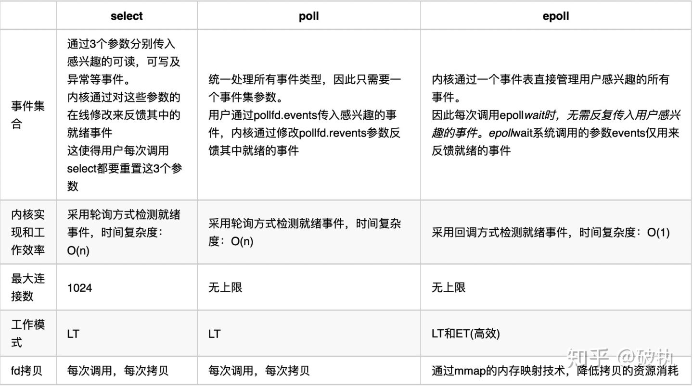

##  **1.BIO、NIO 和 AIO 的区别？** 

**BIO：**一个连接一个线程，客户端有连接请求时服务器端就需要启动一个线程进行处理。线程开销大。

**伪异步 IO：**将请求连接放入线程池，一对多，但线程还是很宝贵的资源。

**NIO：**一个请求一个线程，但客户端发送的连接请求都会注册到多路复用器上，多路复用器轮询到连接有 I/O 请求时才启动一个线程进行处理。

**AIO：**一个有效请求一个线程，客户端的 I/O 请求都是由 OS 先完成了再通知服务器应用去启动线程进行处理。

BIO 是面向流的，NIO 是面向缓冲区的；BIO 的各种流是阻塞的。而 NIO 是非阻塞的；BIO的 Stream 是单向的，而 NIO 的 channel 是双向的。

**NIO 的特点：**事件驱动模型、单线程处理多任务、非阻塞 I/O，I/O 读写不再阻塞，而是返回 0、基于 block 的传输比基于流的传输更高效、更高级的 IO 函数 zero-copy、IO 多路复用大大提高了 Java 网络应用的可伸缩性和实用性。基于 Reactor 线程模型。

## **2.NIO 的组成？**

**Buffer：**与 Channel 进行交互，数据是从 Channel 读入缓冲区，从缓冲区写入 Channel 中的

> **flip 方法 ：** 反转此缓冲区，将 position 给 limit，然后将 position 置为 0，其实就是切换读写模式
>
> **clear 方法 ：**清除此缓冲区，将 position 置为 0，把 capacity 的值给 limit。
>
> **rewind 方法 ：** 重绕此缓冲区，将 position 置为 0
>
> **DirectByteBuffer** ：可减少一次系统空间到用户空间的拷贝。但 Buffer 创建和销毁的成本更高，不可控，通常会用内存池来提高性能。直接缓冲区主要分配给那些易受基础系统的本机 I/O 操作影响的大型、持久的缓冲区。如果数据量比较小的中小应用情况下，可以考虑使用 heapBuffer，由 JVM 进行管理。

**Channel：**表示 IO 源与目标打开的连接，是双向的，但不能直接访问数据，只能与 Buffer进行交互。通过源码可知，FileChannel 的 read 方法和 write 方法都导致数据复制了两次！

**Selector：**可使一个单独的线程管理多个 Channel，open 方法可创建 Selector，register 方法向多路复用器器注册通道，可以监听的事件类型：读、写、连接、accept。注册事件后会产生一个SelectionKey：它表示 SelectableChannel 和 Selector 之间的注册关系，**wakeup 方法**：使尚未返回的第一个选择操作立即返回，唤醒的原因是：注册了新的 channel 或者事件；channel 关闭，取消注册；优先级更高的事件触发（如定时器事件），希望及时处理。

> Selector 在 Linux 的实现类是 EPollSelectorImpl，委托给 EPollArrayWrapper 实现，其中三个native 方法是对 epoll 的封装，而 EPollSelectorImpl. implRegister 方法，通过调用 epoll_ctl向 epoll 实例中注册事件，还将注册的文件描述符(fd)与 SelectionKey 的对应关系添加到fdToKey 中，这个 map 维护了文件描述符与 SelectionKey 的映射。
>
> fdToKey 有时会变得非常大，因为注册到 Selector 上的 Channel 非常多（百万连接）；过期或失效的 Channel 没有及时关闭。fdToKey 总是串行读取的，而读取是在 select 方法中进行的，该方法是非线程安全的。

 **Pipe：**两个线程之间的单向数据连接，数据会被写到 sink 通道，从 source 通道读取

**NIO 的服务端建立过程：Selector.open()：**打开一个 Selector； **ServerSocketChannel.open()：**

创建服务端的 Channel；  **bind()：**绑定到某个端口上。并配置非阻塞模式；  **register()：**注册Channel 和关注的事件到 Selector 上； **select()：**轮询拿到已经就绪的事件

##  **3.Netty 的特点？** 

 	一个高性能、异步事件驱动的 NIO 框架，它提供了对 TCP、UDP 和文件传输的支持使用更高效的 socket 底层，对 epoll 空轮询引起的 cpu 占用飙升在内部进行了处理，避免了直接使用 NIO 的陷阱，简化了 NIO 的处理方式。 

## 4.Netty 的线程模型？

 **单线程模型**   所有 I/O 操作都由一个线程完成，即 多路复用、事件分发和处理 

 **多线程模型：**  有一个 NIO 线程（Acceptor） 只负责监听服务端，接收客户端的 TCP 连接请求；  NIO 线程池负责网络 IO 的操作，即消息的读取、解码、编码和发送；

**主从多线程模型：** Acceptor线程用于绑定监听端口，接收客户端连接，将 SocketChannel从主线程池的 Reactor 线程的多路复用器上移除，重新注册到 Sub 线程池的线程上，用于处理 I/O 的读写等操作，从而保证 mainReactor 只负责接入认证、握手等操作； 

##  **5.TCP 粘包/拆包的原因及解决方法？** 

TCP 是以流的方式来处理数据，一个完整的包可能会被 TCP 拆分成多个包进行发送，也可能把小的封装成一个大的数据包发送。

**TCP 粘包/分包的原因：**

应用程序写入的字节大小大于套接字发送缓冲区的大小，会发生拆包现象，而应用程序写入数据小于套接字缓冲区大小，网卡将应用多次写入的数据发送到网络上，这将会发生粘包现象；

解决问题的关键在于如何给每个数据包添加边界信息，常用的方法如下：

- 发送端给每个数据包添加包首部，首部中应该至少包含数据包的长度，这样接收端在接收到数据后，通过读取包首部的长度字段，便知道每一个数据包的实际长度了。
- 发送端将每个数据包封装为固定长度（不够的可以通过补0填充），这样接收端每次从接收缓冲区中读取固定长度的数据就自然而然的把每个数据包拆分开来。
- 可以在数据包之间设置边界，如添加特殊符号，这样，接收端通过这个边界就可以将不同的数据包拆分开。

**解决方法**

**消息定长：**FixedLengthFrameDecoder 类

**包尾增加特殊字符分割：**行分隔符类：LineBasedFrameDecoder 或自定义分隔符类

**DelimiterBasedFrameDecoder：**将消息分为消息头和消息体：LengthFieldBasedFrameDecoder 类。分为有头部的拆包与粘包、长度字段在前且有头部的拆包与粘包、多扩展头部的拆包与粘包。

##  **6.了解哪几种序列化协议？** 

 序列化（编码）是将对象序列化为二进制形式（字节数组），主要用于网络传输、数据持久化等；而反序列化（解码）则是将从网络、磁盘等读取的字节数组还原成原始对象，主要用于网络传输对象的解码，以便完成远程调用。 

 **影响序列化性能的关键因素：**序列化后的码流大小（网络带宽的占用）、序列化的性能（CPU 资源占用）；是否支持跨语言（异构系统的对接和开发语言切换）。 

----------------------

**Java 默认提供的序列化：**无法跨语言、序列化后的码流太大、序列化的性能差

------------------------------------

**XML，优点：**人机可读性好，可指定元素或特性的名称。

**缺点：**序列化数据只包含数据本身以及类的结构，不包括类型标识和程序集信息；只能序列化公共属性和字段；不能序列化方法；文件庞大，文件格式复杂，传输占带宽。

**适用场景：**当做配置文件存储数据，实时数据转换。

----------------------------------

**JSON**，是一种轻量级的数据交换格式，

**优点：**兼容性高、数据格式比较简单，易于读写、序列化后数据较小，可扩展性好，兼容性好、与 XML 相比，其协议比较简单，解析速度比较快。

**缺点：**数据的描述性比 XML 差、不适合性能要求为 ms 级别的情况、额外空间开销比较大。

**适用场景（可替代ＸＭＬ）：**跨防火墙访问、可调式性要求高、基于 Webbrowser 的 Ajax 请求、传输数据量相对小，实时性要求相对低（例如秒级别）的服务。

-------------------------------------------

**Fastjson**，采用一种“假定有序快速匹配”的算法。

**优点：**接口简单易用、目前 java 语言中最快的 json 库。

**缺点：**过于注重快，而偏离了“标准”及功能性、代码质量不高，文档不全。

**适用场景：**协议交互、Web 输出、Android 客户端

-----------------------------------------------

**Thrift，**不仅是序列化协议，还是一个 RPC 框架。

**优点：**序列化后的体积小, 速度快、支持多种语言和丰富的数据类型、对于数据字段的增删具有较强的兼容性、支持二进制压缩编码。

**缺点：**使用者较少、跨防火墙访问时，不安全、不具有可读性，调试代码时相对困难、不能与其他传输层协议共同使用（例如 HTTP）、无法支持向持久层直接读写数据，即不适合做数据持久化序列化协议。

**适用场景：**分布式系统的 RPC 解决方案

----------------------------------------------------

**Avro，**Hadoop 的一个子项目，解决了 JSON 的冗长和没有 IDL 的问题。

**优点：**支持丰富的数据类型、简单的动态语言结合功能、具有自我描述属性、提高了数据解析速度、快速可压缩的二进制数据形式、可以实现远程过程调用 RPC、支持跨编程语言实现。

**缺点：**对于习惯于静态类型语言的用户不直观。

**适用场景：**在 Hadoop 中做 Hive、Pig 和MapReduce的持久化数据格式。

------------------------------------------------------

**Protobuf，**将数据结构以.proto 文件进行描述，通过代码生成工具可以生成对应数据结构的POJO 对象和 Protobuf 相关的方法和属性。

**优点：**序列化后码流小，性能高、结构化数据存储格式（XML JSON 等）、通过标识字段的顺序，可以实现协议的前向兼容、结构化的文档更容易管理和维护。

**缺点：**需要依赖于工具生成代码、支持的语言相对较少，官方只支持Java 、C++ 、python。

**适用场景：**对性能要求高的 RPC 调用、具有良好的跨防火墙的访问属性、适合应用层对象的持久化

>  具体场景
>
>  对于公司间的系统调用，如果性能要求在 100ms 以上的服务，基于 XML 的 SOAP 协议是一个值得考虑的方案。
>
>  基于 Web browser 的 Ajax，以及 Mobile app 与服务端之间的通讯，JSON 协议是首选。对于性能要求不太高，或者以动态类型语言为主，或者传输数据载荷很小的的运用场景，JSON也是非常不错的选择。
>
>  对于调试环境比较恶劣的场景，采用 JSON 或 XML 能够极大的提高调试效率，降低系统开发成本。
>
>  当对性能和简洁性有极高要求的场景，Protobuf，Thrift，Avro 之间具有一定的竞争关系。
>
>  对于 T 级别的数据的持久化应用场景，Protobuf 和 Avro 是首要选择。如果持久化后的数据存储在 hadoop 子项目里，Avro 会是更好的选择。
>
>  对于持久层非 Hadoop 项目，以静态类型语言为主的应用场景，Protobuf 会更符合静态类型语言工程师的开发习惯。由于 Avro 的设计理念偏向于动态类型语言，对于动态语言为主的应用场景，Avro 是更好的选择。
>
>  如果需要提供一个完整的 RPC 解决方案，Thrift 是一个好的选择。
>
>  如果序列化之后需要支持不同的传输层协议，或者需要跨防火墙访问的高性能场景，Protobuf 可以优先考虑。

##  **7.Netty 的零拷贝实现？** 

Netty 的 Zero-copy 体现在如下几个个方面:

- Netty 提供了 CompositeByteBuf 类, 它可以将多个 ByteBuf 合并为一个逻辑上的 ByteBuf, 避免了各个 ByteBuf 之间的拷贝.
- 通过 wrap 操作, 我们可以将 byte[] 数组、ByteBuf、ByteBuffer等包装成一个 Netty ByteBuf 对象, 进而避免了拷贝操作.
- ByteBuf 支持 slice 操作, 因此可以将 ByteBuf 分解为多个共享同一个存储区域的 ByteBuf, 避免了内存的拷贝.

## 8.netty对NIO改进？

**Selector BUG：**若 Selector 的轮询结果为空，也没有 wakeup 或新消息处理，则发生空轮询，CPU 使用率 100%，

 这个bug只出现在linux系统下，因为linux下NIO底层使用的是epoll来实现的，而java的epoll实现存在bug，导致selector出现了这种轮询为空却唤醒的情况。windows下NIO是使用的poll来实现selector的就不存在这种bug 

Netty 的解决办法：对 Selector 的 select 操作周期进行统计，每完成一次空的 select 操作进行一次计数，若在某个周期内连续发生 N 次空轮询，则触发了 epoll 死循环 bug。重建Selector，判断是否是其他线程发起的重建请求，若不是则将原 SocketChannel 从旧的Selector 上去除注册，重新注册到新的 Selector 上，并将原来的 Selector 关闭。

>  1、设置一个selector.select(timeout)，有一个超时时间，selector有4种情况会跳出阻塞
>
>  有事件发生
>  wakeup
>  超时
>  空轮询bug
>  而前两种返回值不为0，可以跳出循环，超时有时间戳记录，所以每次空轮询，有专门 的计数器+1，如果空轮询的次数超过了512次，就认为其触发了空轮询bug。
>
>  2、触发bug后，netty直接重建一个selector，将原来的channel重新注册到新的selector上，将旧的 selector关掉

##  **9.Netty 的高性能表现在哪些方面？** 

**心跳，对服务端：**会定时清除闲置会话 inactive(netty5)，对客户端:用来检测会话是否断开，是否重来，检测网络延迟，其中 idleStateHandler 类 用来检测会话状态

**串行无锁化设计，**即消息的处理尽可能在同一个线程内完成，期间不进行线程切换，这样就避免了多线程竞争和同步锁。表面上看，串行化设计似乎 CPU 利用率不高，并发程度不够。但是，通过调整 NIO 线程池的线程参数，可以同时启动多个串行化的线程并行运行，这种局部无锁化的串行线程设计相比一个队列-多个工作线程模型性能更优。

**可靠性，链路有效性检测：**链路空闲检测机制，读/写空闲超时机制；内存保护机制：通过内存池重用 ByteBuf;ByteBuf 的解码保护；优雅停机：不再接收新消息、退出前的预处理操作、资源的释放操作。

**Netty 安全性：**支持的安全协议：SSL V2 和 V3，TLS，SSL 单向认证、双向认证和第三方 CA证。

**高效并发编程的体现：**volatile 的大量、正确使用；CAS 和原子类的广泛使用；线程安全容器的使用；通过读写锁提升并发性能。IO 通信性能三原则：传输（AIO）、协议（Http）、线程（主从多线程）

**流量整型的作用（变压器）：**防止由于上下游网元性能不均衡导致下游网元被压垮，业务流中断；防止由于通信模块接受消息过快，后端业务线程处理不及时导致撑死问题。

**TCP 参数配置：**SO_RCVBUF 和 SO_SNDBUF：通常建议值为 128K 或者 256K；

SO_TCPNODELAY：NAGLE 算法通过将缓冲区内的小封包自动相连，组成较大的封包，阻止大量小封包的发送阻塞网络，从而提高网络应用效率。但是对于时延敏感的应用场景需要关闭该优化算法；

## **10.NIOEventLoopGroup 源码？**

 	NioEventLoopGroup(其实是 MultithreadEventExecutorGroup)内部维护一个类型为EventExecutor children [], 默认大小是处理器核数 * 2, 这样就构成了一个线程池，初始化EventExecutor 时 NioEventLoopGroup 重载 newChild 方法，所以 children 元素的实际类型为NioEventLoop。

 	线程启动时调用 SingleThreadEventExecutor 的构造方法，执行 NioEventLoop 类的 run 方法，首先会调用 hasTasks()方法判断当前 taskQueue 是否有元素。如果 taskQueue 中有元素，执行selectNow() 方法，最终执行 selector.selectNow()，该方法会立即返回。如果taskQueue 没有元素，执行 select(oldWakenUp) 方法

  	select ( oldWakenUp) 方法解决了 Nio 中的 bug，selectCnt 用来记录 selector.select 方法的执行次数和标识是否执行过 selector.selectNow()，若触发了 epoll 的空轮询 bug，则会反复执行 selector.select(timeoutMillis)，变量 selectCnt 会逐渐变大，当 selectCnt 达到阈值（默认 512），则执行 rebuildSelector 方法，进行 selector 重建，解决 cpu 占用 100%的 bug。

  	rebuildSelector 方法先通过 openSelector 方法创建一个新的 selector。然后将 old selector 的selectionKey 执行 cancel。最后将 old selector 的 channel 重新注册到新的 selector 中。rebuild 后，需要重新执行方法 selectNow，检查是否有已 ready 的 selectionKey。

  	接下来调用 processSelectedKeys 方法（处理 I/O 任务），当 selectedKeys != null 时，调用processSelectedKeysOptimized 方法，迭代 selectedKeys 获取就绪的 IO 事件的 selectkey 存

放在数组 selectedKeys 中,然后为每个事件都调用processSelectedKey来处理它，processSelectedKey 中分别处理 OP_READ；OP_WRITE；OP_CONNECT 事件。

 

最后调用 runAllTasks 方法（非 IO 任务），该方法首先会调用 fetchFromScheduledTaskQueue方法，把 scheduledTaskQueue 中已经超过延迟执行时间的任务移到 taskQueue 中等待被执行，然后依次从 taskQueue 中取任务执行，每执行 64 个任务，进行耗时检查，如果已执行时间超过预先设定的执行时间，则停止执行非 IO 任务，避免非 IO 任务太多，影响 IO 任务的执行。

 

每个 NioEventLoop 对应一个线程和一个 Selector，NioServerSocketChannel 会主动注册到某一个 NioEventLoop 的 Selector 上，NioEventLoop 负责事件轮询。

 

Outbound 事件都是请求事件, 发起者是 Channel，处理者是 unsafe，通过 Outbound 事件进行通知，传播方向是 tail 到 head。Inbound 事件发起者是 unsafe，事件的处理者是Channel, 是通知事件，传播方向是从头到尾。

 

内存管理机制，首先会预申请一大块内存 Arena，Arena 由许多 Chunk 组成，而每个 Chunk默认由 2048 个 page 组成。Chunk 通过 AVL 树的形式组织 Page，每个叶子节点表示一个Page，而中间节点表示内存区域，节点自己记录它在整个 Arena 中的偏移地址。当区域被分配出去后，中间节点上的标记位会被标记，这样就表示这个中间节点以下的所有节点都已被分配了。大于 8k 的内存分配在 poolChunkList 中，而 PoolSubpage 用于分配小于 8k 的内存，它会把一个 page 分割成多段，进行内存分配。

 

ByteBuf 的特点：支持自动扩容（4M），保证 put 方法不会抛出异常、通过内置的复合缓冲类型，实现零拷贝（zero-copy）；不需要调用 flip()来切换读/写模式，读取和写入索引分开；方法链；引用计数基于 AtomicIntegerFieldUpdater 用于内存回收；PooledByteBuf 采用二叉树来实现一个内存池，集中管理内存的分配和释放，不用每次使用都新建一个缓冲区对象。UnpooledHeapByteBuf 每次都会新建一个缓冲区对象。

##  11.select、poll、epoll的机制及其区别？ 

  

 select、poll、epoll都是I/O多路复用的机制。I/O多路复用就是通过一种机制，一个进程可以监视多个文件描述符，一旦某个描述符就绪（读就绪或写就绪），能够通知程序进行相应的读写操作 

## 12.说说Netty的执行流程？ 

1. 创建ServerBootStrap实例
2. 设置并绑定Reactor线程池：EventLoopGroup，EventLoop就是处理所有注册到本线程的Selector上面的Channel
3. 设置并绑定服务端的channel
4. 创建处理网络事件的ChannelPipeline和handler，网络时间以流的形式在其中流转，handler完成多数的功能定制：比如编解码 SSl安全认证
5. 绑定并启动监听端口
6. 当轮训到准备就绪的channel后，由Reactor线程：NioEventLoop执行pipline中的方法，最终调度并执行channelHandler

[netty面试题及解答]: https://www.cnblogs.com/xiaoyangjia/p/11526197.html

