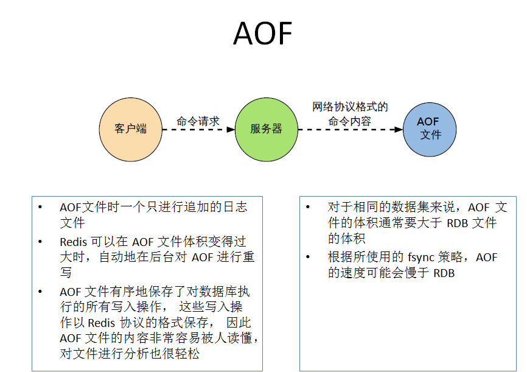

# Redis

## 背景及介绍

 	随着访问量的上升，几乎大部分使用MySQL架构的网站在数据库上都开始出现了性能问题，web程序不再仅仅专注在功能上，同时也在追求性能。程序员们开始大量的使用缓存技术来缓解数据库的压力，优化数据库的结构和索引.Memcached或Redis相当于在DAO层与数据库实例之间挡了一层，众所周知，对数据库来说，压力主要来自于大量频繁的查询，我们把频繁查询并且固定的数据放到缓存当中，这样以后查询的时候就会从缓存中去读取数据，从而减轻了数据库的压力。
**Redis:REmote DIctionary Server(远程字典服务器) **是完全开源免费的，用C语言编写的，遵守BSD协议，是一个**高性能的(key/value)分布式内存数据库**，基于内存运行并**支持持久化的NoSQL数据库**，是当前最热门的NoSql数据库之一,也被人们称为数据结构服务器。
**用途**

1. 内存存储和持久化：redis支持异步将内存中的数据写到硬盘上，同时不影响继续服务
2. 发布、订阅消息系统
3. 模拟类似于HttpSession这种需要设定过期时间的功能
4. 取最新N个数据的操作，如：可以将最新的10条评论的ID放在Redis的List集合里面
5. 定时器、计数器

## 安装

1. 下载并解压redis-3.0.4.tar.gz
2. 执行make命令
      jemalloc/jemalloc.h:没有那个文件-----解决方案：执行命令：make MALLOC=libc
3. 执行 make install
4. 查看默认安装目录 usr/local/bin 


>Redis-benchmark:性能测试工具，可以在自己本子运行，看看自己本子性能如何
>Redis-check-aof：修复有问题的AOF文件，rdb和aof后面讲
>Redis-check-dump：修复有问题的dump.rdb文件
>Redis-cli：客户端，操作入口
>Redis-sentinel：redis集群使用
>Redis-server：Redis服务器启动命令

5. 修改redis.conf文件将里面的daemonize no 改成 yes，让服务在后台启动，将默认的redis.conf拷贝到自己定义好的一个路径下，比如/myconf
6. redis-server 路径/redis.conf 启动redis服务
7. ps -ef |grep redis 查看redis进程
8. 本地client访问redis,redis-cli  -p 6379(redis进程端口号)
9. 单实例关闭：redis-cli shutdown，多实例关闭，指定端口关闭:redis-cli -p 6379 shutdown

>1.单进程
>单进程模型来处理客户端的请求。对读写等事件的响应是通过对epoll函数的包装来做到的。Redis的实际处理速度完全依靠主进程的执行效率
>Epoll是Linux内核为处理大批量文件描述符而作了改进的epoll，是Linux下多路复用IO接口select/poll的增强版本，它能显著提高程序在大量并发连接中只有少量活跃的情况下的系统CPU利用率。
>2.默认16个数据库，类似数组下表从零开始，初始默认使用零号库
>设置数据库的数量，默l认数据库为0，可以使用SELECT <dbid>命令在连接上指定数据库id
>databases 16
>3.Select命令切换数据库
>4.Dbsize查看当前数据库的key的数量
>5.Flushdb：清空当前库
>6.Flushall；通杀全部库
>7.统一密码管理，16个库都是同样密码，要么都OK要么一个也连接不上
>8.Redis索引都是从零开始

## 常用API


## redis常用配置

[redis 常用配置记录](https://blog.csdn.net/shiniar/article/details/93718503)

## Redis持久化-RDB

### 1)RDB （Redis DataBase） 

1. **概念：**在指定时间间隔将内存中数据快照集写入磁盘,即Snapshot快照
2. **原理：**
   Redis会单独创建（fork）一个子进程来进行持久化，会先将数据写入到
   一个临时文件中，待持久化过程都结束了，再用这个临时文件替换上次持久化好的文件。
   整个过程中，主进程是不进行任何IO操作的，确保了极高的性能。
    	Fork的作用是复制一个与当前进程一样的进程。新进程的所有数据（变量、环境变量、程序计数器等）数值都和原进程一致。Rdb以dump.rdb形式保存。
3. **相关配置**

> * save 默认的save选项设置为：
>   save 900 1
>    	save 300 10
>    	save 60 10000
>    	即 在900秒内有一个更改，那么就把这个更改从内存写入到磁盘中，同理，下面两句分别是300秒内有10个更改或者60秒内有10000个更改，那么就把更改从内存写入到磁盘中；这三个条件触发任意一个就会执行写入磁盘的操作，参数可根据实际来进行调整
>   * stop-writes-on-bgsave-error 设置当快照失败的时候后续是否停止写数据到磁盘，默认是开启的，即快照失败则停止写入到磁盘，这样会导致一旦有一点写错，后面的操作就不再执行了。综合考虑后，应该默认开启，当遇到快照问题，暂时需要继续写操作的时候进行开启，然后再在合适的时间解决造成快照失败的问题。
>   * rdbcompression 设置快照是否压缩，默认是进行压缩，压缩的话会消耗cpu资源，不压缩则会占用硬盘资源，所以这个要根据服务器的配置进行选择
>   * rdbchecksum 设置是否对rdb数据进行校验，默认是进行校验，这会消耗cpu资源
>   * dbfilename 设置rdb的文件名称，默认是dump.rdb
>   * dir 设置rdb的存放目录，默认是与redis.conf在同一目录下

3. **触发(达到下列条件之一)，会在目录下生成dump.rdb文件**

  * 达到配置文件中快照设置保存条件
  * 执行save 或者bgsave命令

> SAVE  保存是阻塞主进程，客户端无法连接redis，等SAVE完成后，主进程才开始工作，客户端可以连接
>
> BGSAVE  是fork一个save的子进程，在执行save过程中，不影响主进程，客户端可以正常链接redis，等子进程fork执行save完成后，通知主进程，子进程关闭。很明显BGSAVE方式比较适合线上的维护操作，两种方式的使用一定要了解清楚在谨慎选择。

**注意：**执行flushall命令，产生空dump.rdb文件（覆盖原有），为空，无意义

4. **恢复**

  * 将备份文件 (dump.rdb) 移动到 redis 安装目录（redis server所在目录）并启动服务即可
  * CONFIG GET dir 获取dump.rdb存储目录

5. **优势**

  * 适合大规模的数据恢复
  * 对数据完整性和一致性要求不高

6. **劣势**

  * 在一定间隔时间做一次备份，所以如果redis意外down掉的话，就会丢失最后一次快照后的所有修改
  * Fork的时候，内存中的数据被克隆了一份，大致2倍的膨胀性需要考虑


###  2)AOF(Append Only File)

1.原理：以日志的形式来记录每个**写操作**，将Redis执行过的所有写指令记录下来(读操作不记录)，只许追加文件但不可以改写文件，redis启动之初会读取该文件重新构建数据
当AOF和RDB同时存在时加载AOF。

2.AOF启动

  * 修改默认的appendonly no，改为yes
  * 将有数据的aof文件复制一份保存到对应目录(config get dir)
  * 若AOF文件异常，则无法启动redis服务，可以使用redis-check-aof --fix appendonly.aof修复aof文件（修复前备份）
  * 恢复：重启redis然后重新加载

3. Rewrite
   **原理:**AOF文件持续增长而过大时，会fork出一条新进程来将文件重写(也是先写临时文件最后再rename)，遍历新进程的内存中数据，每条记录有一条的Set语句。重写aof文件的操作，并没有读取旧的aof文件，而是将整个内存中的数据库内容用命令的方式重写了一个新的aof文件，这点和快照有点类似
   **触发机制:**默认配置是当AOF文件大小是上次rewrite后大小的一倍且文件大于64M时触发
4. 配置文件

>* appendonly 设置是否开启aof，aof优势在于数据的完整性和一致性更高，如果在重要的生产环境下，建议ROF和AOF都开启
>* appendfilename 设置AOF文件名，默认是appendonly.aof
>* appendfsync 指定日志更新条件，三个选项，always为同步持久化，每次发生数据变化立刻会写入到磁盘中，性能较差但是数据完整性比较好；默认为 everysec，每秒异步记录一次；no为不等待磁盘同步，直接写入aof文件
>* no-appendfsync-on-rewrite  这个参数设置为no，是最安全的方式，不会丢失数据，但是要忍受阻塞的问题。若设置为yes则相当于将appendfsync设置为no，这说明并没有执行磁盘操作，只是写入了缓冲区，所以并不会造成阻塞（因为没有竞争磁盘），但是如果这个时候redis挂掉，就会丢失数据。在linux的操作系统的默认设置下，最多会丢失30s的数据。综上，如果应用系统无法忍受延迟，而可以容忍少量的数据丢失，则设置为yes。如果应用系统无法忍受数据丢失，则设置为no。
>* auto-aof-rewrite-percentage  相对于上次aof文件大小的增长百分比如果超过这个值,则重写aof，默认是100
>* auto-aof-rewrite-min-size 自动重写aof文件的最小大小,比 auto-aof-rewrite-percentage优先级高，默认是64mb

5. 优劣
   * 同步粒度更细，保存更完整
   * 相同数据集的数据而言aof文件要远大于rdb文件，恢复速度慢于rdb，运行效率略慢于RDB



### 3)RDB与AOF

* 对于数据完整性要求低，想要快速备份可以只开RDB
* 只做缓存可以不使用持久化方式
* 同时开启两种持久化方式（不建议只开AOF,RDB更适合备份数据库）

7. 性能建议

  * RDB只做后备用途，建议只在Slave上持久化，只要15分钟备份一次足够
  * Enable AOF,丢失数据少，但带来持续IO,rewrite过程中造成阻塞，应减少rewrite频率，将重写大小设置到5G以上
  * disable AOF，使用Master-Slave-Replication 实现高可用性，避免AOF缺点但可能丢失相对多数据，较为常用。

## Redis事务

 	**定义：**一个事务中的所有命令都会序列化，按顺序地串行化执行而不会被其它命令插入，不许加塞。
 	**常用：**

  * discard:取消事务放弃事务块所有命令

  * multi:标记事务块开启

  * exec:执行所有事务块内命令

  * unwatch 取消对所有key监视

  * watch key 监视一个或多个key,如果key被其他命令改动，那么事务将被打断

  
	

**注意：**

* 如果事务块中有**语法错误**将终止事务块内所有命令执行，否则除异常命令外都将执行
* Watch指令，类似乐观锁，事务提交时，如果Key的值已被别的客户端改变，比如某个list已被别的客户端push/pop过了，整个事务队列都不会被执行 

  


**特性：**
 	1.单独的隔离操作：事务中的所有命令都会序列化、按顺序地执行。事务在执行的过程中，不会被其他客户端发送来的命令请求所打断。
 	2.没有隔离级别的概念：队列中的命令没有提交之前都不会实际的被执行，因为事务提交前任何指令都不会被实际执行，也就不存在”事务内的查询要看到事务里的更新，在事务外查询不能看到”这个让人万分头痛的问题
 	3.不保证原子性：redis同一个事务中如果有一条命令执行失败，其后的命令仍然会被执行，没有回滚
 	4.将多个命令入队到事务中，接到这些命令并不会立即执行，而是放到等待执行的事务队列里面

## Redis主从复制

作用：

* 容灾恢复
* 读写分类

过程

1. 新建redisclient,配置cp redis.conf  redis6379.conf
   *daemonize yes

  * pidfile   原路径+文件名字(redis6379.conf)
  * 指定端口
  * Log文件名字（6379.log）

2. 主从复制命令

  * slaveof 127.0.0.1 6379 从节点运行，后面为主节点ip及端口
  * INFO replication 查看主从副本状态
  * SLAVEOF no one 使当前数据库停止与其他数据库的同步，转成主数据库


3. 主从问题

  * 新的slave从头复制
  * 主机shutdown,从机原地待命，主机返回从机继续复制
  * 主机返回从机继续复制。从机shutdown返回执行slaveof命令
  * 只要是重新连接master,一次完全同步（全量复制)将被自动执行

4. 哨兵模式（sentinel）

1)新建配置文件sentinel.conf，填写内容

```
sentinel monitor 被监控数据库名字(自己起名字) 127.0.0.1 6379 1
```

上面最后一个数字1，表示主机挂掉后salve投票看让谁接替成为主机，得票数多成为主机,的票一样重新选
2)执行

```
redis-server.sh sentinel.conf --sentinel
或
redis-sentinel sentinel.conf
```

其他：

* master挂后恢复状态为slave
* 一组sentinel能同时监控多个Master
* 复制延时
  由于所有的写操作都是先在Master上操作，然后同步更新到Slave上，所以从Master同步到Slave机器有一定的延迟，当系统很繁忙的时候，延迟问题会更加严重，Slave机器数量的增加也会使这个问题更加严重。
  ddd]https://www.cnblogs.com/pony1223/p/9569212.htm 


## Redis连接池

```java
package com.test;

import redis.clients.jedis.Jedis;
import redis.clients.jedis.JedisPool;
import redis.clients.jedis.JedisPoolConfig;

public  class RedisUtil {
    //Redis服务器IP
    private static String ADDR = "192.168.0.41";
    
    //Redis的端口号
    private static int PORT = 6379;
    
    //访问密码
    private static String AUTH = "admin";
    
    //可用连接实例的最大数目，默认值为8；
    //如果赋值为-1，则表示不限制；如果pool已经分配了maxActive个jedis实例，则此时pool的状态为exhausted(耗尽)。
    private static int MAX_TOTAL = 8;
    
    //最小空闲连接数, 默认0
    private static int MIN_IDLE=0;
    
    //控制一个pool最多有多少个状态为idle(空闲的)的jedis实例，默认值也是8。
    //最大空闲连接数, 默认8个
    private static int MAX_IDLE = 8;
    
    //获取连接时的最大等待毫秒数(如果设置为阻塞时BlockWhenExhausted),如果超时就抛异常, 小于零:阻塞不确定的时间,  默认-1
    //等待可用连接的最大时间，单位毫秒，默认值为-1，表示永不超时。如果超过等待时间，则直接抛出JedisConnectionException；
    private static int MAX_WAIT = -1;
    
    private static int TIMEOUT = 10000;
    
    //连接耗尽时是否阻塞, false报异常,ture阻塞直到超时, 默认true
    private static boolean BLOCK_WHEN_EXHAUSTED = false;
    
    //设置的逐出策略类名, 默认DefaultEvictionPolicy(当连接超过最大空闲时间,或连接数超过最大空闲连接数)
    private static String EVICTION_POLICY_CLASSNAME="org.apache.commons.pool2.impl.DefaultEvictionPolicy";
    
    //是否启用pool的jmx管理功能, 默认true
    private static boolean JMX_ENABLED=true;
   
    //MBean ObjectName = new ObjectName("org.apache.commons.pool2:type=GenericObjectPool,name=" + "pool" + i); 默认为"pool", JMX不熟,具体不知道是干啥的...默认就好.
    private static String JMX_NAME_PREFIX="pool";
    
    //是否启用后进先出, 默认true
    private static boolean LIFO=true;
    
    //逐出连接的最小空闲时间 默认1800000毫秒(30分钟)
    private static long MIN_EVICTABLE_IDLE_TIME_MILLIS=1800000L;
    
    //对象空闲多久后逐出, 当空闲时间>该值 且 空闲连接>最大空闲数 时直接逐出,不再根据MinEvictableIdleTimeMillis判断  (默认逐出策略)   
    private static long SOFT_MIN_EVICTABLE_IDLE_TIME_MILLIS=1800000L;
    
    //每次逐出检查时 逐出的最大数目 如果为负数就是 : 1/abs(n), 默认3
    private static int NUM_TESTS_PER_EVICYION_RUN=3;
    
    //在borrow一个jedis实例时，是否提前进行validate操作；如果为true，则得到的jedis实例均是可用的；
    //在获取连接的时候检查有效性, 默认false
    private static boolean TEST_ON_BORROW = false;
    
    //在空闲时检查有效性, 默认false
    private static boolean TEST_WHILEIDLE=false;
    
    //逐出扫描的时间间隔(毫秒) 如果为负数,则不运行逐出线程, 默认-1
    private static long TIME_BERWEEN_EVICTION_RUNS_MILLIS=-1;
    
    private static JedisPool jedisPool = null;
    
    /**
     * 初始化Redis连接池
     */
    static {
        try {
            JedisPoolConfig config = new JedisPoolConfig();
            config.setBlockWhenExhausted(BLOCK_WHEN_EXHAUSTED);
            config.setEvictionPolicyClassName(EVICTION_POLICY_CLASSNAME); 
            config.setJmxEnabled(JMX_ENABLED);
            config.setJmxNamePrefix(JMX_NAME_PREFIX);
            config.setLifo(LIFO);
            config.setMaxIdle(MAX_IDLE);
            config.setMaxTotal(MAX_TOTAL);
            config.setMaxWaitMillis(MAX_WAIT);
            config.setMinEvictableIdleTimeMillis(MIN_EVICTABLE_IDLE_TIME_MILLIS);
            config.setMinIdle(MIN_IDLE);
            config.setNumTestsPerEvictionRun(NUM_TESTS_PER_EVICYION_RUN);
            config.setSoftMinEvictableIdleTimeMillis(SOFT_MIN_EVICTABLE_IDLE_TIME_MILLIS);
            config.setTestOnBorrow(TEST_ON_BORROW);
            config.setTestWhileIdle(TEST_WHILEIDLE);
            config.setTimeBetweenEvictionRunsMillis(TIME_BERWEEN_EVICTION_RUNS_MILLIS);
            
            jedisPool = new JedisPool(config, ADDR, PORT, TIMEOUT, AUTH);
        } catch (Exception e) {
            e.printStackTrace();
        }
    }
    
    /**
     * 获取Jedis实例
     * @return
     */
    public synchronized static Jedis getJedis() {
        try {
            if (jedisPool != null) {
                Jedis resource = jedisPool.getResource();
                return resource;
            } else {
                return null;
            }
        } catch (Exception e) {
            e.printStackTrace();
            return null;
        }
    }

    /**
     * 释放jedis资源
     * @param jedis
     */
    public static void close(final Jedis jedis) {
        if (jedis != null) {
            jedis.close();
        }
    }
}
```


# 参考

[redis学习]:  https://www.cnblogs.com/pony1223/category/1291208.html
[深入学习redis]: https://www.cnblogs.com/kismetv/p/9236731.html	"深入原理值得细看"

