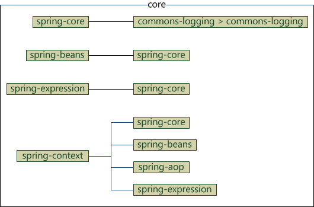

  

  

## JavaBean

JavaBean是一个遵循特定写法的Java类，是一种Java语言编写的可重用组件，它的方法命名，构造及行为必须符合特定的约定：

1、这个类必须具有一个公共的(public)无参构造函数；

2、所有属性私有化（private）；

3、私有化的属性必须通过public类型的方法（getter和setter）暴露给其他程序，并且方法的命名也必须遵循一定的命名规范。 

4、这个类应是可序列化的。（比如可以实现Serializable 接口，用于实现bean的持久性）

JavaBean在Java EE开发中，通常用于封装数据，对于遵循以上写法的JavaBean组件，其它程序可以通过反射技术实例化JavaBean对象（内省机制），并且通过反射那些遵循命名规范的方法，从而获知JavaBean的属性，进而调用其属性保存数据。


## IOC

```xml
<?xml version="1.0" encoding="UTF-8"?>
<beans xmlns="http://www.springframework.org/schema/beans"
       xmlns:xsi="http://www.w3.org/2001/XMLSchema-instance"
       xsi:schemaLocation="http://www.springframework.org/schema/beans http://www.springframework.org/schema/beans/spring-beans.xsd">

    <bean name="source" class="pojo.Source">
        <property name="fruit" value="橙子"/>
        <property name="sugar" value="多糖"/>
        <property name="size" value="超大杯"/>
    </bean>
    <bean name="juickMaker" class="pojo.JuiceMaker">
        <property name="source" ref="source" />
    </bean>
</beans>
```

```java
package test;

import org.junit.Test;
import org.springframework.context.ApplicationContext;
import org.springframework.context.support.ClassPathXmlApplicationContext;
import pojo.JuiceMaker;
import pojo.Source;

public class TestSpring {

    @Test
    public void test(){
        ApplicationContext context = new ClassPathXmlApplicationContext(
                new String[]{"applicationContext.xml"}
        );

        Source source = (Source) context.getBean("source");
        System.out.println(source.getFruit());
        System.out.println(source.getSugar());
        System.out.println(source.getSize());

        JuiceMaker juiceMaker = (JuiceMaker) context.getBean("juickMaker");
        System.out.println(juiceMaker.makeJuice());
    }
}
```

依赖注入的功能，我们怎么来做？ 无外乎：

1. 读取标注或者配置文件，看看JuiceMaker依赖的是哪个Source，拿到类名
2. 使用反射的API，基于类名实例化对应的对象实例
3. 将对象实例，通过构造函数或者 setter，传递给 JuiceMaker


----------------------------------------------------------


  

Spring IoC 容器的设计主要是基于以下两个接口：

- **BeanFactory**
- **ApplicationContext**

其中 ApplicationContext 是 BeanFactory 的子接口之一，换句话说：**BeanFactory 是 Spring IoC 容器所定义的最底层接口，**而 ApplicationContext 是其最高级接口之一，并对 BeanFactory 功能做了许多的扩展，所以在**绝大部分的工作场景下**，都会使用 ApplicationContext 作为 Spring IoC 容器。

### BeanFactory

 BeanFactory 位于设计的最底层，它提供了 Spring IoC 最底层的设计 


  

【getBean】 对应了多个方法来获取配置给 Spring IoC 容器的 Bean。
① 按照类型拿 bean：
`bean = (Bean) factory.getBean(Bean.class);`
**注意：**要求在 Spring 中只配置了一个这种类型的实例，否则报错。（如果有多个那 Spring 就懵了，不知道该获取哪一个）
② 按照 bean 的名字拿 bean:
`bean = (Bean) factory.getBean("beanName");`
**注意：**这种方法不太安全，IDE 不会检查其安全性（关联性）
③ 按照名字和类型拿 bean：**（推荐）**
`bean = (Bean) factory.getBean("beanName", Bean.class);`

【isSingleton】 用于判断是否单例，如果判断为真，其意思是该 Bean 在容器中是作为一个唯一单例存在的。而【isPrototype】则相反，如果判断为真，意思是当你从容器中获取 Bean，容器就为你生成一个新的实例。
**注意：**在默认情况下，【isSingleton】为 ture，而【isPrototype】为 false

关于 type 的匹配，这是一个按 Java 类型匹配的方式

【getAliases】方法是获取别名的方法

-------------------------------------------------------------------------------

### **ApplicationContext**

实际应用中常常会使用到的是 ApplicationContext 接口，因为 BeanFactory 的方法和功能较少，而 ApplicationContext 的方法和功能较多。 

**ApplicationContext 常见实现类：**

1.**ClassPathXmlApplicationContext：**
读取classpath中的资源

```
ApplicationContext ctx = new ClassPathXmlApplicationContext("applicationContext.xml");
```

2:**FileSystemXmlApplicationContext:-**
读取指定路径的资源

```
ApplicationContext ac = new FileSystemXmlApplicationContext("c:/applicationContext.xml");
```

3.**XmlWebApplicationContext:**
需要在Web的环境下才可以运行

```
XmlWebApplicationContext ac = new XmlWebApplicationContext(); // 这时并没有初始化容器
ac.setServletContext(servletContext); // 需要指定ServletContext对象
ac.setConfigLocation("/WEB-INF/applicationContext.xml"); // 指定配置文件路径，开头的斜线表示Web应用的根目录
ac.refresh(); // 初始化容器
```

**BeanFactory 和 ApplicationContext 的区别：**

- **BeanFactory：**是Spring中最底层的接口，只提供了最简单的IoC功能,负责配置，创建和管理bean。
  在应用中，一般不使用 BeanFactory，而推荐使用ApplicationContext（应用上下文），原因如下。
- **ApplicationContext：**
  1.继承了 BeanFactory，拥有了基本的 IoC 功能；
  2.除此之外，ApplicationContext 还提供了以下功能：
  ① 支持国际化；
  ② 支持消息机制；
  ③ 支持统一的资源加载；
  ④ 支持AOP功能；

---------------------------------------------------


### Spring Bean

#### bean常用属性

| 属性名称        | 描述                                                         |
| --------------- | ------------------------------------------------------------ |
| id              | 是一个 Bean 的唯一标识符，Spring 容器对 Bean 的配置和管理都通过该属性完成 |
| name            | Spring 容器同样可以通过此属性对容器中的 Bean 进行配置和管理，name 属性中可以为 Bean 指定多个名称，每个名称之间用逗号或分号隔开 |
| class           | 该属性指定了 Bean 的具体实现类，它必须是一个完整的类名，使用类的全限定名 |
| scope           | 用于设定 Bean 实例的作用域，其属性值有 singleton（单例）、prototype（原型）、request、session 和 global Session。其默认值是 singleton |
| constructor-arg | <bean>元素的子元素，可以使用此元素传入构造参数进行实例化。该元素的 index 属性指定构造参数的序号（从 0 开始），type 属性指定构造参数的类型 |
| property        | <bean>元素的子元素，用于调用 Bean 实例中的 Set 方法完成属性赋值，从而完成依赖注入。该元素的 name 属性指定 Bean 实例中的相应属性名 |
| ref             | <property> 和 <constructor-arg> 等元素的子元索，该元素中的 bean 属性用于指定对 Bean 工厂中某个 Bean 实例的引用 |
| value           | <property> 和 <constractor-arg> 等元素的子元素，用于直接指定一个常量值 |
| list            | 用于封装 List 或数组类型的依赖注入                           |
| set             | 用于封装 Set 类型属性的依赖注入                              |
| map             | 用于封装 Map 类型属性的依赖注入                              |
| entry           | <map> 元素的子元素，用于设置一个键值对。其 key 属性指定字符串类型的键值，ref 或 value 子元素指定其值 |

#### bean实例化

 实例化 Bean 有三种方式，分别是构造器实例化、静态工厂方式实例化和实例工厂方式实例化 

#### bean作用域

**在默认的情况下，Spring IoC 容器只会对一个 Bean 创建一个实例**（单例），但有时候，我们希望能够通过 Spring IoC 容器获取多个实例，我们可以通过 `@Scope` 注解或者 `` 元素中的 `scope` 属性来设置，例如：

```
// XML 中设置作用域
<bean id="" class="" scope="prototype" />
// 使用注解设置作用域
@Scope(ConfigurableBeanFactory.SCOPE_PROTOTYPE)
```

Spring 提供了 5 种作用域，它会根据情况来决定是否生成新的对象：

| 作用域类别              | 描述                                                         |
| :---------------------- | :----------------------------------------------------------- |
| singleton(单例)         | 在Spring IoC容器中仅存在一个Bean实例 （默认的scope）         |
| prototype(多例)         | 每次从容器中调用Bean时，都返回一个新的实例，即每次调用getBean()时 ，相当于执行new XxxBean()：不会在容器启动时创建对象 |
| request(请求)           | 用于web开发，将Bean放入request范围 ，request.setAttribute("xxx") ， 在同一个request 获得同一个Bean |
| session(会话)           | 用于web开发，将Bean 放入Session范围，在同一个Session 获得同一个Bean |
| globalSession(全局会话) | 一般用于 Porlet 应用环境 , 分布式系统存在全局 session 概念（单点登录），如果不是 porlet 环境，globalSession 等同于 Session |

在开发中主要使用 `scope="singleton"`、`scope="prototype"`，**对于MVC中的Action使用prototype类型，其他使用singleton**，Spring容器会管理 Action 对象的创建,此时把 Action 的作用域设置为 prototype.

 单例模式对于无会话状态的 Bean（如 DAO 层、Service 层）来说，是最理想的选择 


#### bean生命周期

  **Bean的定义——Bean的初始化——Bean的使用——Bean的销毁**  


### 装配bean

而在 Spring 中提供了 3 种方法进行配置：

- 在 XML 文件中显式配置
- 在 Java 的接口和类中实现配置
- 隐式 Bean 的发现机制和自动装配原则

#### 基于XML

Spring 基于 XML 的装配通常采用两种实现方式，即设值注入（Setter Injection）和构造注入（Constructor Injection）。
在 Spring 实例化 Bean 的过程中，首先会调用默认的构造方法实例化 Bean 对象，然后通过 的反射机制调用 setXxx() 方法进行属性的注入。因此，设值注入要求一个 Bean 的对应类必须满足以下两点要求。

- 必须提供一个默认的无参构造方法。
- 必须为需要注入的属性提供对应的 setter 方法。


使用设值注入时，在 Spring 配置文件中，需要使用 <bean> 元素的子元素 <property> 元素为每个属性注入值。而使用构造注入时，在配置文件中，主要使用 <constructor-arg> 标签定义构造方法的参数，可以使用其 value 属性（或子元素）设置该参数的值。

#### 基于注解

- **优势：**
  1.可以减少 XML 的配置，当配置项多的时候，臃肿难以维护
  2.功能更加强大，既能实现 XML 的功能，也提供了自动装配的功能，采用了自动装配后，程序猿所需要做的决断就少了，更加有利于对程序的开发，这就是“约定由于配置”的开发原则

在 Spring 中，它提供了两种方式来让 Spring IoC 容器发现 bean：

- **组件扫描：**通过定义资源的方式，让 Spring IoC 容器扫描对应的包，从而把 bean 装配进来。
- **自动装配：**通过注解定义，使得一些依赖关系可以通过注解完成。

**1.使用@Component 装配 Bean**

* **@Repository**用于将数据访问层（DAO层）的类标识为 Spring 中的 Bean，其功能与 @Component 相同。
* **@Service**通常作用在业务层（Service 层），用于将业务层的类标识为 Spring 中的 Bean，其功能与 @Component 相同。
* **@Controller** 通常作用在控制层， 用于将控制层的类标识为 Spring 中的 Bean，其功能与 @Component 相同 

```java
package pojo;

import org.springframework.beans.factory.annotation.Value;
import org.springframework.stereotype.Component;

@Component(value = "student1")
public class Student {

    @Value("1")
    int id;
    @Value("student_name_1")
    String name;

    // getter and setter
}
```

**自动装配 @Autowired** 

```java
/* 包名和import */
public class JuiceMaker {
    ......
    @Autowired
    @Qualifier("source1")
    public void setSource(Source source) {
        this.source = source;
    }
}
```

* Autowired可修饰在对象属性或属性set方法上
* @Qualifier 注解可解决装配歧义
* @Primary 注解 优先

**@Autowired**用于对 Bean 的属性变量、属性的 Set 方法及构造函数进行标注，配合对应的注解处理器完成 Bean 的自动配置工作。默认按照 Bean 的类型进行装配。
**@Resource**其作用与 Autowired 一样。其区别在于 @Autowired 默认按照 Bean 类型装配，而 @Resource 默认按照 Bean 实例名称进行装配

**2.扫描@ComponentScan**

```java
package pojo;
import org.springframework.context.annotation.ComponentScan;

@ComponentScan
public class StudentConfig {
}

```

这个类十分简单，没有任何逻辑，但是需要说明两点：

- **该类和 Student 类位于同一包名下**
- **@ComponentScan注解：**
  代表进行扫描，**默认是扫描当前包的路径**，扫描所有带有 `@Component` 注解的 POJO。

相当于使用注释扫描

```xml
   <context:component-scan base-package="com.mengma.annotation"/>

```


更进一步的扫描

```java
package pojo;
import org.springframework.context.annotation.ComponentScan;

@ComponentScan(basePackages = "pojo")
public class StudentConfig {
}

//  —————————————————— 【 宇宙超级无敌分割线】—————————————————— 
package pojo;

import org.springframework.context.annotation.ComponentScan;

@ComponentScan(basePackageClasses = pojo.Student.class)
public class StudentConfig {
}

```

**3.@Bean 装配 Bean**

**问题：** 以上都是通过 `@Component` 注解来装配 Bean ，并且只能注解在类上，当你需要引用第三方包的（jar 文件），而且往往并没有这些包的源码，这时候将无法为这些包的类加入 `@Component` 注解，让它们变成开发环境中的 Bean 资源。

**@Component与@Bean的区别**

- @Component注解表明**一个类**会作为组件类，并告知Spring要为这个类创建bean。
- @Bean注解告诉Spring这个**方法**将会返回一个对象，这个对象要注册为Spring应用上下文中的bean。通常方法体中包含了最终产生bean实例的逻辑。

两者的目的是一样的，都是注册bean到Spring容器中。

@Component（@Controller、@Service、@Repository）通常是通过类路径扫描来自动侦测以及自动装配到Spring容器中。

而@Bean注解通常是我们在标有该注解的方法中定义产生这个bean的逻辑。

```java
@Controller

//在这里用Component，Controller，Service，Repository都可以起到相同的作用。

@RequestMapping(″/web/controller1″)
public class WebController {
    .....
}

```

当我们引用第三方库中的类需要装配到Spring容器时，则只能通过@Bean来实现

举个例子

```java
public class WireThirdLibClass {
    @Bean
    public ThirdLibClass getThirdLibClass() {
        return new ThirdLibClass();
    }
}

```

再举个只能用@Bean的例子

```csharp
@Bean
public OneService getService(status) {
    case (status)  {
        when 1:
                return new serviceImpl1();
        when 2:
                return new serviceImpl2();
        when 3:
                return new serviceImpl3();
    }
}

```

**4.生成容器**

```java
ApplicationContext context = new AnnotationConfigApplicationContext(StudentConfig.class);
Student student = (Student) context.getBean("student1", Student.class);
student.printInformation();

```

```java
// 在 pojo 包下扫描
ApplicationContext context = new AnnotationConfigApplicationContext("pojo");
// 因为这里获取到的 Bean 就是 String 类型所以直接输出
System.out.println(context.getBean("testBean"));

```


--------------------------------------------------------


### 基本原理

**注意：**Bean 的定义和初始化在 Spring IoC 容器是两大步骤，它是先定义，然后初始化和依赖注入的。

  

- **Bean 的定义分为 3 步：**
  1.Resource 定位
  Spring IoC 容器先根据开发者的配置，进行资源的定位，在 Spring 的开发中，通过 XML 或者注解都是十分常见的方式，定位的内容是由开发者提供的。
  2.BeanDefinition 的载入
  这个时候只是将 Resource 定位到的信息，保存到 Bean 定义（BeanDefinition）中，此时并不会创建 Bean 的实例
  3.BeanDefinition 的注册
  这个过程就是将 BeanDefinition 的信息发布到 Spring IoC 容器中
  **注意：**此时仍然没有对应的 Bean 的实例。

做完了以上 3 步，Bean 就在 Spring IoC 容器中被定义了，而没有被初始化，更没有完成依赖注入，也就是没有注入其配置的资源给 Bean，那么它还不能完全使用。

对于初始化和依赖注入，Spring Bean 还有一个配置选项——**【lazy-init】**，其含义就是**是否初始化 Spring Bean**。在没有任何配置的情况下，它的默认值为 default，实际值为 false，也就是 **Spring IoC 默认会自动初始化 Bean**。如果将其设置为 true，那么只有当我们使用 Spring IoC 容器的 getBean 方法获取它时，它才会进行 Bean 的初始化，完成依赖注入。

## AOP

 AOP 的全称是“Aspect Oriented Programming”，即面向切面编程，它将业务逻辑的各个部分进行隔离，使开发人员在编写业务逻辑时可以专心于核心业务，从而提高了开发效率。

AOP 采取横向抽取机制，取代了传统纵向继承体系的重复性代码，其应用主要体现在事务处理、日志管理、权限控制、异常处理等方面。 

代理是一种设计模式，又简单的分为两种。

- 静态代理:代理类和委托类在代码运行前关系就确定了,也就是说在代理类的代码一开始就已经存在了。
- 动态代理:动态代理类的字节码在程序运行时的时候生成。


AOP思想的实现一般都是基于 **代理模式** ，在JAVA中一般采用JDK动态代理模式，但是我们都知道，**JDK动态代理模式只能代理接口而不能代理类**。因此，Spring AOP 会这样子来进行切换，因为Spring AOP 同时支持 CGLIB、ASPECTJ、JDK动态代理。

- 如果目标对象的实现类实现了接口，Spring AOP 将会采用 JDK 动态代理来生成 AOP 代理类；
- 如果目标对象的实现类没有实现接口，Spring AOP 将会采用 CGLIB 来生成 AOP 代理类——不过这个选择过程对开发者完全透明、开发者也无需关心。


| 名称                | 说明                                                         |
| ------------------- | ------------------------------------------------------------ |
| Joinpoint（连接点） | 指那些被拦截到的点，在 Spring 中，可以被动态代理拦截目标类的方法。 |
| Pointcut（切入点）  | 指要对哪些 Joinpoint 进行拦截，即被拦截的连接点。            |
| Advice（通知）      | 指拦截到 Joinpoint 之后要做的事情，即对切入点增强的内容。    |
| Target（目标）      | 指代理的目标对象。                                           |
| Weaving（植入）     | 指把增强代码应用到目标上，生成代理对象的过程。               |
| Proxy（代理）       | 指生成的代理对象。                                           |
| Aspect（切面）      | 切入点和通知的结合。                                         |

```java
package service;

public class ProductService {
    public void doSomeService(){
        System.out.println("doSomeService");
    }
}

```

准备切面

```java
package aspect;

import org.aspectj.lang.ProceedingJoinPoint;

public class LoggerAspect {
    
    public Object log(ProceedingJoinPoint joinPoint) throws Throwable {
        System.out.println("start log:" + joinPoint.getSignature().getName());
        Object object = joinPoint.proceed();
        System.out.println("end log:" + joinPoint.getSignature().getName());
        return object;
    }
}

```

声明

```xml
<?xml version="1.0" encoding="UTF-8"?>
<beans xmlns="http://www.springframework.org/schema/beans"
       xmlns:xsi="http://www.w3.org/2001/XMLSchema-instance"
       xmlns:aop="http://www.springframework.org/schema/aop"
       xmlns:tx="http://www.springframework.org/schema/tx"
       xmlns:context="http://www.springframework.org/schema/context"
       xsi:schemaLocation="
   http://www.springframework.org/schema/beans
   http://www.springframework.org/schema/beans/spring-beans-3.0.xsd
   http://www.springframework.org/schema/aop
   http://www.springframework.org/schema/aop/spring-aop-3.0.xsd
   http://www.springframework.org/schema/tx
   http://www.springframework.org/schema/tx/spring-tx-3.0.xsd 
   http://www.springframework.org/schema/context
   http://www.springframework.org/schema/context/spring-context-3.0.xsd">

    <bean name="productService" class="service.ProductService" />
    <bean id="loggerAspect" class="aspect.LoggerAspect"/>

    <!-- 配置AOP -->
    <aop:config>
        <!-- where：在哪些地方（包.类.方法）做增加 -->
        <aop:pointcut id="loggerCutpoint"
                      expression="execution(* service.ProductService.*(..)) "/>

        <!-- what:做什么增强 -->
        <aop:aspect id="logAspect" ref="loggerAspect">
            <!-- when:在什么时机（方法前/后/前后） -->
            <aop:around pointcut-ref="loggerCutpoint" method="log"/>
        </aop:aspect>
    </aop:config>
</beans>

```

  


### JDK动态代理

 JDK 动态代理是通过 JDK 中的 java.lang.reflect.Proxy 类实现的。

核心有一个接口和一个方法

 **InvocationHandler接口** 

```java
public interface InvocationHandler {
    public Object invoke(Object proxy, Method method, Object[] args)
        throws Throwable;
}

```

 对于被代理的类的操作都会由该接口中的invoke方法实现，其中的参数的含义分别是： 

- proxy：被代理的类的实例
- method：调用被代理的类的方法
- args：该方法需要的参数

 **newProxyInstance方法** 

```java
public static Object newProxyInstance(ClassLoader loader,
                                      Class<?>[] interfaces,
                                      InvocationHandler h)
    throws IllegalArgumentException

```

其中的参数含义如下：

- loader：被代理的类的类加载器
- interfaces：被代理类的接口数组
- invocationHandler：就是刚刚介绍的调用处理器类的对象实例

下面通过具体的案例演示 JDK 动态代理的使用。 
创建接口

```java
public interface Subject
{
    public String SayHello(String name);
    public String SayGoodBye();
}

```

需要代理的实际对象

```java
public class RealSubject implements Subject
{
    public String SayHello(String name)
    {
        return "hello " + name;
    }
    public String SayGoodBye()
    {
        return " good bye ";
    }
}

```

调用处理器实现类

```java
 */
public class InvocationHandlerImpl implements InvocationHandler
{
 
    /**
     * 这个就是我们要代理的真实对象
     */
    private Object subject;

    public InvocationHandlerImpl(Object subject)
    {
        this.subject = subject;
    }
 
    /**
     * 该方法负责集中处理动态代理类上的所有方法调用。
     * 调用处理器根据这三个参数进行预处理或分派到委托类实例上反射执行
     *
     * @param proxy  代理类实例
     * @param method 被调用的方法对象
     * @param args   调用参数
     * @return
     * @throws Throwable
     */
    public Object invoke(Object proxy, Method method, Object[] args) throws Throwable
    {
        //在代理真实对象前我们可以添加一些自己的操作
        System.out.println("在调用之前，我要干点啥呢？");
 
        System.out.println("Method:" + method);
 
        //当代理对象调用真实对象的方法时，其会自动的跳转到代理对象关联的handler对象的invoke方法来进行调用
        Object returnValue = method.invoke(subject, args);
 
        //在代理真实对象后我们也可以添加一些自己的操作
        System.out.println("在调用之后，我要干点啥呢？");
 
        return returnValue;
    }
}


```

```java
public static void main(String[] args)
    {
        //代理的真实对象
        Subject realSubject = new RealSubject();
        
        /**
         * InvocationHandlerImpl 实现了 InvocationHandler 接口，并能实现方法调用从代理类到委托类的分派转发
         * 其内部通常包含指向委托类实例的引用，用于真正执行分派转发过来的方法调用.
         * 即：要代理哪个真实对象，就将该对象传进去，最后是通过该真实对象来调用其方法
         */
        InvocationHandler handler = new InvocationHandlerImpl(realSubject);
 
        ClassLoader loader = realSubject.getClass().getClassLoader();
        Class[] interfaces = realSubject.getClass().getInterfaces();
        /**
         * 该方法用于为指定类装载器、一组接口及调用处理器生成动态代理类实例
         */
        Subject subject = (Subject) Proxy.newProxyInstance(loader, interfaces, handler);
 
        System.out.println("动态代理对象的类型："+subject.getClass().getName());
 
        String hello = subject.SayHello("jiankunking");
        System.out.println(hello);

}

```

Java 动态代理，具体有如下四步骤：

1. 通过实现 InvocationHandler 接口创建自己的调用处理器
2. 通过为 Proxy 类指定 ClassLoader 对象和一组 interface 来创建动态代理类；
3. 通过**反射机制获得动态代理类的构造函数**，其唯一参数类型是调用处理器接口类型；
4. 通过构造函数创建动态代理类实例，构造时调用处理器对象作为参数被传入。

### CGLIB动态代理

 JDK 动态代理使用起来非常简单，但是它也有一定的局限性，这是因为 JDK 动态代理必须要实现一个或多个接口，如果不希望实现接口，则可以使用 CGLIB 代理。 

 CGLIB（Code Generation Library）是一个高性能开源的代码生成包，它被许多 AOP 框架所使用，其底层是通过使用一个小而快的字节码处理框架 ASM（[Java](http://c.biancheng.net/java/) 字节码操控框架）转换字节码并生成新的类。因此 CGLIB 要依赖于 ASM 的包，解压 [Spring](http://c.biancheng.net/spring/) 的核心包 spring-core-3.2.2.RELEASE.jar 

```java
public class MyBeanFactory {
    public static GoodsDao getBean() {
        // 准备目标类
        final GoodsDao goodsDao = new GoodsDao();
        // 创建切面类实例
        final MyAspect myAspect = new MyAspect();
        // 生成代理类，CGLIB在运行时，生成指定对象的子类，增强
        Enhancer enhancer = new Enhancer();
        // 确定需要增强的类
        enhancer.setSuperclass(goodsDao.getClass());
        // 添加回调函数
        enhancer.setCallback(new MethodInterceptor() {
            // intercept 相当于 jdk invoke，前三个参数与 jdk invoke—致
            @Override
            public Object intercept(Object proxy, Method method, Object[] args,
                    MethodProxy methodProxy) throws Throwable {
                myAspect.myBefore(); // 前增强
                Object obj = method.invoke(goodsDao, args); // 目标方法执行
                myAspect.myAfter(); // 后增强
                return obj;
            }
        });
        // 创建代理类
        GoodsDao goodsDaoProxy = (GoodsDao) enhancer.create();
        return goodsDaoProxy;
    }
}

```

### Spring 创建AOP代理

```java
package com.mengma.factorybean;
import org.aopalliance.intercept.MethodInterceptor;
import org.aopalliance.intercept.MethodInvocation;
//需要实现接口，确定哪个通知，及告诉Spring应该执行哪个方法
public class MyAspect implements MethodInterceptor {
    public Object invoke(MethodInvocation mi) throws Throwable {
        System.out.println("方法执行之前");
        // 执行目标方法
        Object obj = mi.proceed();
        System.out.println("方法执行之后");
        return obj;
    }
}

```

```xml
<?xml version="1.0" encoding="UTF-8"?>
<beans xmlns="http://www.springframework.org/schema/beans"
    xmlns:xsi="http:/www.w3.org/2001/XMLSchema-instance"
    xsi:schemaLocation="http://www.springframework.org/schema/beans
    http://www.springframework.org/schema/beans/spring-beans.xsd">
    <!--目标类 -->
    <bean id="customerDao" class="com.mengma.dao.CustomerDaoImpl" />
    <!-- 通知 advice -->
    <bean id="myAspect" class="com.mengma.factorybean.MyAspect" />
    <!--生成代理对象 -->
    <bean id="customerDaoProxy"
     class="org.springframework.aop.framework.ProxyFactoryBean">
     <!--代理实现的接口 -->
        <property name="proxyInterfaces" value="com.mengma.dao.CustomerDao" />
        <!--代理的目标对象 -->
        <property name="target" ref="customerDao" />
        <!--用通知增强目标 -->
        <property name="interceptorNames" value="myAspect" />
        <!-- 如何生成代理，true:使用cglib; false :使用jdk动态代理 -->
        <property name="proxyTargetClass" value="true" />
    </bean>
</beans>

```


### AspectJ AOP

 AspectJ 是一个基于 [Java](http://c.biancheng.net/java/) 语言的 AOP 框架，它扩展了 Java 语言。[Spring](http://c.biancheng.net/spring/) 2.0 以后，新增了对 AspectJ 方式的支持，新版本的 Spring 框架，建议使用 AspectJ 方式开发 AOP。 


 **Spring 只是使用了与 AspectJ 5 一样的注解，但仍然没有使用 AspectJ 的编译器，底层依是动态代理技术的实现，因此并不依赖于 AspectJ 的编译器**。 Spring AOP虽然是使用了那一套注解，其实实现AOP的底层是使用了动态代理(JDK或者CGLib)来动态植入 

* xml

* Annoation

```java
//切面类
@Aspect
@Component
public class MyAspect {
    // 用于取代：<aop:pointcut
    // expression="execution(*com.mengma.dao..*.*(..))" id="myPointCut"/>
    // 要求：方法必须是private，没有值，名称自定义，没有参数
    @Pointcut("execution(*com.mengma.dao..*.*(..))")
    private void myPointCut() {
    }
    // 前置通知
    @Before("myPointCut()")
    public void myBefore(JoinPoint joinPoint) {
        System.out.print("前置通知，目标：");
        System.out.print(joinPoint.getTarget() + "方法名称:");
        System.out.println(joinPoint.getSignature().getName());
    }
    // 后置通知
    @AfterReturning(value = "myPointCut()")
    public void myAfterReturning(JoinPoint joinPoint) {
        System.out.print("后置通知，方法名称：" + joinPoint.getSignature().getName());
    }
    // 环绕通知
    @Around("myPointCut()")
    public Object myAround(ProceedingJoinPoint proceedingJoinPoint)
            throws Throwable {
        System.out.println("环绕开始"); // 开始
        Object obj = proceedingJoinPoint.proceed(); // 执行当前目标方法
        System.out.println("环绕结束"); // 结束
        return obj;
    }
    // 异常通知
    @AfterThrowing(value = "myPointCut()", throwing = "e")
    public void myAfterThrowing(JoinPoint joinPoint, Throwable e) {
        System.out.println("异常通知" + "出错了" + e.getMessage());
    }
    // 最终通知
    @After("myPointCut()")
    public void myAfter() {
        System.out.println("最终通知");
    }
}

```

```xml
 <!--扫描含com.mengma包下的所有注解-->
    <context:component-scan base-package="com.mengma"/>
    <!-- 使切面开启自动代理 -->
    <aop:aspectj-autoproxy></aop:aspectj-autoproxy>
</beans>

```

## JDBCTemplate

 Spring 框架提供的JDBC支持主要由四个包组成，分别是 core（核心包）、object（对象包）、dataSource（数据源包）和 support（支持包），org.springframework.jdbc.core.JdbcTemplate 类就包含在核心包中。作为 Spring JDBC 的核心，JdbcTemplate 类中包含了所有数据库操作的基本方法。 

```xml
<?xml version="1.0" encoding="UTF-8"?>
<beans xmlns="http://www.springframework.org/schema/beans"
    xmlns:xsi="http:/www.w3.org/2001/XMLSchema-instance"
    xsi:schemaLocation="http://www.springframework.org/schema/beans
    http://www.springframework.org/schema/beans/spring-beans.xsd"> 
   
    <!-- 配置数据源 --> 
    <bean id="dataSource" class="org.springframework.jdbc.dataSource.DriverManagerDataSource">
        <!--数据库驱动-->
        <property name="driverClassName" value="com.mysql.jdbc.Driver" /> 
        <!--连接数据库的url-->
        <property name= "url" value="jdbc:mysql://localhost/spring" />
        <!--连接数据库的用户名-->
        <property name="username" value="root" />
        <!--连接数据库的密码-->
        <property name="password" value="root" />
    </bean>
    <!--配置JDBC模板-->
    <bean id="jdbcTemplate" class="org.springframework.jdbc.core.jdbcTemplate">
        <!--默认必须使用数据源-->
        <property name="dataSource" ref="dataSource"/>
    </bean>
    <!--配置注入类-->
    <bean id="xxx" class="xxx">
        <property name="jdbcTemplate" ref="jdbcTemplate"/>
    </bean>
    ...
</beans>

```


## Spring事务

 事务管理是应用系统开发中必不可少的一部分。Spring 为事务管理提供了丰富的功能支持。Spring 事务管理**分为编码式和声明式的两种方式**。编程式事务指的是通过编码方式实现事务；声明式事务基于 AOP,将具体业务逻辑与事务处理解耦。声明式事务管理使业务代码逻辑不受污染, 因此在实际使用中声明式事务用的比较多。声明式事务有两种方式：

* 在配置文件（xml）中做相关的事务规则声明
* 另一种是基于@Transactional 注解的方式。 

### 核心接口

 在 Spring 解压包的 libs 目录中，包含一个名称为 spring-tx-3.2.13.RELEASE.jar 的文件，该文件是 Spring 提供的用于事务管理的 JAR 包，其中包括事务管理的三个核心接口：PlatformTransactionManager、TransactionDefinition 和 TransactionStatus。 

**PlatformTransactionManager**

PlatformTransactionManager 接口是 Spring 提供的平台事务管理器，用于管理事务。该接口中提供了三个事务操作方法，具体如下。

- TransactionStatus getTransaction（TransactionDefinition definition）：用于获取事务状态信息。
- void commit（TransactionStatus status）：用于提交事务。
- void rollback（TransactionStatus status）：用于回滚事务。

 在项目中，Spring 将 xml 中配置的事务详细信息封装到对象 TransactionDefinition 中，然后通过事务管理器的 getTransaction() 方法获得事务的状态（TransactionStatus），并对事务进行下一步的操作。 

**TransactionDefinition**

TransactionDefinition 接口是事务定义（描述）的对象，它提供了事务相关信息获取的方法，其中包括五个操作，具体如下。

- String getName()：获取事务对象名称。
- int getIsolationLevel()：获取事务的隔离级别。
- int getPropagationBehavior()：获取事务的传播行为。
- int getTimeout()：获取事务的超时时间。
- boolean isReadOnly()：获取事务是否只读。


事务的传播行为是指在同一个方法中，不同操作前后所使用的事务 

**TransactionStatus**

TransactionStatus 接口是事务的状态，它描述了某一时间点上事务的状态信息。其中包含六个操作

| 名称                       | 说明               |
| -------------------------- | ------------------ |
| void flush()               | 刷新事务           |
| boolean hasSavepoint()     | 获取是否存在保存点 |
| boolean isCompleted()      | 获取事务是否完成   |
| boolean isNewTransaction() | 获取是否是新事务   |
| boolean isRollbackOnly()   | 获取是否回滚       |
| void setRollbackOnly()     | 设置事务回滚       |


### @Transactional 注解管理事务

在 xml 配置中的事务配置信息

```xml
<tx:annotation-driven />
<bean id="transactionManager"
class="org.springframework.jdbc.datasource.DataSourceTransactionManager">
<property name="dataSource" ref="dataSource" />
</bean>

```

 将@Transactional 注解添加到合适的方法上，并设置合适的属性信息。@Transactional 注解的属性信息如表 1 展示。 

 **@Transactional 注解的属性信息**

| 属性名           | 说明                                                         |
| :--------------- | :----------------------------------------------------------- |
| name             | 当在配置文件中有多个 TransactionManager , 可以用该属性指定选择哪个事务管理器。 |
| propagation      | 事务的传播行为，默认值为 REQUIRED。                          |
| isolation        | 事务的隔离度，默认值采用 DEFAULT。                           |
| timeout          | 事务的超时时间，默认值为-1。如果超过该时间限制但事务还没有完成，则自动回滚事务。 |
| read-only        | 指定事务是否为只读事务，默认值为 false；为了忽略那些不需要事务的方法，比如读取数据，可以设置 read-only 为 true。 |
| rollback-for     | 用于指定能够触发事务回滚的异常类型，如果有多个异常类型需要指定，各类型之间可以通过逗号分隔。 |
| no-rollback- for | 抛出 no-rollback-for 指定的异常类型，不回滚事务。            |

 除此以外，@Transactional 注解也可以添加到类级别上。当把@Transactional 注解放在类级别时，表示**所有该类的公共方法都配置相同的事务属性信息**。 

**注意事项：**

* 正确的设置@Transactional 的 propagation 属性

* @Transactional 只能应用到 public 方法才有效
* 避免 Spring 的 AOP 的自调用问题

## Spring MVC

 SpringMVC 框架是以请求为驱动，围绕 Servlet 设计，将请求发给控制器，然后通过模型对象，分派器来展示请求结果视图。其中核心类是 DispatcherServlet，它是一个 Servlet，顶层是实现的Servlet接口。 


  

 首先用户的请求会到达 Servlet，然后根据请求调用相应的 Java Bean，并把所有的显示结果交给 JSP 去完成，这样的模式我们就称为 MVC 模式。

- **M 代表 模型（Model）**
  模型是什么呢？ 模型就是数据，就是 dao,bean
- **V 代表 视图（View）**
  视图是什么呢？ 就是网页, JSP，用来展示模型中的数据
- **C 代表 控制器（controller)**
  控制器是什么？ 控制器的作用就是把不同的数据(Model)，显示在不同的视图(View)上，Servlet 扮演的就是这样的角色。

 

 **传统的模型层被拆分为了业务层(Service)和数据访问层（DAO,Data Access Object）。**在 Service 下可以通过 Spring 的声明式事务操作数据访问层，而在业务层上还允许我们访问 NoSQL ，这样就能够满足异军突起的 NoSQL 的使用了，它可以大大提高互联网系统的性能。 

  

  

  


## 设计模式

**工厂模式** :Spring使用工厂模式可以通过 `BeanFactory` 或 `ApplicationContext` 创建 bean 对象。 

**单例模式：** **Spring 中 bean 的默认作用域就是 singleton(单例)的。 

**代理模式：**AOP(Aspect-Oriented Programming:面向切面编程)能够将那些与业务无关，**却为业务模块所共同调用的逻辑或责任（例如事务处理、日志管理、权限控制等）封装起来**，便于**减少系统的重复代码**，**降低模块间的耦合度**，并**有利于未来的可拓展性和可维护性**。

**Spring AOP 就是基于动态代理的**，如果要代理的对象，实现了某个接口，那么Spring AOP会使用**JDK Proxy**，去创建代理对象，而对于没有实现接口的对象，就无法使用 JDK Proxy 去进行代理了，这时候Spring AOP会使用**Cglib** ，这时候Spring AOP会使用 **Cglib** 生成一个被代理对象的子类来作为代理，如下图所示：

**模板方法：** 模板方法模式是一种行为设计模式，它定义一个操作中的算法的骨架，而将一些步骤延迟到子类中。 模板方法使得子类可以不改变一个算法的结构即可重定义该算法的某些特定步骤的实现方式。  Spring 中 `jdbcTemplate`、`hibernateTemplate` 等以 Template 结尾的对数据库操作的类，它们就使用到了模板模式 

**适配者模式：** 在Spring MVC中，`DispatcherServlet` 根据请求信息调用 `HandlerMapping`，解析请求对应的 `Handler`。解析到对应的 `Handler`（也就是我们平常说的 `Controller` 控制器）后，开始由`HandlerAdapter` 适配器处理 

# 参考

[spring基础]: http://c.biancheng.net/view/4275.html
[Transactional使用]: https://www.ibm.com/developerworks/cn/java/j-master-spring-transactional-use/index.html	"讲得很清楚"

[Spring事务传播行为详解]: https://segmentfault.com/a/1190000013341344

