# 算法分析

## 1.时间复杂度

### 1.1表示

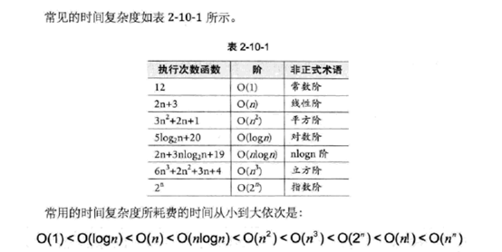

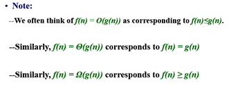

 --O(.)接近函数**时间复杂度上界、最坏运行时间**

 --使用Ω描述函数**下界**

 --使用Θ得到函数的**精确界限**

 -- f(n) =Θ(g(n)**)当且仅当 f(n) = O(g(n)) 且f(n) = Ω(g(n))**

### 1.2计算递归式时间复杂度

#### 1 代入法

（1）猜时间复杂度
（2）使用归纳法证明
（3）求解常数

**例**

T(n) = 4T(n/2) + 100n，假设T(1) = Θ(1)，猜测复杂度为O(n3)，则T(k) ≤ck3 for k < n

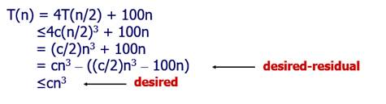

 

**注：该方法关键在于做出恰当假设**

#### 2 递归树法

https://www.cnblogs.com/wu8685/archive/2010/12/21/1912347.html

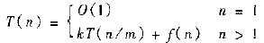

> **例1**
>
> T(n) = 2T(n/2) + n2
> 迭代2次可以得：
> T(n) = n2 + 2(2T(n/4) + (n/2) 2)
> 还可以继续迭代，将其完全展开可得：
> T(n) = n2 + 2((n/2) 2 + 2((n/22)2 + 2((n/23) 2 + 2((n/24) 2 +…+2((n/2i) 2 + 2T(n/2i + 1)))…))))　　……(1)
> 而当n/2i+1 == 1时，迭代结束。
> 将(1)式小括号展开，可得：
> T(n) = n2 + 2(n/2)2 + 22(n/22) 2 + … + 2i(n/2i)2 + 2i+1T(n/2i+1)
>
> 这恰好是一个树形结构，由此可引出递归树法。
>
> 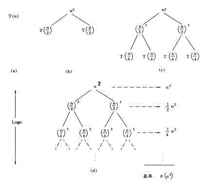
>
> 图中的(a)(b)(c)(d)分别是递归树生成的第1,2,3,n步。每一节点中都将当前的自由项n2留在其中，而将两个递归项T(n/2) + T(n/2)分别摊给了他的两个子节点，如此循环。
> 图中所有节点之和为:
> 　[1 + 1/2 + (1/2)2 + (1/2)3 + … + (1/2)i] n2 = 2n2
> 可知其时间复杂度为O(n2)

**可以得到递归树的规则为：**
 (1) 每层的节点为T(n) = kT(n / m) + f(n)中的f(n)在当前的n/m下的值；
（2) 每个节点的分支数为k；
 (3)每层的右侧标出当前层中所有节点的和。

> **例2**
> T(n) = T(n/3) + T(2n/3) + n
> 其递归树如下图所示：
>
> 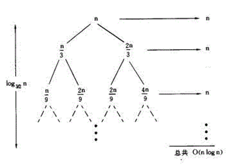
> 可见每层的值都为n，从根到叶节点的最长路径是：
> 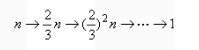
> 因为最后递归的停止是在(2/3)kn == 1.则
> 　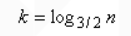
> 于是
> 　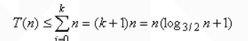
> 即T(n) = O(nlogn)　

**总结，利用此方法解递归算法复杂度：**
f(n) = af(n/b) + d(n)
1.当d(n)为常数时：
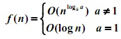
2.当d(n) = cn 时：
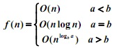
3.当d(n)为其他情况时可用递归树进行分析。

注：由第二种情况知，若采用分治法对原算法进行改进，则着重点是采用新的计算方法缩小a值。

#### 3 主定理法

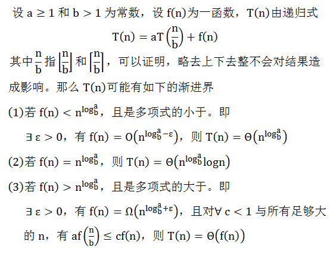

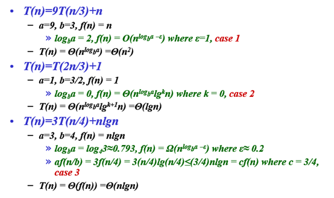

# 2.排序

# 3.分治

### **基本思想**

**将问题分解为K个子问题，子问题相互独立且与原问题相同，问题规模变小，一般使用递归**

-------------------------------------------------------------

### 举例

例1：**

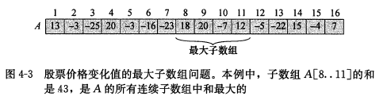

解：

* 遍历法  O(n2)s'sss

* 分治

分治法：

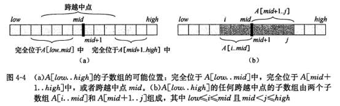

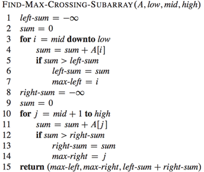

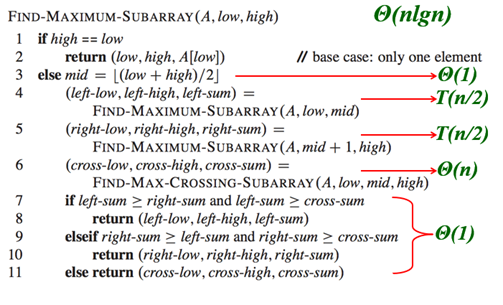

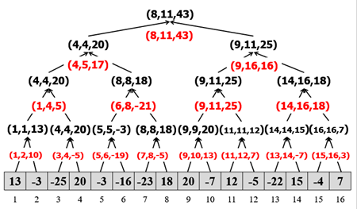

------------------------------------------

**例2：**

寻找第i小元素（线性时间内选择）

思路：

* 排序，O(nlgn)
* 分治和快排

程序解释：利用随机函数产生划分基准，将数组a[p:r]划分成两个子数组a[p:i]和a[i+1:r]，使a[p:i]中的每个元素都不大于a[i+1:r]中的每个元素。接着"j=i-p+1"计算a[p:i]中元素个数j.如果k\<=j，则a[p:r]中第k小元素在子数组a[p:i]中，如果k\>j，则第k小元素在子数组a[i+1:r]中。
**注意：**由于已知道子数组a[p:i]中的元素均小于要找的第k小元素，因此，要找的a[p:r]中第k小元素是a[i+1:r]中第**k-j**小元素。

   在最坏的情况下，例如：总是找到最小元素时，总是在最大元素处划分，这是时间复杂度为O(n^2)。但平均时间复杂度与n呈线性关系，为O(n)(数学证明过程略过,可参考王云鹏论文《**[线性时间选择算法时间复杂度深入研究](http://www.cnki.net/KCMS/detail/detail.aspx?QueryID=1&CurRec=1&recid=&filename=DNBC200914001&dbname=CJFD2009&DbCode=CJFQ&urlid=&yx=&uid=WEEvREcwSlJHSldSdnQ1V1l1WnJXdWl3Ni9hKzRPYUlvcTFQbXRodFRMUHVxNzZqVElFKzBudlJHSk9tcGFZPQ==)**》)。

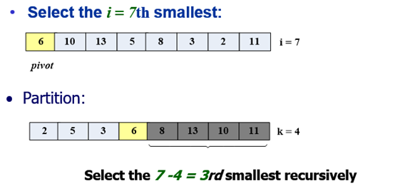

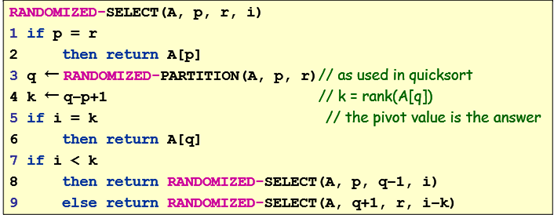

# 4.动态规划

###  **基本思想**

 	若要解一个给定问题，我们需要解其不同部分（即子问题），再合并子问题的解以得出原问题的解。 通常许多子问题非常相似，**为此动态规划法试图仅仅解决每个子问题一次，从而减少计算量： 一旦某个给定子问题的解已经算出，则将其记忆化存储，以便下次需要同一个子问题解之时直接查表**。 这种做法在重复子问题的数目关于输入的规模呈指数增长时特别有用。

### 分治与动态规划

**共同点：**二者都要求原问题具有最优子结构性质,都是将原问题分而治之,分解成若干个规模较小(小到很容易解决的程序)的子问题.然后将子问题的解合并,形成原问题的解.

**不同点：**分治法将分解后的子问题看**成相互独立的**，通常用递归来做。(自上而下)

　　动态规划将分解后的子问题理解为**相互间有联系,有重叠部分，需要记忆**，通常用迭代来做。（自下而上）（一般是记录过程？）

**递归与迭代**

递归（自上而下）1重复解决子问题2只能用在问题规模较小的情况下

迭代（自下而上）1效率更高2减少时间空间浪费3利用子问题最优解

### 问题特征

**最优子结构：**当问题的最优解包含了其子问题的最优解时，称该问题具有最优子结构性质。

**重叠子问题：**在用递归算法自顶向下解问题时，每次产生的子问题并不总是新问题，有些子问题被反复计算多次。动态规划算法正是利用了这种子问题的重叠性质，对每一个子问题只解一次，而后将其解保存在一个表格中，在以后尽可能多地利用这些子问题的解。

### 步骤

* 描述最优解的结构

  * 1有多少子问题被用在原问题的最优解中
   * 2在决定一个最优解中使用那些子问题有多少种选择

* 递归定义最优解的值（用到递归式，但解题过程不是递归）

* 按自底向上的方式计算最优解的值

* 由计算出的结果构造一个最优解

### 举例

**问题1装配线调度**

有二条流水线，每条流水线都有n个站，流水线1,2站j的处理功能相同，但处理时间可能不同，每个站都有一个处理时间，而且从一条流水线的站j-1到另一条流水线站j有一个消耗时间t1[j-1](从流水线1到2）或t2[j-1](从流水线2到1)，同一条流水线站j-1到站j的消耗时间忽略不计，物品上每一条流水线有个时间，下每一条流水线也有一个时间。

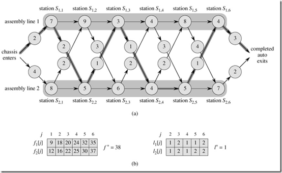

可以分解为f(1j-1)到fj和f(2,j-1)到fj两条个子结构

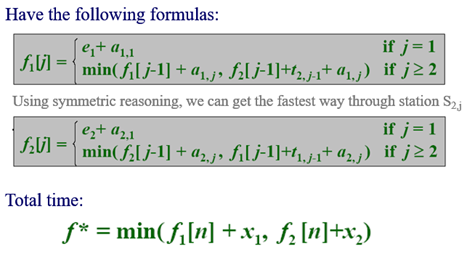

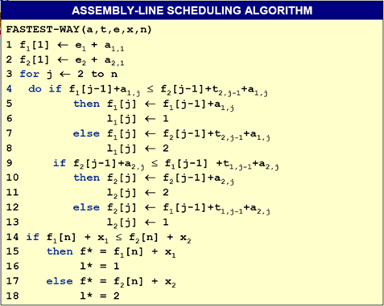

-------------------------------------------------------------

**问题二**         矩阵连乘  

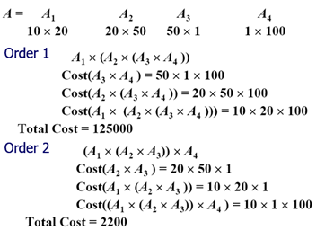

解题：

* 暴力穷举
* 动态规划

考虑使用动态规划，寻找最优子结构。计算A[i:j]的最优次序所包含的计算矩阵子琏A[i:k]和A[k+1:j]的次序也是最优的。

在计算过程中，保存已解决的子问题答案。每个子问题只计算一次，而在后面需要时只要简单查一下，从而避免大量的重复计算，最终得到多项式时间的算法。我们可以根据下面这个公式来计算结果。其中p[i-1]表示的是第i个矩阵的行数,p[k]表示i:k矩阵合起来后最后得到的列数，p[j]是k+1:j合起来后得到的列数。这个部分的计算方法其实就是计算两个矩阵相乘时总共的乘次数

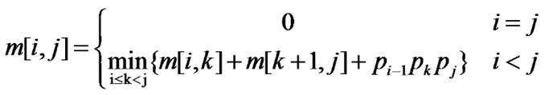

 

P数组存储按照矩阵可乘条件存储矩阵行列数，除p0 pn外 pi有两层含义，相邻数组的行和列如A1(20*50)A2(50*10) 50为A1的行数 A2的列数。

算法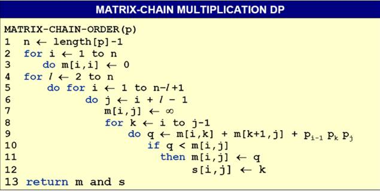

其中l表示l个矩阵相乘，i为起点，j为终点，k为中间节点

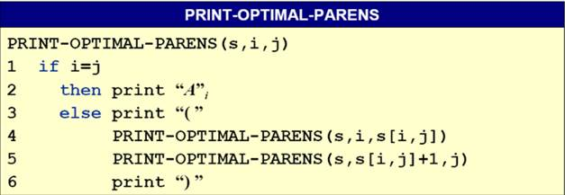

**注：迭代最外层循环一般表示问题规模**

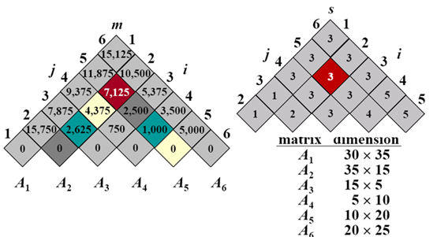

**Memoization优化递归**

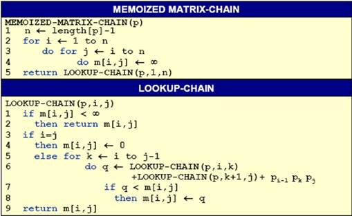

 

Memoization优化递归与DP对比

Memoization优化递归1记住已经计算过的子问题2只需解决递归时用到的子问题

DP        1所有子问题必须都被解决2可以利用常规的表访问模式来减少时间或空间

----------------------------------------------------------------------

**问题三 最长相同字串LCS**

求两个字符串最长相同子串长度

分析可得

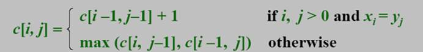

其中i,j为串1，2的长度，c[I,j]表示长度为ij的两串最长相同字串长度

由此可写出递归算法

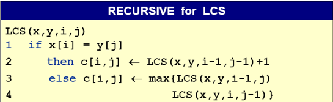

考虑到递归算法重复计算多，效率低，使用迭代改为DP

时间复杂度减小问O(mn)

 

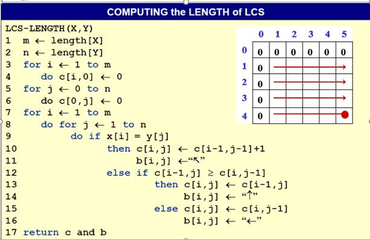

打印字符串时间复杂度O(m+n)

---------------------------------------------

**问题四 最大子数组和**

例数组(-2，11，-4，13，-5，-2)，最大子数组和为i=1到=3和为20

思路一 穷举法

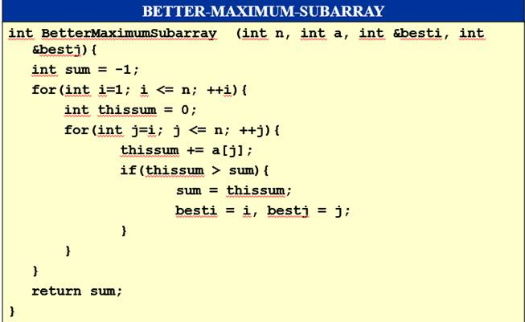

思路二DP

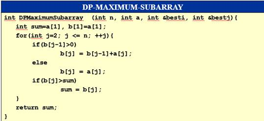

改进

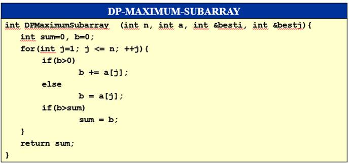

 

# 5.贪心

# 6.最短路径

 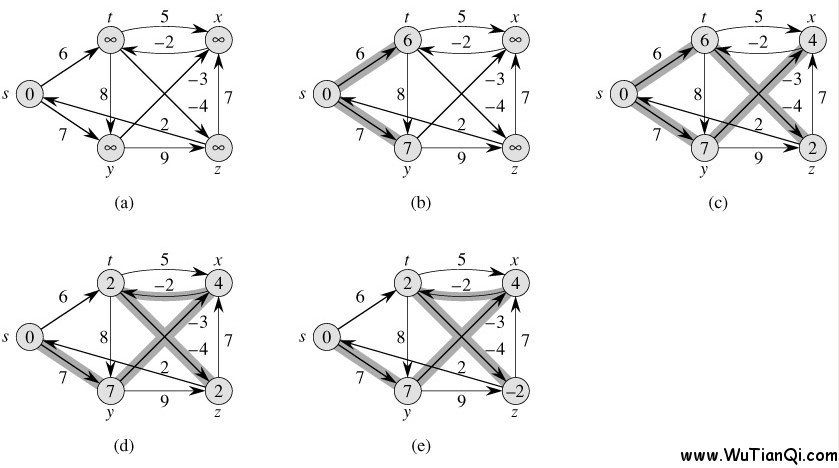 

# 7.回溯