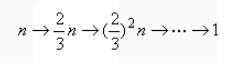
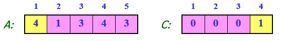
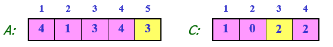
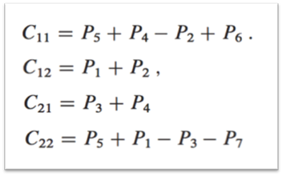
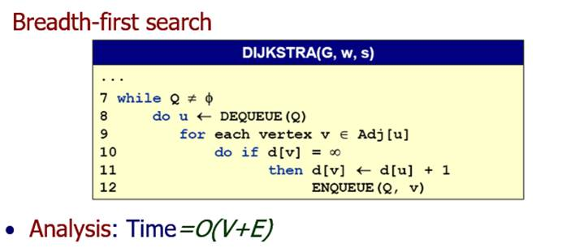

总体感想：

本科期间关于算法只接触了数据结构这门课程，对于算法的认识局限于固定的解题过程，拘泥于程序的编写，并没有真正的理解算法的核心思想，掌握问题分析方法。通过学习算法分析与设计这门课，有种豁然开朗的感觉，老师通过讲解分治合并、动态规划、贪心、回溯、分支限界等重要的算法思想，把一些我以前看似熟悉的以及一些没有接触过的例子融入其中，让我真切感受到算法的精妙，解决问题是有迹可循的，个人认为这是我学习过程中非常大的收获。

 

 

 

学习总结：

 

# **Let2**

## 插入排序

public class incert {

 

​    public static void main(String[] args) {

​       // TODO Auto-generated method stub

​        int a[] = {3,1,5,7,2,4,9,6};

​       new incert().insertSort(a);

​       for(int i:a) {

​           System.out.println(i);

​       }

​    }

​    public int[] insertSort(int[] a) {

​       int n=a.length;

​       int i,j;

​       for(i=1;i<n;i++) {

​           int temp=a[i];//暂存需要排序的元素

​           //从小到大排列，如果当前数大于前面则继续向前遍历直到小于temp时将temp插入

​           for(j=i-1;j>=0&&a[j]<temp;j--) {

​              a[j+1]=a[j];

​           }

​           a[j+1]=temp;

​       }

​       return a;

​    }

}

## 分治

## 二路归并

public class MergeSort {

 

​    public static void main(String[] args) {

​       // TODO Auto-generated method stub

​        int a[] = {3,1,5,7,2,4,9,6};

​       new MergeSort().sort(a,0,a.length-1);

​       for(int i:a) {

​           System.out.println(i);

​       }

​    }

​    public static int[] sort(int[] a,int low,int high){

​    int mid = (low+high)/2;

​    if(low<high){

​      sort(a,low,mid);

​      sort(a,mid+1,high);

​      //左右归并

​      merge(a,low,mid,high);

​    }

​    return a;

  }

   

  public static void merge(int[] a, int low, int mid, int high) {

​    int[] temp = new int[high-low+1];

​    int i= low;

​    int j = mid+1;

​    int k=0;

​    // 把较小的数先移到新数组中

​    while(i<=mid && j<=high){

​      if(a[i]<a[j]){

​        temp[k++] = a[i++];

​      }else{

​        temp[k++] = a[j++];

​      }

​    }

​    // 把左边剩余的数移入数组 

​    while(i<=mid){

​      temp[k++] = a[i++];

​    }

​    // 把右边边剩余的数移入数组

​    while(j<=high){

​       temp[k++] = a[j++];

​    }

​    // 把新数组中的数覆盖nums数组

​    for(int x=0;x<temp.length;x++){

​      a[x+low] = temp[x];

​    }

  }

}

 

 

# **Let3**

O/Θ/Ω notations

 

 O(g(n)) = {f(n): 存在正数c 和n0使得 0≤f(n) ≤cg(n) 对于所有n≥n0}

 --O(.)接近函数时间复杂度上界

 --O(.) 被用来描述最坏运行时间

 --1/3n2 – 3n ∈O(n2)

--k1n2+k2n+k3∈O(n2)

--k1n2+k2n+k3∈O(n3)

 

 Ω(g(n)) = {f(n):存在正数 c 和 n0 使得 0 ≤ cg(n) ≤f(n) 对于所有 n≥n0}

 --使用Ω描述函数下界

例如

--1/3n2 – 3n ∈Ω(n2)

 --k1n2+k2n+k3∈Ω(n2)

--k1n2+k2n+k3∈Ω(n) (lower bound)

 

 Θ(g(n)) = {f(n): 存在正正数 c1, c2 和 n0使得0 ≤ c1g(n) ≤f(n) ≤c2g(n) 对于所有n≥n0}

 --使用Θ得到函数的精确界限

 -- f(n) =Θ(g(n))当且仅当 f(n) = O(g(n)) 且f(n) = Ω(g(n))

 

--k1n2+k2n+k3∈Θ(n2)

--6nlgn + √nlg2n=Θ(nlgn)

 

 

 

 

 

 

 

 

 

 

 

 

 

 

 

 

 

 

 

 

 

 

 

 

 

 

 

 

 

 

 

 

 

 

 

 

 

 

# **Let4**

计算递归式时间复杂度

三种主要方法

1代入法

2递归树

3主定理法

 

## 1代入法

（1）   猜时间复杂度

（2）   使用归纳法证明

（3）   求解常数

例

T(n) = 4T(n/2) + 100n

假设T(1) = Θ(1)

猜测复杂度为O(n3).

则T(k) ≤ck3 for k < n

 

注：该方法关键在于做出恰当假设

 

## 2递归树法

https://www.cnblogs.com/wu8685/archive/2010/12/21/1912347.html

例1

T(n) = 2T(n/2) + n2

迭代2次可以得：

T(n) = n2 + 2(2T(n/4) + (n/2) 2)

还可以继续迭代，将其完全展开可得：

T(n) = n2 + 2((n/2) 2 + 2((n/22)2 + 2((n/23) 2 + 2((n/24) 2 +…+2((n/2i) 2 + 2T(n/2i + 1)))…))))　　……(1)

而当n/2i+1 == 1时，迭代结束。

将(1)式小括号展开，可得：

T(n) = n2 + 2(n/2)2 + 22(n/22) 2 + … + 2i(n/2i)2 + 2i+1T(n/2i+1)

这恰好是一个树形结构，由此可引出递归树法。

图中的(a)(b)(c)(d)分别是递归树生成的第1,2,3,n步。每一节点中都将当前的自由项n2留在其中，而将两个递归项T(n/2) + T(n/2)分别摊给了他的两个子节点，如此循环。

图中所有节点之和为:

　[1 + 1/2 + (1/2)2 + (1/2)3 + … + (1/2)i] n2 = 2n2

可知其时间复杂度为O(n2)

可以得到递归树的规则为：

 (1) 每层的节点为T(n) = kT(n / m) + f(n)中的f(n)在当前的n/m下的值；

（2) 每个节点的分支数为k；

 (3)每层的右侧标出当前层中所有节点的和。

 

例2

T(n) = T(n/3) + T(2n/3) + n

其递归树如下图所示：

　　

可见每层的值都为n，从根到叶节点的最长路径是：

因为最后递归的停止是在(2/3)kn == 1.则

　

于是

　

即T(n) = O(nlogn)　

 

总结，利用此方法解递归算法复杂度：

f(n) = af(n/b) + d(n)

1.当d(n)为常数时：

2.当d(n) = cn 时：

3.当d(n)为其他情况时可用递归树进行分析。

 

 

注：由第二种情况知，若采用分治法对原算法进行改进，则着重点是采用新的计算方法缩小a值。

## 3主定理法

 

 

 

 

 

 

 

# **Let5**

堆排序优先队列

二叉堆是一组能够用堆有序的完全二叉树排序的元素，并在数组中按照层级储存(不使用数组的第一个位置)。

 

在一个二叉堆中，位置k的结点的父结点的位置为k/2 向下取整，而他的两个子结点的位置分别为2k和2k+1.

 

一棵大小为N的完全二叉树的高度为lgN向下取整

由下至上的堆有序化（上浮）：如果堆的有序状态因为某个节点变得比它的父节点更大而被打破，就需要交换它和它的父节点来修复堆，以此类推，直到遇到一个更大的父节点。

 

由上至下的堆有序化（下沉）：如果堆的有序状态因为某个节点变得比它的两个子节点或者其中之一更小而被打破，需要将它和它的两个子节点中的较大者交换来恢复堆，以此类推，直到它的子节点比它更小或者到达堆的底部。

插入元素—将新元素加到数组末尾，添加堆的大小并让这个新元素上浮到合适的位置。

删除元素—从顶端删去最大元素并将最后一个元素放到顶端，减小堆的大小并让这个元素下沉到合适的位置

例 基于堆的优先队列

public class MaxPQ<Key extends Comparable<Key>>{

​       private Key[] pq;

​       private int N = 0;

​       public MaxPQ(int maxN){

​           //pq = new Key[maxN + 1]; 错误

​           pq=(Key[]) new Comparable[maxN+1];

​       }

​       public boolean isEmpty(){

​           return N == 0;

​       }

​       public int size(){

​           return N;

​       }

​       public void insert(Key v){

​           pq[++N] = v;

​           swim(N);//插入到堆末尾，然后进行上浮

​       }

​       public Key delMax(){

​           Key max = pq[1];//从跟节点得到最大元素

​           exchange(1, N--);//将根节点的元素和最后一个节点交换

​           pq[N] = null;

​           sink(1);//下沉

​           return max;

​       }

​       public void exchange(int i, int j){

​           Key temp = pq[i];

​           pq[i] = pq[j];

​           pq[j] = temp;

​       }

​       private boolean less(int i,int j) {

​           return pq[i].compareTo(pq[j])<0;

​       }

​       private void exch(int i,int j) {

​           Key t=pq[i];

​           pq[i]=pq[j];

​           pq[j]=t;

​       }

​       private void swim(int k) {

​           while(k>1&&less(k/2,k)) {

​              exch(k/2,k);

​              k=k/2;

​           }

​       }

​       private void sink(int k) {

​           while(2*k<=N) {

​              int j=2*k;//左孩子

​              if(j<N&&less(j,j+1)) j++;//右孩子大于左孩子，选择较大的子节点

​              exch(k,j);

​              k=j;

​           }

​       }

}

 

 

 

 

 

 

 

 

 

 

 

 

 

 

 

 

## **Let6**

快排特点：原地排序，且将长度为N的数组排序所需的时间和NlgN成正比，快速排序的内循环比大多数排序算法都要短小，这意味着它无论是在理论上还是在实际中都要更快。

 

基本原理

快速排序是一种分治的排序算法。它将一个数组分成两个子数组，将两部分独立地排序。快速排序和归并排序是互补的：归并排序将数组分成两个子数组分别排序，并将有序的子数组归并以将整个数组排序；而快速排序将数组排序的方式则是当两个子数组都有序时整个数组也就自然有序了。在第一种情况中，递归调用发生在处理整个数组之前；在第二种情况中，递归调用发生在处理整个数组之后。在归并排序中，一个数组被等分为两半；在快速排序中，切分的位置取决于数组的内容

该方法的关键在于切分，这个过程使得数组满足下面三个条件：

 

■对于某个j，a[j]已经排定；

 

■a[lo]到a[j-1]中的所有元素都不大于a[j]；

 

■a[j+1]到a[hi]中的所有元素都不小于a[j]。

public class Quick extends Model{

 

  public void sort(Comparable[] a){

​    StdRandom.shuffle(a);  //消除对输入的依赖

​    sort(a, 0, a.length - 1);

  }

 

  private void sort(Comparable[] a, int lo, int hi){

​    if(hi <= lo){

​      return ;

​    }

​    int j = partition(a, lo, hi);  //切分

​    sort(a, lo, j-1);    //将左半部分a[lo..j-1]排序

​    sort(a, j+1, hi);  //将右半部分a[j+1..hi]排序

  }

 

  /**

   \* 快速排序的切分

   \* 将数组切分为a[lo..i-1],a[i],a[i+1..hi]

   */

  private int partition(Comparable[] a, int lo, int hi){

​    int i = lo, j = hi+1;    //左右扫描指针

​    Comparable v = a[lo];  //切分元素

​    //扫描左右，检查扫描是否结束并交换元素

​    while(true){

​      while(less(a[++i], v)){

​        if(i == hi){

​          break;

​        }

​      }

​      while(less(v, a[--j])){

​        if(j == lo){

​          break;

​        }

​      }

​      if(i >= j){

​        break;

​      }

​      exch(a, i, j);

​    }

​    exch(a, lo, j); //将v=a[j]放入正确的位置

​    return j;  //a[lo..j-1]<=a[j]<=a[j+1..hi]达成

  }

}

 

最坏情况  切分点为最大或最小元素-----改进为随机快排

最好情况  二分

 

经典快排，随机快排，三路快排

 

 

 

 

 

 

 

 

 

 

 

 

 

 

 

 

# **Let7****线性时间内排序**

 

通过分析决策树模型，理论上所有基于比较的排序算法（插入、归并、快排、堆排序）最坏排序时间所能达到的最佳值是nlgn

计数排序

特点：非比较排序，时间复杂度O(n+k), 其中中n为要排序的数的个数，k为要排序的数的组大值。计数排序对一定量的整数排序时候的速度非常快，一般快于其他排序算法。但计数排序局限性比较大，只限于对整数进行排序。计数排序是消耗空间发杂度来获取快捷的排序方法，其空间发展度为O（K）同理K为要排序的最大值。

基本思想：一组数在排序之前先统计这组数中其他数小于这个数的个数，则可以确定这个数的位置。例如要排序的数为 7 4 2 1 5 3 1 5；则比7小的有7个数，所有7应该在排序好的数列的第八位，同理3在第四位，对于重复的数字，1在1位和2位（暂且认为第一个1比第二个1小），5和1一样位于6位和7位。

 

3.计数排序的实现办法：

第一步  计数，统计每个数出现的次数

。。。。。。。。。。

第二阶段  计算每个值最后的元素应在的位置

第三阶段 从后向前遍历原数组查找所在位置，置入新数组

。。。。。。。

 

注：为何最后从后向前遍历原数组而不是从前向后？保证排序稳定性。

 

基数排序

​    基数排序为何从低位向高位排序？保证排序稳定性。

桶排序

 

 

 

 

 

 

 

 

 

 

 

 

 

 

 

 

 

 

 

 

 

# **Let8 分治**

分治思想

将问题分解为K个子问题，子问题相互独立且与原问题相同，问题规模变小，一般使用递归

例1 矩阵相乘

将A B拆分为四个n/2×n/2矩阵相乘

 

 

利用Strassen乘法可将原来八个矩阵运算化简为七个，减少时间复杂度

 

 

 

例2 最大子数组https://www.cnblogs.com/tz346125264/p/7372393.html

使用遍历可解问题，时间复杂度为O(n)

分析：分治策略在于将一个问题分成若干个小问题，问题本身不变只是规模更小，本问题中可将该数组分成左右两半，那么最大子数组要么在左部，要么在右部，要么在跨越左部和右部的中间部分，三种情况，左右两部分也可如此分开，直到分到无法再分，那么其实最后问题就为求跨越重点的最大子数组、左边最大子数组、右边最大子数组中的最大值

算法

 

 

 

实现

package com.alibaba;

 

public class MaxSubarray

{

​    public static void main(String[] args)

​    {

​       int[] array = { 1, -2, -3, 4, 5, 6, -3, 4, -11 };

 

​       int[] result = MaxSubarray.findMaxSubarray(array, 0, array.length - 1);

 

​       for (int i = 0; i < result.length; i++)

​       {

​           System.out.println(result[i]);

​           

​       }

 

​    }

 

 

 

 

 

 

//寻找跨越中间的最大子数组

​    public static int[] findMaxCrossingSubarray(int[] array, int low, int mid, int high)

​    {

 

​       int leftsum = Integer.MIN_VALUE;

​       int sum1 = 0;

​       int maxleft = 0;

 

​       for (int i = mid; i >= 0; i--)

​       {

​           sum1 = sum1 + array[i];

​           if (sum1 > leftsum)

​           {

​              leftsum = sum1;

​              maxleft = i;

​           }

​       }

​       int rightsum = Integer.MIN_VALUE;

​       int sum2 = 0;

​       int maxright = 0;

​       for (int j = mid + 1; j <= high; j++)

​       {

​           sum2 = +array[j];

 

​           if (sum2 > rightsum)

​           {

​              rightsum = sum2;

​              maxright = j;

​           }

​       }

​       int[] result = new int[3];

 

​       result[0] = maxleft;//最左下标

​       result[1] = maxright;//最右下标

​       result[2] = leftsum + rightsum;//数组最大子数组

 

​       return result;

​    }

 

​    public static int[] findMaxSubarray(int[] array, int low, int high)

​    {

​       if (high == low)

​       {

​           int[] result = { low, high, array[low] };

​           return result;

​       } else

​       {

​           int mid = (int) Math.floor((low + high) / 2);//取中间将问题划分

//用来存结果，分别为左，中，右子问题结果，有三个值需要存储，左右下标及最大子数组和

​           int[] left = new int[3];

​           int[] right = new int[3];

​           int[] cross = new int[3];

​          //递归求子问题

​           left = findMaxSubarray(array, low, mid);

​           right = findMaxSubarray(array, mid + 1, high);

​           cross = findMaxCrossingSubarray(array, low, mid, high);

​          //比较返回

​           if (left[2] >= right[2] && left[2] >= cross[2])

​              return left;

​           else if (right[2] >= left[2] && right[2] >= cross[2])

​              return right;

​           else

​              return cross;

​       }

 

​    }

 

}

 

 

例

寻找第i小元素（线性时间选择）

思路

1排序 O(nlgn)

2随机选择

利用分治和快排

最好时间

将数组切分为1：9

T(n) = T(9n/10)+Θ(n)

  = Θ(n)

最坏时间

T(n) = T(n - 1) + Θ(n)

​      = Θ(n2)

 

Blum-Floyd-Pratt-Rivest-Tarjan’1973最坏线性 

 https://www.cnblogs.com/wlzy/p/8214153.html

 

 

 

 

 

 

 

 

 

 

 

 

 

 

 

 

 

 

 

 

# **Let9** **动态规划DP**

 https://www.cnblogs.com/raichen/p/5772056.html

通过把原问题分解为相对简单的子问题的方式求解复杂问题的方法。动态规划常常适用于有重叠子问题和最优子结构性质的问题。

 

基本思想

若要解一个给定问题，我们需要解其不同部分（即子问题），再合并子问题的解以得出原问题的解。 通常许多子问题非常相似，为此动态规划法试图仅仅解决每个子问题一次，从而减少计算量： 一旦某个给定子问题的解已经算出，则将其记忆化存储，以便下次需要同一个子问题解之时直接查表。 这种做法在重复子问题的数目关于输入的规模呈指数增长时特别有用。

 

分治与动态规划

共同点：二者都要求原问题具有最优子结构性质,都是将原问题分而治之,分解成若干个规模较小(小到很容易解决的程序)的子问题.然后将子问题的解合并,形成原问题的解.

 

不同点：分治法将分解后的子问题看成相互独立的，通常用递归来做。(自上而下)

　　动态规划将分解后的子问题理解为相互间有联系,有重叠部分，需要记忆，通常用迭代来做。（自下而上）

 

 

递归与迭代

递归（自上而下）1重复解决子问题2只能用在问题规模较小的情况下

迭代（自下而上）1效率更高2减少时间空间浪费3利用子问题最优解

 

递归会重复计算

 

问题特征

最优子结构：当问题的最优解包含了其子问题的最优解时，称该问题具有最优子结构性质。

 

重叠子问题：在用递归算法自顶向下解问题时，每次产生的子问题并不总是新问题，有些子问题被反复计算多次。动态规划算法正是利用了这种子问题的重叠性质，对每一个子问题只解一次，而后将其解保存在一个表格中，在以后尽可能多地利用这些子问题的解。

 

步骤

描述最优解的结构

 

递归定义最优解的值

 

按自底向上的方式计算最优解的值

 

由计算出的结果构造一个最优解

 

注意需要需要二维数组用容器，C++动态分配二维数组太坑爹

 

找出最优子结构

1有多少子问题被用在原问题的最优解中

2在决定一个最优解中使用那些子问题有多少种选择

 

 

问题1装配线调度

有二条流水线，每条流水线都有n个站，流水线1,2站j的处理功能相同，但处理时间可能不同，每个站都有一个处理时间，而且从一条流水线的站j-1到另一条流水线站j有一个消耗时间t1[j-1](从流水线1到2）或t2[j-1](从流水线2到1)，同一条流水线站j-1到站j的消耗时间忽略不计，物品上每一条流水线有个时间，下每一条流水线也有一个时间。

 

最优子结构有两种选择如下列递推关系所示，其中t表示运输时间，表示加工时间

算法

 

 

实现

package dynamic;

 

public class Test1 {

​    public static void main(String[] args) {

​       int N = 6;

​       int[] e = {2,4};

​       int[][] a = {{7,9,3,4,8,4},{8,5,6,4,5,7}};

​       int[][] t = {{2,3,1,3,4},{2,1,2,2,1}};

​       int[] x = {3,2};

​       Object[] obj = fastestWay(a,t,e,x,N);

​       int[][] l = (int[][]) obj[0];

​       int lr = (int) obj[1];

​       printStations(l,lr,N);

​    }

​    

​    public static Object[] fastestWay(int[][] a,int[][] t,int[] e,int[] x,int N) {

​       int[][] f = new int[N][N];

​       int[][] l = new int[2][N];

​       f[0][0] = e[0]+a[0][0];

​       f[1][0] = e[1]+a[1][0];

​       l[0][0] = 1;

​       l[1][0] = 2;

​       int fr=0,lr=0;

​       Object[] obj = new Object[2];

​       for(int i=1;i<N;i++) {

​           if(f[0][i-1]+a[0][i]<f[1][i-1]+t[1][i-1]+a[0][i]) {

​              f[0][i] = f[0][i-1]+a[0][i];

​              l[0][i] = 1;

​           }else {

​              f[0][i] = f[1][i-1]+t[1][i-1]+a[0][i];

​              l[0][i] = 2;

​           }

​           

​           if(f[1][i-1]+a[1][i]<f[0][i-1]+t[0][i-1]+a[1][i]) {

​              f[1][i] = f[1][i-1]+a[1][i];

​              l[1][i] = 2;

​           }else {

​              f[1][i] = f[0][i-1]+t[0][i-1]+a[1][i];

​              l[1][i] = 1;

​           }

​       }

​       if(f[0][N-1]+x[0]<f[1][N-1]+x[1]) {

​           fr = f[0][N-1]+x[0];

​           lr = 1;

​       }else {

​           fr = f[1][N-1]+x[1];

​           lr = 2;

​       }

​       obj[0] = l;

​       obj[1] = lr;

​       return obj;

​    }

​    

​    public static void printStations(int[][] l,int lr,int N) {

​       int i = lr;

​       System.out.println("line"+i+","+"station"+N);

​       for(int j=N;j>=2;j--) {

​           i = l[i-1][j-1];

​           System.out.println("line"+i+","+"station"+(j-1));

​       }

​    }

}

 

 

问题二矩阵连乘

寻找最佳连乘顺序使得运算次数最少

 

思路一 暴力穷举  

思路二 考虑使用动态规划，寻找最优子结构。计算A[i:j]的最优次序所包含的计算矩阵子琏A[i:k]和A[k+1:j]的次序也是最优的。

在计算过程中，保存已解决的子问题答案。每个子问题只计算一次，而在后面需要时只要简单查一下，从而避免大量的重复计算，最终得到多项式时间的算法。我们可以根据下面这个公式来计算结果。其中p[i-1]表示的是第i个矩阵的行数,p[k]表示i:k矩阵合起来后最后得到的列数，p[j]是k+1:j合起来后得到的列数。这个部分的计算方法其实就是计算两个矩阵相乘时总共的乘次数

 

P数组存储按照矩阵可乘条件存储矩阵行列数，除p0 pn外 pi有两层含义，相邻数组的行和列如A1(20*50)A2(50*10) 50为A1的行数 A2的列数。

算法

其中l表示l个矩阵相乘，i为起点，j为终点，k为中间节点

注：迭代最外层循环一般表示问题规模

 

运算过程

 

实现

 

package practice;

/**

 \* array[i][j]

 \*      表示Ai...Aj的最佳计算次序所对应的相乘次数 即存放各子问题的最优值

 \* s[i][j]=k

 \*      表示Ai...Aj这(j-i+1)个矩阵中最优加括号方法为(Ai...Ak)(Ak+1...Aj),

 \*      即存放了各子问题的最优决策

 \* p[i]表示Ai的行数，p[i+1]表示Ai的列数 

 \* @author 光

 */

public class MatrixChain{

 

  private int array[][]; 

  private int p[]; 

  private int s[][]; 

   

  public MatrixChain(){

​      //六个矩阵有七个数

​     p=new int[]{5,3,4,7,2,3,6}; 

​    array=new int[6][6]; 

​    s=new int[6][6]; 

  } 

  /**动态规划*/

  public void martixChain(){ 

​    int n=array.length; 

​    for(int i=0;i<n;i++){

​      array[i][i]=0;

​    }

​    for(int r=2;r<=n;r++){        //不同规模的子问题

​      for(int i=0;i<=n-r;i++){  //每一个规模为r的矩阵连乘序列的首矩阵Ai

​        int j=i+r-1;         //每一个规模为r的矩阵连乘序列的尾矩阵Aj

​        // 决策为k=i的乘法次数

​        array[i][j]=array[i+1][j]+p[i]*p[i+1]*p[j+1]; 

​        s[i][j]=i;

​        for(int k=i+1;k<j;k++){ //对Ai...Aj的所有决策，求最优值，记录最优决策

​          int t=array[i][k]+array[k+1][j]+p[i]*p[k+1]*p[j]; 

​          if(t<array[i][j]){ 

​            array[i][j]=t;

​            s[i][j]=k;

​          } 

​        } 

​      } 

​    } 

  } 

  /* 

   \* 待求矩阵为：Ai...Aj

   */ 

  public void traceBack(int i ,int j){

​      if(i<j){

​         traceBack(i,s[i][j]);

​         traceBack(s[i][j]+1,j);

​         if(i==s[i][j] && (s[i][j]+1)==j){

​             System.out.println("把A"+(i+1)+"到A"+(j+1)+"括起来");

​         }else if(i==s[i][j] && (s[i][j]+1)!=j){

​             System.out.println("把A"+((s[i][j]+1)+1)+"到A"+(j+1)+"括起来,在把A"+(i+1)+"到A"+(j+1)+"括起来");

​         }else if(i!=s[i][j] && (s[i][j]+1)==j){

​             System.out.println("把A"+(i+1)+"到A"+(s[i][j]+1)+"括起来,在把A"+(i+1)+"到A"+(j+1)+"括起来");

​         }else{

​             System.out.println("把A"+(i+1)+"到A"+(s[i][j]+1)+"括起来，在把A"+((s[i][j]+1)+1)+"到A"+(j+1)+"括起来，然后把A"+(i+1)+"到A"+(j+1)+"括起来");

​         }

​      }

  }

  public static void main(String[] args) { 

​    MatrixChain m=new MatrixChain(); 

​    m.martixChain();

​    m.traceBack(0, 5);

  }

}

Memoization优化递归

 

Memoization优化递归与DP对比

Memoization优化递归1记住已经计算过的子问题2只需解决递归时用到的子问题

DP        1所有子问题必须都被解决2可以利用常规的表访问模式来减少时间或空间

 

 

问题三 最长相同字串LCS

求两个字符串最长相同子串长度

分析可得

其中i,j为串1，2的长度，c[I,j]表示长度为ij的两串最长相同字串长度

由此可写出递归算法

考虑到递归算法重复计算多，效率低，使用迭代改为DP

时间复杂度减小问O(mn)

 

打印字符串时间复杂度O(m+n)

 

实现

 

import java.util.Arrays;

 

 

public class LCS {

​    public static void main(String[] args) {

​       char[] X = {'1','A','B','C','B','D','A','B'};

​       char[] Y = {'2','B','D','C','A','B','A'};

​       

​       LCS_LENGTH(X,Y);

​       

​    }

​    

​    

​    static void LCS_LENGTH(char[] X,char[] Y){

​       

​       int lenOfX = X.length;

​       int lenOfY = Y.length;

 

​       // 存储记录长度

​       int[][] c = new int[lenOfX][lenOfY];

​       // c是由哪一个记录到达的

​       int[][] b = new int[lenOfX][lenOfY];

​       

​       for(int i=1;i<lenOfX;i++) c[i][0] = 0;

​       for(int j=1;j<lenOfY;j++) c[0][j] = 0;

​       for(int i=1;i<lenOfX;i++){

​           for(int j=1;j<lenOfY;j++){

​              if(X[i]==Y[j]){

​                  c[i][j] = c[i-1][j-1] +1;

​                  b[i][j] = 1; // "↖"

​              }

​              else if(c[i-1][j]>=c[i][j-1]){

​                  c[i][j]= c[i-1][j];

​                  b[i][j] = 2;// "↑"

​              }

​              else{

​                  c[i][j]=c[i][j-1];

​                  b[i][j]= 3;// "←"

​              }

​           }

​       }

​       

//      System.out.println(Arrays.deepToString(b));

​       LCS(b,X,lenOfX-1,lenOfY-1);

​    }

​    

​    static void LCS(int[][] b, char[] X,int i , int j){

​       if(i==0 || j==0) return;

​       if(b[i][j]==1){

​           LCS(b,X,i-1,j-1);

​           System.out.print(X[i]);

​       }

​       else if(b[i][j] == 2) LCS(b,X,i-1,j);

​       else LCS(b,X,i,j-1);

​    }

}

 

 

问题四 最大字数组和

例数组(-2，11，-4，13，-5，-2)，最大子数组和为i=2到j=4,和为20

思路一 穷举法

思路二DP

 

改进

 

 

 

 

 

 

 

 

 

 

 

 

 

 

 

 

 

 

 

 

 

 

 

 

 

 

 

 

 

 

 

# **Let10 贪心算法**

主体思想：局部最优选择累加得到全局最优解，关键在于找到行量选择的标准，按照标准进行选择

 

问题一活动选择

有n个需要在同一天使用同一个教室的活动a1,a2,…,an，教室同一时刻只能由一个活动使用。每个活动ai都有一个开始时间si和结束时间fi 。一旦被选择后，活动ai就占据半开时间区间[si,fi)。如果[si,fi]和[sj,fj]互不重叠，ai和aj两个活动就可以被安排在这一天。该问题就是要安排这些活动使得尽量多的活动能不冲突的举行。

贪心思想：活动越早结束，剩余时间越多，选择结束时间最早的活动，在剩余活动中再找最早结束的活动

 

问题二分数背包

解题思路：按照价值率大小选择

问题三0-1背包

给定种物品和一个容量为的背包，物品的重量是，其价值为，背包问题是如何使选择装入背包内的物品，使得装入背包中的物品的总价值最大。其中，每种物品只有全部装入背包或不装入背包两种选择。

思路一穷举

思路二DP

同时减少物品和限定重量构造子问题，注意运算过程中的V（i，j）不是装i件物品j重量最优解，而是限制前i件物品时的最优解，及子结构中最优解只有V(n,w)，n为全部物品数

 

算法

实现

 

 

哈夫曼编码

 

 

 

 

 

 

 

 

 

 

 

 

 

 

 

 

 

 

 

 

 

 

 

 

 

 

 

 

 

 

 

 

 

 

 

 

 

 

 

 

# **Let11 最短路径**

单源最短路径

1贪心---Dijkstra算法

以点遍历，找最近点A,以A为中点修改到各定点权值

最短路径为ACEBD

算法

 

若各边权值为1，使用队列改进Dijkstra算法得到广度优先搜索

 

Bellman-Ford算法----动态规划  

https://www.cnblogs.com/wt869054461/p/3678044.html

 

Bellman-Ford算法思想

Bellman-Ford算法能在更普遍的情况下（存在负权边）解决单源点最短路径问题。对于给定的带权（有向或无向）图 G=（V,E），其源点为s，加权函数 w是 边集 E 的映射。对图G运行Bellman-Ford算法的结果是一个布尔值，表明图中是否存在着一个从源点s可达的负权回路。若不存在这样的回路，算法将给出从源点s到 图G的任意顶点v的最短路径d[v]。

 

Bellman-Ford算法流程分为三个阶段：

（1）  初始化：将除源点外的所有顶点的最短距离估计值 d[v] ←+∞, d[s] ←0;

 

（2）  迭代求解：反复对边集E中的每条边进行松弛操作，使得顶点集V中的每个顶点v的最短距离估计值逐步逼近其最短距离；（运行|v|-1次）

 

（4）   检验负权回路：判断边集E中的每一条边的两个端点是否收敛。如果存在未收敛的顶点，则算法返回false，表明问题无解；否则算法返回true，并且从源点可达的顶点v的最短距离保存在 d[v]中。算法描述如下：

图G,边集函数w，s为源点

11  Exit true

以边为单元进行V-1次循环

 

 

下面给出描述性证明：

  首先指出，图的任意一条最短路径既不能包含负权回路，也不会包含正权回路，因此它最多包含|v|-1条边。

  其次，从源点s可达的所有顶点如果 存在最短路径，则这些最短路径构成一个以s为根的最短路径树。Bellman-Ford算法的迭代松弛操作，实际上就是按顶点距离s的层次，逐层生成这棵最短路径树的过程。

在对每条边进行1遍松弛的时候，生成了从s出发，层次至多为1的那些树枝。也就是说，找到了与s至多有1条边相联的那些顶点的最短路径；对每条边进行第2遍松弛的时候，生成了第2层次的树枝，就是说找到了经过2条边相连的那些顶点的最短路径……。因为最短路径最多只包含|v|-1 条边，所以，只需要循环|v|-1 次。

每实施一次松弛操作，最短路径树上就会有一层顶点达到其最短距离，此后这层顶点的最短距离值就会一直保持不变，不再受后续松弛操作的影响。（但是，每次还要判断松弛，这里浪费了大量的时间，怎么优化？单纯的优化是否可行？）

如果没有负权回路，由于最短路径树的高度最多只能是|v|-1，所以最多经过|v|-1遍松弛操作后，所有从s可达的顶点必将求出最短距离。如果 d[v]仍保持 +∞，则表明从s到v不可达。

如果有负权回路，那么第 |v|-1 遍松弛操作仍然会成功，这时，负权回路上的顶点不会收敛。

 

 

 

 

多源最短路径

1无权值为负的边，可以使用n次Dijkstra算法O(VE+V2lgV)

2通用算法 Floyd-Warshall算法

动态规划，以点k为中点，遍历所有点修改两点之间最短路径

Johnson’算法

https://www.cnblogs.com/gaochundong/p/johnson_algorithm.html

思考将权值简单增加一个正数，使得所有路径权值为正，事实证明不可行，如下图曾加1后最短路径改变。

 

实际操作中，将wh(u,v)=w(u,v)+h(u)-h(v).作为新权值，证明如下

任意两点增加了相同权值

Johnson 算法描述如下：

 

给定图 G = (V, E)，增加一个新的顶点 s，使 s 指向图 G 中的所有顶点都建立连接，设新的图为 G’；

对图 G’ 中顶点 s 使用 Bellman-Ford 算法计算单源最短路径，得到结果 h[] = {h[0], h[1], .. h[V-1]}；

对原图 G 中的所有边进行 "re-weight"，即对于每个边 (u, v)，其新的权值为 w(u, v) + (h[u] - h[v])；

移除新增的顶点 s，对每个顶点运行 Dijkstra 算法求得最短路径；

O(VE+V2lgv)

 

 

 

 

 

 

 

 

 

 

 

 

 

 

 

 

 

 

 

 

 

 

 

 

 

 

# **Let12 回溯算法**

 

回溯算法实际上一个类似枚举的深度优先搜索尝试过程，主要是在搜索尝试过程中寻找问题的解，当发现已不满足求解条件时，就“回溯”返回（也就是递归返回），尝试别的路径。许多复杂的，规模较大的问题都可以使用回溯法，有“通用解题方法”的美称。回溯法说白了就是穷举法。回溯法一般用递归来解决。

回溯法一般有两个条件，一个为解条件，若不满足则需要回溯，另一个为结束条件

问题一n皇后问题

 

 

问题二  数组和

将数组元素从小到大排序

约束函数

算法

S当前选中元素和，k为当前元素下标，为剩余元素和

 

问题三 0-1背包

按价值率为物品排序,Bound函数为当前情况下假设物品可分（分数背包）所能装最大价值。

在搜索状态为空时尽可能装物品（向左子树走），对于右子树，先计算上界函数，若上界函数<fp，回溯（回溯在叶子结点发生）

约束函数

算法

 

 

 